# 04 — User Flows · Flowery

> **Phiên bản / Version:** 1.0.0  
> **Cập nhật / Updated:** 2026-03-06  
> **Trạng thái / Status:** Draft  
> **Tác giả / Author:** Flowery UX Team

---

## Mục Lục (Table of Contents)

1. [Tổng Quan (Overview)](#1-tổng-quan-overview)
2. [Flow 01 — Đăng Ký & Đăng Nhập](#flow-01--đăng-ký--đăng-nhập-registration--login)
3. [Flow 02 — Khám Phá Hoa Theo Cảm Xúc](#flow-02--khám-phá-hoa-theo-cảm-xúc-emotion-based-discovery)
4. [Flow 03 — Quiz Gợi Ý Hoa](#flow-03--quiz-gợi-ý-hoa-ai-recommendation-quiz)
5. [Flow 04 — Đặt Hàng Hoa](#flow-04--đặt-hàng-hoa-order-flowers)
6. [Flow 05 — Quản Lý Mối Quan Hệ](#flow-05--quản-lý-mối-quan-hệ-relationship-manager)
7. [Flow 06 — Nhận & Xử Lý Thông Báo](#flow-06--nhận--xử-lý-thông-báo-event-notifications)
8. [Flow 07 — Đăng Ký Subscription](#flow-07--đăng-ký-subscription-subscribe)
9. [Flow 08 — Đăng Ký & Quản Lý Shop](#flow-08--đăng-ký--quản-lý-shop-shop-onboarding--management)
10. [Flow 09 — Đánh Giá & Review](#flow-09--đánh-giá--review-order-review)
11. [Flow 10 — Thanh Toán & Xác Nhận](#flow-10--thanh-toán--xác-nhận-payment--confirmation)
12. [State Diagrams](#state-diagrams)
13. [Tổng Hợp Error States](#tổng-hợp-error-states-error-state-summary)

---

## 1. Tổng Quan (Overview)

Flowery phục vụ người dùng thông qua 3 nhóm luồng chính: **Core Flows** (hành trình mua hàng), **Relationship Flows** (quản lý kết nối cảm xúc), và **Platform Flows** (vận hành nền tảng bao gồm shop và subscription).

### 1.1 Flow Inventory

| Flow | Tên tiếng Việt | English Name | Loại | Persona chính | Mức độ ưu tiên |
|------|----------------|--------------|------|---------------|----------------|
| F-01 | Đăng Ký & Đăng Nhập | Registration & Login | Core | All Users | 🔴 Critical |
| F-02 | Khám Phá Hoa Theo Cảm Xúc | Emotion-Based Discovery | Core | Gift Giver, Self-Buyer | 🔴 Critical |
| F-03 | Quiz Gợi Ý Hoa | AI Recommendation Quiz | Core | Confused Buyer | 🔴 Critical |
| F-04 | Đặt Hàng Hoa | Order Flowers | Core | Gift Giver, Self-Buyer | 🔴 Critical |
| F-05 | Quản Lý Mối Quan Hệ | Relationship Manager | Relationship | Relationship-Conscious User | 🟠 High |
| F-06 | Nhận & Xử Lý Thông Báo | Event Notifications | Relationship | All Users | 🟠 High |
| F-07 | Đăng Ký Subscription | Subscribe | Platform | Power User | 🟡 Medium |
| F-08 | Đăng Ký & Quản Lý Shop | Shop Onboarding & Management | Platform | Shop Owner | 🔴 Critical |
| F-09 | Đánh Giá & Review | Order Review | Core | Post-Purchase User | 🟡 Medium |
| F-10 | Thanh Toán & Xác Nhận | Payment & Confirmation | Core | All Users | 🔴 Critical |

### 1.2 Flow Categories

```
Core Flows (Luồng cốt lõi)
├── F-01: Registration & Login
├── F-02: Emotion-Based Discovery
├── F-03: AI Recommendation Quiz
├── F-04: Order Flowers
├── F-09: Order Review
└── F-10: Payment & Confirmation

Relationship Flows (Luồng quan hệ cảm xúc)
├── F-05: Relationship Manager
└── F-06: Event Notifications

Platform Flows (Luồng vận hành nền tảng)
├── F-07: Subscription
└── F-08: Shop Onboarding & Management
```

### 1.3 Personas

| Persona | Mô tả | Flows liên quan |
|---------|-------|-----------------|
| **Gift Giver** | Mua hoa tặng người khác, thường không chắc chắn về lựa chọn | F-02, F-03, F-04, F-05, F-06 |
| **Self-Buyer** | Tự mua hoa cho bản thân, theo sở thích cá nhân | F-02, F-03, F-04 |
| **Relationship-Conscious User** | Chú trọng việc duy trì kết nối qua các dịp đặc biệt | F-05, F-06, F-07 |
| **Shop Owner** | Chủ cửa hàng hoa muốn mở rộng kênh bán hàng online | F-08 |
| **Power User** | Đặt hàng thường xuyên, cần tự động hóa | F-07 |

---

## Flow 01 — Đăng Ký & Đăng Nhập (Registration & Login)

- **Mục đích**: Cho phép người dùng tạo tài khoản mới hoặc đăng nhập vào hệ thống Flowery để truy cập đầy đủ tính năng.
- **Persona chính**: Tất cả người dùng (All Users)
- **Preconditions**: Người dùng chưa có phiên đăng nhập hợp lệ
- **Trigger**: Người dùng nhấn nút "Đăng Nhập / Đăng Ký" hoặc cố gắng truy cập tính năng yêu cầu xác thực

### Mermaid Flowchart

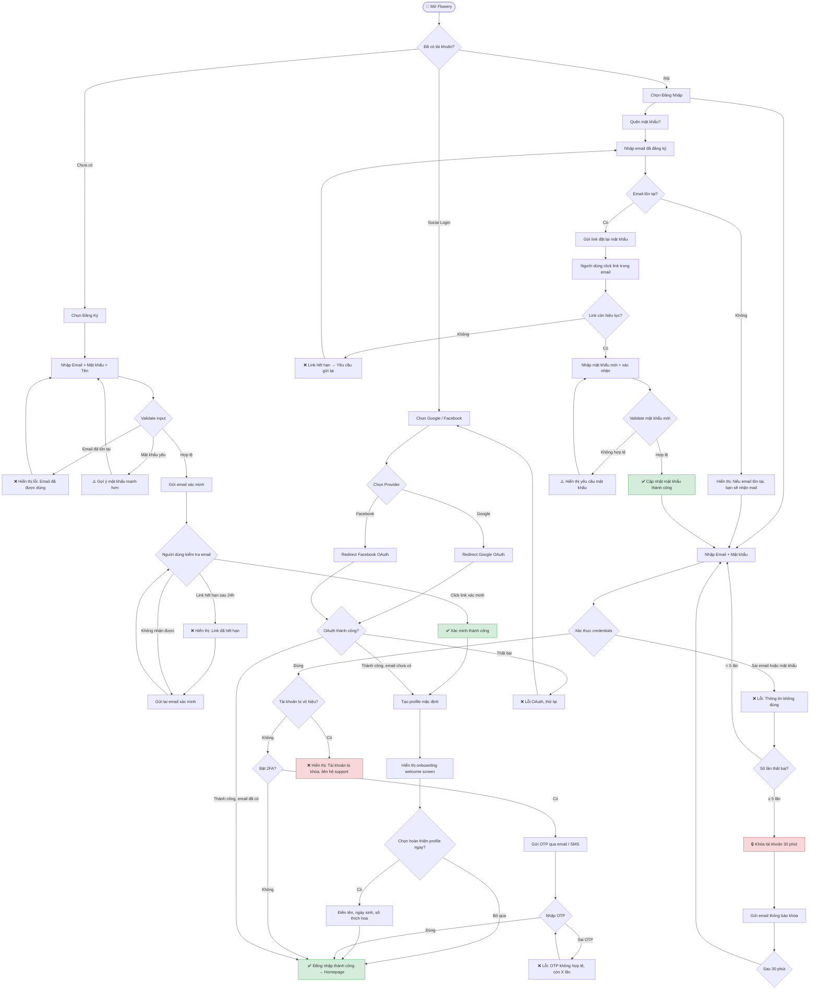

### Các Bước Chi Tiết (Detailed Steps)

| Bước | Hành động người dùng | Hệ thống phản hồi | Validation |
|------|----------------------|-------------------|------------|
| 1 | Mở app/web Flowery | Hiển thị màn hình Landing hoặc Auth | — |
| 2 | Chọn "Đăng Ký" | Form đăng ký xuất hiện | — |
| 3 | Nhập Email | Real-time check email format | RFC 5322 email format |
| 4 | Nhập Mật khẩu | Hiển thị strength meter | Min 8 ký tự, 1 hoa, 1 số |
| 5 | Nhập Tên hiển thị | — | Min 2 ký tự, max 50 |
| 6 | Submit form | Spinner hiển thị, gọi `POST /api/auth/register` | Duplicate email check |
| 7 | Nhận email xác minh | Toast: "Kiểm tra hộp thư của bạn" | — |
| 8 | Click link xác minh | Redirect về app, token verify | JWT token, expiry 24h |
| 9 | Xem onboarding | Welcome screen với tên người dùng | — |
| 10 | Vào Homepage | Session tạo thành công | Access token stored |

### Error States

- **E-01 Email trùng lặp**: Hiển thị inline error "Email này đã được đăng ký. [Đăng nhập ngay?]" → Link đến màn hình login
- **E-02 Mật khẩu yếu**: Inline error với checklist các yêu cầu chưa đạt → User chỉnh sửa
- **E-03 Link xác minh hết hạn**: Modal với nút "Gửi lại email xác minh" → Gửi email mới, giới hạn 3 lần/giờ
- **E-04 Tài khoản bị khóa**: Toast error + thông báo qua email với hướng dẫn mở khóa
- **E-05 OAuth thất bại**: Toast "Đăng nhập bằng [Google/Facebook] thất bại. Thử lại hoặc dùng email."
- **E-06 OTP sai**: Inline error + countdown đến lần thử tiếp theo _(⚠️ 2FA/OTP chưa triển khai — planned for future release)_

### Edge Cases

- Người dùng đăng ký bằng email đã dùng cho Social Login → Gợi ý liên kết tài khoản
- Đăng nhập trên nhiều thiết bị đồng thời → Session hợp lệ trên tất cả thiết bị
- Link xác minh được click lần thứ 2 → Chuyển thẳng vào app, không báo lỗi
- Mất mạng khi submit form → Error toast + Giữ nguyên dữ liệu đã nhập

### Success Criteria

- ✅ Tài khoản được tạo và xác minh email trong vòng 2 phút
- ✅ Session JWT được lưu trữ an toàn (httpOnly cookie)
- ✅ Người dùng được redirect đúng trang sau khi đăng nhập
- ✅ Tất cả error states có thông báo rõ ràng bằng tiếng Việt

---

## Flow 02 — Khám Phá Hoa Theo Cảm Xúc (Emotion-Based Discovery)

- **Mục đích**: Cho phép người dùng tìm kiếm và khám phá các loại hoa phù hợp với cảm xúc hiện tại hoặc thông điệp muốn truyền đạt.
- **Persona chính**: Gift Giver, Self-Buyer
- **Preconditions**: Người dùng ở trạng thái đăng nhập hoặc guest (guest có thể xem nhưng không đặt hàng)
- **Trigger**: Người dùng nhấn "Tìm theo cảm xúc" trên Homepage hoặc Navigation bar

### Mermaid Flowchart

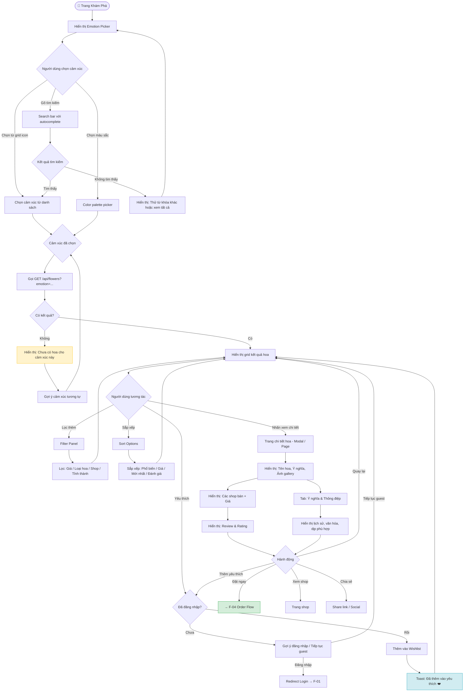

### Các Bước Chi Tiết (Detailed Steps)

| Bước | Hành động người dùng | Hệ thống phản hồi | Validation |
|------|----------------------|-------------------|------------|
| 1 | Vào trang Khám Phá | Load emotion grid (8-12 cảm xúc chính) | — |
| 2 | Chọn cảm xúc (VD: "Yêu thương") | Highlight selection, gọi API với param `emotion=love` | — |
| 3 | Xem kết quả | Skeleton loader → Grid ảnh hoa (lazy load) | Kết quả paginate 20 items |
| 4 | Áp dụng filter giá | Re-call API với params bổ sung | Min ≤ Max price |
| 5 | Click vào hoa | Modal/Page chi tiết xuất hiện | — |
| 6 | Xem ý nghĩa hoa | Tab "Ý nghĩa" với content rich text | — |
| 7 | Nhấn "Đặt ngay" | Redirect sang F-04 với flower_id | User phải đăng nhập |

### Error States

- **E-01 Không có kết quả**: Empty state với illustration + gợi ý 3 cảm xúc phổ biến
- **E-02 Lỗi load ảnh**: Placeholder image + retry button
- **E-03 API timeout**: Toast "Đang tải... vui lòng đợi" + auto retry sau 3s
- **E-04 Filter không hợp lệ**: Inline error "Giá tối thiểu không thể lớn hơn giá tối đa"

### Edge Cases

- Người dùng chọn nhiều cảm xúc cùng lúc → Kết quả union của tất cả cảm xúc đã chọn
- Hoa hết hàng → Vẫn hiển thị nhưng có badge "Tạm hết hàng" + nút "Thông báo khi có hàng"
- Người dùng ở tỉnh thành không có shop → Gợi ý shop ship toàn quốc

### Success Criteria

- ✅ Load kết quả đầu tiên trong < 1.5s
- ✅ Người dùng tìm được loại hoa phù hợp trong ≤ 3 bước tương tác
- ✅ Trang chi tiết hoa đầy đủ thông tin ý nghĩa

---

## Flow 03 — Quiz Gợi Ý Hoa (AI Recommendation Quiz)

- **Mục đích**: Hướng dẫn người dùng chưa biết chọn hoa gì thông qua quiz AI để nhận gợi ý cá nhân hóa.
- **Persona chính**: Confused Buyer (Gift Giver không chắc chắn)
- **Preconditions**: Không yêu cầu đăng nhập (có thể dùng như guest)
- **Trigger**: Nhấn "Gợi ý cho tôi" / "Không biết chọn gì?" trên Homepage hoặc F-02

### Mermaid Flowchart

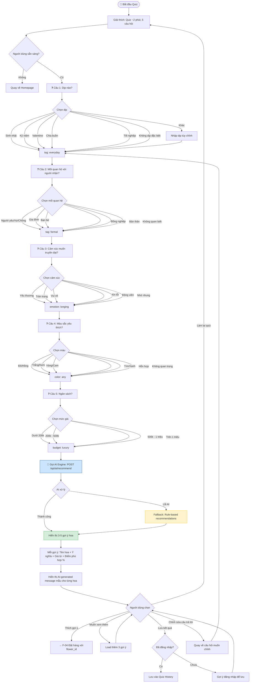

### Các Bước Chi Tiết (Detailed Steps)

| Bước | Hành động người dùng | Hệ thống phản hồi | Validation |
|------|----------------------|-------------------|------------|
| 1 | Bắt đầu quiz | Progress bar 0/5, giải thích ngắn | — |
| 2 | Chọn dịp | Highlight selection, Next button active | Bắt buộc chọn 1 |
| 3 | Chọn mối quan hệ | Tương tự, có back button | Bắt buộc chọn 1 |
| 4 | Chọn cảm xúc | Có thể chọn nhiều (max 2) | 1-2 lựa chọn |
| 5 | Chọn màu sắc | Visual color swatches | Bắt buộc chọn 1 |
| 6 | Chọn ngân sách | Range slider hoặc preset buttons | Bắt buộc chọn 1 |
| 7 | Submit quiz | Loading animation "AI đang phân tích..." (2-3s) | — |
| 8 | Xem kết quả | Cards hoa với match percentage | — |
| 9 | Chọn hoa ưng | Redirect sang F-04 | — |

### Error States

- **E-01 AI service down**: Tự động fallback sang rule-based engine, không thông báo với user
- **E-02 Không có kết quả phù hợp**: Hiển thị hoa phổ biến nhất kèm message "Có vẻ chúng tôi cần tìm hiểu thêm về bạn!"
- **E-03 Session timeout giữa quiz**: Lưu answers vào localStorage, restore khi user quay lại

### Edge Cases

- Người dùng bỏ dở giữa quiz → Lưu progress vào localStorage 24h
- Người dùng muốn chỉnh sửa câu hỏi trước → Có thể back không mất data
- Quiz kết quả trùng với lần trước → Thêm ghi chú "Bạn thường thích loại hoa này"

### Success Criteria

- ✅ AI trả về kết quả trong < 3s
- ✅ Kết quả có ≥ 3 gợi ý hoa khác nhau
- ✅ Mỗi gợi ý hiển thị lý do phù hợp rõ ràng
- ✅ Match score ≥ 70% cho gợi ý đầu tiên

---

## Flow 04 — Đặt Hàng Hoa (Order Flowers)

- **Mục đích**: Hoàn tất quy trình đặt hàng từ chọn sản phẩm đến xác nhận đơn, bao gồm cá nhân hóa thiệp và thông điệp.
- **Persona chính**: Gift Giver, Self-Buyer
- **Preconditions**: Người dùng đã đăng nhập, đã chọn sản phẩm
- **Trigger**: Nhấn "Đặt ngay" từ F-02, F-03 hoặc Wishlist

### Mermaid Flowchart

```mermaid
flowchart TD
    A([🛒 Trang sản phẩm]) --> B[Hiển thị chi tiết sản phẩm + giá]
    B --> B1{Chọn options}
    B1 --> B2[Chọn kích thước bó / số lượng]
    B2 --> B3{Tùy chỉnh thêm?}

    B3 -->|Thêm thiệp| C1[Chọn mẫu thiệp]
    C1 --> C2{Nội dung thiệp}
    C2 -->|Tự viết| C3[Text editor max 200 ký tự]
    C2 -->|Dùng AI gợi ý| C4[Nhập ngữ cảnh ngắn]
    C4 --> C5[🤖 AI generate 3 message mẫu]
    C5 --> C6{Chọn message}
    C6 -->|Chọn và chỉnh sửa| C3
    C6 -->|Dùng nguyên| C7[Confirm nội dung thiệp]
    C3 --> C7

    B3 -->|Không cần thiệp| C7

    C7 --> D[Thêm vào giỏ hàng]
    D --> D1{Tiếp tục mua?}
    D1 -->|Có| A
    D1 -->|Checkout| E

    E[Trang Checkout] --> E1[Xem lại giỏ hàng]
    E1 --> E2{Chỉnh sửa giỏ?}
    E2 -->|Xóa item| E3[Cập nhật giỏ hàng]
    E3 --> E1
    E2 -->|Tiếp tục| F

    F[Nhập thông tin giao hàng] --> F1{Đã có địa chỉ lưu?}
    F1 -->|Có| F2[Chọn địa chỉ đã lưu]
    F1 -->|Chưa| F3[Nhập địa chỉ mới]
    F2 --> F4
    F3 --> F3A{Validate địa chỉ}
    F3A -->|Không hợp lệ| F3B[⚠️ Gợi ý địa chỉ hoặc báo lỗi]
    F3B --> F3
    F3A -->|Hợp lệ| F3C{Lưu địa chỉ?}
    F3C -->|Có| F3D[Lưu vào Address Book]
    F3C -->|Không| F4
    F3D --> F4

    F4[Chọn thời gian giao hàng] --> F4A{Kiểm tra lịch giao}
    F4A --> F4B[Hiển thị slot khả dụng của shop]
    F4B --> F5{Chọn ngày giờ}
    F5 -->|Hôm nay| F5A{Còn slot trong ngày?}
    F5A -->|Không| F5B[⚠️ Giao hàng sớm nhất: ngày mai]
    F5B --> F5
    F5A -->|Có| F6
    F5 -->|Hẹn trước| F6

    F6[Giao hàng ẩn danh?] --> F6A{Chọn}
    F6A -->|Có| F6B[Ẩn thông tin người gửi]
    F6A -->|Không| F7
    F6B --> F7

    F7[Nhập ghi chú cho shop] --> G

    G[→ F-10 Thanh Toán] --> H{Thanh toán thành công?}
    H -->|Thất bại| H1[→ F-10 Retry Payment]
    H -->|Thành công| I

    I[✅ Xác nhận đơn hàng] --> I1[Gửi email/SMS xác nhận]
    I1 --> I2[Hiển thị Order ID + tracking link]
    I2 --> I3[Cập nhật order status: CONFIRMED]
    I3 --> J{Theo dõi đơn hàng}

    J --> J1[Thông báo push: Shop đã nhận đơn]
    J1 --> J2[Thông báo: Đang chuẩn bị]
    J2 --> J3[Thông báo: Shipper đã lấy hàng]
    J3 --> J4[Thông báo: Đang giao]
    J4 --> J5{Giao thành công?}
    J5 -->|Có| J6[✅ Đã giao → Gợi ý đánh giá → F-09]
    J5 -->|Thất bại| J7[❌ Giao thất bại → Liên hệ shop]
    J7 --> J8{Xử lý}
    J8 -->|Giao lại| J3
    J8 -->|Hủy| K[Xử lý hoàn tiền]

    style I fill:#d4edda,stroke:#28a745
    style J6 fill:#d4edda,stroke:#28a745
    style K fill:#f8d7da,stroke:#dc3545
```

### Các Bước Chi Tiết (Detailed Steps)

| Bước | Hành động người dùng | Hệ thống phản hồi | Validation |
|------|----------------------|-------------------|------------|
| 1 | Chọn kích thước bó | Cập nhật giá real-time | — |
| 2 | Thêm thiệp | Modal chọn mẫu thiệp | — |
| 3 | Viết hoặc chọn message AI | Character counter, preview thiệp | Max 200 ký tự |
| 4 | Thêm vào giỏ hàng | Toast xác nhận + Cart badge update | — |
| 5 | Vào Checkout | Load giỏ hàng + kiểm tra tồn kho | Tồn kho real-time check |
| 6 | Chọn địa chỉ giao | Google Maps autocomplete | Địa chỉ trong phạm vi ship |
| 7 | Chọn slot giao hàng | Calendar + time slot picker | Slot phải còn trống |
| 8 | Xem tóm tắt đơn | Order summary + phí ship | — |
| 9 | Nhấn "Đặt hàng" | Redirect sang Payment | — |
| 10 | Nhận xác nhận | Email + in-app notification | — |

### Error States

- **E-01 Hàng hết trong khi checkout**: Alert "Sản phẩm vừa hết hàng. [Xem sản phẩm tương tự]"
- **E-02 Địa chỉ ngoài vùng giao**: Toast "Shop này chưa giao đến khu vực của bạn. [Tìm shop khác]"
- **E-03 Không còn slot hôm nay**: Auto-suggest slot sớm nhất của ngày hôm sau
- **E-04 Thanh toán thất bại**: Giữ nguyên đơn hàng draft 30 phút, retry payment

### Edge Cases

- Người dùng thêm cùng sản phẩm từ 2 shop khác nhau → Tách thành 2 sub-order, 1 thanh toán
- Shop đột ngột offline khi checkout → Thông báo và gợi ý shop thay thế
- Cúp điện/mất mạng giữa checkout → Restore cart từ session khi vào lại

### Success Criteria

- ✅ Đặt hàng hoàn tất trong < 5 phút (happy path)
- ✅ Order ID được tạo ngay sau thanh toán thành công
- ✅ Email xác nhận gửi trong < 30s
- ✅ Tracking link hoạt động ngay lập tức

---

## Flow 05 — Quản Lý Mối Quan Hệ (Relationship Manager)

- **Mục đích**: Cho phép người dùng lưu trữ thông tin người thân, thiết lập ngày quan trọng và nhận nhắc nhở để không bỏ lỡ dịp đặc biệt.
- **Persona chính**: Relationship-Conscious User, Gift Giver
- **Preconditions**: Người dùng đã đăng nhập
- **Trigger**: Vào mục "Người thân" trong Navigation hoặc từ gợi ý sau khi đặt hàng lần đầu

### Mermaid Flowchart

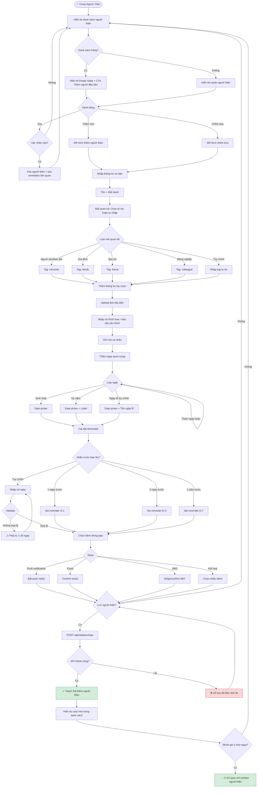

### Các Bước Chi Tiết (Detailed Steps)

| Bước | Hành động người dùng | Hệ thống phản hồi | Validation |
|------|----------------------|-------------------|------------|
| 1 | Nhấn "Thêm người thân" | Form slide-in hoặc modal | — |
| 2 | Nhập tên | — | Bắt buộc, max 100 ký tự |
| 3 | Chọn mối quan hệ | Dropdown với icons | Bắt buộc |
| 4 | Upload ảnh | Crop tool, resize auto | JPG/PNG, max 5MB |
| 5 | Thêm ngày sinh nhật | Date picker (không bắt buộc nhập năm) | Ngày hợp lệ |
| 6 | Cài đặt nhắc nhở | Toggle on/off per date | — |
| 7 | Chọn kênh thông báo | Checkbox cho mỗi kênh | Ít nhất 1 kênh |
| 8 | Lưu | Loading + toast thành công | — |

### Error States

- **E-01 Tên trùng**: Cảnh báo "Bạn đã có người thân tên [X]. Tiếp tục thêm?" với confirm dialog
- **E-02 Upload ảnh lỗi**: Inline error "Ảnh quá lớn hoặc không đúng định dạng"
- **E-03 Push notification bị từ chối**: Hướng dẫn vào Settings để bật lại

### Edge Cases

- Ngày 29/2 (Năm nhuận): Hỏi người dùng muốn nhắc vào 28/2 hay 1/3 ở năm không nhuận
- Người dùng có cùng tên: Cho phép nhiều người cùng tên với mối quan hệ khác nhau
- Xóa tài khoản: Cảnh báo tất cả reminder sẽ bị xóa

### Success Criteria

- ✅ Người thân được lưu với đầy đủ thông tin
- ✅ Reminder được schedule ngay lập tức
- ✅ Hiển thị đúng trong danh sách với ngày quan trọng sắp tới

---

## Flow 06 — Nhận & Xử Lý Thông Báo (Event Notifications)

- **Mục đích**: Tự động nhắc nhở người dùng về các dịp quan trọng và gợi ý hành động phù hợp (đặt hoa, gửi thiệp).
- **Persona chính**: Relationship-Conscious User
- **Preconditions**: Người dùng đã cài đặt ít nhất một người thân với ngày quan trọng (F-05)
- **Trigger**: Hệ thống scheduled job chạy hàng ngày lúc 8:00 sáng

### Mermaid Flowchart

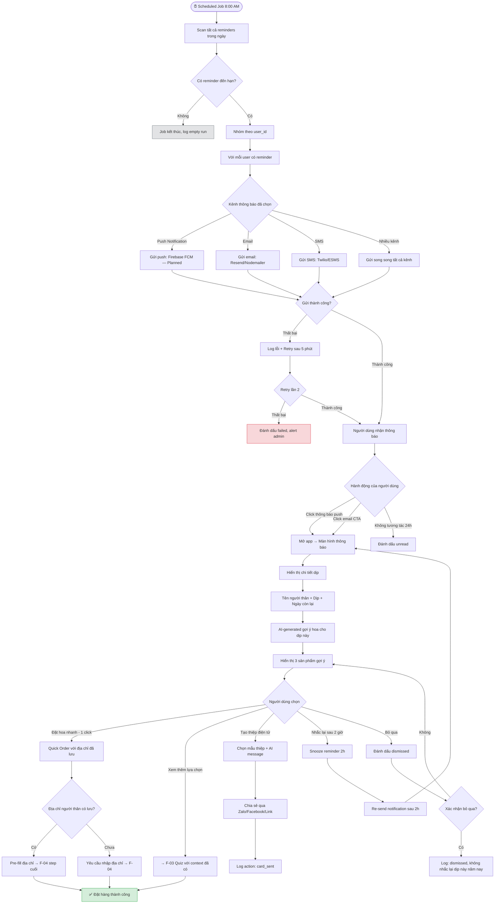

### Các Bước Chi Tiết (Detailed Steps)

| Bước | Hành động | Hệ thống phản hồi | Validation |
|------|-----------|-------------------|------------|
| 1 | (Hệ thống) Job scan reminders | Query DB reminders trong 1-7 ngày tới | — |
| 2 | (Hệ thống) Gửi thông báo | Push/Email/SMS theo cài đặt user | Token FCM hợp lệ |
| 3 | User nhận thông báo | — | — |
| 4 | User click thông báo | Mở app/web vào màn hình nhắc nhở | — |
| 5 | Xem gợi ý hoa AI | 3 gợi ý phù hợp với dịp và người thân | — |
| 6 | Nhấn "Đặt nhanh" | Pre-fill form đặt hàng | User phải đăng nhập |
| 7 | Xác nhận đặt hàng | → F-04 → F-10 | — |

### Error States

> ⚠️ **Note:** Firebase FCM push notifications chưa được triển khai. Hiện tại hệ thống sử dụng in-app notifications và email.

- **E-01 FCM token hết hạn**: Refresh token tự động, nếu không được thì gửi email thay thế _(Planned)_
- **E-02 Email bounce**: Đánh dấu email invalid, yêu cầu user cập nhật email
- **E-03 Gợi ý hoa không có hàng**: Thay bằng gợi ý sản phẩm tương tự có hàng

### Edge Cases

- Người dùng có nhiều dịp cùng ngày → Gom tất cả vào 1 thông báo
- Người dùng đã đặt hoa cho dịp này rồi → Không gửi lại thông báo
- App bị uninstall → Chỉ gửi email

### Success Criteria

- ✅ Thông báo gửi đúng giờ (± 5 phút)
- ✅ Gợi ý hoa liên quan đúng ngữ cảnh
- ✅ Quick order hoàn thành trong < 3 bước

---

## Flow 07 — Đăng Ký Subscription (Subscribe)

- **Mục đích**: Cho phép người dùng đăng ký gói hoa định kỳ tự động để nhận hoa hàng tuần/tháng tại nhà hoặc văn phòng.
- **Persona chính**: Power User, Self-Buyer thường xuyên
- **Preconditions**: Người dùng đã đăng nhập, đã có địa chỉ giao hàng
- **Trigger**: Nhấn "Đăng Ký Nhận Hoa Định Kỳ" từ Navigation hoặc sau khi đặt hàng lần 3+

### Mermaid Flowchart

```mermaid
flowchart TD
    A([🌺 Trang Subscription]) --> B[Hiển thị các gói subscription]
    B --> B1[Gói Weekly / Bi-weekly / Monthly]
    B1 --> B2[So sánh tính năng và giá các gói]

    B2 --> C{Người dùng chọn gói}
    C -->|Gói Weekly| D[Chọn ngày giao trong tuần]
    C -->|Gói Bi-weekly| D
    C -->|Gói Monthly| D1[Chọn ngày giao trong tháng]
    D --> E
    D1 --> E

    E[Tùy chỉnh Preferences] --> E1[Chọn phong cách hoa]
    E1 --> E1A{Phong cách}
    E1A -->|Cổ điển| S1[style: classic]
    E1A -->|Hiện đại| S1[style: modern]
    E1A -->|Tự nhiên| S1[style: natural]
    E1A -->|Để AI chọn| S1[style: ai_curated]

    S1 --> E2[Chọn màu sắc ưu tiên]
    E2 --> E3[Màu sắc không muốn có]
    E3 --> E4[Ngân sách per delivery]
    E4 --> E4A{Validate ngân sách}
    E4A -->|Dưới mức tối thiểu| E4B[⚠️ Ngân sách tối thiểu là 150,000đ]
    E4B --> E4
    E4A -->|Hợp lệ| E5

    E5[Địa chỉ giao hàng] --> E5A{Chọn địa chỉ}
    E5A -->|Địa chỉ đã lưu| E5B[Chọn từ danh sách]
    E5A -->|Địa chỉ mới| E5C[Nhập địa chỉ mới]
    E5B --> E6
    E5C --> E6

    E6[Chọn shop ưu tiên] --> E6A{Shop selection}
    E6A -->|Chọn shop cụ thể| E6B[Search và chọn shop]
    E6A -->|Để hệ thống chọn| E6C[Auto-assign shop gần nhất]
    E6B --> F
    E6C --> F

    F[Xem tóm tắt subscription] --> F1[Tổng chi phí / tháng dự kiến]
    F1 --> F2[Lịch giao hàng preview]
    F2 --> F3{Xác nhận đăng ký?}

    F3 -->|Chỉnh sửa| E
    F3 -->|Xác nhận| G

    G[Chọn phương thức thanh toán] --> G1{Loại thanh toán}
    G1 -->|Thẻ tín dụng/Ghi nợ| G2[Nhập thông tin thẻ]
    G1 -->|Ví điện tử| G3[Chọn ví: MoMo / ZaloPay / VNPay]
    G2 --> G4[Lưu phương thức thanh toán]
    G3 --> G4
    G4 --> G5[Thanh toán đơn đầu tiên]
    G5 --> G6{Thanh toán thành công?}
    G6 -->|Thất bại| G7[❌ Lỗi thanh toán → Thử lại]
    G7 --> G1
    G6 -->|Thành công| H

    H[✅ Subscription Active] --> H1[Gửi email xác nhận với lịch giao]
    H1 --> H2[Hiển thị Subscription Dashboard]

    H2 --> I{Quản lý Subscription}
    I -->|Xem lịch giao| I1[Calendar view upcoming deliveries]
    I -->|Tạm dừng| I2{Xác nhận tạm dừng?}
    I2 -->|Có| I3[Pause tất cả delivery tương lai]
    I3 --> I4[Toast: Đã tạm dừng, tiếp tục bất cứ lúc nào]
    I4 --> I2A{Tái kích hoạt?}
    I2A -->|Có| I5[Resume subscription]
    I5 --> H2
    I2 -->|Không| H2

    I -->|Hủy đăng ký| J{Xác nhận hủy?}
    J -->|Có| J1{Lý do hủy - Survey}
    J1 --> J2[Ghi lại feedback]
    J2 --> J3{Có delivery sắp tới?}
    J3 -->|Có| J4[Thực hiện xong delivery cuối, sau đó hủy]
    J3 -->|Không| J5[Hủy ngay lập tức]
    J4 --> J6[❌ Subscription Cancelled]
    J5 --> J6
    J -->|Không| H2

    I -->|Chỉnh sửa preferences| E

    style H fill:#d4edda,stroke:#28a745
    style J6 fill:#f8d7da,stroke:#dc3545
    style I4 fill:#fff3cd,stroke:#ffc107
```

### Các Bước Chi Tiết (Detailed Steps)

| Bước | Hành động người dùng | Hệ thống phản hồi | Validation |
|------|----------------------|-------------------|------------|
| 1 | Chọn gói subscription | Hiển thị so sánh giá và tính năng | — |
| 2 | Chọn tần suất giao | Hiển thị lịch preview | — |
| 3 | Cài đặt sở thích hoa | Lưu preferences vào profile | — |
| 4 | Nhập ngân sách | Real-time tính số hoa ước tính | Min 150k VND |
| 5 | Chọn shop | Gợi ý shop phù hợp theo địa chỉ | Shop phải active |
| 6 | Xem tóm tắt | Tính tổng chi phí monthly | — |
| 7 | Thanh toán đơn đầu | Charge ngay lập tức | — |
| 8 | Nhận xác nhận | Email + Dashboard hiển thị | — |

### Error States

- **E-01 Thanh toán auto hàng tháng thất bại**: Thử lại 3 lần trong 24h, nếu vẫn thất bại thì pause subscription và thông báo
- **E-02 Shop không còn hoạt động**: Auto-assign shop mới và thông báo trước 3 ngày
- **E-03 Hết hàng theo preferences**: Thay thế bằng hoa tương tự, gửi thông báo thay đổi

### Success Criteria

- ✅ Subscription active ngay sau thanh toán thành công
- ✅ Delivery đầu tiên được lên lịch đúng ngày chọn
- ✅ Dashboard hiển thị lịch giao hàng rõ ràng

---

## Flow 08 — Đăng Ký & Quản Lý Shop (Shop Onboarding & Management)

- **Mục đích**: Cho phép chủ cửa hàng hoa đăng ký và vận hành gian hàng trên nền tảng Flowery.
- **Persona chính**: Shop Owner
- **Preconditions**: Có tài khoản Flowery, có giấy phép kinh doanh
- **Trigger**: Nhấn "Trở Thành Đối Tác Flowery" trên trang dành cho shop

### Mermaid Flowchart

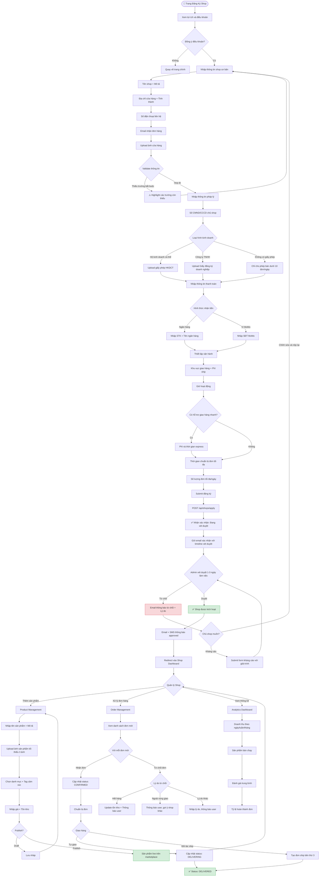

### Các Bước Chi Tiết (Detailed Steps)

| Bước | Hành động người dùng | Hệ thống phản hồi | Validation |
|------|----------------------|-------------------|------------|
| 1 | Điền form đăng ký shop | Real-time validation từng field | Tất cả fields bắt buộc |
| 2 | Upload giấy phép | Preview ảnh, check file size | PDF/JPG/PNG, max 10MB |
| 3 | Nhập tài khoản ngân hàng | Mask STK sau khi nhập | Luhn check nếu có |
| 4 | Cài đặt vùng giao | Google Maps polygon | Vùng phải thuộc 1 tỉnh/thành |
| 5 | Submit | Loading + số ticket xét duyệt | — |
| 6 | (Sau 1-3 ngày) Nhận kết quả | Email thông báo | — |
| 7 | Vào Dashboard | Tutorial onboarding lần đầu | — |
| 8 | Thêm sản phẩm đầu tiên | Guided flow với checklist | Min 3 ảnh |

### Error States

- **E-01 Giấy phép không đọc được**: Yêu cầu upload lại, hướng dẫn chụp ảnh rõ hơn
- **E-02 Địa chỉ shop trùng**: Cảnh báo "Đã có shop đăng ký tại địa chỉ này. Liên hệ support nếu đây là lỗi"
- **E-03 STK ngân hàng không hợp lệ**: Inline error với hướng dẫn tìm STK đúng

### Success Criteria

- ✅ Hoàn thành đăng ký trong < 15 phút
- ✅ Shop được xét duyệt trong 3 ngày làm việc
- ✅ Sản phẩm đầu tiên được đăng trong < 10 phút sau khi approved

---

## Flow 09 — Đánh Giá & Review (Order Review)

- **Mục đích**: Thu thập feedback từ người dùng sau khi nhận hàng để cải thiện chất lượng dịch vụ và giúp người mua khác ra quyết định.
- **Persona chính**: Post-Purchase User
- **Preconditions**: Đơn hàng ở trạng thái DELIVERED
- **Trigger**: Thông báo push/email 24 giờ sau khi giao hàng thành công

### Mermaid Flowchart

```mermaid
flowchart TD
    A([📦 Đơn hàng DELIVERED]) --> B[Hệ thống chờ 24 giờ]
    B --> C[Gửi thông báo mời đánh giá]
    C --> D{Người dùng phản hồi}

    D -->|Bỏ qua| D1[Nhắc lại sau 3 ngày]
    D1 --> D2{Phản hồi lần 2?}
    D2 -->|Bỏ qua| D3[Không nhắc nữa, đánh dấu skipped]
    D2 -->|Có| E

    D -->|Click vào| E[Màn hình đánh giá đơn hàng]

    E --> F[Hiển thị thông tin đơn: sản phẩm, ngày đặt, shop]
    F --> G[❓ Đánh giá tổng thể]
    G --> G1{Chọn số sao}
    G1 -->|1-2 sao| G2[Trải nghiệm kém]
    G1 -->|3 sao| G3[Trải nghiệm trung bình]
    G1 -->|4-5 sao| G4[Trải nghiệm tốt]

    G2 --> H[Hiển thị các vấn đề phổ biến]
    H --> H1{Chọn vấn đề}
    H1 -->|Hoa không đúng mô tả| H2[tag: wrong_product]
    H1 -->|Giao hàng trễ| H3[tag: late_delivery]
    H1 -->|Hoa bị hỏng| H4[tag: damaged]
    H1 -->|Thiếu phụ kiện| H5[tag: missing_items]
    H1 -->|Vấn đề khác| H6[tag: other]

    G3 --> I
    G4 --> I
    H2 --> I
    H3 --> I
    H4 --> I
    H5 --> I
    H6 --> I

    I[Đánh giá chi tiết] --> I1{Đánh giá từng tiêu chí}
    I1 --> I2[⭐ Chất lượng hoa]
    I2 --> I3[⭐ Đóng gói]
    I3 --> I4[⭐ Giao hàng đúng giờ]
    I4 --> I5[⭐ Thái độ phục vụ]
    I5 --> J

    J[Viết nhận xét] --> J1{Có muốn viết không?}
    J1 -->|Bỏ qua| K
    J1 -->|Có| J2[Text area max 500 ký tự]
    J2 --> J3{Validate nội dung}
    J3 -->|Chứa nội dung không phù hợp| J4[⚠️ Cảnh báo: Vui lòng viết nhận xét phù hợp]
    J4 --> J2
    J3 -->|OK| K

    K[Upload ảnh sản phẩm nhận được] --> K1{Muốn upload không?}
    K1 -->|Không| L
    K1 -->|Có| K2[Chọn ảnh từ gallery / chụp mới]
    K2 --> K3{Validate ảnh}
    K3 -->|Quá lớn hoặc sai format| K4[⚠️ Resize hoặc báo lỗi]
    K4 --> K2
    K3 -->|OK| K5[Preview ảnh]
    K5 --> K6{Ảnh đúng?}
    K6 -->|Xóa và chụp lại| K2
    K6 -->|OK| L

    L[Xem preview đánh giá] --> L1{Submit?}
    L1 -->|Chỉnh sửa| I
    L1 -->|Gửi đánh giá| M[POST /api/reviews]

    M --> M1{API thành công?}
    M1 -->|Lỗi| M2[❌ Toast lỗi + Lưu draft local]
    M2 --> M3[Retry khi có mạng]
    M3 --> M
    M1 -->|Thành công| N

    N[✅ Đánh giá thành công] --> N1[Tặng điểm thưởng / voucher]
    N1 --> N2{Đánh giá 1-2 sao?}
    N2 -->|Có| N3[Gửi thông báo cho Shop + Admin]
    N3 --> N4{Shop phản hồi trong 48h?}
    N4 -->|Có| N5[Hiển thị phản hồi shop dưới review]
    N4 -->|Không| N6[Escalate đến Admin]
    N2 -->|Không| N7[Review public sau 10 phút kiểm duyệt]
    N5 --> N7
    N7 --> O[Review hiển thị trên trang sản phẩm]

    style N fill:#d4edda,stroke:#28a745
    style N7 fill:#d4edda,stroke:#28a745
    style M2 fill:#f8d7da,stroke:#dc3545
```

### Các Bước Chi Tiết (Detailed Steps)

| Bước | Hành động người dùng | Hệ thống phản hồi | Validation |
|------|----------------------|-------------------|------------|
| 1 | Nhận thông báo mời review | Push/Email 24h sau delivery | — |
| 2 | Click vào thông báo | Mở màn hình review với thông tin đơn | — |
| 3 | Chọn số sao tổng thể | UI star rating interactive | Bắt buộc |
| 4 | Nếu ≤ 2 sao: chọn vấn đề | Checkbox list các vấn đề | Ít nhất 1 vấn đề |
| 5 | Đánh giá 4 tiêu chí | Star rating riêng mỗi tiêu chí | Không bắt buộc |
| 6 | Viết nhận xét (tùy chọn) | Character counter | Max 500 ký tự |
| 7 | Upload ảnh (tùy chọn) | Preview trước khi submit | JPG/PNG, max 3 ảnh, 5MB/ảnh |
| 8 | Submit | Loading + success state | — |
| 9 | Nhận điểm thưởng | Badge + điểm cộng vào tài khoản | — |

### Error States

- **E-01 Review sau thời hạn 30 ngày**: Thông báo "Thời hạn đánh giá đã hết. Liên hệ support nếu cần hỗ trợ"
- **E-02 Nội dung vi phạm**: Highlight câu vi phạm và giải thích lý do
- **E-03 Mất mạng khi submit**: Lưu draft, auto-retry và thông báo khi gửi thành công

### Success Criteria

- ✅ Review được gửi thành công
- ✅ Điểm thưởng được cộng ngay lập tức
- ✅ Review public sau kiểm duyệt < 10 phút
- ✅ Shop nhận được thông báo review mới trong < 1 phút

---

## Flow 10 — Thanh Toán & Xác Nhận (Payment & Confirmation)

- **Mục đích**: Xử lý thanh toán an toàn cho đơn hàng với nhiều phương thức phù hợp thị trường Việt Nam.
- **Persona chính**: Tất cả người dùng mua hàng
- **Preconditions**: Người dùng đã hoàn thành thông tin đơn hàng (F-04)
- **Trigger**: Nhấn "Tiến Hành Thanh Toán" từ trang Checkout

### Mermaid Flowchart

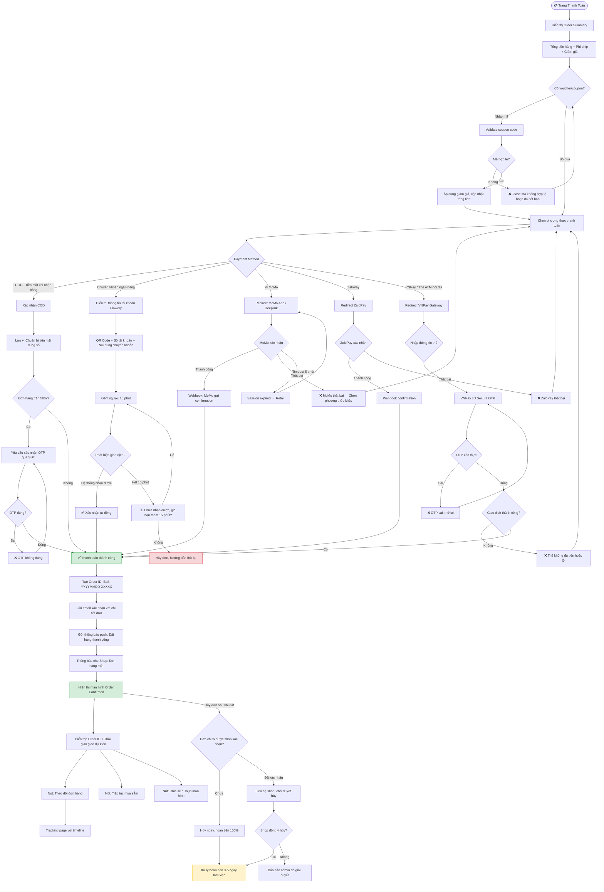

### Các Bước Chi Tiết (Detailed Steps)

| Bước | Hành động người dùng | Hệ thống phản hồi | Validation |
|------|----------------------|-------------------|------------|
| 1 | Xem order summary | Tính thuế, phí ship, discount | — |
| 2 | Nhập mã giảm giá (tùy chọn) | Validate real-time | Code format, expiry, usage limit |
| 3 | Chọn phương thức thanh toán | Hiển thị các method khả dụng | — |
| 4a (COD) | Xác nhận COD | OTP cho đơn > 500k | — |
| 4b (Bank) | Quét QR chuyển khoản | Đếm ngược 15 phút | Amount khớp |
| 4c (Ví) | Xác nhận trong app ví | Webhook từ provider | Signature verify |
| 5 | Nhận Order Confirmed | Email + Push notification | — |
| 6 | Xem tracking link | Real-time status updates | — |

### Error States

> ⚠️ **Note:** OTP xác nhận cho đơn COD >500k chưa được triển khai trong phiên bản hiện tại.

- **E-01 Đơn đã hết hạn**: Toast "Đơn hàng đã hết thời gian thanh toán. Vui lòng đặt lại" + link đặt lại
- **E-02 Thẻ bị từ chối**: Thông báo chung "Giao dịch không thành công" (không tiết lộ lý do chi tiết vì bảo mật)
- **E-03 Gateway timeout**: Tự động retry 2 lần, sau đó thông báo thử lại sau 5 phút
- **E-04 Duplicate payment**: Phát hiện trùng lặp → Hoàn tiền tự động trong 24h

### Edge Cases

- Người dùng quay lại trang trước khi hoàn tất → Đơn nháp tồn tại 30 phút
- Webhook từ ví điện tử đến trễ → Retry mechanism 5 lần, khoảng cách tăng dần
- Thanh toán thành công nhưng email thất bại → Retry email, order vẫn active

### Success Criteria

- ✅ Thanh toán xử lý trong < 5s (ví điện tử) hoặc < 2s (COD)
- ✅ Order ID được tạo ngay lập tức
- ✅ Shop nhận thông báo trong < 10s
- ✅ Email xác nhận gửi trong < 30s

---

## State Diagrams

### Order States (Trạng Thái Đơn Hàng)

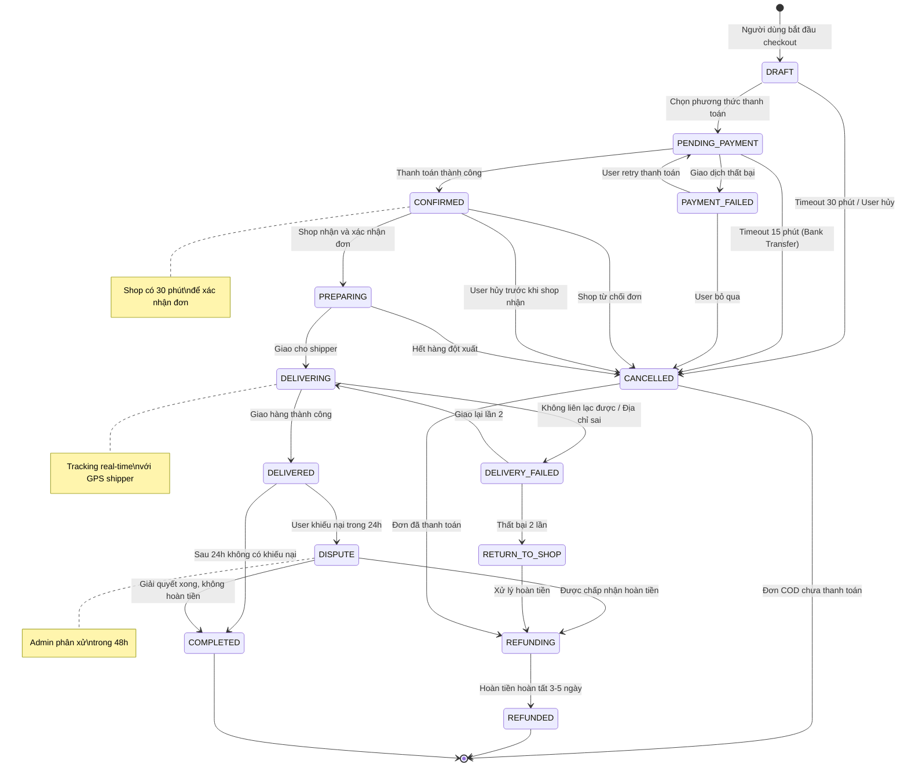

### Subscription States (Trạng Thái Subscription)

```mermaid
stateDiagram-v2
    [*] --> PENDING : Người dùng đăng ký

    PENDING --> ACTIVE : Thanh toán đầu tiên thành công
    PENDING --> FAILED : Thanh toán thất bại

    FAILED --> PENDING : Retry thanh toán (max 3 lần)
    FAILED --> CANCELLED : Hết lần retry

    ACTIVE --> ACTIVE : Thanh toán định kỳ thành công\nDelivery được lên lịch

    ACTIVE --> PAYMENT_OVERDUE : Thanh toán định kỳ thất bại
    ACTIVE --> PAUSED : User tạm dừng thủ công
    ACTIVE --> CANCELLED : User hủy đăng ký

    PAYMENT_OVERDUE --> ACTIVE : Thanh toán lại thành công trong 7 ngày
    PAYMENT_OVERDUE --> SUSPENDED : Quá 7 ngày không thanh toán

    PAUSED --> ACTIVE : User tiếp tục subscription
    PAUSED --> CANCELLED : User hủy khi đang pause

    SUSPENDED --> ACTIVE : Thanh toán và reactivate
    SUSPENDED --> CANCELLED : Admin hủy sau 30 ngày suspended

    CANCELLED --> [*]

    ACTIVE --> EXPIRED : Gói có thời hạn và đã hết hạn
    EXPIRED --> ACTIVE : User gia hạn
    EXPIRED --> [*] : Không gia hạn

    note right of ACTIVE : Auto-charge theo chu kỳ\nWeekly / Bi-weekly / Monthly
    note right of PAUSED : Không charge\nKhông giao hàng\nTối đa 3 tháng
    note right of PAYMENT_OVERDUE : Retry 3 lần:\n+1h, +24h, +72h
```

### Shop States (Trạng Thái Shop)

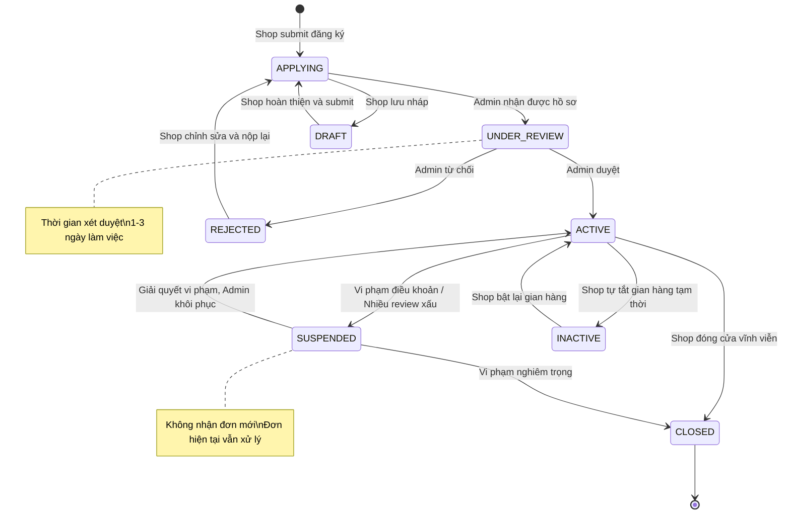

---

## Tổng Hợp Error States (Error State Summary)

### Common Error Patterns

Các lỗi phổ biến được phân loại theo nhóm:

| Nhóm | Loại lỗi | HTTP Code | Tần suất |
|------|----------|-----------|----------|
| **Authentication** | Token hết hạn, Unauthorized | 401, 403 | Cao |
| **Validation** | Dữ liệu không hợp lệ, Thiếu field | 400, 422 | Cao |
| **Not Found** | Resource không tồn tại | 404 | Trung bình |
| **Conflict** | Duplicate, Race condition | 409 | Thấp |
| **Payment** | Giao dịch thất bại, Timeout | 402, 408 | Trung bình |
| **Server** | Internal error, Database timeout | 500, 503 | Thấp |
| **Rate Limit** | Quá nhiều request | 429 | Thấp |

### Error Code Mapping Table

| Error Code | Tên kỹ thuật | Flow liên quan | Thông báo người dùng (Tiếng Việt) |
|------------|-------------|----------------|------------------------------------|
| `AUTH_001` | Token expired | F-01 đến F-10 | "Phiên đăng nhập đã hết hạn. Vui lòng đăng nhập lại." |
| `AUTH_002` | Invalid credentials | F-01 | "Email hoặc mật khẩu không đúng. Vui lòng thử lại." |
| `AUTH_003` | Account locked | F-01 | "Tài khoản tạm thời bị khóa. Thử lại sau [X] phút." |
| `AUTH_004` | Email not verified | F-01 | "Vui lòng xác minh email trước khi đăng nhập." |
| `USER_001` | Email already exists | F-01 | "Email này đã được đăng ký. Bạn có muốn đăng nhập?" |
| `USER_002` | Invalid email format | F-01 | "Địa chỉ email không hợp lệ." |
| `PRODUCT_001` | Out of stock | F-04 | "Sản phẩm vừa hết hàng. Xem sản phẩm tương tự?" |
| `PRODUCT_002` | Product unavailable | F-04 | "Sản phẩm này hiện không còn kinh doanh." |
| `ORDER_001` | Minimum order not met | F-04 | "Đơn hàng tối thiểu [X]đ. Thêm sản phẩm để tiếp tục." |
| `ORDER_002` | Delivery area not covered | F-04 | "Shop này chưa giao đến khu vực của bạn." |
| `ORDER_003` | No delivery slots | F-04 | "Không còn khung giờ giao hàng hôm nay. Chọn ngày khác?" |
| `ORDER_004` | Order expired | F-10 | "Đơn hàng đã hết hạn. Vui lòng đặt lại." |
| `PAY_001` | Payment failed | F-10 | "Thanh toán không thành công. Vui lòng thử phương thức khác." |
| `PAY_002` | Insufficient funds | F-10 | "Tài khoản không đủ số dư." |
| `PAY_003` | Gateway timeout | F-10 | "Kết nối thanh toán bị gián đoạn. Vui lòng thử lại." |
| `PAY_004` | Duplicate payment | F-10 | "Giao dịch trùng lặp. Tiền sẽ được hoàn trong 24h." |
| `COUPON_001` | Invalid coupon | F-10 | "Mã giảm giá không hợp lệ hoặc đã hết hạn." |
| `COUPON_002` | Coupon used | F-10 | "Bạn đã sử dụng mã này rồi." |
| `COUPON_003` | Min order not met | F-10 | "Đơn hàng tối thiểu [X]đ để dùng mã này." |
| `SHOP_001` | Shop not found | F-08 | "Không tìm thấy thông tin cửa hàng." |
| `SHOP_002` | Shop suspended | F-04 | "Cửa hàng này đang tạm ngưng hoạt động." |
| `SUB_001` | Already subscribed | F-07 | "Bạn đã có gói đăng ký đang hoạt động." |
| `SUB_002` | Plan not available | F-07 | "Gói này hiện không còn khả dụng." |
| `REVIEW_001` | Review period expired | F-09 | "Thời hạn đánh giá đã qua (30 ngày)." |
| `REVIEW_002` | Already reviewed | F-09 | "Bạn đã đánh giá đơn hàng này rồi." |
| `AI_001` | AI service unavailable | F-03, F-04 | (Fallback tự động, không hiển thị lỗi) |
| `NOTIF_001` | Notification permission denied | F-06 | "Bật thông báo trong Cài đặt để không bỏ lỡ dịp đặc biệt." |
| `UPLOAD_001` | File too large | F-08, F-09 | "File quá lớn. Vui lòng chọn file nhỏ hơn [X]MB." |
| `UPLOAD_002` | Invalid file type | F-08, F-09 | "Định dạng file không được hỗ trợ. Dùng JPG, PNG hoặc PDF." |
| `NET_001` | Network error | Tất cả | "Mất kết nối mạng. Kiểm tra kết nối và thử lại." |
| `SERVER_001` | Internal server error | Tất cả | "Hệ thống đang gặp sự cố. Vui lòng thử lại sau ít phút." |

### User-Facing Error Message Guidelines

**Nguyên tắc viết thông báo lỗi cho người dùng:**

1. **Rõ ràng**: Nói chính xác điều gì đã xảy ra
   - ✅ "Email này đã được đăng ký."
   - ❌ "Lỗi xảy ra."

2. **Hành động**: Cho người dùng biết phải làm gì tiếp theo
   - ✅ "Vui lòng kiểm tra lại địa chỉ email hoặc [Đăng nhập]"
   - ❌ "Không thể tạo tài khoản."

3. **Thân thiện**: Dùng ngôn ngữ tự nhiên, tránh thuật ngữ kỹ thuật
   - ✅ "Mã giảm giá đã hết hạn sử dụng."
   - ❌ "COUPON_EXPIRY_VALIDATION_FAILED"

4. **Tích cực**: Tập trung vào giải pháp thay vì vấn đề
   - ✅ "Slot này đã đầy. Còn nhiều slot trống vào ngày mai!"
   - ❌ "Không thể đặt slot này."

5. **Ngắn gọn**: Thông báo lỗi không quá 2 câu
   - Câu 1: Điều gì đã xảy ra
   - Câu 2: Hướng dẫn / hành động tiếp theo (có thể là link)

### Recovery Actions Summary

| Nhóm lỗi | Recovery Action mặc định |
|----------|--------------------------|
| Network error | Auto-retry 3 lần với exponential backoff |
| Auth error | Redirect về Login, preserve current page URL |
| Validation error | Highlight field lỗi, scroll đến field đầu tiên |
| Payment error | Giữ cart/order, cho retry hoặc đổi phương thức |
| Server error | Hiển thị error boundary, nút "Thử lại" + link Hỗ trợ |
| AI service error | Fallback sang rule-based, transparent với user |
| Upload error | Clear file, hướng dẫn compress/convert |

---

*Document này là phần của bộ tài liệu Flowery UX Documentation.*  
*Xem thêm: [01-project-overview.md](./01-project-overview.md) · [02-personas.md](./02-personas.md) · [03-information-architecture.md](./03-information-architecture.md) · [05-wireframes.md](./05-wireframes.md)*
