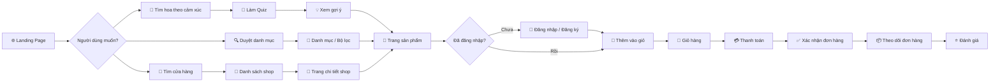

# 05. Kiến Trúc Thông Tin — Information Architecture
**Flowery** · Emotion-Based Flower Delivery Platform  
_Cập nhật: 2026-03-06 · Phiên bản: 1.0_

---

> **⚠️ Trạng Thái Triển Khai (Tháng 3/2026):**
> Một số routes trong tài liệu này chưa được triển khai. Các mục đánh dấu "Chưa triển khai" phản ánh kiến trúc mục tiêu nhưng chưa có trong codebase hiện tại. Các routes bị comment out trong sitemap cũng là routes chưa triển khai.

---

## Mục Lục

1. [Tổng Quan Kiến Trúc Thông Tin](#1-tổng-quan-kiến-trúc-thông-tin)
2. [Sitemap](#2-sitemap)
3. [Cấu Trúc Điều Hướng](#3-cấu-trúc-điều-hướng)
4. [Kiểm Kê Trang](#4-kiểm-kê-trang)
5. [Wireframe Mô Tả](#5-wireframe-mô-tả)
6. [Content Model](#6-content-model)
7. [URL Strategy](#7-url-strategy)
8. [Responsive Strategy](#8-responsive-strategy)

---

## 1. Tổng Quan Kiến Trúc Thông Tin

### 1.1 IA Principles — Nguyên Tắc Kiến Trúc Thông Tin

Flowery tổ chức thông tin theo 5 nguyên tắc cốt lõi:

| Nguyên tắc | Mô tả | Áp dụng |
|------------|-------|---------|
| **Emotion-First** | Mọi luồng điều hướng bắt đầu từ cảm xúc của người dùng, không phải danh mục sản phẩm | Quiz → Gợi ý hoa → Mua hàng |
| **Progressive Disclosure** | Hiển thị thông tin theo từng lớp, từ tổng quan đến chi tiết | Trang chủ → Danh mục → Sản phẩm → Chi tiết |
| **Dual Persona** | Hai nhóm người dùng (Khách hàng & Chủ shop) có luồng thông tin riêng biệt, không chồng chéo | Header khác nhau, Dashboard riêng |
| **Context Awareness** | Nội dung thay đổi theo dịp lễ, mùa, và lịch sử người dùng | Gợi ý theo Valentine, Tết, sinh nhật |
| **Trust Signals** | Thông tin đánh giá, xác minh shop, và minh bạch giá được ưu tiên hiển thị | Badge, rating, review nổi bật |

### 1.2 Content Strategy Brief

**Mục tiêu nội dung:** Kết nối cảm xúc con người với ngôn ngữ của hoa — mỗi trang phải trả lời câu hỏi "Tôi nên tặng gì và tại sao?"

**Giọng văn (Tone of Voice):**
- Ấm áp, thơ mộng nhưng thực tế
- Sử dụng tiếng Việt gần gũi, tránh thuật ngữ kỹ thuật
- Kết hợp ý nghĩa văn hoá hoa với cảm xúc hiện đại

**Content Pillars:**
1. **Khám phá** — Danh mục hoa, ý nghĩa hoa, blog
2. **Cảm xúc** — Quiz, gợi ý cá nhân hoá, lời nhắn
3. **Kết nối** — Quản lý quan hệ, lịch sự kiện, nhắc nhở
4. **Mua sắm** — Cửa hàng, đặt hàng, theo dõi
5. **Cộng đồng** — Đánh giá, review, chia sẻ

### 1.3 Navigation Philosophy

```
Người dùng mới → Landing Page → Quiz hoặc Khám phá Danh mục
Người dùng quen → Dashboard → Nhắc nhở → Đặt hàng nhanh
Chủ shop → Shop Dashboard → Quản lý sản phẩm → Xử lý đơn hàng
```

**Luật 3 Clicks:** Mọi hành động mua hàng quan trọng phải hoàn thành trong tối đa 3 lần nhấp từ trang chủ.

---

## 2. Sitemap

### 2.1 Sơ Đồ Sitemap Tổng Thể

```mermaid
graph TD
    ROOT["🌸 Flowery<br/>blooms.vn"] --> PUBLIC["🌐 Public Pages<br/>Không cần đăng nhập"]
    ROOT --> CUSTOMER["👤 Customer Pages<br/>Cần đăng nhập"]
    ROOT --> SHOP["🏪 Shop Owner Pages<br/>Chủ cửa hàng"]
    ROOT --> ADMIN["⚙️ Admin Pages<br/>Quản trị viên"]

    %% PUBLIC PAGES
    PUBLIC --> HOME["/ Home"]
    PUBLIC --> CATALOG["🌺 Flower Catalog<br/>/flowers"]
    PUBLIC --> SHOPS["🏪 Shop Listing<br/>/shops"]
    PUBLIC --> BLOG["📖 Blog & Encyclopedia<br/>/blog"]
    PUBLIC --> INFO["ℹ️ Info Pages"]
    PUBLIC --> AUTH["🔐 Auth Pages"]

    %% CATALOG subtree
    %% CATALOG --> CAT_CAT["/flowers/category/:slug<br/>Theo danh mục"]
    %% CATALOG --> CAT_EMO["/flowers/emotion/:emotion<br/>Theo cảm xúc"]
    %% CATALOG --> CAT_OCC["/flowers/occasion/:occasion<br/>Theo dịp lễ"]
    CATALOG --> CAT_DETAIL["/flowers/:slug<br/>Chi tiết hoa"]

    %% SHOPS subtree
    SHOPS --> SHOP_DETAIL["/shops/:slug<br/>Chi tiết cửa hàng"]

    %% BLOG subtree
    %% BLOG --> BLOG_POST["/blog/:slug<br/>Bài viết"]
    %% BLOG --> BLOG_MEANING["/meanings/:flower<br/>Ý nghĩa hoa"]

    %% INFO subtree
    INFO --> ABOUT["/about"]
    INFO --> FAQ["/faq"]
    INFO --> CONTACT["/contact"]
    INFO --> TERMS["/terms"]
    INFO --> PRIVACY["/privacy"]

    %% AUTH subtree
    AUTH --> LOGIN["/login"]
    AUTH --> REGISTER["/register"]
    AUTH --> FORGOT["/forgot-password"]

    %% CUSTOMER PAGES
    CUSTOMER --> DASH["📊 Dashboard<br/>/dashboard"]
    CUSTOMER --> QUIZ["💬 Flower Quiz<br/>/quiz"]
    CUSTOMER --> CART["🛒 Cart & Checkout<br/>/cart"]
    CUSTOMER --> ORDERS["📦 Orders<br/>/orders"]
    CUSTOMER --> RELATIONS["❤️ Relationship Manager<br/>/relationships"]
    CUSTOMER --> EVENTS["📅 Event Calendar<br/>/events"]
    CUSTOMER --> SUBS["🔄 Subscriptions<br/>/subscriptions"]
    CUSTOMER --> PROFILE["👤 Profile<br/>/profile"]
    CUSTOMER --> NOTIFS["🔔 Notifications<br/>/notifications"]

    %% CUSTOMER sub-pages
    %% QUIZ --> QUIZ_RESULT["/quiz/result<br/>Kết quả gợi ý"]
    CART --> CHECKOUT["/checkout<br/>Thanh toán"]
    CHECKOUT --> ORDER_CONFIRM["/checkout/success<br/>Xác nhận đơn"]
    ORDERS --> ORDER_DETAIL["/orders/:id<br/>Chi tiết đơn"]
    ORDER_DETAIL --> ORDER_TRACK["/orders/:id/track<br/>Theo dõi"]
    ORDER_DETAIL --> REVIEW["/orders/:id/review<br/>Đánh giá"]
    PROFILE --> PROFILE_SETTINGS["/profile/settings"]
    PROFILE --> PROFILE_ADDRESSES["/profile/addresses"]
    PROFILE --> WISHLIST["/profile/wishlist"]

    %% SHOP OWNER PAGES
    SHOP --> SHOP_DASH["📊 Shop Dashboard<br/>/shop/dashboard"]
    SHOP --> SHOP_PRODUCTS["🌸 Products<br/>/shop/products"]
    SHOP --> SHOP_ORDERS["📦 Orders<br/>/shop/orders"]
    SHOP --> SHOP_PROFILE["🏪 Shop Profile<br/>/shop/profile"]
    SHOP --> SHOP_REVENUE["💰 Revenue<br/>/shop/revenue"]
    SHOP --> SHOP_SUBS["🔄 Subscriptions<br/>/shop/subscriptions"]

    %% SHOP sub-pages
    SHOP_PRODUCTS --> PROD_NEW["/shop/products/new"]
    SHOP_PRODUCTS --> PROD_EDIT["/shop/products/:id/edit"]
    SHOP_ORDERS --> SHOP_ORDER_DETAIL["/shop/orders/:id"]
    SHOP_REVENUE --> REVENUE_REPORT["/shop/revenue/reports"]

    %% ADMIN PAGES
    ADMIN --> ADMIN_DASH["📊 Admin Dashboard<br/>/admin/dashboard"]
    ADMIN --> ADMIN_USERS["👥 Users<br/>/admin/users"]
    ADMIN --> ADMIN_SHOPS["🏪 Shops<br/>/admin/shops"]
    ADMIN --> ADMIN_CONTENT["📝 Content<br/>/admin/content"]
    ADMIN --> ADMIN_ANALYTICS["📈 Analytics<br/>/admin/analytics"]
    ADMIN --> ADMIN_SETTINGS["⚙️ Settings<br/>/admin/settings"]

    %% ADMIN sub-pages
    ADMIN_SHOPS --> SHOP_VERIFY["/admin/shops/:id/verify"]
    ADMIN_CONTENT --> CONTENT_BLOG["/admin/content/blog"]
    ADMIN_CONTENT --> CONTENT_MEANINGS["/admin/content/meanings"]

    %% Styles
    classDef public fill:#e8f5e9,stroke:#4caf50,color:#1b5e20
    classDef customer fill:#e3f2fd,stroke:#2196f3,color:#0d47a1
    classDef shopowner fill:#fff3e0,stroke:#ff9800,color:#e65100
    classDef admin fill:#fce4ec,stroke:#e91e63,color:#880e4f
    classDef root fill:#f3e5f5,stroke:#9c27b0,color:#4a148c

    class ROOT root
    class PUBLIC,HOME,CATALOG,CAT_DETAIL,SHOPS,SHOP_DETAIL,BLOG,INFO,ABOUT,FAQ,CONTACT,TERMS,PRIVACY,AUTH,LOGIN,REGISTER,FORGOT public
    class CUSTOMER,DASH,QUIZ,CART,CHECKOUT,ORDER_CONFIRM,ORDERS,ORDER_DETAIL,ORDER_TRACK,REVIEW,RELATIONS,EVENTS,SUBS,PROFILE,PROFILE_SETTINGS,PROFILE_ADDRESSES,WISHLIST,NOTIFS customer
    class SHOP,SHOP_DASH,SHOP_PRODUCTS,PROD_NEW,PROD_EDIT,SHOP_ORDERS,SHOP_ORDER_DETAIL,SHOP_PROFILE,SHOP_REVENUE,REVENUE_REPORT,SHOP_SUBS shopowner
    class ADMIN,ADMIN_DASH,ADMIN_USERS,ADMIN_SHOPS,SHOP_VERIFY,ADMIN_CONTENT,CONTENT_BLOG,CONTENT_MEANINGS,ADMIN_ANALYTICS,ADMIN_SETTINGS admin
```



### 2.2 User Journey Flow — Luồng Người Dùng Chính



---

## 3. Cấu Trúc Điều Hướng

### 3.1 Primary Navigation — Điều Hướng Chính (Header)

**Desktop Header** (hiển thị từ breakpoint `lg` trở lên):

```
┌─────────────────────────────────────────────────────────────────────────┐
│  🌸 Flowery    Khám Phá ▾    Cảm Xúc ▾    Cửa Hàng    Blog    [🔍]  │
│                                                        [🛒 2] [👤 Menu] │
└─────────────────────────────────────────────────────────────────────────┘
```

| Mục | Label | URL | Dropdown? | Mô tả |
|-----|-------|-----|-----------|-------|
| Logo | 🌸 Flowery | `/` | Không | Về trang chủ |
| Khám Phá | Khám Phá | `/flowers` | Có | Mega menu danh mục |
| Cảm Xúc | Cảm Xúc | `/quiz` | Có | Quiz + theo cảm xúc |
| Cửa Hàng | Cửa Hàng | `/shops` | Không | Danh sách shop |
| Blog | Blog & Ý Nghĩa | `/blog` | Không | Blog và encyclopedia |
| Search | 🔍 | — | Overlay | Tìm kiếm toàn cục |
| Cart | 🛒 [n] | `/cart` | Không | Giỏ hàng + badge |
| Profile | 👤 | — | Có | Menu tài khoản |

**Dropdown "Khám Phá":**
```
┌─────────────────────────────────────────────────────┐
│  Theo Danh Mục          Theo Dịp Lễ                 │
│  ─────────────          ──────────                   │
│  🌹 Hoa Hồng            💝 Tình Yêu / Valentine     │
│  💐 Bó Hoa              🎂 Sinh Nhật                │
│  🌷 Hoa Đơn Lẻ          👰 Đám Cưới                │
│  🪴 Cây Cảnh            🏥 Thăm Bệnh                │
│  🎁 Hộp Hoa Quà         🎓 Tốt Nghiệp              │
│                          🌸 Tết / Năm Mới           │
│  → Xem tất cả danh mục  → Xem tất cả dịp lễ        │
└─────────────────────────────────────────────────────┘
```

**Dropdown "Cảm Xúc":**
```
┌──────────────────────────────────────────────┐
│  Tôi đang cảm thấy...                        │
│  ──────────────────────                       │
│  💕 Yêu thương & Lãng mạn                   │
│  😊 Vui vẻ & Hạnh phúc                      │
│  😔 Xin lỗi & Hối tiếc                      │
│  🙏 Biết ơn & Trân trọng                    │
│  💪 Cổ vũ & Động viên                       │
│  😢 Chia buồn & Thương cảm                  │
│                                              │
│  ✨ Làm Quiz để nhận gợi ý cá nhân hoá      │
└──────────────────────────────────────────────┘
```

**Dropdown "Profile" (Đã đăng nhập - Khách hàng):**
```
┌──────────────────────────────┐
│  👤 Nguyễn Văn A            │
│  ──────────────              │
│  📊 Dashboard                │
│  📦 Đơn hàng của tôi        │
│  ❤️ Quản lý quan hệ         │
│  📅 Lịch sự kiện            │
│  🔔 Thông báo               │
│  ──────────────              │
│  ⚙️ Cài đặt                 │
│  🚪 Đăng xuất               │
└──────────────────────────────┘
```

**Dropdown "Profile" (Chủ shop):**
```
┌──────────────────────────────┐
│  🏪 Hoa Tươi Sài Gòn        │
│  ──────────────              │
│  📊 Shop Dashboard           │
│  🌸 Quản lý sản phẩm        │
│  📦 Đơn hàng                │
│  💰 Doanh thu               │
│  ──────────────              │
│  ⚙️ Cài đặt shop            │
│  🚪 Đăng xuất               │
└──────────────────────────────┘
```

### 3.2 Secondary Navigation — Điều Hướng Phụ

**Breadcrumb Pattern:**
```
Trang chủ > Hoa theo Cảm Xúc > Yêu Thương > Hồng Đỏ Premium
```

**In-page Tab Navigation** (Trang chi tiết shop):
```
[ Sản Phẩm ] [ Đánh Giá ] [ Giới Thiệu ] [ Liên Hệ ]
```

**Dashboard Sidebar** (Customer):
```
📊 Tổng Quan
📦 Đơn Hàng
❤️ Quan Hệ
📅 Sự Kiện
🔄 Đăng Ký Dài Hạn
💌 Lời Nhắn Đã Lưu
⭐ Danh Sách Yêu Thích
```

**Shop Dashboard Sidebar:**
```
📊 Tổng Quan
🌸 Sản Phẩm
📦 Đơn Hàng
🔄 Đăng Ký
💰 Doanh Thu
⭐ Đánh Giá
🏪 Hồ Sơ Shop
```

### 3.3 Footer Navigation

```
┌──────────────────────────────────────────────────────────────────────────┐
│                          🌸 Flowery                                    │
│         Ngôn ngữ tình yêu từ thiên nhiên — trao gửi bằng hoa            │
│                                                                          │
│  Khám Phá          Tài Khoản         Cửa Hàng         Hỗ Trợ           │
│  ─────────         ─────────         ────────          ──────           │
│  Danh mục hoa      Đăng nhập         Danh sách shop    Trung tâm hỗ trợ │
│  Hoa theo cảm xúc  Đăng ký           Mở shop với chúng tôi FAQ          │
│  Hoa theo dịp lễ   Dashboard         Chính sách đối tác Contact         │
│  Blog & Ý nghĩa    Đơn hàng                                             │
│  Quiz cảm xúc      Danh sách yêu thích                                  │
│                                                                          │
│  ─────────────────────────────────────────────────────────────────────  │
│  © 2026 Flowery  |  Điều khoản  |  Bảo mật  |  🇻🇳 Tiếng Việt        │
│  📘 Facebook  📸 Instagram  🎵 TikTok  📧 hello@blooms.vn               │
└──────────────────────────────────────────────────────────────────────────┘
```

### 3.4 Mobile Navigation

**Hamburger Menu Structure** (màn hình `< lg`):

```
┌────────────────────────────┐
│ 🌸 Flowery     [🔍] [☰] │
│              [🛒 2]        │
└────────────────────────────┘

Khi mở menu (slide-in từ phải):
┌────────────────────────────┐
│            [✕]             │
│  👤 Đăng nhập / Đăng ký   │
│  ─────────────────────     │
│  🏠 Trang Chủ              │
│  🌸 Khám Phá Hoa        ▾  │
│  💕 Cảm Xúc             ▾  │
│  🏪 Cửa Hàng              │
│  📖 Blog & Ý Nghĩa         │
│  ─────────────────────     │
│  📦 Đơn Hàng Của Tôi      │
│  ❤️ Quản Lý Quan Hệ       │
│  📅 Lịch Sự Kiện          │
│  ─────────────────────     │
│  ⚙️ Cài Đặt               │
│  🚪 Đăng Xuất             │
└────────────────────────────┘
```

**Bottom Navigation Bar** (Mobile, Đã đăng nhập):
```
┌──────────────────────────────────────────────────────┐
│  🏠 Trang Chủ  💕 Quiz  🛒 Giỏ  📦 Đơn  👤 Tôi    │
└──────────────────────────────────────────────────────┘
```

### 3.5 Breadcrumb Patterns

| Trang | Breadcrumb |
|-------|------------|
| Danh mục hoa | Trang chủ > Khám Phá > Hoa Hồng |
| Hoa theo cảm xúc | Trang chủ > Cảm Xúc > Yêu Thương |
| Chi tiết sản phẩm | Trang chủ > Hoa Hồng > Hồng Đỏ Premium |
| Bài blog | Trang chủ > Blog > Ý nghĩa hoa hướng dương |
| Đơn hàng | Trang chủ > Tài Khoản > Đơn Hàng > #ORD-2026-001 |
| Quản lý shop | Trang chủ > Shop Dashboard > Sản Phẩm > Thêm mới |

---

## 4. Kiểm Kê Trang

### 4.1 Page Inventory — Danh Sách Đầy Đủ Các Trang

| # | Trang | URL Pattern | Mục đích | Components chính | Data cần | Quyền truy cập |
|---|-------|-------------|----------|-----------------|----------|----------------|
| **PUBLIC PAGES** |
| 1 | Home / Trang Chủ | `/` | Landing page, giới thiệu nền tảng và drive conversion | Hero Banner, Emotion Quiz CTA, Featured Products, Shop Carousel, Event Countdown, Blog Preview, App Download | featured_flowers, top_shops, upcoming_events | Public |
| 2 | Flower Catalog | `/flowers` | Duyệt toàn bộ danh mục hoa | Filter Panel, Product Grid, Sort Controls, Pagination, Active Filters | flowers (paginated), categories, occasions | Public |
| 3 | Category Page | `/flowers/category/:slug` | Hoa theo danh mục cụ thể (hoa hồng, bó hoa...) | Category Header, Filter Panel, Product Grid | flowers_by_category, category_info | Public |
| 4 | Emotion Page | `/flowers/emotion/:emotion` | Hoa theo cảm xúc (yêu thương, vui vẻ...) | Emotion Hero, Meaning Description, Product Grid | flowers_by_emotion, emotion_content | Public |
| 5 | Occasion Page | `/flowers/occasion/:occasion` | Hoa theo dịp lễ (Valentine, sinh nhật...) | Occasion Banner, Countdown, Product Grid | flowers_by_occasion, occasion_content | Public |
| 6 | Flower Detail | `/flowers/:slug` | Chi tiết sản phẩm hoa | Image Gallery, Product Info, Shop Info, Meaning Section, Customization Options, Reviews, Related Products | flower_detail, shop_info, reviews | Public |
| 7 | Shop Listing | `/shops` | Danh sách tất cả cửa hàng | Search Bar, Filter (location, rating), Shop Cards Grid, Map View Toggle | shops (paginated), locations | Public |
| 8 | Shop Detail | `/shops/:slug` | Trang hồ sơ cửa hàng | Shop Header, Product Tabs, Reviews, About, Contact, Map | shop_profile, products, reviews | Public |
| 9 | Blog List | `/blog` | Danh sách bài viết và hướng dẫn | Blog Hero, Category Filter, Article Cards, Featured Posts | blog_posts, categories | Public |
| 10 | Blog Post | `/blog/:slug` _(Chưa triển khai)_ | Nội dung bài viết chi tiết | Article Header, Content, Author Info, Related Posts, Share Buttons, Comments | blog_post_detail, related_posts | Public |
| 11 | Flower Meanings | `/flowers/meanings` | Encyclopedia ý nghĩa các loài hoa | Search, Alphabet Index, Flower Cards | flower_meanings (all) | Public |
| 12 | Flower Meaning Detail | `/meanings/:flower` _(Chưa triển khai)_ | Ý nghĩa chi tiết một loài hoa | Flower Image, Meaning Text, Cultural Context, Occasions, Related Flowers, Buy CTA | flower_meaning, related_flowers | Public |
| 13 | About | `/about` | Giới thiệu Flowery | Mission Statement, Team, Stats, Story Timeline | static_content | Public |
| 14 | FAQ | `/faq` | Câu hỏi thường gặp | FAQ Accordion by Category, Search, Contact CTA | faq_items | Public |
| 15 | Contact | `/contact` | Liên hệ hỗ trợ | Contact Form, Social Links, Map, Business Hours | — | Public |
| 16 | Terms of Service | `/terms` | Điều khoản sử dụng | Formatted Legal Text, TOC | static_content | Public |
| 17 | Privacy Policy | `/privacy` | Chính sách bảo mật | Formatted Legal Text, TOC | static_content | Public |
| **AUTH PAGES** |
| 18 | Login | `/login` | Đăng nhập tài khoản | Login Form, Social Auth (Google/Facebook), Forgot Password Link | — | Public (redirect nếu đã đăng nhập) |
| 19 | Register | `/register` | Đăng ký tài khoản mới | Register Form, Role Selection (Khách/Chủ shop), Social Auth | — | Public |
| 20 | Forgot Password | `/forgot-password` | Yêu cầu đặt lại mật khẩu | Email Form, Instructions | — | Public |
| 21 | Reset Password | `/reset-password` | Đặt mật khẩu mới | New Password Form | reset_token | Public (via email link) |
| 22 | Email Verification | `/verify-email` | Xác nhận email | Verification Status, Resend Button | verification_token | Public |
| **CUSTOMER PAGES** |
| 23 | Customer Dashboard | `/dashboard` | Tổng quan tài khoản khách hàng | Welcome Widget, Upcoming Events, Recent Orders, Quick Actions, AI Recommendations | user_data, orders, events, recommendations | Customer |
| 24 | Flower Quiz | `/quiz` | Wizard gợi ý hoa theo cảm xúc | Progress Bar, Emotion Question, Occasion Question, Budget Question, Recipient Question | quiz_options | Customer (Guest có thể làm, save cần đăng nhập) |
| 25 | Quiz Result | `/quiz/result` _(Chưa triển khai)_ | Kết quả gợi ý hoa từ AI | AI Recommendation Cards, Explanation Text, Shop Options, Save/Share Buttons | quiz_results, recommended_flowers | Customer |
| 26 | Cart | `/cart` | Giỏ hàng | Cart Items List, Quantity Editor, Price Summary, Promo Code, Checkout CTA | cart_items, prices | Customer |
| 27 | Checkout | `/checkout` | Thanh toán đơn hàng | Delivery Info Form, Date/Time Picker, Message Card Input, Payment Method, Order Summary | cart_items, user_addresses, payment_methods | Customer |
| 28 | Order Confirmation | `/checkout/success` | Xác nhận đặt hàng thành công | Order Summary, Tracking Info, Estimated Delivery, Share Button, Continue Shopping | order_confirmation | Customer |
| 29 | Order History | `/orders` | Lịch sử đơn hàng | Order Filter (status), Order Cards List, Pagination | orders (paginated) | Customer |
| 30 | Order Detail | `/orders/:id` | Chi tiết một đơn hàng | Order Info, Item List, Status Timeline, Shop Contact, Actions | order_detail | Customer |
| 31 | Order Tracking | `/orders/:id/track` | Theo dõi trạng thái giao hàng | Live Status Map, Timeline Steps, Delivery Info, Contact Shipper | order_tracking, live_location | Customer |
| 32 | Write Review | `/reviews/new` | Viết đánh giá sau khi nhận hàng | Star Rating, Photo Upload, Text Review, Shop Rating | order_info | Customer |
| 33 | Relationship Manager | `/relationships` | Quản lý danh sách người thân | Relationship Cards, Add/Edit Form, Upcoming Occasions per Person | relationships, occasions | Customer |
| 34 | Add/Edit Relationship | `/relationships/:id/edit` | Thêm hoặc chỉnh sửa thông tin người thân | Relationship Form, Preference Tags, Special Dates | relationship_data | Customer |
| 35 | Event Calendar | `/events` | Lịch sự kiện và nhắc nhở | Calendar View / List View, Event Cards, Add Event Button | events, relationships | Customer |
| 36 | Add/Edit Event | `/events/:id/edit` | Tạo hoặc chỉnh sửa sự kiện | Event Form, Reminder Settings, Link to Relationship | event_data | Customer |
| 37 | Subscription List | `/subscriptions` | Quản lý đăng ký giao hoa định kỳ | Active Subs Cards, Upcoming Deliveries, Plan Details | subscriptions | Customer |
| 38 | Subscription Detail | `/subscriptions/:id` _(Chưa triển khai)_ | Chi tiết một gói đăng ký | Plan Info, Delivery Schedule, Pause/Cancel Options, History | subscription_detail | Customer |
| 39 | Profile | `/profile` | Hồ sơ cá nhân | Profile Info Display, Edit CTA, Quick Links | user_profile | Customer |
| 40 | Profile Settings | `/profile/preferences` | Chỉnh sửa thông tin cá nhân | Edit Form (name, phone, avatar), Change Password, Language/Currency | user_data | Customer |
| 41 | Manage Addresses | `/profile/addresses` | Quản lý địa chỉ giao hàng | Address Cards, Add/Edit/Delete, Default Address | user_addresses | Customer |
| 42 | Wishlist | `/profile/wishlist` | Danh sách sản phẩm yêu thích | Product Grid (saved flowers), Remove, Add to Cart | wishlist_items | Customer |
| 43 | Notifications | `/notifications` | Trung tâm thông báo | Notification List (unread/all), Mark Read, Filter by Type | notifications | Customer |
| 44 | Message Generator | `/message-generator` | Tạo lời nhắn tặng hoa bằng AI | Occasion Selector, Tone Selector, AI Generated Options, Edit & Save | occasion_data | Customer |
| **SHOP OWNER PAGES** |
| 45 | Shop Dashboard | `/shop/dashboard` | Tổng quan hoạt động cửa hàng | Stats Cards (orders/revenue/rating), Recent Orders, Top Products, Alerts | shop_stats, recent_orders | Shop Owner |
| 46 | Product List | `/shop/products` | Quản lý danh sách sản phẩm | Product Table, Search/Filter, Status Toggle, Quick Edit | shop_products | Shop Owner |
| 47 | Add Product | `/shop/products/new` | Thêm sản phẩm mới | Multi-step Form (info → images → pricing → emotions/occasions) | categories, emotions, occasions | Shop Owner |
| 48 | Edit Product | `/shop/products/:id/edit` | Chỉnh sửa thông tin sản phẩm | Pre-filled Product Form, Preview | product_data | Shop Owner |
| 49 | Shop Orders | `/shop/orders` | Quản lý đơn hàng nhận được | Orders Table with Status Filter, Bulk Actions, Export | shop_orders | Shop Owner |
| 50 | Shop Order Detail | `/shop/orders/:id` | Chi tiết một đơn hàng | Order Info, Customer Info, Items, Update Status, Print | order_detail | Shop Owner |
| 51 | Shop Profile | `/shop/profile` | Chỉnh sửa hồ sơ cửa hàng | Shop Info Form, Cover Photo, Business Hours, Location, Contact | shop_data | Shop Owner |
| 52 | Revenue Overview | `/shop/revenue` | Tổng quan doanh thu | Revenue Chart, Payout History, Pending Balance | revenue_data | Shop Owner |
| 53 | Revenue Reports | `/shop/revenue/reports` | Báo cáo doanh thu chi tiết | Date Range Filter, Charts, Table Export (CSV) | revenue_reports | Shop Owner |
| 54 | Subscription Products | `/shop/subscriptions` | Quản lý gói đăng ký cửa hàng | Subscription Plans List, Subscribers Count, Edit Plans | subscription_plans | Shop Owner |
| 55 | Shop Reviews | `/shop/reviews` | Xem và phản hồi đánh giá | Reviews List, Rating Summary, Reply Form | shop_reviews | Shop Owner |
| **ADMIN PAGES** |
| 56 | Admin Dashboard | `/admin/dashboard` | Tổng quan nền tảng | KPI Cards, Charts (users/orders/revenue), Recent Activity | platform_stats | Admin |
| 57 | User Management | `/admin/users` | Quản lý tài khoản người dùng | Users Table, Search/Filter, Role Management, Ban/Restore | users | Admin |
| 58 | User Detail | `/admin/users/:id` | Chi tiết tài khoản người dùng | User Info, Activity Log, Orders, Actions | user_detail | Admin |
| 59 | Shop Management | `/admin/shops` | Quản lý danh sách cửa hàng | Shops Table, Pending Verification Badge, Status Filter | shops | Admin |
| 60 | Shop Verification | `/admin/shops/:id/verify` | Xem xét và xác minh cửa hàng mới | Shop Info, Documents, Approve/Reject Form | shop_verification | Admin |
| 61 | Content Management | `/admin/content` _(Chưa triển khai)_ | Quản lý nội dung platform | Content Type Tabs | — | Admin |
| 62 | Flower Admin | `/admin/flowers` | CRUD sản phẩm hoa | Post List, Create/Edit Form, Publish Control | blog_posts | Admin |
| 63 | Meanings Admin | `/admin/content/meanings` _(Chưa triển khai)_ | CRUD database ý nghĩa hoa | Meanings List, Edit Form | flower_meanings | Admin |
| 64 | Platform Analytics | `/admin/analytics` | Phân tích dữ liệu nền tảng | Advanced Charts, Funnel Analysis, Quiz Completion, Geographic Data | analytics_data | Admin |
| 65 | Admin Settings | `/admin/settings` | Cài đặt hệ thống | Platform Config, Fee Settings, Feature Flags | settings | Admin |

#### Routes Thực Tế Chưa Có Trong Tài Liệu

| # | Route | Mô tả | Loại |
|---|-------|--------|------|
| - | `/products/:slug` | Chi tiết sản phẩm (path thay thế) | Public |
| - | `/quiz/history` | Lịch sử quiz đã làm | Customer |
| - | `/events/new` | Tạo sự kiện mới | Customer |
| - | `/relationships/new` | Thêm người thân mới | Customer |
| - | `/subscriptions/new` | Tạo đăng ký mới | Customer |
| - | `/auth/callback` | OAuth callback handler | Public |
| - | `/admin/users/:id` | Chi tiết tài khoản người dùng | Admin |

---

## 5. Wireframe Mô Tả

### 5.1 Home Page — Trang Chủ

```
┌─────────────────────────────────────────────────────────────────────────┐
│ HEADER: Logo | Nav | Search | Cart | Profile                            │
├─────────────────────────────────────────────────────────────────────────┤
│                                                                         │
│  HERO SECTION (full-width, 70vh)                                        │
│  ┌───────────────────────────────────────────────────────────────────┐  │
│  │  Background: Video/Ảnh hoa đẹp, overlay gradient                  │  │
│  │                                                                   │  │
│  │  H1: "Nói thay điều bạn muốn nói — bằng ngôn ngữ của hoa"        │  │
│  │  Subtitle: Tìm bó hoa hoàn hảo theo cảm xúc của bạn              │  │
│  │                                                                   │  │
│  │  [✨ Làm Quiz Cảm Xúc]  [🔍 Khám Phá Ngay]                      │  │
│  │                                                                   │  │
│  │  Social Proof: ⭐ 4.9 | 10,000+ đơn hàng | 200+ cửa hàng        │  │
│  └───────────────────────────────────────────────────────────────────┘  │
│                                                                         │
│  EMOTION QUICK SELECT (horizontal scroll on mobile)                     │
│  ┌──────┐ ┌──────┐ ┌──────┐ ┌──────┐ ┌──────┐ ┌──────┐              │
│  │ 💕   │ │ 😊   │ │ 🙏   │ │ 😔   │ │ 💪   │ │ 😢   │              │
│  │Yêu   │ │Vui   │ │Cảm   │ │Xin   │ │Cổ    │ │Chia  │              │
│  │thương│ │vẻ    │ │ơn    │ │lỗi   │ │vũ    │ │buồn  │              │
│  └──────┘ └──────┘ └──────┘ └──────┘ └──────┘ └──────┘              │
│                                                                         │
│  UPCOMING EVENTS BANNER (nếu đã đăng nhập)                             │
│  ┌───────────────────────────────────────────────────────────────────┐  │
│  │  🔔 Sinh nhật của Mẹ còn 3 ngày! [Đặt hoa ngay →]               │  │
│  └───────────────────────────────────────────────────────────────────┘  │
│                                                                         │
│  FEATURED PRODUCTS — "Hoa Nổi Bật Hôm Nay"                            │
│  [Card 1] [Card 2] [Card 3] [Card 4]   →  [Xem tất cả]               │
│                                                                         │
│  SHOP HIGHLIGHTS — "Cửa Hàng Được Yêu Thích"                          │
│  [Shop 1] [Shop 2] [Shop 3]                →  [Khám phá shop]          │
│                                                                         │
│  HOW IT WORKS — Cách Flowery hoạt động                               │
│  [1 Làm Quiz] → [2 AI Gợi Ý] → [3 Chọn Shop] → [4 Giao Tận Nơi]    │
│                                                                         │
│  BLOG PREVIEW — "Ý Nghĩa Hoa & Câu Chuyện"                           │
│  [Article 1] [Article 2] [Article 3]                                    │
│                                                                         │
├─────────────────────────────────────────────────────────────────────────┤
│ FOOTER                                                                  │
└─────────────────────────────────────────────────────────────────────────┘
```

**Content Priority (F-pattern reading):**
1. Hero CTA → Quiz hoặc Khám phá
2. Emotion Selector → Quick entry vào luồng mua hàng
3. Event Reminder → Urgency trigger
4. Featured Products → Browse & buy
5. Blog → Trust building

---

### 5.2 Flower Quiz Page — Trang Quiz Cảm Xúc

```
┌─────────────────────────────────────────────────────────────────────────┐
│ HEADER (minimal, quiz-focused)                                          │
├─────────────────────────────────────────────────────────────────────────┤
│                                                                         │
│  PROGRESS BAR                                                           │
│  Bước 2/5  ████████░░░░░░░░░░  40%                                     │
│                                                                         │
│  QUIZ CARD (centred, max-width: 640px)                                  │
│  ┌───────────────────────────────────────────────────────────────────┐  │
│  │                                                                   │  │
│  │  💕 Câu 2: Bạn muốn gửi gắm cảm xúc gì?                         │  │
│  │  ─────────────────────────────────────                            │  │
│  │                                                                   │  │
│  │  ┌──────────────────┐  ┌──────────────────┐                      │  │
│  │  │  💕 Tình yêu     │  │  😊 Niềm vui     │                      │  │
│  │  │  & Lãng mạn      │  │  & Hạnh phúc     │                      │  │
│  │  └──────────────────┘  └──────────────────┘                      │  │
│  │  ┌──────────────────┐  ┌──────────────────┐                      │  │
│  │  │  🙏 Biết ơn      │  │  😔 Xin lỗi &   │                      │  │
│  │  │  & Trân trọng    │  │  Hối tiếc        │                      │  │
│  │  └──────────────────┘  └──────────────────┘                      │  │
│  │  ┌──────────────────┐  ┌──────────────────┐                      │  │
│  │  │  💪 Cổ vũ &      │  │  😢 Chia buồn   │                      │  │
│  │  │  Động viên       │  │  & Thương cảm    │                      │  │
│  │  └──────────────────┘  └──────────────────┘                      │  │
│  │                                                                   │  │
│  │  [← Quay lại]                        [Tiếp theo →]               │  │
│  └───────────────────────────────────────────────────────────────────┘  │
│                                                                         │
│  STEPS INDICATOR: Cảm xúc → Dịp → Ngân sách → Người nhận → Phong cách│
│                                                                         │
└─────────────────────────────────────────────────────────────────────────┘
```

---

### 5.3 Product Detail Page — Trang Chi Tiết Sản Phẩm

```
┌─────────────────────────────────────────────────────────────────────────┐
│ HEADER + BREADCRUMB: Trang chủ > Hoa Hồng > Hồng Đỏ Premium           │
├─────────────────────────────────────────────────────────────────────────┤
│                                                                         │
│  ┌──────────────────────────┐  ┌──────────────────────────────────────┐ │
│  │                          │  │  🌹 Hồng Đỏ Premium                  │ │
│  │  IMAGE GALLERY           │  │  ⭐ 4.8 (124 đánh giá) | 🏪 Hoa Tươi │ │
│  │  ┌────────────────────┐  │  │                                      │ │
│  │  │                    │  │  │  💰 450,000đ – 890,000đ              │ │
│  │  │  Main Image        │  │  │                                      │ │
│  │  │  (click to zoom)   │  │  │  Size: [S] [M] [L] [XL]             │ │
│  │  │                    │  │  │                                      │ │
│  │  └────────────────────┘  │  │  Màu sắc: [🔴 Đỏ] [🌸 Hồng] [⬜ Trắng]│ │
│  │  [Thumb1][Thumb2][Th3]   │  │                                      │ │
│  │                          │  │  💌 Lời nhắn (tùy chọn):            │ │
│  └──────────────────────────┘  │  [____________________________]      │ │
│                                │  [✨ Tạo lời nhắn bằng AI]          │ │
│                                │                                      │ │
│                                │  📅 Ngày giao: [Chọn ngày]          │ │
│                                │  ⏰ Giờ giao:  [Chọn khung giờ]     │ │
│                                │                                      │ │
│                                │  [🛒 Thêm vào giỏ]                  │ │
│                                │  [💝 Mua ngay]   [❤️ Yêu thích]     │ │
│                                │                                      │ │
│                                │  🏪 Bán bởi: Hoa Tươi Sài Gòn      │ │
│                                │  📍 Quận 1, HCM | ✅ Đã xác minh   │ │
│                                └──────────────────────────────────────┘ │
│                                                                         │
│  TABS: [Mô Tả] [Ý Nghĩa] [Đánh Giá (124)] [Chính Sách]              │
│                                                                         │
│  Ý NGHĨA HOA                                                           │
│  🌹 Hoa hồng đỏ là biểu tượng của tình yêu sâu sắc và đam mê...      │
│  Phù hợp cho: 💕 Tình yêu | 📅 Valentine | 💍 Kỷ niệm               │
│                                                                         │
│  ĐÁNH GIÁ  ⭐ 4.8/5                                                    │
│  [Review 1] [Review 2] [Review 3]  [Xem thêm đánh giá]               │
│                                                                         │
│  SẢN PHẨM LIÊN QUAN                                                    │
│  [Card 1] [Card 2] [Card 3] [Card 4]                                  │
│                                                                         │
└─────────────────────────────────────────────────────────────────────────┘
```

---

### 5.4 Cart & Checkout Page — Giỏ Hàng & Thanh Toán

```
CART PAGE (/cart)
┌─────────────────────────────────────────────────────────────────────────┐
│  🛒 Giỏ Hàng (3 sản phẩm)                                              │
│                                                                         │
│  ┌─────────────────────────────────────┐  ┌──────────────────────────┐ │
│  │  CART ITEMS                         │  │  ORDER SUMMARY           │ │
│  │                                     │  │  ─────────────────────   │ │
│  │  [Img] Hồng Đỏ Premium (M)         │  │  Tạm tính:   1,200,000đ  │ │
│  │  Hoa Tươi Sài Gòn | 450,000đ       │  │  Phí giao:      50,000đ  │ │
│  │  [-] [1] [+]              [🗑️]      │  │  Giảm giá:     -50,000đ  │ │
│  │  💌 Lời nhắn: "Anh yêu em"         │  │  ─────────────────────   │ │
│  │  ─────────────────────────────────  │  │  Tổng:      1,200,000đ  │ │
│  │  [Img] Cẩm Tú Cầu Tím (L)         │  │                          │ │
│  │  Vườn Hoa Hà Nội | 750,000đ        │  │  Mã giảm giá:            │ │
│  │  [-] [1] [+]              [🗑️]      │  │  [____________] [Áp dụng]│ │
│  │  ─────────────────────────────────  │  │                          │ │
│  │  [+ Thêm sản phẩm khác]            │  │  [→ Tiến hành thanh toán]│ │
│  └─────────────────────────────────────┘  └──────────────────────────┘ │
└─────────────────────────────────────────────────────────────────────────┘

CHECKOUT PAGE (/checkout) — Multi-step
┌─────────────────────────────────────────────────────────────────────────┐
│  Steps: [1 Thông tin] → [2 Thời gian] → [3 Thanh toán] → [4 Xác nhận]│
│                                                                         │
│  STEP 1: Thông Tin Giao Hàng                                           │
│  ┌───────────────────────────────────────────────────────────────────┐  │
│  │  Người nhận: [______________]  SĐT: [______________]              │  │
│  │  Địa chỉ: [____________________________________________]           │  │
│  │  Phường/Xã: [______]  Quận/Huyện: [______]  Tỉnh/TP: [______]   │  │
│  │  [ ] Lưu địa chỉ này | [📋 Dùng địa chỉ đã lưu]                  │  │
│  └───────────────────────────────────────────────────────────────────┘  │
│                                                                         │
│  STEP 2: Thời Gian Giao Hàng                                           │
│  ┌───────────────────────────────────────────────────────────────────┐  │
│  │  📅 Ngày giao: [Calendar Picker]                                  │  │
│  │  ⏰ Khung giờ:  [8-10h] [10-12h] [14-16h] [16-18h] [18-20h]     │  │
│  │  💌 Thêm lời nhắn thiệp: [Textarea] [✨ Tạo bằng AI]            │  │
│  └───────────────────────────────────────────────────────────────────┘  │
│                                                                         │
│  STEP 3: Thanh Toán                                                    │
│  ┌───────────────────────────────────────────────────────────────────┐  │
│  │  ◉ 💳 Thẻ ngân hàng / Visa / Mastercard                          │  │
│  │  ○  📱 Ví MoMo                                                    │  │
│  │  ○  🏦 Chuyển khoản ngân hàng                                     │  │
│  │  ○  💵 Thanh toán khi nhận hàng (COD)                             │  │
│  └───────────────────────────────────────────────────────────────────┘  │
└─────────────────────────────────────────────────────────────────────────┘
```

---

### 5.5 Customer Dashboard — Bảng Điều Khiển Khách Hàng

```
┌─────────────────────────────────────────────────────────────────────────┐
│ HEADER                                                                  │
├─────────────────────────────────────────────────────────────────────────┤
│  ┌──────────────────┐  ┌───────────────────────────────────────────────┐ │
│  │  SIDEBAR         │  │  MAIN CONTENT                                 │ │
│  │  ────────        │  │                                               │ │
│  │  📊 Tổng Quan    │  │  Xin chào, Nguyễn Văn A! 👋                 │ │
│  │  📦 Đơn Hàng     │  │                                               │ │
│  │  ❤️ Quan Hệ      │  │  UPCOMING EVENTS (next 30 days)               │ │
│  │  📅 Sự Kiện      │  │  ┌────────────────────────────────────────┐  │ │
│  │  🔄 Đăng Ký      │  │  │ 🎂 Sinh nhật Mẹ — còn 3 ngày         │  │ │
│  │  💌 Lời Nhắn     │  │  │ [🌸 Đặt hoa ngay]  [💌 Tạo lời nhắn] │  │ │
│  │  ⭐ Yêu Thích    │  │  ├────────────────────────────────────────┤  │ │
│  │  ──────────      │  │  │ 💍 Kỷ niệm ngày cưới — còn 12 ngày   │  │ │
│  │  ⚙️ Cài Đặt     │  │  │ [🌸 Đặt hoa ngay]                     │  │ │
│  └──────────────────┘  │  └────────────────────────────────────────┘  │ │
│                         │                                               │ │
│                         │  RECENT ORDERS                                │ │
│                         │  [#001 - Đang giao] [#002 - Đã giao] [Xem+] │ │
│                         │                                               │ │
│                         │  AI RECOMMENDATIONS — "Dành riêng cho bạn"  │ │
│                         │  [Card 1] [Card 2] [Card 3]                  │ │
│                         │                                               │ │
│                         │  QUICK ACTIONS                                │ │
│                         │  [✨ Làm Quiz] [📅 Thêm sự kiện] [🔄 Sub]   │ │
│                         └───────────────────────────────────────────────┘ │
└─────────────────────────────────────────────────────────────────────────┘
```

---

### 5.6 Shop Dashboard — Bảng Điều Khiển Chủ Shop

```
┌─────────────────────────────────────────────────────────────────────────┐
│ HEADER (Shop Owner mode)                                                │
├─────────────────────────────────────────────────────────────────────────┤
│  ┌──────────────────┐  ┌───────────────────────────────────────────────┐ │
│  │  SHOP SIDEBAR    │  │  SHOP MAIN CONTENT                            │ │
│  │  ────────        │  │                                               │ │
│  │  📊 Tổng Quan    │  │  KPI CARDS ROW                                │ │
│  │  🌸 Sản Phẩm     │  │  ┌──────────┐┌──────────┐┌──────────┐       │ │
│  │  📦 Đơn Hàng     │  │  │📦 Đơn    ││💰Doanh   ││⭐Rating  │       │ │
│  │  🔄 Đăng Ký      │  │  │hàng hôm  ││thu tháng ││trung bình│       │ │
│  │  💰 Doanh Thu    │  │  │nay: 12   ││này:      ││: 4.8/5   │       │ │
│  │  ⭐ Đánh Giá     │  │  │▲ +3      ││45tr ▲+12%││(124 đg)  │       │ │
│  │  🏪 Hồ Sơ Shop   │  │  └──────────┘└──────────┘└──────────┘       │ │
│  └──────────────────┘  │                                               │ │
│                         │  PENDING ORDERS — "Cần xử lý ngay"           │ │
│                         │  ┌────────────────────────────────────────┐  │ │
│                         │  │ #ORD-001 | Hồng đỏ x2 | 9:30 sáng   │  │ │
│                         │  │ [Xác nhận] [Từ chối]                  │  │ │
│                         │  ├────────────────────────────────────────┤  │ │
│                         │  │ #ORD-002 | Cẩm tú cầu x1 | 10:15    │  │ │
│                         │  │ [Xác nhận] [Từ chối]                  │  │ │
│                         │  └────────────────────────────────────────┘  │ │
│                         │                                               │ │
│                         │  REVENUE CHART (30 ngày gần nhất)            │ │
│                         │  [Line chart]                                 │ │
│                         │                                               │ │
│                         │  TOP PRODUCTS & LOW STOCK ALERTS             │ │
│                         └───────────────────────────────────────────────┘ │
└─────────────────────────────────────────────────────────────────────────┘
```

---

## 6. Content Model

### 6.1 Content Types — Các Loại Nội Dung

| Content Type | Mô tả | Ai tạo | Lifecycle | Schema chính |
|-------------|-------|--------|-----------|-------------|
| **Flower Product** | Thông tin sản phẩm hoa | Shop Owner | Draft → Published → Archived | name, price, images, category, emotions[], occasions[], meaning, shop_id |
| **Shop Profile** | Hồ sơ cửa hàng | Shop Owner + Admin | Pending → Verified → Active | name, description, location, hours, images, rating, is_verified |
| **Flower Meaning** | Ý nghĩa và lịch sử loài hoa | Admin + Editor | Draft → Published | flower_name, meaning, cultural_context, occasions[], color_variants |
| **Blog Post** | Bài viết và hướng dẫn | Admin + Editor | Draft → Review → Published → Archived | title, content, author, category, tags[], seo_meta |
| **Order** | Đơn hàng | System (from Customer) | Pending → Confirmed → Preparing → Delivering → Delivered → Reviewed | items[], delivery_info, message, payment, status_timeline |
| **Review** | Đánh giá sản phẩm và shop | Customer | Submitted → Approved → Published | rating, text, photos[], product_id, shop_id, order_id |
| **Relationship** | Thông tin người thân | Customer | Active → Archived | name, relationship_type, birthdate, anniversary, preferences[], notes |
| **Event** | Sự kiện và nhắc nhở | Customer | Upcoming → Notified → Past | title, date, relationship_id, reminder_days, notes |
| **Subscription** | Gói đặt hoa định kỳ | Customer | Active → Paused → Cancelled | plan, frequency, next_delivery, flower_preferences, delivery_address |
| **Notification** | Thông báo hệ thống | System | Unread → Read → Archived | type, title, message, action_url, read_at |
| **AI Message** | Lời nhắn được tạo bởi AI | System (AI) | Generated → Saved/Discarded | occasion, tone, recipient_type, generated_text, custom_text |

### 6.2 Taxonomy — Phân Loại Nội Dung

**Danh Mục Hoa (Flower Categories):**
```
├── Bó Hoa (Bouquets)
│   ├── Bó Hoa Tròn
│   ├── Bó Hoa Dài
│   └── Bó Hoa Mini
├── Hoa Đơn Lẻ (Single Stems)
│   ├── Hoa Hồng
│   ├── Hoa Cúc
│   └── Hoa Ly
├── Giỏ Hoa (Flower Baskets)
├── Hộp Hoa (Flower Boxes)
├── Hoa Cưới (Wedding Flowers)
├── Cây Cảnh (Plants)
└── Vòng Hoa / Lẵng Hoa (Arrangements)
```

**Cảm Xúc (Emotions — Taxonomy):**

| Slug | Tên tiếng Việt | Màu đại diện | Hoa tiêu biểu |
|------|---------------|--------------|---------------|
| `love-romantic` | Tình Yêu & Lãng Mạn | Đỏ / Hồng | Hoa hồng đỏ |
| `happiness-joy` | Vui Vẻ & Hạnh Phúc | Vàng / Cam | Hướng dương, Cúc vàng |
| `gratitude` | Biết Ơn & Trân Trọng | Vàng / Tím | Hoa cúc, Cẩm tú cầu |
| `apology` | Xin Lỗi & Hối Tiếc | Tím / Trắng | Hoa lan, Hoa lys |
| `encouragement` | Cổ Vũ & Động Viên | Cam / Vàng | Hướng dương, Đồng tiền |
| `sympathy` | Chia Buồn & Thương Cảm | Trắng / Tím | Hoa ly trắng |
| `celebration` | Chúc Mừng & Tự Hào | Nhiều màu | Mix bouquet |
| `friendship` | Tình Bạn & Gắn Kết | Vàng / Hồng | Cúc vàng, Hoa loa kèn |

**Dịp Lễ (Occasions):**
```
Tình Yêu:     Valentine's Day, Kỷ niệm, Cầu hôn, Kết hôn
Gia Đình:     Sinh nhật, Ngày của Mẹ, Ngày của Bố, Tết, Lễ Vu Lan
Bạn Bè:       Sinh nhật bạn bè, Tốt nghiệp, Chúc mừng thành công
Sức Khỏe:     Thăm bệnh, Hồi phục, Sinh em bé
Nghề Nghiệp:  Khai trương, Chúc mừng thăng chức, Hội nghị
Tang Lễ:      Chia buồn, Viếng thăm
```

**Mối Quan Hệ (Relationship Types):**
```
Gia đình: Bố, Mẹ, Vợ/Chồng, Con, Anh/Chị/Em
Tình yêu: Người yêu, Người bạn đời
Bạn bè:   Bạn thân, Đồng nghiệp, Thầy cô
Khác:     Tùy chỉnh
```

### 6.3 Search Strategy — Chiến Lược Tìm Kiếm

**Searchable Entities:**

| Entity | Full-text Fields | Filter Fields | Sort Options |
|--------|-----------------|---------------|-------------|
| Hoa | name, description, shop_name | category, emotion, occasion, price_range, location, rating | Phổ biến, Mới nhất, Giá tăng/giảm, Đánh giá |
| Shop | name, description, location | rating, verified, location, delivery_speed | Phổ biến, Gần nhất, Đánh giá cao |
| Blog | title, content, tags | category, author, date | Mới nhất, Phổ biến nhất |
| Ý nghĩa hoa | flower_name, meaning_text | occasion, emotion, color | A-Z, Phổ biến |

**Global Search (Overlay):**
- Tìm kiếm đồng thời flowers + shops + blog
- Auto-suggest khi gõ
- Recent searches
- Popular searches
- Voice search (mobile)

---

## 7. URL Strategy

### 7.1 URL Design Principles

1. **Tiếng Việt không dấu** cho slug (SEO-friendly): `/hoa-hong-do-premium`
2. **Hierarchical** khi có quan hệ cha-con: `/flowers/category/hoa-hong`
3. **Ngắn gọn** — tránh nesting quá sâu (tối đa 3 levels)
4. **Consistent** — động từ trong URL admin: `/admin/shops/:id/verify`
5. **Static** cho pages tĩnh: `/about`, `/faq`, `/contact`

### 7.2 URL Patterns

```
Public Routes
─────────────────────────────────────────────────────────
/                                   Trang chủ
/flowers                            Danh mục hoa
/flowers/category/hoa-hong          Hoa theo danh mục
/flowers/emotion/tinh-yeu           Hoa theo cảm xúc
/flowers/occasion/valentine          Hoa theo dịp lễ
/flowers/hong-do-premium            Chi tiết sản phẩm
/shops                              Danh sách shop
/shops/hoa-tuoi-sai-gon             Chi tiết shop
/blog                               Blog list
/blog/y-nghia-hoa-hong-do           Bài viết blog
/meanings                           Encyclopedia hoa
/meanings/hoa-hong                  Ý nghĩa hoa hồng
/about                              Về chúng tôi
/faq                                FAQ
/contact                            Liên hệ

Auth Routes
─────────────────────────────────────────────────────────
/login
/register
/forgot-password
/reset-password?token=[token]
/verify-email?token=[token]

Customer Routes (Protected)
─────────────────────────────────────────────────────────
/dashboard
/quiz
/quiz/result?session=[id]
/cart
/checkout
/checkout/success?order=[id]
/orders
/orders/[id]
/orders/[id]/track
/orders/[id]/review
/relationships
/relationships/[id]/edit
/events
/events/[id]/edit
/subscriptions
/subscriptions/[id]
/profile
/profile/settings
/profile/addresses
/profile/wishlist
/notifications
/message-generator

Shop Owner Routes (Protected + Role)
─────────────────────────────────────────────────────────
/shop/dashboard
/shop/products
/shop/products/new
/shop/products/[id]/edit
/shop/orders
/shop/orders/[id]
/shop/profile
/shop/revenue
/shop/revenue/reports
/shop/subscriptions
/shop/reviews

Admin Routes (Protected + Admin Role)
─────────────────────────────────────────────────────────
/admin/dashboard
/admin/users
/admin/users/[id]
/admin/shops
/admin/shops/[id]/verify
/admin/content
/admin/content/blog
/admin/content/blog/new
/admin/content/blog/[id]/edit
/admin/content/meanings
/admin/analytics
/admin/settings
```

### 7.3 Next.js App Router Structure

```
app/
├── (public)/
│   ├── page.tsx                          # /
│   ├── flowers/
│   │   ├── page.tsx                      # /flowers
│   │   ├── category/[slug]/page.tsx      # /flowers/category/:slug
│   │   ├── emotion/[emotion]/page.tsx    # /flowers/emotion/:emotion
│   │   ├── occasion/[occasion]/page.tsx  # /flowers/occasion/:occasion
│   │   └── [slug]/page.tsx              # /flowers/:slug
│   ├── shops/
│   │   ├── page.tsx
│   │   └── [slug]/page.tsx
│   ├── blog/
│   │   ├── page.tsx
│   │   └── [slug]/page.tsx
│   ├── meanings/
│   │   ├── page.tsx
│   │   └── [flower]/page.tsx
│   ├── about/page.tsx
│   ├── faq/page.tsx
│   └── contact/page.tsx
├── (auth)/
│   ├── login/page.tsx
│   ├── register/page.tsx
│   ├── forgot-password/page.tsx
│   └── reset-password/page.tsx
├── (customer)/
│   ├── layout.tsx                        # Auth guard + customer sidebar
│   ├── dashboard/page.tsx
│   ├── quiz/
│   │   ├── page.tsx
│   │   └── result/page.tsx
│   ├── cart/page.tsx
│   ├── checkout/
│   │   ├── page.tsx
│   │   └── success/page.tsx
│   ├── orders/
│   │   ├── page.tsx
│   │   └── [id]/
│   │       ├── page.tsx
│   │       ├── track/page.tsx
│   │       └── review/page.tsx
│   ├── relationships/
│   ├── events/
│   ├── subscriptions/
│   ├── profile/
│   ├── notifications/page.tsx
│   └── message-generator/page.tsx
├── (shop)/
│   ├── layout.tsx                        # Shop auth guard + shop sidebar
│   └── shop/
│       ├── dashboard/page.tsx
│       ├── products/
│       ├── orders/
│       ├── profile/page.tsx
│       ├── revenue/
│       ├── subscriptions/page.tsx
│       └── reviews/page.tsx
└── (admin)/
    ├── layout.tsx                        # Admin auth guard
    └── admin/
        ├── dashboard/page.tsx
        ├── users/
        ├── shops/
        ├── content/
        ├── analytics/page.tsx
        └── settings/page.tsx
```

### 7.4 SEO URL Examples

```
✅ Tốt (SEO-friendly, tiếng Việt không dấu):
/flowers/hong-do-premium-50-bong
/flowers/emotion/tinh-yeu-lang-man
/flowers/occasion/valentine-day
/shops/hoa-tuoi-sai-gon-quan-1
/blog/y-nghia-hoa-hong-tinh-yeu

❌ Tránh:
/flowers?id=12345                 (không readable)
/flowers/product/12345           (id không có nghĩa)
/f/c/hoa-hong                    (quá ngắn, mất context)
/flowers/HOA-HONG-DO             (uppercase trong URL)
```

---

## 8. Responsive Strategy

### 8.1 Breakpoints

| Breakpoint | Name | Width | Target Device |
|-----------|------|-------|---------------|
| `xs` | Extra Small | `< 480px` | Điện thoại nhỏ (iPhone SE, Galaxy A-series) |
| `sm` | Small | `480px – 767px` | Điện thoại lớn (iPhone Pro Max, Galaxy S-series) |
| `md` | Medium | `768px – 1023px` | Tablet (iPad, Android tablet) |
| `lg` | Large | `1024px – 1279px` | Laptop nhỏ (MacBook Air 13") |
| `xl` | Extra Large | `1280px – 1535px` | Laptop / Desktop (MacBook Pro, 1080p) |
| `2xl` | 2X Large | `≥ 1536px` | Màn hình lớn (4K, ultrawide) |

**Tailwind CSS Config:**
```ts
// tailwind.config.ts
screens: {
  'xs':  '480px',
  'sm':  '640px',   // Tailwind default
  'md':  '768px',   // Tailwind default
  'lg':  '1024px',  // Tailwind default
  'xl':  '1280px',  // Tailwind default
  '2xl': '1536px',  // Tailwind default
}
```

### 8.2 Layout Changes Per Page

**Home Page:**

| Breakpoint | Layout |
|-----------|--------|
| `xs / sm` | Single column; Hero full-height; Emotion pills horizontal scroll; Product grid 1 col; Bottom nav bar |
| `md` | Single column; Product grid 2 cols; Sidebar nav replaced by top nav |
| `lg+` | Full desktop layout; Product grid 4 cols; Mega menu on hover |

**Flower Catalog:**

| Breakpoint | Layout |
|-----------|--------|
| `xs / sm` | Filter as bottom sheet (drawer); Product grid 2 cols; Sort in sticky bar |
| `md` | Filter as collapsible top bar; Product grid 3 cols |
| `lg+` | Persistent sidebar filter; Product grid 4 cols; Sticky filter |

**Product Detail:**

| Breakpoint | Layout |
|-----------|--------|
| `xs / sm` | Stacked: Image gallery → Product info → Actions (sticky bottom bar); Tabs scroll |
| `md` | Side-by-side: Image (50%) | Info (50%) |
| `lg+` | Wide: Image gallery (45%) | Info (35%) | Sidebar (20%) |

**Checkout:**

| Breakpoint | Layout |
|-----------|--------|
| `xs / sm` | Single column wizard; Summary at bottom; Steps as progress bar only |
| `md` | Two columns: Form (60%) | Summary (40%) |
| `lg+` | Two columns: Form (65%) | Sticky Summary (35%) |

**Customer Dashboard:**

| Breakpoint | Layout |
|-----------|--------|
| `xs / sm` | No sidebar; Bottom tab navigation; Cards stack vertically |
| `md` | Sidebar collapses to icon-only (64px); Main content full width |
| `lg+` | Full sidebar (240px); 3-column card grid |

**Shop Dashboard:**

| Breakpoint | Layout |
|-----------|--------|
| `xs / sm` | No sidebar; Mobile top nav tabs; KPI cards horizontal scroll |
| `md` | Icon-only sidebar; Stats in 2x2 grid |
| `lg+` | Full sidebar; Stats row; Charts side-by-side |

### 8.3 Mobile-First Considerations

**Thiết Kế Mobile-First cho Flowery:**

1. **Touch Targets:** Tất cả button/interactive elements tối thiểu `44×44px`
2. **Thumb Zone:** CTA chính (Thêm vào giỏ, Đặt hàng) trong vùng ngón cái (bottom 40% màn hình)
3. **Bottom Navigation:** 5 items max — Trang chủ, Quiz, Giỏ hàng, Đơn hàng, Tôi
4. **Swipe Gestures:**
   - Product images: swipe ngang để xem ảnh tiếp theo
   - Order cards: swipe để xem actions
   - Calendar: swipe ngang để chuyển tháng
5. **Sticky Elements:**
   - Mobile: Sticky bottom bar với "Thêm vào giỏ" trên trang product detail
   - Mobile: Sticky checkout button trên trang cart
6. **Performance:**
   - Lazy load images dưới fold
   - Skeleton screens thay vì spinner
   - Optimistic UI cho actions như thêm vào giỏ
7. **Offline Consideration:**
   - Cache wishlist và đơn hàng gần đây với Service Worker
   - Toast notification khi mất kết nối

**Component Responsive Patterns:**

| Component | Desktop | Mobile |
|-----------|---------|--------|
| Navigation | Horizontal header | Bottom tab bar + hamburger |
| Filter panel | Sticky sidebar | Bottom sheet / drawer |
| Product grid | 4 columns | 2 columns |
| Data tables | Full table | Card list view |
| Modal/Dialog | Centered overlay | Bottom sheet (slide-up) |
| Date picker | Calendar popover | Full-screen overlay |
| Image gallery | Thumbnails row | Swipeable carousel |
| Toast notifications | Top-right | Bottom center |

### 8.4 Accessibility Responsive Considerations

- **Font size:** Tối thiểu `16px` cho body text trên mobile (tránh auto-zoom trên iOS)
- **Contrast ratio:** Đảm bảo AA (4.5:1) trên tất cả breakpoints
- **Focus indicators:** Visible trên desktop (keyboard nav); hidden trên touch (`:focus-visible`)
- **Skip links:** "Bỏ qua điều hướng" cho keyboard users
- **ARIA labels:** Cập nhật khi layout thay đổi (hamburger menu state)

---

## Phụ Lục

### A. Page States — Trạng Thái Trang

Mỗi trang cần xử lý các trạng thái sau:

| State | Mô tả | Xử lý UI |
|-------|-------|----------|
| **Loading** | Đang tải dữ liệu | Skeleton screens |
| **Empty** | Không có dữ liệu | Empty state illustration + CTA |
| **Error** | Lỗi tải dữ liệu | Error message + Retry button |
| **Offline** | Không có internet | Offline banner + cached data |
| **Success** | Hành động thành công | Toast / Success screen |
| **Auth Required** | Cần đăng nhập | Redirect to `/login?redirect=[current_url]` |

### B. Naming Conventions

```
Pages:           PascalCase  →  FlowerDetailPage
Components:      PascalCase  →  ProductCard, EmotionSelector
Routes (files):  kebab-case  →  flower-detail/page.tsx
URL slugs:       kebab-case  →  /flowers/hong-do-premium
API routes:      kebab-case  →  /api/flowers/by-emotion
CSS classes:     kebab-case  →  .product-card__image
```

### C. Revision History

| Version | Ngày | Thay đổi |
|---------|------|----------|
| 1.0 | 2026-03-06 | Tạo tài liệu ban đầu |

---

_Tài liệu này là nguồn tham khảo chính cho toàn bộ kiến trúc thông tin của Flowery. Mọi thay đổi về cấu trúc trang, URL, hoặc navigation cần được cập nhật tại đây._
