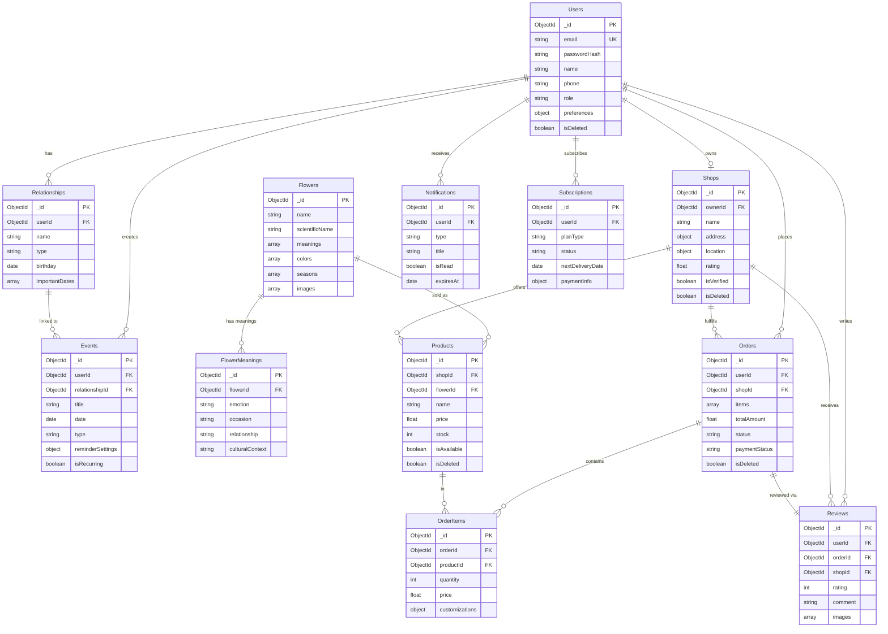

# 06. Database Design — Flowery

> **Phiên bản / Version:** 1.0.0
> **Cập nhật / Updated:** 2026-03-06
> **Công nghệ / Technology:** MongoDB Atlas 7.x (MERN Stack)

---

## Mục Lục / Table of Contents

1. [Tổng Quan Thiết Kế](#1-tổng-quan-thiết-kế)
2. [Entity Relationship Diagram](#2-entity-relationship-diagram)
3. [Chi Tiết Collection](#3-chi-tiết-collection)
4. [Chiến Lược Index](#4-chiến-lược-index)
5. [Quan Hệ & Tham Chiếu](#5-quan-hệ--tham-chiếu)
6. [Migration Strategy](#6-migration-strategy)
7. [Hiệu Suất & Tối Ưu](#7-hiệu-suất--tối-ưu)
8. [Backup & Recovery](#8-backup--recovery)

---

## 1. Tổng Quan Thiết Kế

### 1.1 Lý Do Chọn MongoDB / Why MongoDB

Flowery là nền tảng giao hoa cảm xúc với dữ liệu đa dạng và schema linh hoạt. MongoDB Atlas được chọn vì các lý do sau:

| Tiêu chí / Criterion | Lý do / Reason |
|---|---|
| **Flexible Schema** | Mỗi loài hoa có `meanings[]`, `customizations` khác nhau — không phù hợp với rigid SQL schema |
| **Embedded Documents** | `OrderItems` có thể embed vào `Orders`, tránh JOIN phức tạp |
| **Horizontal Scaling** | Sharding tự nhiên khi dữ liệu Orders tăng trưởng theo vùng địa lý |
| **Atlas Search** | Full-text search tích hợp sẵn cho flower catalog và shop discovery |
| **Aggregation Pipeline** | AI recommendation engine cần complex aggregations trên emotion → flower mappings |
| **Geospatial Queries** | Tìm shop gần nhất theo `2dsphere` index trên địa chỉ |
| **Atlas Triggers** | Real-time notification khi order status thay đổi |

### 1.2 Design Principles

#### Embedding vs Referencing Decision Rules

```
EMBED khi:
  ✓ Dữ liệu thuộc về document cha (owned relationship)
  ✓ Dữ liệu hiếm khi thay đổi độc lập
  ✓ Luôn đọc cùng với document cha
  ✓ Cardinality: one-to-few (< 100 items)

REFERENCE khi:
  ✓ Dữ liệu được share giữa nhiều documents
  ✓ Dữ liệu thay đổi thường xuyên
  ✓ Cardinality: one-to-many hoặc many-to-many
  ✓ Cần query độc lập
```

#### Denormalization Strategy

- `Orders` embed snapshot của product info (price, name) tại thời điểm đặt hàng — tránh giá thay đổi ảnh hưởng order cũ
- `Reviews` denormalize `shopId` để query shop reviews không cần join qua Orders
- `Products` denormalize flower `name`, `meanings[]` để tránh lookup khi hiển thị catalog

### 1.3 Naming Conventions

| Convention | Rule | Example |
|---|---|---|
| Collection names | PascalCase, số ít | `User`, `FlowerMeaning` |
| Field names | camelCase | `createdAt`, `shopId` |
| ObjectId refs | `[Collection]Id` suffix | `userId`, `shopId` |
| Boolean flags | `is` prefix | `isVerified`, `isDeleted` |
| Timestamps | `At` suffix | `createdAt`, `deletedAt` |
| Arrays | Plural noun | `images[]`, `tags[]` |

---

## 2. Entity Relationship Diagram



---

## 3. Chi Tiết Collection

---

### Collection: Users

**Mô tả**: Lưu trữ thông tin tài khoản người dùng, bao gồm khách hàng (`user`), chủ shop (`shop_owner`) và quản trị viên (`admin`). Đây là collection trung tâm của hệ thống.

**Estimated size**: ~50,000 documents năm đầu, tăng trưởng ~5,000/tháng

**Schema:**
```javascript
{
  _id: ObjectId,                          // Auto-generated
  email: {
    type: String,
    required: true,
    unique: true,
    lowercase: true,
    trim: true,
    match: /^[^\s@]+@[^\s@]+\.[^\s@]+$/
  },
  passwordHash: {
    type: String,
    required: true,
    select: false                         // Never returned in queries by default
  },
  name: {
    type: String,
    required: true,
    trim: true,
    minlength: 2,
    maxlength: 100
  },
  phone: {
    type: String,
    match: /^(\+84|0)[3-9]\d{8}$/,       // Vietnamese phone format
    sparse: true
  },
  avatar: {
    url: String,
    publicId: String                      // Cloudinary public_id for deletion
  },
  role: {
    type: String,
    enum: ['user', 'shop_owner', 'admin'],
    default: 'user',
    index: true
  },
  address: {
    street: String,
    ward: String,                         // Phường/Xã
    district: String,                     // Quận/Huyện
    city: String,                         // Tỉnh/Thành phố
    country: { type: String, default: 'Vietnam' },
    postalCode: String
  },
  preferences: {
    emotions: [String],                   // ['happy', 'romantic', 'grateful']
    colors: [String],                     // ['red', 'pink', 'white']
    budget: {
      min: { type: Number, min: 0 },
      max: { type: Number, min: 0 }
    },
    notifications: {
      email: { type: Boolean, default: true },
      sms: { type: Boolean, default: false },
      push: { type: Boolean, default: true }
    }
  },
  authProviders: [{
    provider: { type: String, enum: ['google', 'facebook'] },
    providerId: String,
    connectedAt: Date
  }],
  refreshTokens: [{
    token: String,
    device: String,
    createdAt: Date,
    expiresAt: Date
  }],
  lastLoginAt: Date,
  emailVerifiedAt: Date,
  passwordChangedAt: Date,
  isActive: { type: Boolean, default: true },
  isDeleted: { type: Boolean, default: false },
  deletedAt: Date,
  __v: { type: Number, default: 0 },     // Optimistic locking version
  createdAt: Date,
  updatedAt: Date
}
```

**Indexes:**
| Index | Fields | Type | Purpose |
|---|---|---|---|
| `email_unique` | `{ email: 1 }` | Unique | Login lookup |
| `role_idx` | `{ role: 1 }` | Single | Admin queries |
| `isDeleted_idx` | `{ isDeleted: 1 }` | Partial | Soft delete filter |
| `authProviders_idx` | `{ "authProviders.provider": 1, "authProviders.providerId": 1 }` | Compound | OAuth lookup |

**Validation Rules:**
- `email`: RFC 5322 regex, lowercase normalized, max 254 chars
- `phone`: Vietnamese format `(+84|0)[3-9]\d{8}`
- `preferences.budget.max` >= `preferences.budget.min`
- `passwordHash` không trả về trong API response (select: false)

**Sample Document:**
```json
{
  "_id": "507f1f77bcf86cd799439011",
  "email": "nguyen.thi.mai@gmail.com",
  "name": "Nguyễn Thị Mai",
  "phone": "0912345678",
  "role": "user",
  "avatar": {
    "url": "https://res.cloudinary.com/flowery/image/upload/v1/avatars/user_011.jpg",
    "publicId": "avatars/user_011"
  },
  "address": {
    "street": "123 Nguyễn Huệ",
    "ward": "Bến Nghé",
    "district": "Quận 1",
    "city": "Hồ Chí Minh",
    "country": "Vietnam"
  },
  "preferences": {
    "emotions": ["romantic", "grateful"],
    "colors": ["pink", "white"],
    "budget": { "min": 200000, "max": 800000 },
    "notifications": { "email": true, "sms": false, "push": true }
  },
  "isActive": true,
  "isDeleted": false,
  "emailVerifiedAt": "2026-01-15T08:00:00Z",
  "lastLoginAt": "2026-03-05T14:22:00Z",
  "createdAt": "2026-01-15T08:00:00Z",
  "updatedAt": "2026-03-05T14:22:00Z"
}
```

---

### Collection: Relationships

**Mô tả**: Lưu trữ danh sách người thân và bạn bè của người dùng. Đây là cơ sở để AI gợi ý hoa phù hợp với từng mối quan hệ và dịp đặc biệt.

**Estimated size**: ~200,000 documents (trung bình 4 relationship/user)

**Schema:**
```javascript
{
  _id: ObjectId,
  userId: { type: ObjectId, ref: 'Users', required: true, index: true },
  name: { type: String, required: true, trim: true, maxlength: 100 },
  nickname: { type: String, maxlength: 50 },
  type: {
    type: String,
    required: true,
    enum: ['family', 'friend', 'lover', 'colleague', 'other']
  },
  subType: String,                        // 'mother', 'father', 'sister', 'boss', ...
  birthday: Date,
  birthdayLunar: {                        // Âm lịch — quan trọng với văn hóa VN
    day: { type: Number, min: 1, max: 30 },
    month: { type: Number, min: 1, max: 12 }
  },
  avatar: {
    url: String,
    publicId: String
  },
  contactInfo: {
    phone: String,
    email: String
  },
  importantDates: [{
    label: { type: String, maxlength: 100 }, // 'Ngày cưới', 'Ngày quen nhau'
    date: Date,
    isLunar: { type: Boolean, default: false },
    reminderDays: { type: Number, default: 3 }
  }],
  notes: { type: String, maxlength: 500 },
  flowerPreferences: {
    favoriteFlowers: [String],
    favoriteColors: [String],
    allergies: [String]
  },
  isDeleted: { type: Boolean, default: false },
  deletedAt: Date,
  createdAt: Date,
  updatedAt: Date
}
```

**Indexes:**
| Index | Fields | Type | Purpose |
|---|---|---|---|
| `userId_idx` | `{ userId: 1, isDeleted: 1 }` | Compound | Lấy danh sách relationships của user |
| `birthday_reminder` | `{ "birthday": 1 }` | Single | Cron job gửi reminder sinh nhật |
| `userId_type` | `{ userId: 1, type: 1 }` | Compound | Filter theo loại quan hệ |

**Sample Document:**
```json
{
  "_id": "507f1f77bcf86cd799439022",
  "userId": "507f1f77bcf86cd799439011",
  "name": "Trần Văn Hùng",
  "nickname": "Anh Hùng",
  "type": "family",
  "subType": "brother",
  "birthday": "1990-07-15T00:00:00Z",
  "birthdayLunar": { "day": 12, "month": 6 },
  "importantDates": [
    { "label": "Ngày tốt nghiệp đại học", "date": "2013-06-20T00:00:00Z", "reminderDays": 7 }
  ],
  "flowerPreferences": {
    "favoriteColors": ["yellow", "orange"],
    "allergies": []
  },
  "isDeleted": false,
  "createdAt": "2026-02-01T09:00:00Z",
  "updatedAt": "2026-02-01T09:00:00Z"
}
```

---

### Collection: Events

**Mô tả**: Lịch sự kiện của người dùng. Hệ thống tự động gửi nhắc nhở và gợi ý hoa phù hợp trước ngày sự kiện.

**Estimated size**: ~500,000 documents, tăng cao vào mùa lễ (Tết, Valentine, 8/3)

**Schema:**
```javascript
{
  _id: ObjectId,
  userId: { type: ObjectId, ref: 'Users', required: true, index: true },
  relationshipId: { type: ObjectId, ref: 'Relationships', index: true },
  title: { type: String, required: true, maxlength: 200 },
  date: { type: Date, required: true },
  isLunarDate: { type: Boolean, default: false },
  type: {
    type: String,
    required: true,
    enum: ['birthday', 'anniversary', 'holiday', 'graduation', 'wedding', 'custom']
  },
  reminderSettings: {
    enabled: { type: Boolean, default: true },
    daysBefore: [{ type: Number, enum: [1, 3, 7, 14, 30] }],
    channels: [{ type: String, enum: ['push', 'email', 'sms'] }],
    lastSentAt: Date
  },
  isRecurring: { type: Boolean, default: false },
  recurrence: {
    frequency: { type: String, enum: ['yearly', 'monthly', 'weekly'] },
    endDate: Date
  },
  status: {
    type: String,
    enum: ['upcoming', 'today', 'passed', 'cancelled'],
    default: 'upcoming'
  },
  aiSuggestionSent: { type: Boolean, default: false },
  notes: { type: String, maxlength: 500 },
  isDeleted: { type: Boolean, default: false },
  deletedAt: Date,
  createdAt: Date,
  updatedAt: Date
}
```

**Indexes:**
| Index | Fields | Type | Purpose |
|---|---|---|---|
| `userId_date` | `{ userId: 1, date: 1 }` | Compound | Lấy upcoming events |
| `date_reminder` | `{ date: 1, "reminderSettings.enabled": 1 }` | Compound | Cron job reminder |
| `userId_status` | `{ userId: 1, status: 1, date: 1 }` | Compound | Filter theo status |

**Sample Document:**
```json
{
  "_id": "507f1f77bcf86cd799439033",
  "userId": "507f1f77bcf86cd799439011",
  "relationshipId": "507f1f77bcf86cd799439022",
  "title": "Sinh nhật Anh Hùng",
  "date": "2026-07-15T00:00:00Z",
  "type": "birthday",
  "reminderSettings": {
    "enabled": true,
    "daysBefore": [7, 3, 1],
    "channels": ["push", "email"],
    "lastSentAt": null
  },
  "isRecurring": true,
  "recurrence": { "frequency": "yearly" },
  "status": "upcoming",
  "aiSuggestionSent": false,
  "createdAt": "2026-02-01T09:00:00Z",
  "updatedAt": "2026-02-01T09:00:00Z"
}
```

---

### Collection: Flowers

**Mô tả**: Danh mục hoa với thông tin khoa học và ý nghĩa. Đây là "từ điển hoa" của hệ thống, được AI sử dụng để mapping cảm xúc → hoa phù hợp.

**Estimated size**: ~500 documents (ổn định, tăng chậm ~5/tháng)

**Schema:**
```javascript
{
  _id: ObjectId,
  name: {
    vi: { type: String, required: true },  // 'Hoa Hồng'
    en: { type: String, required: true }   // 'Rose'
  },
  scientificName: { type: String },        // 'Rosa'
  slug: { type: String, unique: true },    // 'hoa-hong'
  meanings: [{
    emotion: String,                        // 'romantic', 'passionate'
    occasion: String,                       // 'anniversary', 'valentines'
    relationship: String,                   // 'lover', 'spouse'
    description: { vi: String, en: String }
  }],
  colors: [{
    name: { vi: String, en: String },       // { vi: 'Đỏ', en: 'Red' }
    hex: String,                            // '#FF0000'
    meanings: [String]                      // ['passion', 'love']
  }],
  seasons: [{ type: String, enum: ['spring', 'summer', 'autumn', 'winter', 'all_year'] }],
  images: [{
    url: String,
    publicId: String,
    color: String,
    isPrimary: Boolean
  }],
  description: {
    vi: { type: String, maxlength: 2000 },
    en: { type: String, maxlength: 2000 }
  },
  careInstructions: {
    wateringFrequency: String,             // 'Tưới 2 lần/tuần'
    sunlight: String,
    temperature: String,
    vaseLife: String,                      // 'Tươi 7-10 ngày'
    tips: [String]
  },
  culturalSignificance: {
    vietnam: String,
    general: String
  },
  popularityScore: { type: Number, default: 0 },  // Cập nhật theo order count
  tags: [String],
  isActive: { type: Boolean, default: true },
  createdAt: Date,
  updatedAt: Date
}
```

**Indexes:**
| Index | Fields | Type | Purpose |
|---|---|---|---|
| `slug_unique` | `{ slug: 1 }` | Unique | URL lookup |
| `text_search` | `{ "name.vi": "text", "name.en": "text", "tags": "text" }` | Text | Full-text search |
| `seasons_idx` | `{ seasons: 1, isActive: 1 }` | Compound | Filter theo mùa |
| `meanings_idx` | `{ "meanings.emotion": 1, "meanings.occasion": 1 }` | Compound | AI emotion mapping |
| `popularity_idx` | `{ popularityScore: -1 }` | Single | Trending flowers |

**Sample Document:**
```json
{
  "_id": "507f1f77bcf86cd799439044",
  "name": { "vi": "Hoa Hồng", "en": "Rose" },
  "scientificName": "Rosa",
  "slug": "hoa-hong",
  "meanings": [
    {
      "emotion": "romantic",
      "occasion": "anniversary",
      "relationship": "lover",
      "description": {
        "vi": "Hoa hồng đỏ biểu tượng cho tình yêu nồng cháy và đam mê.",
        "en": "Red roses symbolize passionate and romantic love."
      }
    }
  ],
  "colors": [
    { "name": { "vi": "Đỏ", "en": "Red" }, "hex": "#DC143C", "meanings": ["love", "passion"] },
    { "name": { "vi": "Hồng", "en": "Pink" }, "hex": "#FFB6C1", "meanings": ["gratitude", "grace"] }
  ],
  "seasons": ["all_year"],
  "popularityScore": 9850,
  "tags": ["classic", "romantic", "wedding", "valentine"],
  "isActive": true,
  "createdAt": "2026-01-01T00:00:00Z",
  "updatedAt": "2026-03-01T00:00:00Z"
}
```

---

### Collection: FlowerMeanings

**Mô tả**: Bảng tra cứu chi tiết ý nghĩa của hoa theo bối cảnh văn hóa Việt Nam. Được AI sử dụng để đưa ra gợi ý phù hợp nhất với từng ngữ cảnh.

**Estimated size**: ~5,000 documents (nhiều meanings/flower × nhiều contexts)

**Schema:**
```javascript
{
  _id: ObjectId,
  flowerId: { type: ObjectId, ref: 'Flowers', required: true, index: true },
  emotion: {
    type: String,
    required: true,
    enum: ['romantic', 'grateful', 'joyful', 'sympathetic', 'respectful',
           'apologetic', 'celebratory', 'mourning', 'friendly', 'passionate']
  },
  occasion: {
    type: String,
    enum: ['birthday', 'anniversary', 'valentines', 'mothers_day', 'womens_day',
           'tet', 'graduation', 'wedding', 'funeral', 'get_well', 'custom']
  },
  relationship: {
    type: String,
    enum: ['lover', 'spouse', 'mother', 'father', 'friend', 'colleague',
           'teacher', 'boss', 'child', 'general']
  },
  culturalContext: {
    type: String,
    enum: ['vietnam', 'general', 'western'],
    default: 'vietnam'
  },
  description: {
    vi: { type: String, required: true, maxlength: 1000 },
    en: { type: String, maxlength: 1000 }
  },
  taboos: [{                              // Kiêng kỵ — quan trọng với văn hóa VN
    context: String,                     // 'tang lễ', 'ngày tết'
    reason: String
  }],
  aiWeight: { type: Number, default: 1.0, min: 0, max: 5 },  // Weight cho recommendation engine
  usageCount: { type: Number, default: 0 },                   // Tracking popularity
  createdAt: Date,
  updatedAt: Date
}
```

**Indexes:**
| Index | Fields | Type | Purpose |
|---|---|---|---|
| `flowerId_idx` | `{ flowerId: 1 }` | Single | Lấy meanings của một hoa |
| `ai_lookup` | `{ emotion: 1, occasion: 1, relationship: 1, culturalContext: 1 }` | Compound | AI recommendation query |
| `aiWeight_idx` | `{ aiWeight: -1, usageCount: -1 }` | Compound | Ranking trong recommendation |

**Sample Document:**
```json
{
  "_id": "507f1f77bcf86cd799439055",
  "flowerId": "507f1f77bcf86cd799439044",
  "emotion": "grateful",
  "occasion": "mothers_day",
  "relationship": "mother",
  "culturalContext": "vietnam",
  "description": {
    "vi": "Hoa hồng hồng nhạt thể hiện lòng biết ơn sâu sắc và tình yêu thương dành cho mẹ. Trong văn hóa Việt Nam, hoa hồng hồng là lựa chọn truyền thống trong ngày của mẹ.",
    "en": "Light pink roses express deep gratitude and love for mothers."
  },
  "taboos": [],
  "aiWeight": 4.5,
  "usageCount": 2340,
  "createdAt": "2026-01-01T00:00:00Z",
  "updatedAt": "2026-03-01T00:00:00Z"
}
```

---

### Collection: Shops

**Mô tả**: Thông tin cửa hàng hoa đã đăng ký trên nền tảng Flowery. Bao gồm thông tin kinh doanh, xác minh, và vị trí địa lý để tìm kiếm gần nhất.

**Estimated size**: ~2,000 shops năm đầu, tăng trưởng ~50/tháng

**Schema:**
```javascript
{
  _id: ObjectId,
  ownerId: { type: ObjectId, ref: 'Users', required: true, unique: true },
  name: { type: String, required: true, trim: true, maxlength: 200 },
  slug: { type: String, unique: true },
  description: { type: String, maxlength: 2000 },
  tagline: { type: String, maxlength: 200 },
  address: {
    street: { type: String, required: true },
    ward: String,
    district: { type: String, required: true },
    city: { type: String, required: true },
    postalCode: String
  },
  location: {
    type: { type: String, enum: ['Point'], default: 'Point' },
    coordinates: [Number]               // [longitude, latitude]
  },
  phone: {
    type: String,
    required: true,
    match: /^(\+84|0)[3-9]\d{8}$/
  },
  email: { type: String, match: /^[^\s@]+@[^\s@]+\.[^\s@]+$/ },
  website: String,
  socialLinks: {
    facebook: String,
    instagram: String,
    zalo: String
  },
  logo: { url: String, publicId: String },
  coverImage: { url: String, publicId: String },
  images: [{ url: String, publicId: String, caption: String }],
  operatingHours: {
    monday:    { open: String, close: String, isClosed: Boolean },
    tuesday:   { open: String, close: String, isClosed: Boolean },
    wednesday: { open: String, close: String, isClosed: Boolean },
    thursday:  { open: String, close: String, isClosed: Boolean },
    friday:    { open: String, close: String, isClosed: Boolean },
    saturday:  { open: String, close: String, isClosed: Boolean },
    sunday:    { open: String, close: String, isClosed: Boolean }
  },
  deliveryConfig: {
    maxRadius: { type: Number, default: 10 },    // km
    minOrderAmount: { type: Number, default: 0 },
    deliveryFee: Number,
    freeDeliveryThreshold: Number,
    estimatedTime: String                        // '30-60 phút'
  },
  stats: {
    rating: { type: Number, default: 0, min: 0, max: 5 },
    ratingCount: { type: Number, default: 0 },
    totalOrders: { type: Number, default: 0 },
    completionRate: { type: Number, default: 100 }  // % đơn hoàn thành
  },
  businessLicense: {
    number: String,
    issuedDate: Date,
    expiryDate: Date,
    imageUrl: String
  },
  isVerified: { type: Boolean, default: false },
  verifiedAt: Date,
  verifiedBy: { type: ObjectId, ref: 'Users' },  // Admin who verified
  isActive: { type: Boolean, default: true },
  isDeleted: { type: Boolean, default: false },
  deletedAt: Date,
  suspendedAt: Date,
  suspendReason: String,
  __v: { type: Number, default: 0 },
  createdAt: Date,
  updatedAt: Date
}
```

**Indexes:**
| Index | Fields | Type | Purpose |
|---|---|---|---|
| `ownerId_unique` | `{ ownerId: 1 }` | Unique | Owner → shop lookup |
| `slug_unique` | `{ slug: 1 }` | Unique | URL routing |
| `location_geo` | `{ location: "2dsphere" }` | 2dsphere | Tìm shop gần nhất |
| `text_search` | `{ name: "text", description: "text", tagline: "text" }` | Text | Shop search |
| `rating_idx` | `{ "stats.rating": -1, isVerified: 1 }` | Compound | Xếp hạng shop |
| `city_district` | `{ "address.city": 1, "address.district": 1, isActive: 1 }` | Compound | Browse by location |

**Sample Document:**
```json
{
  "_id": "507f1f77bcf86cd799439066",
  "ownerId": "507f1f77bcf86cd799439099",
  "name": "Hoa Tươi Sài Gòn",
  "slug": "hoa-tuoi-sai-gon",
  "description": "Cửa hàng hoa tươi cao cấp tại trung tâm Quận 1, chuyên cung cấp hoa nhập khẩu và nội địa.",
  "address": {
    "street": "45 Lê Lợi",
    "ward": "Bến Nghé",
    "district": "Quận 1",
    "city": "Hồ Chí Minh"
  },
  "location": { "type": "Point", "coordinates": [106.6985, 10.7757] },
  "phone": "02838221234",
  "stats": { "rating": 4.8, "ratingCount": 342, "totalOrders": 1205, "completionRate": 98.5 },
  "isVerified": true,
  "isActive": true,
  "isDeleted": false,
  "createdAt": "2026-01-10T00:00:00Z",
  "updatedAt": "2026-03-01T00:00:00Z"
}
```

---

### Collection: Products

**Mô tả**: Sản phẩm hoa do từng shop đăng bán. Lưu snapshot thông tin hoa để tránh join, đồng thời tham chiếu `flowerId` cho AI recommendation.

**Estimated size**: ~30,000 documents (trung bình 15 sản phẩm/shop)

**Schema:**
```javascript
{
  _id: ObjectId,
  shopId: { type: ObjectId, ref: 'Shops', required: true, index: true },
  flowerId: { type: ObjectId, ref: 'Flowers', index: true },    // nullable — bouquet có thể mix
  name: { type: String, required: true, maxlength: 200 },
  slug: String,
  description: { type: String, maxlength: 3000 },
  price: {
    type: Number,
    required: true,
    min: 10000,                          // Tối thiểu 10,000 VNĐ
    max: 50000000                        // Tối đa 50,000,000 VNĐ
  },
  salePrice: { type: Number, min: 0 },   // Giá khuyến mãi
  saleEndsAt: Date,
  currency: { type: String, default: 'VND' },
  category: {
    type: String,
    required: true,
    enum: ['single_flower', 'bouquet', 'arrangement', 'basket', 'box', 'subscription_pack', 'custom']
  },
  flowerComposition: [{                  // Thành phần hoa (quan trọng cho mix bouquet)
    flowerId: ObjectId,
    flowerName: String,                  // Denormalized snapshot
    quantity: Number,
    color: String
  }],
  images: [{
    url: { type: String, required: true },
    publicId: String,
    isPrimary: { type: Boolean, default: false },
    alt: String
  }],
  tags: [String],
  customizationOptions: [{
    name: String,                        // 'Màu ruy băng', 'Tin nhắn thiệp'
    type: { type: String, enum: ['text', 'select', 'boolean'] },
    options: [String],                   // Cho type='select'
    maxLength: Number,                   // Cho type='text'
    additionalPrice: { type: Number, default: 0 }
  }],
  stock: {
    quantity: { type: Number, required: true, min: 0 },
    unlimited: { type: Boolean, default: false },
    lowStockThreshold: { type: Number, default: 5 },
    reservedQuantity: { type: Number, default: 0 }   // Tạm giữ cho pending orders
  },
  availableForDelivery: { type: Boolean, default: true },
  availableForPickup: { type: Boolean, default: true },
  isAvailable: { type: Boolean, default: true },
  isDeleted: { type: Boolean, default: false },
  deletedAt: Date,
  stats: {
    totalSold: { type: Number, default: 0 },
    rating: { type: Number, default: 0 },
    ratingCount: { type: Number, default: 0 }
  },
  createdAt: Date,
  updatedAt: Date
}
```

**Indexes:**
| Index | Fields | Type | Purpose |
|---|---|---|---|
| `shopId_available` | `{ shopId: 1, isAvailable: 1, isDeleted: 1 }` | Compound | Lấy products của shop |
| `flowerId_idx` | `{ flowerId: 1 }` | Single | AI recommendation lookup |
| `price_range` | `{ price: 1, category: 1 }` | Compound | Filter theo giá |
| `text_search` | `{ name: "text", description: "text", tags: "text" }` | Text | Product search |
| `rating_idx` | `{ "stats.rating": -1, "stats.totalSold": -1 }` | Compound | Bestseller listing |

**Sample Document:**
```json
{
  "_id": "507f1f77bcf86cd799439077",
  "shopId": "507f1f77bcf86cd799439066",
  "flowerId": "507f1f77bcf86cd799439044",
  "name": "Bó Hoa Hồng Đỏ 24 Bông - Tình Yêu Vĩnh Cửu",
  "price": 650000,
  "currency": "VND",
  "category": "bouquet",
  "flowerComposition": [
    { "flowerName": "Hoa Hồng Đỏ", "quantity": 24, "color": "red" },
    { "flowerName": "Hoa Baby", "quantity": 10, "color": "white" }
  ],
  "stock": { "quantity": 15, "unlimited": false, "lowStockThreshold": 3 },
  "customizationOptions": [
    {
      "name": "Màu ruy băng",
      "type": "select",
      "options": ["Đỏ", "Hồng", "Trắng", "Vàng"],
      "additionalPrice": 0
    },
    {
      "name": "Nội dung thiệp",
      "type": "text",
      "maxLength": 150,
      "additionalPrice": 0
    }
  ],
  "isAvailable": true,
  "isDeleted": false,
  "stats": { "totalSold": 89, "rating": 4.9, "ratingCount": 45 },
  "createdAt": "2026-01-15T00:00:00Z",
  "updatedAt": "2026-03-01T00:00:00Z"
}
```

---

### Collection: Orders

**Mô tả**: Đơn hàng của khách. Embed snapshot thông tin sản phẩm và giá tại thời điểm đặt để tránh sai lệch khi giá thay đổi. `items[]` được embed trực tiếp vào Order thay vì tách riêng (cardinality thấp: < 20 items/order).

**Estimated size**: ~500,000 orders/năm, tăng mạnh vào lễ (Valentine, 8/3, Tết)

**Schema:**
```javascript
{
  _id: ObjectId,
  orderNumber: { type: String, unique: true },  // 'BS-2026-00001' — human-readable
  userId: { type: ObjectId, ref: 'Users', required: true, index: true },
  shopId: { type: ObjectId, ref: 'Shops', required: true, index: true },
  items: [{                              // EMBED thay vì OrderItems collection riêng
    productId: { type: ObjectId, ref: 'Products' },
    productName: String,                 // Snapshot tại thời điểm đặt
    productImage: String,
    quantity: { type: Number, min: 1 },
    unitPrice: Number,                  // Snapshot giá
    subtotal: Number,
    customizations: Object              // { ribbonColor: 'Đỏ', cardMessage: '...' }
  }],
  pricing: {
    subtotal: Number,
    deliveryFee: Number,
    discount: Number,
    discountCode: String,
    totalAmount: { type: Number, required: true, min: 0 }
  },
  status: {
    type: String,
    enum: ['pending', 'confirmed', 'preparing', 'delivering', 'delivered', 'cancelled', 'refunded'],
    default: 'pending',
    index: true
  },
  statusHistory: [{
    status: String,
    timestamp: Date,
    note: String,
    updatedBy: ObjectId
  }],
  deliveryAddress: {
    recipientName: { type: String, required: true },
    recipientPhone: { type: String, required: true },
    street: String,
    ward: String,
    district: String,
    city: String,
    notes: String                       // 'Giao trước 10h, gọi trước khi đến'
  },
  deliveryDate: { type: Date, required: true },
  deliveryTimeSlot: {
    start: String,                      // '08:00'
    end: String                         // '12:00'
  },
  isAnonymous: { type: Boolean, default: false },  // Giao hoa ẩn danh
  giftMessage: { type: String, maxlength: 500 },
  paymentMethod: {
    type: String,
    enum: ['cod', 'vnpay', 'momo', 'zalopay', 'bank_transfer'],
    required: true
  },
  paymentStatus: {
    type: String,
    enum: ['pending', 'paid', 'failed', 'refunded'],
    default: 'pending'
  },
  paymentDetails: {
    transactionId: String,
    paidAt: Date,
    gateway: String
  },
  cancelReason: String,
  cancelledAt: Date,
  cancelledBy: { type: ObjectId, ref: 'Users' },
  refundAmount: Number,
  refundedAt: Date,
  isDeleted: { type: Boolean, default: false },
  deletedAt: Date,
  __v: { type: Number, default: 0 },
  createdAt: Date,
  updatedAt: Date
}
```

**Indexes:**
| Index | Fields | Type | Purpose |
|---|---|---|---|
| `orderNumber_unique` | `{ orderNumber: 1 }` | Unique | Order lookup |
| `userId_status` | `{ userId: 1, status: 1, createdAt: -1 }` | Compound | User order history |
| `shopId_status` | `{ shopId: 1, status: 1, deliveryDate: 1 }` | Compound | Shop order dashboard |
| `deliveryDate_idx` | `{ deliveryDate: 1, status: 1 }` | Compound | Delivery schedule |
| `paymentStatus_idx` | `{ paymentStatus: 1, createdAt: -1 }` | Compound | Payment reconciliation |

**Sample Document:**
```json
{
  "_id": "507f1f77bcf86cd799439088",
  "orderNumber": "BS-2026-00542",
  "userId": "507f1f77bcf86cd799439011",
  "shopId": "507f1f77bcf86cd799439066",
  "items": [
    {
      "productId": "507f1f77bcf86cd799439077",
      "productName": "Bó Hoa Hồng Đỏ 24 Bông",
      "quantity": 1,
      "unitPrice": 650000,
      "subtotal": 650000,
      "customizations": { "ribbonColor": "Đỏ", "cardMessage": "Chúc mừng sinh nhật em yêu!" }
    }
  ],
  "pricing": {
    "subtotal": 650000,
    "deliveryFee": 30000,
    "discount": 0,
    "totalAmount": 680000
  },
  "status": "confirmed",
  "deliveryAddress": {
    "recipientName": "Nguyễn Thị Mai",
    "recipientPhone": "0912345678",
    "street": "123 Nguyễn Huệ",
    "district": "Quận 1",
    "city": "Hồ Chí Minh"
  },
  "deliveryDate": "2026-07-15T00:00:00Z",
  "deliveryTimeSlot": { "start": "08:00", "end": "12:00" },
  "paymentMethod": "vnpay",
  "paymentStatus": "paid",
  "createdAt": "2026-03-05T10:30:00Z",
  "updatedAt": "2026-03-05T10:35:00Z"
}
```

---

### Collection: Reviews

**Mô tả**: Đánh giá của khách hàng sau khi nhận đơn. Mỗi đơn hàng chỉ được đánh giá một lần. Denormalize `shopId` để query shop reviews trực tiếp.

**Estimated size**: ~150,000 documents (rate ~30% orders leave review)

**Schema:**
```javascript
{
  _id: ObjectId,
  userId: { type: ObjectId, ref: 'Users', required: true, index: true },
  orderId: { type: ObjectId, ref: 'Orders', required: true, unique: true }, // 1 order → 1 review
  shopId: { type: ObjectId, ref: 'Shops', required: true, index: true },    // Denormalized
  rating: {
    overall: { type: Number, required: true, min: 1, max: 5 },
    quality: { type: Number, min: 1, max: 5 },
    delivery: { type: Number, min: 1, max: 5 },
    packaging: { type: Number, min: 1, max: 5 }
  },
  comment: { type: String, maxlength: 2000 },
  images: [{
    url: String,
    publicId: String
  }],
  shopReply: {
    content: { type: String, maxlength: 1000 },
    repliedAt: Date
  },
  isVerifiedPurchase: { type: Boolean, default: true },
  helpfulCount: { type: Number, default: 0 },
  isDeleted: { type: Boolean, default: false },
  deletedAt: Date,
  deletedReason: String,
  createdAt: Date,
  updatedAt: Date
}
```

**Indexes:**
| Index | Fields | Type | Purpose |
|---|---|---|---|
| `orderId_unique` | `{ orderId: 1 }` | Unique | 1 review/order |
| `shopId_rating` | `{ shopId: 1, "rating.overall": -1, createdAt: -1 }` | Compound | Shop review listing |
| `userId_idx` | `{ userId: 1, createdAt: -1 }` | Compound | User review history |

**Sample Document:**
```json
{
  "_id": "507f1f77bcf86cd799439099",
  "userId": "507f1f77bcf86cd799439011",
  "orderId": "507f1f77bcf86cd799439088",
  "shopId": "507f1f77bcf86cd799439066",
  "rating": { "overall": 5, "quality": 5, "delivery": 4, "packaging": 5 },
  "comment": "Hoa tươi đẹp, đóng gói cẩn thận. Giao hơi trễ 15 phút nhưng vẫn rất hài lòng. Sẽ ủng hộ tiếp!",
  "images": [{ "url": "https://res.cloudinary.com/flowery/reviews/r_099.jpg" }],
  "shopReply": {
    "content": "Cảm ơn bạn đã tin tưởng Hoa Tươi Sài Gòn! Chúng tôi sẽ cải thiện thời gian giao hàng ạ.",
    "repliedAt": "2026-07-16T08:00:00Z"
  },
  "isVerifiedPurchase": true,
  "helpfulCount": 12,
  "isDeleted": false,
  "createdAt": "2026-07-15T18:30:00Z",
  "updatedAt": "2026-07-16T08:00:00Z"
}
```

---

### Collection: Notifications

**Mô tả**: Thông báo đẩy cho người dùng. Sử dụng TTL index để tự động xóa thông báo cũ sau 90 ngày. Không lưu vĩnh viễn để tiết kiệm storage.

**Estimated size**: ~2M documents, auto-purged via TTL

**Schema:**
```javascript
{
  _id: ObjectId,
  userId: { type: ObjectId, ref: 'Users', required: true, index: true },
  type: {
    type: String,
    required: true,
    enum: ['order_status', 'event_reminder', 'ai_suggestion', 'promo', 'review_request',
           'system', 'subscription_renewal', 'shop_reply']
  },
  title: { type: String, required: true, maxlength: 200 },
  message: { type: String, required: true, maxlength: 500 },
  data: {                               // Deep link data
    orderId: ObjectId,
    eventId: ObjectId,
    shopId: ObjectId,
    productId: ObjectId,
    url: String
  },
  channels: [{ type: String, enum: ['push', 'email', 'sms', 'in_app'] }],
  isRead: { type: Boolean, default: false, index: true },
  readAt: Date,
  expiresAt: Date,                      // TTL field
  createdAt: Date
}
```

**Indexes:**
| Index | Fields | Type | Purpose |
|---|---|---|---|
| `userId_unread` | `{ userId: 1, isRead: 1, createdAt: -1 }` | Compound | Unread notifications |
| `ttl_expire` | `{ expiresAt: 1 }` | TTL (90d) | Auto-delete old notifications |
| `type_idx` | `{ userId: 1, type: 1, createdAt: -1 }` | Compound | Filter by type |

**Sample Document:**
```json
{
  "_id": "507f1f77bcf86cd799439100",
  "userId": "507f1f77bcf86cd799439011",
  "type": "event_reminder",
  "title": "🎂 Sinh nhật Anh Hùng còn 7 ngày nữa!",
  "message": "Đừng quên chọn hoa cho sinh nhật Anh Hùng ngày 15/07. Flowery đã có những gợi ý dành riêng cho bạn!",
  "data": { "eventId": "507f1f77bcf86cd799439033", "url": "/events/507f1f77bcf86cd799439033/suggest" },
  "channels": ["push", "email"],
  "isRead": false,
  "expiresAt": "2026-10-05T00:00:00Z",
  "createdAt": "2026-07-08T08:00:00Z"
}
```

---

### Collection: Subscriptions

**Mô tả**: Gói đặt hoa định kỳ (weekly/biweekly/monthly). Cron job chạy hàng ngày để tạo Orders từ active subscriptions đến ngày giao tiếp theo.

**Estimated size**: ~10,000 active subscriptions

**Schema:**
```javascript
{
  _id: ObjectId,
  userId: { type: ObjectId, ref: 'Users', required: true, index: true },
  shopId: { type: ObjectId, ref: 'Shops' },   // Có thể null nếu để AI chọn shop
  planType: {
    type: String,
    required: true,
    enum: ['weekly', 'biweekly', 'monthly']
  },
  preferences: {
    budget: { type: Number, required: true, min: 50000 },
    emotions: [String],
    colors: [String],
    excludeFlowers: [String],
    surpriseMe: { type: Boolean, default: false }  // AI tự chọn hoàn toàn
  },
  deliveryAddress: {
    recipientName: { type: String, required: true },
    recipientPhone: { type: String, required: true },
    street: String,
    ward: String,
    district: String,
    city: String
  },
  deliveryDayOfWeek: { type: Number, min: 0, max: 6 },  // 0=Sun, 1=Mon...
  deliveryTimeSlot: { start: String, end: String },
  nextDeliveryDate: { type: Date, required: true, index: true },
  lastDeliveryDate: Date,
  totalDeliveries: { type: Number, default: 0 },
  status: {
    type: String,
    enum: ['active', 'paused', 'cancelled'],
    default: 'active',
    index: true
  },
  pausedUntil: Date,
  pauseReason: String,
  cancelledAt: Date,
  cancelReason: String,
  paymentInfo: {
    method: { type: String, enum: ['vnpay', 'momo', 'zalopay', 'bank_transfer'] },
    savedCardToken: String,              // Tokenized card — không lưu raw card data
    autoCharge: { type: Boolean, default: false }
  },
  orderHistory: [{ type: ObjectId, ref: 'Orders' }],  // Reference to generated orders
  __v: { type: Number, default: 0 },
  createdAt: Date,
  updatedAt: Date
}
```

**Indexes:**
| Index | Fields | Type | Purpose |
|---|---|---|---|
| `userId_status` | `{ userId: 1, status: 1 }` | Compound | User's subscriptions |
| `nextDelivery_active` | `{ nextDeliveryDate: 1, status: 1 }` | Compound | Cron job: today's deliveries |

**Sample Document:**
```json
{
  "_id": "507f1f77bcf86cd799439111",
  "userId": "507f1f77bcf86cd799439011",
  "planType": "weekly",
  "preferences": {
    "budget": 300000,
    "emotions": ["romantic", "joyful"],
    "colors": ["pink", "white"],
    "surpriseMe": false
  },
  "deliveryAddress": {
    "recipientName": "Nguyễn Thị Mai",
    "recipientPhone": "0912345678",
    "street": "123 Nguyễn Huệ",
    "district": "Quận 1",
    "city": "Hồ Chí Minh"
  },
  "deliveryDayOfWeek": 5,
  "deliveryTimeSlot": { "start": "16:00", "end": "20:00" },
  "nextDeliveryDate": "2026-03-13T00:00:00Z",
  "status": "active",
  "totalDeliveries": 8,
  "paymentInfo": { "method": "vnpay", "autoCharge": true },
  "createdAt": "2026-01-17T00:00:00Z",
  "updatedAt": "2026-03-06T00:00:00Z"
}
```

---

## 4. Chiến Lược Index

### 4.1 Index Summary Table

| Collection | Index Name | Fields | Type | Cardinality |
|---|---|---|---|---|
| Users | email_unique | `{ email: 1 }` | Unique | Very High |
| Users | role_idx | `{ role: 1 }` | Single | Low |
| Shops | location_geo | `{ location: "2dsphere" }` | Geospatial | High |
| Shops | text_search | `{ name, description, tagline }` | Text | — |
| Products | shopId_available | `{ shopId, isAvailable, isDeleted }` | Compound | High |
| Products | text_search | `{ name, description, tags }` | Text | — |
| Orders | userId_status | `{ userId, status, createdAt }` | Compound | High |
| Orders | shopId_status | `{ shopId, status, deliveryDate }` | Compound | High |
| Flowers | meanings_idx | `{ "meanings.emotion", "meanings.occasion" }` | Compound | Medium |
| Notifications | ttl_expire | `{ expiresAt }` | TTL | — |
| Subscriptions | nextDelivery_active | `{ nextDeliveryDate, status }` | Compound | Medium |

### 4.2 Text Search Indexes

```javascript
// Shops full-text search
db.Shops.createIndex(
  { name: "text", description: "text", tagline: "text" },
  { weights: { name: 10, tagline: 5, description: 1 }, name: "shops_text" }
)

// Products full-text search
db.Products.createIndex(
  { name: "text", description: "text", tags: "text" },
  { weights: { name: 10, tags: 5, description: 1 }, name: "products_text" }
)

// Flowers full-text search (bilingual)
db.Flowers.createIndex(
  { "name.vi": "text", "name.en": "text", tags: "text" },
  { weights: { "name.vi": 10, "name.en": 10, tags: 5 }, name: "flowers_text" }
)
```

### 4.3 TTL Index for Notifications

```javascript
// Tự động xóa notifications sau 90 ngày
db.Notifications.createIndex(
  { expiresAt: 1 },
  { expireAfterSeconds: 0, name: "notifications_ttl" }
)
```

### 4.4 Partial Indexes (Tối ưu Storage)

```javascript
// Chỉ index users chưa bị xóa
db.Users.createIndex(
  { email: 1 },
  { partialFilterExpression: { isDeleted: false }, unique: true }
)

// Chỉ index orders đang active
db.Orders.createIndex(
  { deliveryDate: 1 },
  { partialFilterExpression: { status: { $in: ['confirmed', 'preparing', 'delivering'] } } }
)
```

### 4.5 Index Size Estimates

| Collection | Document Count | Est. Index Size | Notes |
|---|---|---|---|
| Users | 50,000 | ~15 MB | Email unique + role |
| Orders | 500,000 | ~120 MB | Multiple compound indexes |
| Products | 30,000 | ~25 MB | Text index largest |
| Notifications | 2,000,000 | ~200 MB | Auto-purged via TTL |
| Shops | 2,000 | ~5 MB | 2dsphere index |

---

## 5. Quan Hệ & Tham Chiếu

### 5.1 Embedding vs Referencing Decision Matrix

| Relationship | Decision | Reason |
|---|---|---|
| Orders → Items | **EMBED** `items[]` | < 20 items/order, always read together, prices need snapshot |
| Orders → statusHistory | **EMBED** | Small array, always read with order |
| Users → preferences | **EMBED** | Belongs to user, read always together |
| Shops → operatingHours | **EMBED** | Fixed structure, always needed with shop |
| Products → flowerComposition | **EMBED** | Snapshot needed, small array |
| Users → Relationships | **REFERENCE** | Independent queries needed, many relationships |
| Orders → Reviews | **REFERENCE** | 1:1 but loaded separately |
| Flowers → FlowerMeanings | **REFERENCE** | Many meanings, queried independently by AI |

### 5.2 Reference Chain Map

```
Users ──────┬──► Relationships ──► Events
            ├──► Orders ──────────► (items[] embedded)
            ├──► Reviews
            ├──► Notifications
            ├──► Subscriptions
            └──► Shops ──┬──► Products ──► Flowers ──► FlowerMeanings
                         └──► Reviews
```

### 5.3 Cascade Delete Strategy

| Trigger | Action | Implementation |
|---|---|---|
| User deleted | Soft delete only (`isDeleted: true`) | MongoDB trigger / app logic |
| Shop deleted | Soft delete shop + deactivate products | App middleware |
| Product deleted | Soft delete product, keep in order snapshots | App middleware |
| Order cancelled | Update status, restore product stock, trigger refund | Transaction |
| Relationship deleted | Soft delete, keep events intact | App logic |

### 5.4 Data Consistency Patterns

```javascript
// Sử dụng MongoDB Transactions cho Order creation
const session = await mongoose.startSession()
session.startTransaction()
try {
  // 1. Tạo order
  const order = await Order.create([orderData], { session })
  // 2. Giảm stock
  await Product.updateMany(
    { _id: { $in: productIds } },
    { $inc: { "stock.reservedQuantity": quantity } },
    { session }
  )
  // 3. Tạo notification cho shop
  await Notification.create([notifData], { session })
  await session.commitTransaction()
} catch (err) {
  await session.abortTransaction()
  throw err
}
```

---

## 6. Migration Strategy

### 6.1 Schema Versioning

Mỗi document có field `__v` (Mongoose version key) để optimistic locking. Khi schema thay đổi lớn, tạo migration script riêng:

```
migrations/
├── 001_add_user_preferences.js
├── 002_add_shop_geolocation.js
├── 003_add_subscription_v2.js
└── README.md
```

### 6.2 Migration Script Pattern

```javascript
// migrations/002_add_shop_geolocation.js
const { MongoClient } = require('mongodb')

async function up(db) {
  const shops = await db.collection('Shops').find({ location: { $exists: false } }).toArray()
  const ops = shops.map(shop => ({
    updateOne: {
      filter: { _id: shop._id },
      update: {
        $set: {
          location: {
            type: 'Point',
            coordinates: [0, 0]   // Placeholder — cần geocoding manual
          }
        }
      }
    }
  }))
  if (ops.length > 0) await db.collection('Shops').bulkWrite(ops)
  console.log(`Migrated ${ops.length} shops`)
}

async function down(db) {
  await db.collection('Shops').updateMany({}, { $unset: { location: '' } })
}

module.exports = { up, down }
```

### 6.3 Seed Data Scripts

```javascript
// scripts/seed/flowers.js — Seed dữ liệu hoa cơ bản
const flowers = [
  {
    name: { vi: "Hoa Hồng", en: "Rose" },
    scientificName: "Rosa",
    slug: "hoa-hong",
    seasons: ["all_year"],
    tags: ["classic", "romantic", "wedding"],
    popularityScore: 9850
  },
  {
    name: { vi: "Hoa Lan", en: "Orchid" },
    scientificName: "Orchidaceae",
    slug: "hoa-lan",
    seasons: ["all_year"],
    tags: ["elegant", "luxury", "respect"],
    popularityScore: 7200
  },
  {
    name: { vi: "Hoa Cúc", en: "Chrysanthemum" },
    scientificName: "Chrysanthemum",
    slug: "hoa-cuc",
    seasons: ["autumn", "winter"],
    tags: ["traditional", "tet", "longevity"],
    popularityScore: 6500
  },
  {
    name: { vi: "Hoa Ly", en: "Lily" },
    scientificName: "Lilium",
    slug: "hoa-ly",
    seasons: ["spring", "summer"],
    tags: ["pure", "funeral", "sympathy"],
    popularityScore: 5800
  },
  {
    name: { vi: "Hoa Tulip", en: "Tulip" },
    scientificName: "Tulipa",
    slug: "hoa-tulip",
    seasons: ["spring"],
    tags: ["modern", "colorful", "valentine"],
    popularityScore: 5100
  }
]

async function seedFlowers(db) {
  await db.collection('Flowers').insertMany(flowers)
  console.log(`Seeded ${flowers.length} flowers`)
}
```

---

## 7. Hiệu Suất & Tối Ưu

### 7.1 Common Query Patterns & Optimization

```javascript
// ✅ Query 1: Tìm shop gần nhất trong 10km
db.Shops.find({
  location: {
    $near: {
      $geometry: { type: "Point", coordinates: [106.6985, 10.7757] },
      $maxDistance: 10000  // 10km in meters
    }
  },
  isActive: true,
  isVerified: true
}).limit(20)
// Index: location_geo (2dsphere)

// ✅ Query 2: Lịch sử đơn hàng của user (phân trang)
db.Orders.find({ userId: ObjectId("..."), isDeleted: false })
  .sort({ createdAt: -1 })
  .skip(0).limit(20)
  .select('orderNumber status pricing.totalAmount deliveryDate items.productName')
// Index: userId_status

// ✅ Query 3: AI Recommendation — tìm hoa theo emotion + occasion
db.FlowerMeanings.find({
  emotion: "romantic",
  occasion: "anniversary",
  culturalContext: "vietnam"
}).sort({ aiWeight: -1, usageCount: -1 }).limit(5)
// Index: ai_lookup
```

### 7.2 Aggregation Pipeline Examples

```javascript
// Pipeline: Thống kê doanh thu shop theo tháng
db.Orders.aggregate([
  { $match: { shopId: ObjectId("..."), status: "delivered", createdAt: { $gte: new Date("2026-01-01") } } },
  { $group: {
    _id: { year: { $year: "$createdAt" }, month: { $month: "$createdAt" } },
    totalRevenue: { $sum: "$pricing.totalAmount" },
    totalOrders: { $count: {} },
    avgOrderValue: { $avg: "$pricing.totalAmount" }
  }},
  { $sort: { "_id.year": 1, "_id.month": 1 } }
])

// Pipeline: Top 10 sản phẩm bán chạy nhất
db.Orders.aggregate([
  { $match: { status: { $in: ["delivered", "preparing"] } } },
  { $unwind: "$items" },
  { $group: {
    _id: "$items.productId",
    productName: { $first: "$items.productName" },
    totalSold: { $sum: "$items.quantity" },
    totalRevenue: { $sum: "$items.subtotal" }
  }},
  { $sort: { totalSold: -1 } },
  { $limit: 10 }
])

// Pipeline: Rating trung bình của shop (denormalize)
db.Reviews.aggregate([
  { $match: { shopId: ObjectId("..."), isDeleted: false } },
  { $group: {
    _id: "$shopId",
    avgRating: { $avg: "$rating.overall" },
    avgQuality: { $avg: "$rating.quality" },
    avgDelivery: { $avg: "$rating.delivery" },
    count: { $count: {} }
  }},
  // Sau đó updateOne vào Shops.stats để cache
])
```

### 7.3 Caching Strategy (Redis)

```
Cache Keys Convention:
  shop:{shopId}:info          TTL: 10 phút  — Shop details
  shop:{shopId}:products      TTL: 5 phút   — Product listing
  flower:{slug}               TTL: 1 giờ   — Flower details (ít thay đổi)
  user:{userId}:cart          TTL: 24 giờ  — Shopping cart
  search:shops:{query}:{city} TTL: 2 phút  — Search results
  ai:suggest:{emotion}:{occ}  TTL: 30 phút — AI recommendations

Invalidation Events:
  Order placed        → invalidate shop:{shopId}:products (stock changed)
  Shop info updated   → invalidate shop:{shopId}:info
  Review added        → invalidate shop:{shopId}:info (rating changed)
```

### 7.4 Sharding Strategy (Khi Scale > 10M Orders)

```javascript
// Shard Orders theo userId để co-locate user's data
sh.shardCollection("flowery.Orders", { userId: "hashed" })

// Shard Products theo shopId
sh.shardCollection("flowery.Products", { shopId: "hashed" })

// Không shard Flowers, Shops (small collections) — để trên primary shard
```

---

## 8. Backup & Recovery

### 8.1 MongoDB Atlas Backup Strategy

| Loại Backup | Tần suất | Retention | Use Case |
|---|---|---|---|
| **Continuous Cloud Backup** | Real-time | 24h point-in-time | Instant recovery < 24h |
| **Daily Snapshots** | 00:00 UTC+7 | 7 ngày | Daily rollback |
| **Weekly Snapshots** | Chủ nhật | 4 tuần | Weekly rollback |
| **Monthly Snapshots** | Ngày 1 | 12 tháng | Compliance & audit |

### 8.2 Point-in-Time Recovery

MongoDB Atlas cho phép restore đến bất kỳ thời điểm nào trong 24h qua:

```
Scenario: Shop vô tình xóa toàn bộ products lúc 14:30
Recovery: Restore cluster về 14:25 → Export products collection → Import vào production
RTO: ~30 phút | RPO: ~5 phút
```

### 8.3 Data Retention Policy

| Collection | Retention | Lý do |
|---|---|---|
| Users (hard delete) | Không bao giờ | GDPR-like — cần xử lý qua soft delete |
| Orders | 7 năm | Yêu cầu pháp lý kế toán tại VN |
| Reviews | 3 năm | Trải nghiệm người dùng |
| Notifications | 90 ngày | TTL index tự động |
| Audit logs | 2 năm | Compliance |

### 8.4 Disaster Recovery Checklist

```
☐ Atlas cluster có ít nhất 3 nodes (1 primary + 2 secondaries)
☐ Multi-region replica set: HCM (primary) + HN (secondary) + Singapore (DR)
☐ Atlas alerts: disk > 75%, connections > 80%, replication lag > 10s
☐ Backup restore tested monthly (thứ 6 tuần cuối tháng)
☐ Connection string in Secret Manager (không hardcode)
☐ IP whitelist cập nhật khi thêm server mới
```

---

> **Ghi chú / Note:** Tài liệu này là living document. Cập nhật khi có thay đổi schema, thêm collection mới, hoặc thay đổi indexing strategy. Version lưu trong git cùng với migration scripts.
>
> **Liên hệ / Contact:** Backend Team — `backend@flowery.vn`
