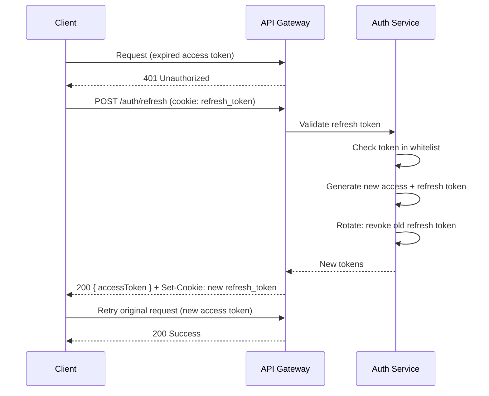

# 07 - Đặc Tả API (API Specification)

> Tài liệu đặc tả chi tiết tất cả API endpoints của Flowery platform.
> Tuân theo chuẩn RESTful API và định dạng OpenAPI.

---

## Mục Lục

1. [Tổng Quan API](#1-tổng-quan-api)
2. [Quy Ước Chung](#2-quy-ước-chung)
3. [Authentication API](#3-authentication-api)
4. [Users API](#4-users-api)
5. [Relationships API](#5-relationships-api)
6. [Events API](#6-events-api)
7. [Flowers API](#7-flowers-api)
8. [Recommendations API](#8-recommendations-api)
9. [Shops API](#9-shops-api)
10. [Products API](#10-products-api)
11. [Orders API](#11-orders-api)
12. [Reviews API](#12-reviews-api)
13. [Notifications API](#13-notifications-api)
14. [Subscriptions API](#14-subscriptions-api)
15. [Admin API](#15-admin-api)
16. [Webhooks API](#16-webhooks-api)
17. [Authentication & Authorization](#17-authentication--authorization)
18. [Error Code Catalog](#18-error-code-catalog)

---

## 1. Tổng Quan API

### Base URL

| Môi Trường  | URL                                    |
| ----------- | -------------------------------------- |
| Production  | `https://api.flowery.vn/api/v1`     |
| Staging     | `https://staging-api.flowery.vn/api/v1` |
| Development | `http://localhost:3001/api/v1`         |

### Versioning Strategy

- **Phương pháp**: URL path versioning (`/api/v1/`, `/api/v2/`)
- **Chính sách**: Hỗ trợ tối đa 2 versions đồng thời
- **Deprecation**: Thông báo trước 6 tháng qua header `X-API-Deprecated`

### Xác Thực (Authentication)

Tất cả API yêu cầu xác thực sử dụng **JWT Bearer Token** trong header:

```
Authorization: Bearer <access_token>
```

- **Access Token**: Hết hạn sau 15 phút
- **Refresh Token**: Hết hạn sau 7 ngày, lưu trong httpOnly cookie

### Rate Limiting

| Loại Endpoint     | Giới Hạn       | Window  | Header                  |
| ----------------- | -------------- | ------- | ----------------------- |
| General           | 100 req        | 1 phút  | `X-RateLimit-Limit`    |
| Auth endpoints    | 20 req         | 1 phút  | `X-RateLimit-Limit`    |
| File upload       | 10 req         | 1 phút  | `X-RateLimit-Limit`    |
| Search/AI         | 30 req         | 1 phút  | `X-RateLimit-Limit`    |

**Headers trả về:**
```
X-RateLimit-Limit: 100
X-RateLimit-Remaining: 95
X-RateLimit-Reset: 1709744400
Retry-After: 60  (khi bị rate limited)
```

### Common Headers

| Header             | Giá Trị              | Bắt Buộc | Mô Tả                          |
| ------------------ | -------------------- | --------- | ------------------------------- |
| `Content-Type`     | `application/json`   | Có        | Định dạng request body          |
| `Accept`           | `application/json`   | Có        | Định dạng response mong muốn   |
| `Authorization`    | `Bearer <token>`     | Tùy API   | JWT access token                |
| `Accept-Language`  | `vi` / `en`          | Không     | Ngôn ngữ response (mặc định: vi) |
| `X-Request-ID`     | UUID v4              | Không     | ID theo dõi request             |
| `X-Client-Version` | `1.0.0`              | Không     | Phiên bản client                |

---

## 2. Quy Ước Chung

### Success Response Format

**Single object:**
```json
{
  "success": true,
  "data": {
    "id": "507f1f77bcf86cd799439011",
    "name": "Hoa Hồng Đỏ"
  }
}
```

**Collection (có phân trang):**
```json
{
  "success": true,
  "data": [
    { "id": "...", "name": "Hoa Hồng Đỏ" },
    { "id": "...", "name": "Hoa Lily Trắng" }
  ],
  "meta": {
    "page": 1,
    "limit": 20,
    "total": 156,
    "totalPages": 8,
    "hasNext": true,
    "hasPrev": false
  }
}
```

### Error Response Format

```json
{
  "success": false,
  "error": {
    "code": "VALIDATION_ERROR",
    "message": "Dữ liệu không hợp lệ",
    "details": [
      {
        "field": "email",
        "message": "Email không đúng định dạng",
        "value": "invalid-email"
      }
    ]
  }
}
```

### HTTP Status Codes

| Code | Tên                  | Sử Dụng Khi                                        |
| ---- | -------------------- | -------------------------------------------------- |
| 200  | OK                   | Request thành công (GET, PUT)                      |
| 201  | Created              | Tạo resource mới thành công (POST)                 |
| 204  | No Content           | Xóa thành công, không có response body             |
| 400  | Bad Request          | Request body/params không hợp lệ                   |
| 401  | Unauthorized         | Chưa xác thực hoặc token hết hạn                   |
| 403  | Forbidden            | Không có quyền truy cập resource                   |
| 404  | Not Found            | Resource không tồn tại                              |
| 409  | Conflict             | Xung đột dữ liệu (email đã tồn tại, etc.)         |
| 422  | Unprocessable Entity | Dữ liệu đúng format nhưng không xử lý được         |
| 429  | Too Many Requests    | Vượt quá rate limit                                 |
| 500  | Internal Server Error| Lỗi server không xác định                          |

### Pagination

- **Phương pháp**: Offset-based pagination
- **Parameters**: `?page=1&limit=20`
- **Mặc định**: `page=1`, `limit=20`
- **Giới hạn**: `limit` tối đa 100

### Sorting

```
GET /api/v1/products?sort=-createdAt,name
```
- Prefix `-` cho descending order
- Nhiều fields phân cách bởi dấu `,`
- Mặc định: `-createdAt` (mới nhất trước)

### Filtering

```
GET /api/v1/products?status=active&minPrice=100000&maxPrice=500000&category=bouquet
```
- Filter theo query parameters
- Hỗ trợ: `min*`, `max*` cho range queries
- Hỗ trợ: `search` cho full-text search

---

## 3. Authentication API

### POST /api/v1/auth/register

**Mô tả**: Đăng ký tài khoản người dùng mới
**Authentication**: Không yêu cầu
**Rate Limit**: 20 req/min

**Request Body:**
```json
{
  "email": "minh@example.com",
  "password": "SecureP@ss123",
  "name": "Nguyễn Văn Minh",
  "phone": "0901234567"
}
```

| Field      | Type   | Required | Validation                                        |
| ---------- | ------ | -------- | ------------------------------------------------- |
| `email`    | String | Có       | Email hợp lệ, unique                             |
| `password` | String | Có       | Min 8 ký tự, chứa uppercase, lowercase, số, đặc biệt |
| `name`     | String | Có       | 2-100 ký tự                                       |
| `phone`    | String | Không    | Số điện thoại VN (10 số, bắt đầu 0)              |

**Response (201):**
```json
{
  "success": true,
  "data": {
    "user": {
      "id": "507f1f77bcf86cd799439011",
      "email": "minh@example.com",
      "name": "Nguyễn Văn Minh",
      "phone": "0901234567",
      "role": "user",
      "isEmailVerified": false,
      "createdAt": "2026-03-06T12:00:00.000Z"
    },
    "tokens": {
      "accessToken": "eyJhbGciOiJSUzI1NiIs...",
      "expiresIn": 900
    }
  }
}
```

**Error Responses:**

| Status | Code                | Mô Tả                          |
| ------ | ------------------- | ------------------------------- |
| 400    | `VALIDATION_ERROR`  | Dữ liệu không hợp lệ          |
| 409    | `EMAIL_EXISTS`      | Email đã được đăng ký           |
| 409    | `PHONE_EXISTS`      | Số điện thoại đã được sử dụng  |
| 429    | `RATE_LIMITED`      | Vượt quá giới hạn request      |

---

### POST /api/v1/auth/login

**Mô tả**: Đăng nhập và nhận JWT tokens
**Authentication**: Không yêu cầu
**Rate Limit**: 20 req/min

**Request Body:**
```json
{
  "email": "minh@example.com",
  "password": "SecureP@ss123"
}
```

**Response (200):**
```json
{
  "success": true,
  "data": {
    "user": {
      "id": "507f1f77bcf86cd799439011",
      "email": "minh@example.com",
      "name": "Nguyễn Văn Minh",
      "role": "user",
      "avatar": "https://cdn.flowery.vn/avatars/minh.jpg",
      "preferences": {
        "emotions": ["love", "gratitude"],
        "colors": ["red", "pink"],
        "budgetRange": { "min": 200000, "max": 500000 }
      }
    },
    "tokens": {
      "accessToken": "eyJhbGciOiJSUzI1NiIs...",
      "expiresIn": 900
    }
  }
}
```

**Lưu ý**: Refresh token được set trong httpOnly cookie `flowery_refresh_token`.

**Error Responses:**

| Status | Code                    | Mô Tả                         |
| ------ | ----------------------- | ------------------------------ |
| 401    | `INVALID_CREDENTIALS`   | Email hoặc mật khẩu sai       |
| 401    | `ACCOUNT_LOCKED`        | Tài khoản bị khóa (5 lần sai) |
| 403    | `ACCOUNT_DISABLED`      | Tài khoản bị vô hiệu hóa     |

---

### POST /api/v1/auth/refresh

**Mô tả**: Refresh access token sử dụng refresh token từ cookie
**Authentication**: Refresh token cookie
**Rate Limit**: 20 req/min

**Request**: Không cần body — refresh token được gửi qua httpOnly cookie.

**Response (200):**
```json
{
  "success": true,
  "data": {
    "accessToken": "eyJhbGciOiJSUzI1NiIs...",
    "expiresIn": 900
  }
}
```

**Error Responses:**

| Status | Code                  | Mô Tả                      |
| ------ | --------------------- | --------------------------- |
| 401    | `INVALID_REFRESH_TOKEN` | Token không hợp lệ hoặc hết hạn |
| 401    | `TOKEN_REUSE_DETECTED`  | Phát hiện token bị reuse (đã revoke) |

---

### POST /api/v1/auth/forgot-password

**Mô tả**: Gửi email/OTP đặt lại mật khẩu
**Authentication**: Không yêu cầu
**Rate Limit**: 5 req/min

**Request Body:**
```json
{
  "email": "minh@example.com"
}
```

**Response (200):**
```json
{
  "success": true,
  "data": {
    "message": "Mã xác nhận đã được gửi đến email của bạn",
    "expiresIn": 600
  }
}
```

**Lưu ý**: Luôn trả về 200 dù email tồn tại hay không (bảo mật).

---

### POST /api/v1/auth/reset-password

**Mô tả**: Đặt lại mật khẩu bằng OTP token
**Authentication**: Không yêu cầu
**Rate Limit**: 5 req/min

**Request Body:**
```json
{
  "email": "minh@example.com",
  "token": "123456",
  "newPassword": "NewSecureP@ss456"
}
```

**Response (200):**
```json
{
  "success": true,
  "data": {
    "message": "Mật khẩu đã được đặt lại thành công"
  }
}
```

**Error Responses:**

| Status | Code                | Mô Tả                       |
| ------ | ------------------- | ---------------------------- |
| 400    | `INVALID_TOKEN`     | OTP không đúng hoặc hết hạn |
| 400    | `PASSWORD_REUSED`   | Mật khẩu trùng với 5 lần gần nhất |
| 422    | `WEAK_PASSWORD`     | Mật khẩu không đủ mạnh      |

---

## 4. Users API

### GET /api/v1/users/me

**Mô tả**: Lấy thông tin profile người dùng hiện tại
**Authentication**: Bắt buộc
**Authorization**: Tất cả roles

**Response (200):**
```json
{
  "success": true,
  "data": {
    "id": "507f1f77bcf86cd799439011",
    "email": "minh@example.com",
    "name": "Nguyễn Văn Minh",
    "phone": "0901234567",
    "avatar": "https://cdn.flowery.vn/avatars/507f1f77.jpg",
    "role": "user",
    "isEmailVerified": true,
    "preferences": {
      "emotions": ["love", "gratitude"],
      "colors": ["red", "pink"],
      "budgetRange": { "min": 200000, "max": 500000 }
    },
    "stats": {
      "totalOrders": 12,
      "totalRelationships": 5,
      "memberSince": "2026-01-15T00:00:00.000Z"
    },
    "createdAt": "2026-01-15T00:00:00.000Z",
    "updatedAt": "2026-03-01T10:30:00.000Z"
  }
}
```

---

### PUT /api/v1/users/me

**Mô tả**: Cập nhật thông tin cá nhân
**Authentication**: Bắt buộc
**Authorization**: Tất cả roles

**Request Body:**
```json
{
  "name": "Nguyễn Văn Minh",
  "phone": "0901234567",
  "address": {
    "street": "123 Nguyễn Huệ",
    "ward": "Phường Bến Nghé",
    "district": "Quận 1",
    "city": "TP. Hồ Chí Minh"
  }
}
```

| Field     | Type   | Required | Validation                   |
| --------- | ------ | -------- | ---------------------------- |
| `name`    | String | Không    | 2-100 ký tự                  |
| `phone`   | String | Không    | Số điện thoại VN hợp lệ     |
| `address` | Object | Không    | Địa chỉ với đầy đủ các field |

**Response (200):**
```json
{
  "success": true,
  "data": {
    "id": "507f1f77bcf86cd799439011",
    "name": "Nguyễn Văn Minh",
    "phone": "0901234567",
    "address": {
      "street": "123 Nguyễn Huệ",
      "ward": "Phường Bến Nghé",
      "district": "Quận 1",
      "city": "TP. Hồ Chí Minh"
    },
    "updatedAt": "2026-03-06T12:30:00.000Z"
  }
}
```

---

### PUT /api/v1/users/me/preferences

**Mô tả**: Cập nhật sở thích cá nhân cho recommendation engine
**Authentication**: Bắt buộc

**Request Body:**
```json
{
  "emotions": ["love", "gratitude", "joy"],
  "colors": ["red", "pink", "white"],
  "budgetRange": {
    "min": 200000,
    "max": 800000
  },
  "favoriteFlowers": ["rose", "lily", "orchid"],
  "occasions": ["birthday", "anniversary", "valentines"]
}
```

**Response (200):**
```json
{
  "success": true,
  "data": {
    "preferences": {
      "emotions": ["love", "gratitude", "joy"],
      "colors": ["red", "pink", "white"],
      "budgetRange": { "min": 200000, "max": 800000 },
      "favoriteFlowers": ["rose", "lily", "orchid"],
      "occasions": ["birthday", "anniversary", "valentines"]
    },
    "updatedAt": "2026-03-06T12:35:00.000Z"
  }
}
```

---

### PUT /api/v1/users/me/avatar

**Mô tả**: Upload hoặc cập nhật ảnh đại diện
**Authentication**: Bắt buộc
**Content-Type**: `multipart/form-data`
**Rate Limit**: 10 req/min

**Request:**
```
Content-Type: multipart/form-data

avatar: [binary file]
```

| Field    | Type | Required | Validation                        |
| -------- | ---- | -------- | --------------------------------- |
| `avatar` | File | Có       | JPEG/PNG/WebP, tối đa 5MB, min 200x200px |

**Response (200):**
```json
{
  "success": true,
  "data": {
    "avatar": "https://cdn.flowery.vn/avatars/507f1f77_1709726400.webp",
    "updatedAt": "2026-03-06T12:40:00.000Z"
  }
}
```

**Error Responses:**

| Status | Code               | Mô Tả                       |
| ------ | ------------------ | ---------------------------- |
| 400    | `INVALID_FILE_TYPE` | Định dạng file không hợp lệ |
| 400    | `FILE_TOO_LARGE`    | File vượt quá 5MB           |
| 400    | `IMAGE_TOO_SMALL`   | Ảnh nhỏ hơn 200x200px      |

---

## 5. Relationships API

### GET /api/v1/relationships

**Mô tả**: Danh sách mối quan hệ của người dùng
**Authentication**: Bắt buộc

**Query Parameters:**

| Param    | Type   | Default | Mô Tả                                              |
| -------- | ------ | ------- | --------------------------------------------------- |
| `type`   | String | —       | Filter theo loại: `family`, `friend`, `lover`, `colleague` |
| `search` | String | —       | Tìm kiếm theo tên                                  |
| `page`   | Number | 1       | Trang hiện tại                                      |
| `limit`  | Number | 20      | Số lượng mỗi trang                                  |
| `sort`   | String | `name`  | Sắp xếp: `name`, `-name`, `createdAt`, `-createdAt` |

**Response (200):**
```json
{
  "success": true,
  "data": [
    {
      "id": "60d5f484f1a2c8b1f8e4e1a1",
      "name": "Nguyễn Thị Lan",
      "type": "lover",
      "birthday": "2004-05-15",
      "avatar": "https://cdn.flowery.vn/relationships/60d5f484.jpg",
      "importantDates": [
        {
          "title": "Ngày yêu nhau",
          "date": "2025-02-14",
          "type": "anniversary"
        }
      ],
      "notes": "Thích hoa hồng và hoa lily",
      "lastGiftDate": "2026-02-14T00:00:00.000Z",
      "totalGifts": 8,
      "createdAt": "2026-01-20T00:00:00.000Z"
    }
  ],
  "meta": {
    "page": 1,
    "limit": 20,
    "total": 5,
    "totalPages": 1,
    "hasNext": false,
    "hasPrev": false
  }
}
```

---

### GET /api/v1/relationships/:id

**Mô tả**: Chi tiết một mối quan hệ
**Authentication**: Bắt buộc
**Authorization**: Chỉ owner

**Response (200):**
```json
{
  "success": true,
  "data": {
    "id": "60d5f484f1a2c8b1f8e4e1a1",
    "name": "Nguyễn Thị Lan",
    "type": "lover",
    "birthday": "2004-05-15",
    "avatar": "https://cdn.flowery.vn/relationships/60d5f484.jpg",
    "importantDates": [
      {
        "id": "evt001",
        "title": "Ngày yêu nhau",
        "date": "2025-02-14",
        "type": "anniversary",
        "recurring": true
      },
      {
        "id": "evt002",
        "title": "Ngày sinh nhật",
        "date": "2004-05-15",
        "type": "birthday",
        "recurring": true
      }
    ],
    "preferences": {
      "favoriteColors": ["pink", "red"],
      "favoriteFlowers": ["rose", "lily"],
      "allergies": [],
      "notes": "Thích hoa hồng và hoa lily, dị ứng hoa cúc"
    },
    "giftHistory": [
      {
        "orderId": "ord001",
        "date": "2026-02-14",
        "productName": "Bó hoa Tình Yêu Vĩnh Cửu",
        "amount": 450000
      }
    ],
    "totalGifts": 8,
    "createdAt": "2026-01-20T00:00:00.000Z",
    "updatedAt": "2026-03-01T00:00:00.000Z"
  }
}
```

---

### POST /api/v1/relationships

**Mô tả**: Thêm mối quan hệ mới
**Authentication**: Bắt buộc

**Request Body:**
```json
{
  "name": "Mẹ - Nguyễn Thị Hoa",
  "type": "family",
  "birthday": "1975-08-20",
  "importantDates": [
    {
      "title": "Ngày sinh nhật",
      "date": "1975-08-20",
      "type": "birthday",
      "recurring": true
    }
  ],
  "preferences": {
    "favoriteColors": ["yellow", "white"],
    "favoriteFlowers": ["chrysanthemum", "orchid"],
    "notes": "Mẹ thích hoa lan và hoa cúc vàng"
  }
}
```

| Field           | Type     | Required | Validation                              |
| --------------- | -------- | -------- | --------------------------------------- |
| `name`          | String   | Có       | 1-100 ký tự                            |
| `type`          | String   | Có       | Enum: `family`, `friend`, `lover`, `colleague` |
| `birthday`      | String   | Không    | ISO date (YYYY-MM-DD)                  |
| `importantDates` | Array   | Không    | Mỗi item: title, date, type, recurring |
| `preferences`   | Object   | Không    | Colors, flowers, notes                  |

**Response (201):** Trả về object mối quan hệ mới tạo.

---

### PUT /api/v1/relationships/:id

**Mô tả**: Cập nhật mối quan hệ
**Authentication**: Bắt buộc
**Authorization**: Chỉ owner

**Request Body**: Tương tự POST, tất cả fields là optional.

**Response (200):** Trả về object mối quan hệ đã cập nhật.

---

### DELETE /api/v1/relationships/:id

**Mô tả**: Xóa mối quan hệ (soft delete)
**Authentication**: Bắt buộc
**Authorization**: Chỉ owner

**Response (204):** Không có response body.

**Error Responses:**

| Status | Code                  | Mô Tả                              |
| ------ | --------------------- | ----------------------------------- |
| 404    | `RELATIONSHIP_NOT_FOUND` | Mối quan hệ không tồn tại       |
| 403    | `NOT_OWNER`           | Không phải chủ sở hữu              |

---

## 6. Events API

### GET /api/v1/events

**Mô tả**: Danh sách sự kiện / ngày quan trọng
**Authentication**: Bắt buộc

**Query Parameters:**

| Param       | Type   | Default | Mô Tả                                          |
| ----------- | ------ | ------- | ----------------------------------------------- |
| `startDate` | String | —       | Filter từ ngày (ISO date)                       |
| `endDate`   | String | —       | Filter đến ngày (ISO date)                      |
| `type`      | String | —       | `birthday`, `anniversary`, `holiday`, `custom`  |
| `relationshipId` | String | — | Filter theo mối quan hệ                        |
| `page`      | Number | 1       | Trang                                           |
| `limit`     | Number | 20      | Số lượng                                        |

**Response (200):**
```json
{
  "success": true,
  "data": [
    {
      "id": "evt001",
      "title": "Sinh nhật Lan",
      "date": "2026-05-15",
      "type": "birthday",
      "relationship": {
        "id": "60d5f484f1a2c8b1f8e4e1a1",
        "name": "Nguyễn Thị Lan",
        "type": "lover"
      },
      "reminder": {
        "enabled": true,
        "daysBefore": [7, 3, 1],
        "channels": ["push", "email"]
      },
      "recurring": true,
      "status": "upcoming",
      "suggestedFlowers": [
        {
          "id": "flower001",
          "name": "Bó Hoa Tình Yêu",
          "price": 350000,
          "image": "https://cdn.flowery.vn/flowers/rose-bouquet.jpg"
        }
      ]
    }
  ],
  "meta": { "page": 1, "limit": 20, "total": 12, "totalPages": 1 }
}
```

---

### GET /api/v1/events/upcoming

**Mô tả**: Danh sách sự kiện sắp diễn ra trong 30 ngày tới
**Authentication**: Bắt buộc

**Query Parameters:**

| Param  | Type   | Default | Mô Tả                      |
| ------ | ------ | ------- | --------------------------- |
| `days` | Number | 30      | Số ngày tới (max 90)       |

**Response (200):** Tương tự GET /events, sắp xếp theo ngày gần nhất.

---

### POST /api/v1/events

**Mô tả**: Tạo sự kiện / ngày quan trọng mới
**Authentication**: Bắt buộc

**Request Body:**
```json
{
  "title": "Kỷ niệm 1 năm yêu nhau",
  "date": "2026-02-14",
  "type": "anniversary",
  "relationshipId": "60d5f484f1a2c8b1f8e4e1a1",
  "recurring": true,
  "reminder": {
    "enabled": true,
    "daysBefore": [7, 3, 1],
    "channels": ["push", "email"]
  },
  "notes": "Chuẩn bị thật đặc biệt cho ngày này"
}
```

**Response (201):** Trả về event object mới tạo.

---

### PUT /api/v1/events/:id

**Mô tả**: Cập nhật sự kiện
**Authentication**: Bắt buộc
**Authorization**: Chỉ owner

**Response (200):** Trả về event object đã cập nhật.

---

### DELETE /api/v1/events/:id

**Mô tả**: Xóa sự kiện
**Authentication**: Bắt buộc
**Authorization**: Chỉ owner

**Response (204):** Không có response body.

---

## 7. Flowers API

### GET /api/v1/flowers

**Mô tả**: Danh sách tất cả loài hoa trong cơ sở dữ liệu
**Authentication**: Không yêu cầu

**Query Parameters:**

| Param    | Type   | Default      | Mô Tả                                    |
| -------- | ------ | ------------ | ----------------------------------------- |
| `search` | String | —            | Tìm theo tên (Vietnamese text search)     |
| `color`  | String | —            | Filter theo màu: `red`, `pink`, `white`... |
| `season` | String | —            | Filter theo mùa                           |
| `emotion`| String | —            | Filter theo cảm xúc liên quan             |
| `page`   | Number | 1            | Trang                                     |
| `limit`  | Number | 20           | Số lượng                                  |
| `sort`   | String | `name`       | Sắp xếp                                  |

**Response (200):**
```json
{
  "success": true,
  "data": [
    {
      "id": "flower001",
      "name": "Hoa Hồng",
      "scientificName": "Rosa",
      "colors": ["red", "pink", "white", "yellow"],
      "seasons": ["spring", "summer"],
      "primaryEmotion": "love",
      "thumbnail": "https://cdn.flowery.vn/flowers/rose-thumb.jpg",
      "shortDescription": "Biểu tượng vĩnh cửu của tình yêu và sự lãng mạn",
      "meaningCount": 8,
      "productCount": 45
    }
  ],
  "meta": { "page": 1, "limit": 20, "total": 85, "totalPages": 5 }
}
```

---

### GET /api/v1/flowers/:id

**Mô tả**: Chi tiết đầy đủ về một loài hoa
**Authentication**: Không yêu cầu

**Response (200):**
```json
{
  "success": true,
  "data": {
    "id": "flower001",
    "name": "Hoa Hồng",
    "scientificName": "Rosa",
    "family": "Rosaceae",
    "colors": ["red", "pink", "white", "yellow", "orange"],
    "seasons": ["spring", "summer"],
    "images": [
      "https://cdn.flowery.vn/flowers/rose-1.jpg",
      "https://cdn.flowery.vn/flowers/rose-2.jpg"
    ],
    "description": "Hoa hồng là loài hoa được yêu thích nhất trên thế giới...",
    "careInstructions": {
      "water": "Tưới nước đều đặn, tránh úng",
      "sunlight": "Cần ánh sáng trực tiếp 6-8 giờ/ngày",
      "temperature": "15-25°C",
      "vaseLife": "7-12 ngày"
    },
    "meanings": [
      {
        "emotion": "love",
        "occasion": "valentines",
        "description": "Hoa hồng đỏ tượng trưng cho tình yêu nồng cháy",
        "culturalContext": "Trong văn hóa Việt Nam, hoa hồng đỏ thường dùng trong ngày lễ tình nhân"
      },
      {
        "emotion": "gratitude",
        "occasion": "mothers_day",
        "description": "Hoa hồng hồng thể hiện lòng biết ơn và sự trân trọng",
        "culturalContext": "Tặng hoa hồng cho mẹ vào ngày 8/3 và 20/10"
      }
    ],
    "relatedProducts": [
      {
        "id": "prod001",
        "name": "Bó Hoa Tình Yêu Vĩnh Cửu",
        "price": 450000,
        "shop": { "id": "shop001", "name": "Hoa Sài Gòn" },
        "image": "https://cdn.flowery.vn/products/prod001.jpg"
      }
    ]
  }
}
```

---

### GET /api/v1/flowers/emotions/:emotion

**Mô tả**: Danh sách hoa liên quan đến một cảm xúc
**Authentication**: Không yêu cầu

**Path Parameters:**

| Param     | Type   | Mô Tả                                                        |
| --------- | ------ | ------------------------------------------------------------- |
| `emotion` | String | Enum: `love`, `gratitude`, `joy`, `sympathy`, `congratulations`, `apology`, `friendship`, `respect` |

**Response (200):** Tương tự GET /flowers với filter theo emotion.

---

### GET /api/v1/flowers/occasions/:occasion

**Mô tả**: Danh sách hoa phù hợp với dịp / sự kiện
**Authentication**: Không yêu cầu

**Path Parameters:**

| Param      | Type   | Mô Tả                                                              |
| ---------- | ------ | ------------------------------------------------------------------- |
| `occasion` | String | Enum: `birthday`, `anniversary`, `valentines`, `mothers_day`, `wedding`, `funeral`, `graduation`, `tet`, `teachers_day`, `womens_day` |

**Response (200):** Tương tự GET /flowers với filter theo occasion.

---

### GET /api/v1/flowers/search

**Mô tả**: Tìm kiếm nâng cao hoa với nhiều tiêu chí
**Authentication**: Không yêu cầu

**Query Parameters:**

| Param       | Type   | Mô Tả                           |
| ----------- | ------ | -------------------------------- |
| `q`         | String | Từ khóa tìm kiếm                |
| `emotion`   | String | Filter cảm xúc                  |
| `occasion`  | String | Filter dịp                      |
| `color`     | String | Filter màu (nhiều, phân cách `,`) |
| `season`    | String | Filter mùa                      |
| `page`      | Number | Trang                           |
| `limit`     | Number | Số lượng                        |

**Response (200):** Tương tự GET /flowers, kết quả sắp xếp theo relevance score.

---

### GET /api/v1/flowers/:id/meanings

**Mô tả**: Tất cả ý nghĩa của một loài hoa theo ngữ cảnh
**Authentication**: Không yêu cầu

**Response (200):**
```json
{
  "success": true,
  "data": [
    {
      "id": "meaning001",
      "emotion": "love",
      "occasion": "valentines",
      "relationship": "lover",
      "description": "Hoa hồng đỏ tượng trưng cho tình yêu cháy bỏng, sự đam mê và cam kết",
      "culturalContext": "Trong văn hóa Việt Nam, tặng hoa hồng đỏ vào Valentine là truyền thống phổ biến",
      "colorContext": {
        "red": "Tình yêu nồng cháy",
        "pink": "Tình cảm dịu dàng, ngưỡng mộ",
        "white": "Sự thuần khiết, tình yêu trong sáng",
        "yellow": "Tình bạn, niềm vui (lưu ý: có thể hiểu là chia tay)"
      },
      "numberOfFlowers": {
        "1": "Tình yêu duy nhất",
        "3": "Tôi yêu em",
        "9": "Tình yêu vĩnh cửu",
        "11": "Yêu em nhất trên đời",
        "99": "Mãi mãi bên nhau"
      },
      "aiWeight": 0.95
    }
  ]
}
```

---

## 8. Recommendations API

### POST /api/v1/recommendations/quiz

**Mô tả**: Gửi kết quả flower quiz và nhận gợi ý hoa từ AI engine
**Authentication**: Optional (nếu đăng nhập sẽ có personalized results)
**Rate Limit**: 30 req/min

**Request Body:**
```json
{
  "occasion": "birthday",
  "relationship": "lover",
  "emotion": "love",
  "colorPreference": ["red", "pink"],
  "budget": {
    "min": 300000,
    "max": 600000
  },
  "additionalNotes": "Bạn gái thích hoa hồng, muốn có thiệp viết tay"
}
```

| Field              | Type   | Required | Validation                         |
| ------------------ | ------ | -------- | ---------------------------------- |
| `occasion`         | String | Có       | Enum occasions                     |
| `relationship`     | String | Có       | Enum relationship types            |
| `emotion`          | String | Có       | Enum emotions                      |
| `colorPreference`  | Array  | Không    | Danh sách màu ưa thích            |
| `budget`           | Object | Có       | min >= 100000, max <= 10000000 VNĐ |
| `additionalNotes`  | String | Không    | Max 500 ký tự                      |

**Response (200):**
```json
{
  "success": true,
  "data": {
    "recommendationId": "rec_abc123",
    "results": [
      {
        "rank": 1,
        "product": {
          "id": "prod001",
          "name": "Bó Hoa Tình Yêu Vĩnh Cửu",
          "price": 450000,
          "images": ["https://cdn.flowery.vn/products/prod001.jpg"],
          "shop": {
            "id": "shop001",
            "name": "Hoa Sài Gòn",
            "rating": 4.8
          }
        },
        "matchScore": 0.95,
        "scoreBreakdown": {
          "occasionMatch": 0.98,
          "emotionMatch": 0.96,
          "colorMatch": 0.90,
          "priceMatch": 0.95
        },
        "reasons": [
          "Hoa hồng đỏ hoàn hảo cho dịp sinh nhật người yêu",
          "Phù hợp ngân sách và sở thích màu sắc",
          "Shop đánh giá cao (4.8/5)"
        ],
        "suggestedMessage": "Chúc em sinh nhật vui vẻ! Mỗi cánh hoa hồng là một lời yêu thương anh dành cho em. 🌹"
      },
      {
        "rank": 2,
        "product": { "..." : "..." },
        "matchScore": 0.88,
        "scoreBreakdown": { "..." : "..." },
        "reasons": ["..."],
        "suggestedMessage": "..."
      }
    ],
    "totalResults": 5,
    "modelVersion": "v2.1.0",
    "processingTime": 245
  }
}
```

---

### GET /api/v1/recommendations/personalized

**Mô tả**: Gợi ý cá nhân hóa dựa trên lịch sử và sở thích
**Authentication**: Bắt buộc

**Query Parameters:**

| Param  | Type   | Default | Mô Tả                         |
| ------ | ------ | ------- | ------------------------------ |
| `limit`| Number | 10      | Số lượng gợi ý (max 30)       |
| `type` | String | `all`   | `all`, `upcoming_events`, `trending`, `reorder` |

**Response (200):**
```json
{
  "success": true,
  "data": {
    "recommendations": [
      {
        "type": "upcoming_event",
        "event": {
          "title": "Sinh nhật Lan",
          "date": "2026-03-15",
          "daysUntil": 9,
          "relationship": { "name": "Lan", "type": "lover" }
        },
        "products": [
          {
            "id": "prod001",
            "name": "Bó Hoa Tình Yêu",
            "price": 450000,
            "matchScore": 0.95,
            "image": "https://cdn.flowery.vn/products/prod001.jpg"
          }
        ]
      },
      {
        "type": "trending",
        "title": "Xu hướng mùa xuân",
        "products": ["..."]
      }
    ]
  }
}
```

---

### GET /api/v1/recommendations/history

**Mô tả**: Lịch sử các lần nhận gợi ý
**Authentication**: Bắt buộc

**Query Parameters:** `page`, `limit`

**Response (200):**
```json
{
  "success": true,
  "data": [
    {
      "id": "rec_abc123",
      "quizInput": {
        "occasion": "birthday",
        "relationship": "lover",
        "emotion": "love"
      },
      "topResult": {
        "productName": "Bó Hoa Tình Yêu Vĩnh Cửu",
        "matchScore": 0.95
      },
      "ordered": true,
      "orderId": "ord001",
      "createdAt": "2026-02-10T14:30:00.000Z"
    }
  ],
  "meta": { "page": 1, "limit": 20, "total": 8 }
}
```

---

## 9. Shops API

### GET /api/v1/shops

**Mô tả**: Danh sách cửa hàng hoa
**Authentication**: Không yêu cầu

**Query Parameters:**

| Param      | Type   | Default    | Mô Tả                            |
| ---------- | ------ | ---------- | --------------------------------- |
| `search`   | String | —          | Tìm theo tên shop                |
| `verified` | Boolean| —          | Chỉ shop đã xác minh             |
| `rating`   | Number | —          | Rating tối thiểu (1-5)           |
| `city`     | String | —          | Filter theo thành phố             |
| `sort`     | String | `-rating`  | `rating`, `totalOrders`, `createdAt` |
| `page`     | Number | 1          | Trang                             |
| `limit`    | Number | 20         | Số lượng                          |

**Response (200):**
```json
{
  "success": true,
  "data": [
    {
      "id": "shop001",
      "name": "Hoa Sài Gòn",
      "description": "Shop hoa tươi chất lượng cao tại Quận 1",
      "logo": "https://cdn.flowery.vn/shops/shop001-logo.jpg",
      "coverImage": "https://cdn.flowery.vn/shops/shop001-cover.jpg",
      "address": {
        "street": "456 Lê Lợi",
        "district": "Quận 1",
        "city": "TP. Hồ Chí Minh"
      },
      "rating": 4.8,
      "totalReviews": 234,
      "totalOrders": 1850,
      "isVerified": true,
      "operatingHours": {
        "open": "07:00",
        "close": "21:00"
      },
      "productCount": 45,
      "tags": ["premium", "same-day-delivery", "custom-bouquet"]
    }
  ],
  "meta": { "page": 1, "limit": 20, "total": 32 }
}
```

---

### GET /api/v1/shops/:id

**Mô tả**: Chi tiết cửa hàng
**Authentication**: Không yêu cầu

**Response (200):** Object shop đầy đủ bao gồm `operatingHours`, `deliveryInfo`, `socialLinks`, top products, và recent reviews.

---

### POST /api/v1/shops

**Mô tả**: Đăng ký cửa hàng mới trên platform
**Authentication**: Bắt buộc
**Authorization**: User (sẽ được chuyển role thành shop_owner sau khi được duyệt)
**Content-Type**: `multipart/form-data`

**Request:**
```json
{
  "name": "Hoa Sài Gòn",
  "description": "Shop hoa tươi chất lượng cao...",
  "address": {
    "street": "456 Lê Lợi",
    "ward": "Phường Bến Thành",
    "district": "Quận 1",
    "city": "TP. Hồ Chí Minh"
  },
  "phone": "0281234567",
  "email": "contact@hoasaigon.vn",
  "operatingHours": { "open": "07:00", "close": "21:00" },
  "logo": "[binary file]",
  "businessLicense": "[binary file]"
}
```

**Response (201):**
```json
{
  "success": true,
  "data": {
    "id": "shop002",
    "status": "pending_verification",
    "message": "Cửa hàng của bạn đang chờ xác minh. Chúng tôi sẽ phản hồi trong 1-3 ngày làm việc."
  }
}
```

---

### PUT /api/v1/shops/:id

**Mô tả**: Cập nhật thông tin cửa hàng
**Authentication**: Bắt buộc
**Authorization**: Shop owner (chỉ shop của mình)

**Response (200):** Object shop đã cập nhật.

---

### GET /api/v1/shops/:id/products

**Mô tả**: Danh sách sản phẩm của một cửa hàng
**Authentication**: Không yêu cầu

**Query Parameters:** `category`, `minPrice`, `maxPrice`, `available`, `sort`, `page`, `limit`

**Response (200):** Paginated list sản phẩm.

---

### GET /api/v1/shops/:id/reviews

**Mô tả**: Đánh giá của một cửa hàng
**Authentication**: Không yêu cầu

**Query Parameters:** `rating`, `sort`, `page`, `limit`

**Response (200):** Paginated list reviews với rating breakdown.

---

## 10. Products API

### GET /api/v1/products

**Mô tả**: Danh sách tất cả sản phẩm (bó hoa, arrangement)
**Authentication**: Không yêu cầu

**Query Parameters:**

| Param       | Type    | Default      | Mô Tả                                 |
| ----------- | ------- | ------------ | -------------------------------------- |
| `search`    | String  | —            | Tìm kiếm theo tên                     |
| `shop`      | String  | —            | Filter theo shopId                     |
| `category`  | String  | —            | `bouquet`, `arrangement`, `single`, `basket`, `box` |
| `flower`    | String  | —            | Filter theo loài hoa chính             |
| `emotion`   | String  | —            | Filter theo cảm xúc                   |
| `occasion`  | String  | —            | Filter theo dịp                        |
| `minPrice`  | Number  | —            | Giá tối thiểu (VNĐ)                   |
| `maxPrice`  | Number  | —            | Giá tối đa (VNĐ)                      |
| `available` | Boolean | `true`       | Chỉ sản phẩm còn hàng                 |
| `sort`      | String  | `-createdAt` | `price`, `-price`, `rating`, `popular` |
| `page`      | Number  | 1            | Trang                                  |
| `limit`     | Number  | 20           | Số lượng                               |

**Response (200):**
```json
{
  "success": true,
  "data": [
    {
      "id": "prod001",
      "name": "Bó Hoa Tình Yêu Vĩnh Cửu",
      "slug": "bo-hoa-tinh-yeu-vinh-cuu",
      "description": "Bó hoa hồng đỏ 20 bông kết hợp baby...",
      "price": 450000,
      "originalPrice": 500000,
      "discount": 10,
      "images": [
        "https://cdn.flowery.vn/products/prod001-1.jpg",
        "https://cdn.flowery.vn/products/prod001-2.jpg"
      ],
      "category": "bouquet",
      "flowers": [
        { "id": "flower001", "name": "Hoa Hồng", "quantity": 20 },
        { "id": "flower005", "name": "Baby", "quantity": 10 }
      ],
      "tags": ["romantic", "birthday", "valentines"],
      "emotions": ["love", "passion"],
      "occasions": ["valentines", "anniversary", "birthday"],
      "shop": {
        "id": "shop001",
        "name": "Hoa Sài Gòn",
        "rating": 4.8,
        "isVerified": true
      },
      "rating": 4.9,
      "totalReviews": 56,
      "totalSold": 234,
      "isAvailable": true,
      "customization": {
        "addCard": true,
        "addChocolate": true,
        "addTeddyBear": true,
        "changeSize": ["S", "M", "L"]
      }
    }
  ],
  "meta": { "page": 1, "limit": 20, "total": 345 }
}
```

---

### GET /api/v1/products/:id

**Mô tả**: Chi tiết sản phẩm
**Authentication**: Không yêu cầu

**Response (200):** Object product đầy đủ bao gồm tất cả customization options, shop info, reviews summary, và related products.

---

### POST /api/v1/products

**Mô tả**: Tạo sản phẩm mới
**Authentication**: Bắt buộc
**Authorization**: Shop Owner
**Content-Type**: `multipart/form-data`

**Request:**
```json
{
  "name": "Bó Hoa Nắng Mới",
  "description": "Bó hoa hướng dương tươi tắn...",
  "price": 350000,
  "category": "bouquet",
  "flowers": [
    { "flowerId": "flower003", "quantity": 5 },
    { "flowerId": "flower005", "quantity": 8 }
  ],
  "tags": ["cheerful", "graduation", "congratulations"],
  "emotions": ["joy", "congratulations"],
  "occasions": ["graduation", "birthday"],
  "customization": {
    "addCard": true,
    "addChocolate": false,
    "changeSize": ["S", "M"]
  },
  "stock": 50,
  "images": ["[binary files - max 8]"]
}
```

| Field          | Type    | Required | Validation                     |
| -------------- | ------- | -------- | ------------------------------ |
| `name`         | String  | Có       | 3-200 ký tự                   |
| `description`  | String  | Có       | 10-2000 ký tự                  |
| `price`        | Number  | Có       | >= 50000 VNĐ                   |
| `category`     | String  | Có       | Enum categories                |
| `flowers`      | Array   | Có       | Ít nhất 1 loài hoa             |
| `images`       | Files   | Có       | 1-8 ảnh, JPEG/PNG/WebP, max 5MB mỗi ảnh |
| `stock`        | Number  | Có       | >= 0                            |

**Response (201):** Object product mới tạo.

---

### PUT /api/v1/products/:id

**Mô tả**: Cập nhật sản phẩm
**Authentication**: Bắt buộc
**Authorization**: Shop Owner (chỉ product của shop mình)

**Response (200):** Object product đã cập nhật.

---

### DELETE /api/v1/products/:id

**Mô tả**: Xóa sản phẩm (soft delete)
**Authentication**: Bắt buộc
**Authorization**: Shop Owner

**Response (204):** Không có response body.

---

### POST /api/v1/products/:id/images

**Mô tả**: Upload thêm ảnh cho sản phẩm
**Authentication**: Bắt buộc
**Authorization**: Shop Owner
**Content-Type**: `multipart/form-data`

**Request:**
```
images: [binary files - max 8 total per product]
```

**Response (200):**
```json
{
  "success": true,
  "data": {
    "images": [
      "https://cdn.flowery.vn/products/prod001-1.jpg",
      "https://cdn.flowery.vn/products/prod001-2.jpg",
      "https://cdn.flowery.vn/products/prod001-3.jpg"
    ],
    "totalImages": 3
  }
}
```

---

## 11. Orders API

### GET /api/v1/orders

**Mô tả**: Danh sách đơn hàng của người dùng
**Authentication**: Bắt buộc

**Query Parameters:**

| Param       | Type   | Default      | Mô Tả                                          |
| ----------- | ------ | ------------ | ----------------------------------------------- |
| `status`    | String | —            | `pending`, `confirmed`, `preparing`, `delivering`, `delivered`, `completed`, `cancelled` |
| `startDate` | String | —            | Từ ngày (ISO date)                              |
| `endDate`   | String | —            | Đến ngày (ISO date)                             |
| `sort`      | String | `-createdAt` | Sắp xếp                                        |
| `page`      | Number | 1            | Trang                                           |
| `limit`     | Number | 20           | Số lượng                                        |

**Response (200):**
```json
{
  "success": true,
  "data": [
    {
      "id": "ord001",
      "orderNumber": "BS-20260306-001",
      "status": "delivering",
      "items": [
        {
          "product": {
            "id": "prod001",
            "name": "Bó Hoa Tình Yêu Vĩnh Cửu",
            "image": "https://cdn.flowery.vn/products/prod001.jpg"
          },
          "quantity": 1,
          "price": 450000,
          "customizations": {
            "size": "M",
            "addCard": true,
            "cardMessage": "Anh yêu em! 🌹"
          }
        }
      ],
      "subtotal": 450000,
      "deliveryFee": 30000,
      "discount": 0,
      "totalAmount": 480000,
      "shop": {
        "id": "shop001",
        "name": "Hoa Sài Gòn"
      },
      "delivery": {
        "recipientName": "Nguyễn Thị Lan",
        "recipientPhone": "0987654321",
        "address": "789 Nguyễn Du, Quận 3, TP.HCM",
        "date": "2026-03-06",
        "timeSlot": "14:00-16:00"
      },
      "payment": {
        "method": "vnpay",
        "status": "paid",
        "paidAt": "2026-03-05T10:30:00.000Z"
      },
      "createdAt": "2026-03-05T10:15:00.000Z"
    }
  ],
  "meta": { "page": 1, "limit": 20, "total": 12 }
}
```

---

### GET /api/v1/orders/:id

**Mô tả**: Chi tiết đơn hàng
**Authentication**: Bắt buộc
**Authorization**: Order owner hoặc Shop owner

**Response (200):** Object order đầy đủ bao gồm timeline trạng thái, delivery tracking, và payment details.

---

### POST /api/v1/orders

**Mô tả**: Tạo đơn hàng mới
**Authentication**: Bắt buộc

**Request Body:**
```json
{
  "items": [
    {
      "productId": "prod001",
      "quantity": 1,
      "customizations": {
        "size": "M",
        "addCard": true,
        "cardMessage": "Chúc em sinh nhật vui vẻ! 🎂🌹",
        "addChocolate": false
      }
    }
  ],
  "delivery": {
    "recipientName": "Nguyễn Thị Lan",
    "recipientPhone": "0987654321",
    "address": {
      "street": "789 Nguyễn Du",
      "ward": "Phường 7",
      "district": "Quận 3",
      "city": "TP. Hồ Chí Minh"
    },
    "date": "2026-03-06",
    "timeSlot": "14:00-16:00",
    "isAnonymous": false,
    "senderNote": "Giao nhẹ nhàng, hoa dễ gãy"
  },
  "paymentMethod": "vnpay",
  "couponCode": "SPRING2026",
  "relationshipId": "60d5f484f1a2c8b1f8e4e1a1"
}
```

| Field            | Type   | Required | Validation                           |
| ---------------- | ------ | -------- | ------------------------------------ |
| `items`          | Array  | Có       | 1-10 items                           |
| `items[].productId` | String | Có   | Product phải tồn tại và available    |
| `items[].quantity`   | Number | Có   | 1-99                                 |
| `delivery`       | Object | Có       | Đầy đủ thông tin giao hàng          |
| `delivery.date`  | String | Có       | Ngày giao >= ngày mai               |
| `delivery.timeSlot` | String | Có  | Enum: `08:00-10:00`, `10:00-12:00`, `14:00-16:00`, `16:00-18:00`, `18:00-20:00` |
| `paymentMethod`  | String | Có       | `cod`, `vnpay`, `momo`, `zalopay`, `bank_transfer` |

**Response (201):**
```json
{
  "success": true,
  "data": {
    "id": "ord002",
    "orderNumber": "BS-20260306-002",
    "status": "pending",
    "totalAmount": 480000,
    "payment": {
      "method": "vnpay",
      "status": "pending",
      "paymentUrl": "https://sandbox.vnpayment.vn/paymentv2/vpcpay.html?..."
    },
    "createdAt": "2026-03-06T09:00:00.000Z"
  }
}
```

**Error Responses:**

| Status | Code                    | Mô Tả                              |
| ------ | ----------------------- | ----------------------------------- |
| 400    | `PRODUCT_UNAVAILABLE`   | Sản phẩm hết hàng hoặc không tồn tại |
| 400    | `INVALID_TIME_SLOT`     | Time slot không hợp lệ hoặc đã qua |
| 400    | `INVALID_DELIVERY_DATE` | Ngày giao phải >= ngày mai          |
| 400    | `INVALID_COUPON`        | Mã giảm giá không hợp lệ           |
| 422    | `SHOP_CLOSED`           | Cửa hàng đang đóng cửa             |
| 422    | `DELIVERY_AREA_NOT_SUPPORTED` | Khu vực giao hàng chưa hỗ trợ |

---

### PUT /api/v1/orders/:id/status

**Mô tả**: Cập nhật trạng thái đơn hàng
**Authentication**: Bắt buộc
**Authorization**: Shop Owner hoặc Admin

**Request Body:**
```json
{
  "status": "confirmed",
  "note": "Đã xác nhận đơn hàng, chuẩn bị hoa trong 2 giờ"
}
```

**Trạng thái hợp lệ:**

| Từ Trạng Thái | Đến Trạng Thái | Ai Được Phép         |
| -------------- | -------------- | -------------------- |
| `pending`      | `confirmed`    | Shop Owner, Admin    |
| `pending`      | `cancelled`    | Shop Owner, Admin    |
| `confirmed`    | `preparing`    | Shop Owner           |
| `preparing`    | `delivering`   | Shop Owner           |
| `delivering`   | `delivered`    | Shop Owner, Admin    |
| `delivered`    | `completed`    | System (auto 24h)    |

**Response (200):**
```json
{
  "success": true,
  "data": {
    "id": "ord001",
    "status": "confirmed",
    "statusHistory": [
      { "status": "pending", "timestamp": "2026-03-05T10:15:00.000Z" },
      { "status": "confirmed", "timestamp": "2026-03-05T10:45:00.000Z", "note": "Đã xác nhận..." }
    ]
  }
}
```

---

### POST /api/v1/orders/:id/cancel

**Mô tả**: Hủy đơn hàng
**Authentication**: Bắt buộc
**Authorization**: Order owner (chỉ khi status là `pending` hoặc `confirmed`)

**Request Body:**
```json
{
  "reason": "Tôi muốn thay đổi ngày giao hàng",
  "cancelType": "customer_request"
}
```

**Response (200):**
```json
{
  "success": true,
  "data": {
    "id": "ord001",
    "status": "cancelled",
    "refund": {
      "eligible": true,
      "amount": 480000,
      "method": "original_payment",
      "estimatedDays": 3
    }
  }
}
```

**Error Responses:**

| Status | Code                    | Mô Tả                                   |
| ------ | ----------------------- | ---------------------------------------- |
| 400    | `ORDER_NOT_CANCELLABLE` | Đơn hàng đang ở trạng thái không thể hủy |
| 400    | `CANCEL_WINDOW_EXPIRED` | Đã quá thời gian cho phép hủy           |

---

### GET /api/v1/orders/:id/tracking

**Mô tả**: Theo dõi trạng thái giao hàng real-time
**Authentication**: Bắt buộc
**Authorization**: Order owner

**Response (200):**
```json
{
  "success": true,
  "data": {
    "orderId": "ord001",
    "currentStatus": "delivering",
    "estimatedDelivery": "2026-03-06T15:00:00.000Z",
    "timeline": [
      {
        "status": "pending",
        "timestamp": "2026-03-05T10:15:00.000Z",
        "description": "Đơn hàng đã được tạo"
      },
      {
        "status": "confirmed",
        "timestamp": "2026-03-05T10:45:00.000Z",
        "description": "Cửa hàng đã xác nhận đơn hàng"
      },
      {
        "status": "preparing",
        "timestamp": "2026-03-06T08:00:00.000Z",
        "description": "Đang chuẩn bị bó hoa"
      },
      {
        "status": "delivering",
        "timestamp": "2026-03-06T13:30:00.000Z",
        "description": "Đang giao hàng đến 789 Nguyễn Du, Q3"
      }
    ],
    "delivery": {
      "driverName": "Trần Văn Nam",
      "driverPhone": "0911****67",
      "estimatedArrival": "14:30"
    }
  }
}
```

---

### GET /api/v1/shops/:shopId/orders

**Mô tả**: Danh sách đơn hàng của shop (Shop Owner dashboard)
**Authentication**: Bắt buộc
**Authorization**: Shop Owner (chỉ shop của mình)

**Query Parameters:** `status`, `startDate`, `endDate`, `sort`, `page`, `limit`

**Response (200):** Paginated list orders với thông tin customer (masked phone), items, delivery details.

---

## 12. Reviews API

### GET /api/v1/reviews/shop/:shopId

**Mô tả**: Danh sách đánh giá theo cửa hàng
**Authentication**: Không yêu cầu

**Query Parameters:**

| Param    | Type   | Default      | Mô Tả                      |
| -------- | ------ | ------------ | --------------------------- |
| `rating` | Number | —            | Filter theo rating (1-5)    |
| `hasImages` | Boolean | —        | Chỉ review có ảnh           |
| `sort`   | String | `-createdAt` | `createdAt`, `rating`, `helpful` |
| `page`   | Number | 1            | Trang                       |
| `limit`  | Number | 20           | Số lượng                    |

**Response (200):**
```json
{
  "success": true,
  "data": {
    "summary": {
      "averageRating": 4.8,
      "totalReviews": 234,
      "ratingBreakdown": {
        "5": 180,
        "4": 35,
        "3": 12,
        "2": 5,
        "1": 2
      }
    },
    "reviews": [
      {
        "id": "rev001",
        "user": {
          "id": "user001",
          "name": "Nguyễn Văn Minh",
          "avatar": "https://cdn.flowery.vn/avatars/user001.jpg"
        },
        "order": {
          "id": "ord001",
          "productName": "Bó Hoa Tình Yêu Vĩnh Cửu"
        },
        "rating": 5,
        "comment": "Hoa rất đẹp, tươi lâu, giao hàng đúng giờ. Bạn gái rất thích!",
        "images": [
          "https://cdn.flowery.vn/reviews/rev001-1.jpg"
        ],
        "reply": {
          "message": "Cảm ơn bạn đã tin tưởng Hoa Sài Gòn! Rất vui vì bạn hài lòng 🌹",
          "repliedAt": "2026-02-15T08:00:00.000Z"
        },
        "helpfulCount": 12,
        "createdAt": "2026-02-14T20:00:00.000Z"
      }
    ]
  },
  "meta": { "page": 1, "limit": 20, "total": 234 }
}
```

---

### GET /api/v1/reviews/product/:productId

**Mô tả**: Đánh giá theo sản phẩm cụ thể
**Authentication**: Không yêu cầu

**Response (200):** Tương tự shop reviews nhưng filter theo product.

---

### POST /api/v1/reviews

**Mô tả**: Tạo đánh giá cho đơn hàng đã nhận
**Authentication**: Bắt buộc
**Content-Type**: `multipart/form-data`

**Request:**
```json
{
  "orderId": "ord001",
  "rating": 5,
  "comment": "Hoa rất đẹp, tươi lâu, giao hàng đúng giờ!",
  "images": ["[binary files - max 5]"],
  "tags": ["fresh", "on-time", "beautiful"]
}
```

| Field     | Type   | Required | Validation                    |
| --------- | ------ | -------- | ----------------------------- |
| `orderId` | String | Có       | Order phải ở trạng thái `delivered` hoặc `completed` |
| `rating`  | Number | Có       | 1-5                           |
| `comment` | String | Không    | 10-1000 ký tự                 |
| `images`  | Files  | Không    | Max 5 ảnh, JPEG/PNG, max 5MB  |
| `tags`    | Array  | Không    | Predefined tags                |

**Response (201):** Object review mới tạo.

**Error Responses:**

| Status | Code                  | Mô Tả                          |
| ------ | --------------------- | ------------------------------- |
| 400    | `ORDER_NOT_DELIVERED` | Đơn hàng chưa được giao        |
| 409    | `REVIEW_EXISTS`       | Đã đánh giá đơn hàng này rồi  |

---

### POST /api/v1/reviews/:id/reply

**Mô tả**: Shop owner phản hồi đánh giá
**Authentication**: Bắt buộc
**Authorization**: Shop Owner (chỉ review của shop mình)

**Request Body:**
```json
{
  "message": "Cảm ơn bạn đã ủng hộ! Hy vọng được phục vụ bạn lần sau 🌸"
}
```

| Field     | Type   | Required | Validation    |
| --------- | ------ | -------- | ------------- |
| `message` | String | Có       | 5-500 ký tự   |

**Response (200):** Object review với reply đã cập nhật.

---

## 13. Notifications API

### GET /api/v1/notifications

**Mô tả**: Danh sách thông báo của người dùng
**Authentication**: Bắt buộc

**Query Parameters:**

| Param    | Type    | Default      | Mô Tả                                             |
| -------- | ------- | ------------ | -------------------------------------------------- |
| `isRead` | Boolean | —            | Filter đã đọc / chưa đọc                          |
| `type`   | String  | —            | `order`, `event`, `promotion`, `system`, `review`  |
| `page`   | Number  | 1            | Trang                                              |
| `limit`  | Number  | 20           | Số lượng                                           |

**Response (200):**
```json
{
  "success": true,
  "data": {
    "unreadCount": 3,
    "notifications": [
      {
        "id": "notif001",
        "type": "event",
        "title": "Sinh nhật Lan sắp đến!",
        "message": "Còn 3 ngày nữa là sinh nhật Lan. Hãy chuẩn bị một bó hoa thật đẹp nhé! 🎂",
        "data": {
          "eventId": "evt001",
          "relationshipId": "60d5f484f1a2c8b1f8e4e1a1",
          "actionUrl": "/recommendations/quiz?occasion=birthday&relationship=lover"
        },
        "isRead": false,
        "createdAt": "2026-03-03T08:00:00.000Z"
      },
      {
        "id": "notif002",
        "type": "order",
        "title": "Đơn hàng đang được giao",
        "message": "Đơn hàng BS-20260306-001 đang trên đường giao đến người nhận",
        "data": {
          "orderId": "ord001",
          "actionUrl": "/orders/ord001/tracking"
        },
        "isRead": false,
        "createdAt": "2026-03-06T13:30:00.000Z"
      }
    ]
  },
  "meta": { "page": 1, "limit": 20, "total": 28 }
}
```

---

### PUT /api/v1/notifications/:id/read

**Mô tả**: Đánh dấu thông báo đã đọc
**Authentication**: Bắt buộc

**Response (200):**
```json
{
  "success": true,
  "data": {
    "id": "notif001",
    "isRead": true,
    "readAt": "2026-03-06T14:00:00.000Z"
  }
}
```

---

### PUT /api/v1/notifications/read-all

**Mô tả**: Đánh dấu tất cả thông báo đã đọc
**Authentication**: Bắt buộc

**Response (200):**
```json
{
  "success": true,
  "data": {
    "updatedCount": 3,
    "message": "Đã đánh dấu tất cả thông báo là đã đọc"
  }
}
```

---

## 14. Subscriptions API

### GET /api/v1/subscriptions/plans

**Mô tả**: Danh sách các gói subscription
**Authentication**: Không yêu cầu

**Response (200):**
```json
{
  "success": true,
  "data": [
    {
      "id": "plan_weekly",
      "name": "Gói Tuần",
      "nameEn": "Weekly Plan",
      "description": "Nhận hoa tươi mỗi tuần, luôn có hoa đẹp trong nhà",
      "frequency": "weekly",
      "price": 199000,
      "originalPrice": 250000,
      "savings": "20%",
      "features": [
        "Hoa tươi mỗi tuần",
        "Thay đổi sở thích bất kỳ lúc nào",
        "Miễn phí giao hàng",
        "Thiệp handmade kèm theo"
      ],
      "isPopular": false
    },
    {
      "id": "plan_biweekly",
      "name": "Gói 2 Tuần",
      "nameEn": "Bi-weekly Plan",
      "description": "Hoa tươi mỗi 2 tuần, lựa chọn cân bằng",
      "frequency": "biweekly",
      "price": 149000,
      "originalPrice": 200000,
      "savings": "25%",
      "features": [
        "Hoa tươi mỗi 2 tuần",
        "Thay đổi sở thích bất kỳ lúc nào",
        "Miễn phí giao hàng",
        "Thiệp handmade kèm theo"
      ],
      "isPopular": true
    },
    {
      "id": "plan_monthly",
      "name": "Gói Tháng",
      "nameEn": "Monthly Plan",
      "description": "Bó hoa premium mỗi tháng, lựa chọn tiết kiệm",
      "frequency": "monthly",
      "price": 299000,
      "originalPrice": 400000,
      "savings": "25%",
      "features": [
        "Bó hoa premium mỗi tháng",
        "Hoa được chọn bởi AI",
        "Miễn phí giao hàng",
        "Thiệp handmade + chocolate",
        "Ưu tiên giao hàng"
      ],
      "isPopular": false
    }
  ]
}
```

---

### GET /api/v1/subscriptions/me

**Mô tả**: Subscription hiện tại của người dùng
**Authentication**: Bắt buộc

**Response (200):**
```json
{
  "success": true,
  "data": {
    "id": "sub001",
    "plan": {
      "id": "plan_biweekly",
      "name": "Gói 2 Tuần",
      "frequency": "biweekly",
      "price": 149000
    },
    "status": "active",
    "preferences": {
      "colors": ["pink", "white"],
      "emotions": ["joy", "love"],
      "allergies": ["lily"],
      "notes": "Thích phong cách tự nhiên, minimalist"
    },
    "deliveryAddress": {
      "street": "123 Nguyễn Huệ",
      "district": "Quận 1",
      "city": "TP. Hồ Chí Minh"
    },
    "nextDelivery": {
      "date": "2026-03-13",
      "timeSlot": "10:00-12:00"
    },
    "paymentInfo": {
      "method": "vnpay",
      "lastPayment": "2026-02-27T00:00:00.000Z",
      "nextPayment": "2026-03-13T00:00:00.000Z"
    },
    "deliveryHistory": [
      {
        "date": "2026-02-27",
        "productName": "Bó Hoa Mùa Xuân",
        "status": "delivered",
        "rating": 5
      }
    ],
    "startDate": "2026-01-15T00:00:00.000Z",
    "totalDeliveries": 4
  }
}
```

---

### POST /api/v1/subscriptions

**Mô tả**: Đăng ký gói subscription mới
**Authentication**: Bắt buộc

**Request Body:**
```json
{
  "planId": "plan_biweekly",
  "preferences": {
    "colors": ["pink", "white"],
    "emotions": ["joy", "love"],
    "allergies": ["lily"],
    "notes": "Thích phong cách tự nhiên"
  },
  "deliveryAddress": {
    "street": "123 Nguyễn Huệ",
    "ward": "Phường Bến Nghé",
    "district": "Quận 1",
    "city": "TP. Hồ Chí Minh"
  },
  "deliveryTimeSlot": "10:00-12:00",
  "paymentMethod": "vnpay",
  "startDate": "2026-03-13"
}
```

**Response (201):**
```json
{
  "success": true,
  "data": {
    "id": "sub002",
    "status": "active",
    "plan": { "id": "plan_biweekly", "name": "Gói 2 Tuần" },
    "nextDelivery": "2026-03-13",
    "payment": {
      "status": "pending",
      "paymentUrl": "https://sandbox.vnpayment.vn/..."
    }
  }
}
```

**Error Responses:**

| Status | Code                        | Mô Tả                            |
| ------ | --------------------------- | --------------------------------- |
| 409    | `SUBSCRIPTION_EXISTS`       | Đã có subscription đang active    |
| 400    | `INVALID_PLAN`              | Gói subscription không tồn tại   |
| 422    | `DELIVERY_AREA_NOT_SUPPORTED` | Khu vực chưa hỗ trợ subscription |

---

### PUT /api/v1/subscriptions/:id

**Mô tả**: Cập nhật subscription (thay đổi preferences, pause, resume)
**Authentication**: Bắt buộc
**Authorization**: Subscription owner

**Request Body (cập nhật preferences):**
```json
{
  "preferences": {
    "colors": ["red", "pink"],
    "notes": "Thay đổi sang phong cách lãng mạn"
  }
}
```

**Request Body (tạm dừng):**
```json
{
  "action": "pause",
  "pauseReason": "Đi công tác 2 tuần",
  "resumeDate": "2026-04-01"
}
```

**Request Body (tiếp tục):**
```json
{
  "action": "resume"
}
```

**Response (200):** Object subscription đã cập nhật.

---

### DELETE /api/v1/subscriptions/:id

**Mô tả**: Hủy subscription
**Authentication**: Bắt buộc
**Authorization**: Subscription owner

**Request Body:**
```json
{
  "cancelReason": "Tôi muốn tạm ngưng sử dụng dịch vụ",
  "feedback": "Dịch vụ tốt nhưng tôi cần tiết kiệm chi phí"
}
```

**Response (200):**
```json
{
  "success": true,
  "data": {
    "id": "sub001",
    "status": "cancelled",
    "cancelledAt": "2026-03-06T10:00:00.000Z",
    "activeUntil": "2026-03-13T00:00:00.000Z",
    "message": "Subscription sẽ còn hiệu lực đến 13/03/2026. Bạn có thể đăng ký lại bất kỳ lúc nào."
  }
}
```

---

## 15. Admin API

> Tất cả Admin API yêu cầu role `admin`.

### GET /api/v1/admin/dashboard

**Mô tả**: Thống kê tổng quan cho admin dashboard
**Authentication**: Bắt buộc
**Authorization**: Admin

**Response (200):**
```json
{
  "success": true,
  "data": {
    "overview": {
      "totalUsers": 15420,
      "totalShops": 87,
      "totalOrders": 8934,
      "totalRevenue": 4521000000,
      "activeSubscriptions": 342
    },
    "today": {
      "newUsers": 45,
      "newOrders": 123,
      "revenue": 56780000,
      "pendingShopVerifications": 3
    },
    "trends": {
      "userGrowth": 12.5,
      "orderGrowth": 8.3,
      "revenueGrowth": 15.2
    },
    "topShops": [
      {
        "id": "shop001",
        "name": "Hoa Sài Gòn",
        "monthlyOrders": 234,
        "monthlyRevenue": 105300000,
        "rating": 4.8
      }
    ],
    "recentActivity": [
      {
        "type": "new_shop",
        "message": "Shop 'Hoa Đà Lạt' đăng ký mới",
        "timestamp": "2026-03-06T09:30:00.000Z"
      }
    ]
  }
}
```

---

### GET /api/v1/admin/users

**Mô tả**: Quản lý danh sách người dùng
**Authentication**: Bắt buộc
**Authorization**: Admin

**Query Parameters:**

| Param    | Type   | Default | Mô Tả                              |
| -------- | ------ | ------- | ----------------------------------- |
| `role`   | String | —       | `user`, `shop_owner`, `admin`       |
| `status` | String | —       | `active`, `locked`, `disabled`      |
| `search` | String | —       | Tìm theo tên, email, phone         |
| `sort`   | String | `-createdAt` | Sắp xếp                       |
| `page`   | Number | 1       | Trang                               |
| `limit`  | Number | 20      | Số lượng                            |

**Response (200):** Paginated list users với thống kê cá nhân (orders, spending).

---

### PUT /api/v1/admin/users/:id/status

**Mô tả**: Khóa / mở khóa / vô hiệu hóa tài khoản
**Authentication**: Bắt buộc
**Authorization**: Admin

**Request Body:**
```json
{
  "status": "locked",
  "reason": "Vi phạm điều khoản sử dụng - spam reviews",
  "duration": 72
}
```

| Field      | Type   | Required | Validation                      |
| ---------- | ------ | -------- | ------------------------------- |
| `status`   | String | Có       | `active`, `locked`, `disabled`  |
| `reason`   | String | Có       | 10-500 ký tự                    |
| `duration` | Number | Không    | Thời gian khóa (giờ), cho `locked` |

**Response (200):** Object user với status đã cập nhật.

---

### GET /api/v1/admin/shops

**Mô tả**: Danh sách shops (chú trọng pending verification)
**Authentication**: Bắt buộc
**Authorization**: Admin

**Query Parameters:** `status` (`pending`, `verified`, `rejected`, `suspended`), `search`, `sort`, `page`, `limit`

**Response (200):** Paginated list shops với verification documents, business license info.

---

### PUT /api/v1/admin/shops/:id/verify

**Mô tả**: Xác minh hoặc từ chối cửa hàng
**Authentication**: Bắt buộc
**Authorization**: Admin

**Request Body:**
```json
{
  "action": "verify",
  "notes": "Giấy phép kinh doanh hợp lệ, đã xác minh địa chỉ"
}
```

hoặc:

```json
{
  "action": "reject",
  "reason": "Giấy phép kinh doanh không rõ ràng, vui lòng gửi lại",
  "requiredDocuments": ["business_license", "id_card"]
}
```

**Response (200):**
```json
{
  "success": true,
  "data": {
    "id": "shop002",
    "verificationStatus": "verified",
    "verifiedAt": "2026-03-06T11:00:00.000Z",
    "verifiedBy": "admin001"
  }
}
```

---

### GET /api/v1/admin/reports

**Mô tả**: Báo cáo và analytics chi tiết
**Authentication**: Bắt buộc
**Authorization**: Admin

**Query Parameters:**

| Param       | Type   | Default     | Mô Tả                           |
| ----------- | ------ | ----------- | -------------------------------- |
| `type`      | String | `overview`  | `overview`, `revenue`, `users`, `orders`, `shops` |
| `startDate` | String | 30 ngày trước | Từ ngày                        |
| `endDate`   | String | Hôm nay     | Đến ngày                        |
| `granularity` | String | `daily`   | `daily`, `weekly`, `monthly`     |

**Response (200):** Data series theo granularity cho charting.

---

## 16. Webhooks API

### POST /api/v1/webhooks/vnpay

**Mô tả**: Callback từ VNPay khi thanh toán hoàn tất
**Authentication**: Signature verification (HMAC-SHA512)

**Request Body (từ VNPay):**
```json
{
  "vnp_TxnRef": "BS-20260306-002",
  "vnp_Amount": "48000000",
  "vnp_ResponseCode": "00",
  "vnp_TransactionNo": "14082024",
  "vnp_BankCode": "NCB",
  "vnp_PayDate": "20260306103045",
  "vnp_SecureHash": "abc123..."
}
```

**Xử lý:**
1. Verify HMAC-SHA512 signature
2. Check `vnp_ResponseCode === "00"` (thành công)
3. Update order payment status
4. Trigger notifications

**Response (200):**
```json
{
  "RspCode": "00",
  "Message": "Confirm Success"
}
```

---

### POST /api/v1/webhooks/momo

**Mô tả**: Callback từ MoMo khi thanh toán hoàn tất
**Authentication**: Signature verification (HMAC-SHA256)

**Request Body (từ MoMo):**
```json
{
  "partnerCode": "FLOWERY",
  "orderId": "BS-20260306-002",
  "requestId": "req123",
  "amount": 480000,
  "resultCode": 0,
  "message": "Thành công",
  "transId": 2088394823,
  "signature": "def456..."
}
```

**Response (204):** No content.

---

## 17. Authentication & Authorization

### JWT Token Structure

**Access Token Payload:**
```json
{
  "sub": "507f1f77bcf86cd799439011",
  "email": "minh@example.com",
  "role": "user",
  "iat": 1709726400,
  "exp": 1709727300,
  "iss": "flowery.vn"
}
```

**Token Refresh Flow:**



### RBAC Permission Matrix

| Resource         | Guest | User  | Shop Owner | Admin |
| ---------------- | ----- | ----- | ---------- | ----- |
| View flowers     | ✅    | ✅    | ✅         | ✅    |
| View products    | ✅    | ✅    | ✅         | ✅    |
| View shops       | ✅    | ✅    | ✅         | ✅    |
| Create order     | ❌    | ✅    | ✅         | ✅    |
| Manage relationships | ❌ | ✅ (own) | ✅ (own) | ✅    |
| Manage events    | ❌    | ✅ (own) | ✅ (own) | ✅    |
| Take quiz        | ✅    | ✅    | ✅         | ✅    |
| View personalized recs | ❌ | ✅ | ✅        | ✅    |
| Create shop      | ❌    | ✅    | ❌         | ✅    |
| Manage products  | ❌    | ❌    | ✅ (own)   | ✅    |
| Manage shop orders | ❌  | ❌    | ✅ (own)   | ✅    |
| Reply reviews    | ❌    | ❌    | ✅ (own)   | ✅    |
| Write review     | ❌    | ✅    | ✅         | ✅    |
| Manage subscription | ❌ | ✅ (own) | ✅ (own) | ✅   |
| Admin dashboard  | ❌    | ❌    | ❌         | ✅    |
| Verify shops     | ❌    | ❌    | ❌         | ✅    |
| Manage users     | ❌    | ❌    | ❌         | ✅    |

---

## 18. Error Code Catalog

### Authentication Errors (AUTH_)

| Code             | HTTP | Mô Tả                                     |
| ---------------- | ---- | ------------------------------------------ |
| `AUTH_001`       | 401  | Token không hợp lệ hoặc đã hết hạn        |
| `AUTH_002`       | 401  | Email hoặc mật khẩu không đúng            |
| `AUTH_003`       | 401  | Refresh token không hợp lệ                |
| `AUTH_004`       | 401  | Phát hiện token reuse                      |
| `AUTH_005`       | 403  | Tài khoản bị khóa                          |
| `AUTH_006`       | 403  | Tài khoản chưa xác minh email             |
| `AUTH_007`       | 429  | Quá nhiều lần đăng nhập thất bại          |

### User Errors (USER_)

| Code             | HTTP | Mô Tả                                     |
| ---------------- | ---- | ------------------------------------------ |
| `USER_001`       | 409  | Email đã tồn tại                           |
| `USER_002`       | 409  | Số điện thoại đã được sử dụng             |
| `USER_003`       | 400  | Mật khẩu không đủ mạnh                    |
| `USER_004`       | 400  | Mật khẩu trùng với lần gần nhất           |
| `USER_005`       | 404  | Người dùng không tồn tại                  |

### Relationship Errors (REL_)

| Code             | HTTP | Mô Tả                                     |
| ---------------- | ---- | ------------------------------------------ |
| `REL_001`        | 404  | Mối quan hệ không tồn tại                 |
| `REL_002`        | 403  | Không có quyền truy cập mối quan hệ này   |
| `REL_003`        | 400  | Loại mối quan hệ không hợp lệ             |

### Event Errors (EVT_)

| Code             | HTTP | Mô Tả                                     |
| ---------------- | ---- | ------------------------------------------ |
| `EVT_001`        | 404  | Sự kiện không tồn tại                     |
| `EVT_002`        | 400  | Ngày sự kiện không hợp lệ                 |
| `EVT_003`        | 400  | Cài đặt reminder không hợp lệ             |

### Flower Errors (FLR_)

| Code             | HTTP | Mô Tả                                     |
| ---------------- | ---- | ------------------------------------------ |
| `FLR_001`        | 404  | Loài hoa không tồn tại                    |
| `FLR_002`        | 400  | Cảm xúc không hợp lệ                      |
| `FLR_003`        | 400  | Dịp không hợp lệ                          |

### Shop Errors (SHOP_)

| Code             | HTTP | Mô Tả                                     |
| ---------------- | ---- | ------------------------------------------ |
| `SHOP_001`       | 404  | Cửa hàng không tồn tại                    |
| `SHOP_002`       | 403  | Không có quyền quản lý shop này           |
| `SHOP_003`       | 400  | Giấy phép kinh doanh không hợp lệ        |
| `SHOP_004`       | 409  | Đã có shop đăng ký với tài khoản này      |
| `SHOP_005`       | 422  | Shop chưa được xác minh                   |

### Product Errors (PROD_)

| Code             | HTTP | Mô Tả                                     |
| ---------------- | ---- | ------------------------------------------ |
| `PROD_001`       | 404  | Sản phẩm không tồn tại                    |
| `PROD_002`       | 400  | Giá sản phẩm không hợp lệ                |
| `PROD_003`       | 400  | Danh mục sản phẩm không hợp lệ           |
| `PROD_004`       | 400  | Vượt quá giới hạn ảnh (max 8)            |
| `PROD_005`       | 422  | Sản phẩm hết hàng                         |

### Order Errors (ORD_)

| Code             | HTTP | Mô Tả                                     |
| ---------------- | ---- | ------------------------------------------ |
| `ORD_001`        | 404  | Đơn hàng không tồn tại                    |
| `ORD_002`        | 400  | Sản phẩm trong đơn hàng không khả dụng    |
| `ORD_003`        | 400  | Time slot giao hàng không hợp lệ          |
| `ORD_004`        | 400  | Ngày giao hàng phải >= ngày mai           |
| `ORD_005`        | 400  | Không thể hủy đơn hàng ở trạng thái này  |
| `ORD_006`        | 400  | Chuyển trạng thái không hợp lệ            |
| `ORD_007`        | 422  | Khu vực giao hàng chưa hỗ trợ            |
| `ORD_008`        | 422  | Cửa hàng đang đóng cửa                   |
| `ORD_009`        | 400  | Mã giảm giá không hợp lệ hoặc hết hạn    |

### Review Errors (REV_)

| Code             | HTTP | Mô Tả                                     |
| ---------------- | ---- | ------------------------------------------ |
| `REV_001`        | 400  | Đơn hàng chưa được giao, không thể đánh giá |
| `REV_002`        | 409  | Đã đánh giá đơn hàng này rồi              |
| `REV_003`        | 403  | Không có quyền phản hồi review này        |

### Subscription Errors (SUB_)

| Code             | HTTP | Mô Tả                                     |
| ---------------- | ---- | ------------------------------------------ |
| `SUB_001`        | 409  | Đã có subscription đang active             |
| `SUB_002`        | 400  | Gói subscription không tồn tại            |
| `SUB_003`        | 400  | Không thể thực hiện action ở trạng thái này |
| `SUB_004`        | 422  | Khu vực chưa hỗ trợ subscription          |

### Payment Errors (PAY_)

| Code             | HTTP | Mô Tả                                     |
| ---------------- | ---- | ------------------------------------------ |
| `PAY_001`        | 400  | Phương thức thanh toán không hợp lệ       |
| `PAY_002`        | 422  | Thanh toán thất bại                        |
| `PAY_003`        | 400  | Webhook signature không hợp lệ            |
| `PAY_004`        | 422  | Hoàn tiền thất bại                         |

### General Errors

| Code                | HTTP | Mô Tả                                  |
| ------------------- | ---- | --------------------------------------- |
| `VALIDATION_ERROR`  | 400  | Dữ liệu đầu vào không hợp lệ          |
| `NOT_FOUND`         | 404  | Resource không tồn tại                  |
| `FORBIDDEN`         | 403  | Không có quyền truy cập                |
| `RATE_LIMITED`      | 429  | Vượt quá giới hạn request              |
| `FILE_TOO_LARGE`    | 400  | File vượt quá giới hạn kích thước      |
| `INVALID_FILE_TYPE` | 400  | Định dạng file không được hỗ trợ       |
| `INTERNAL_ERROR`    | 500  | Lỗi server nội bộ                      |
| `SERVICE_UNAVAILABLE` | 503 | Dịch vụ tạm thời không khả dụng       |

---

## Phụ Lục

### A. Enum Values Reference

**Emotions:**
`love`, `gratitude`, `joy`, `sympathy`, `congratulations`, `apology`, `friendship`, `respect`

**Occasions:**
`birthday`, `anniversary`, `valentines`, `mothers_day`, `womens_day`, `teachers_day`, `wedding`, `funeral`, `graduation`, `tet`, `christmas`, `custom`

**Relationship Types:**
`family`, `friend`, `lover`, `colleague`

**Order Status:**
`pending` → `confirmed` → `preparing` → `delivering` → `delivered` → `completed`
`pending` / `confirmed` → `cancelled`
`delivered` → `refunded`

**Product Categories:**
`bouquet`, `arrangement`, `single`, `basket`, `box`, `wreath`

**Payment Methods:**
`cod`, `vnpay`, `momo`, `zalopay`, `bank_transfer`

**Notification Types:**
`order`, `event`, `promotion`, `system`, `review`

### B. Tài Liệu Liên Quan

| Tài Liệu | Mô Tả |
| --------- | ------ |
| [06-database-design.md](./06-database-design.md) | Schema chi tiết cho mỗi collection |
| [08-system-architecture.md](./08-system-architecture.md) | Kiến trúc microservices |
| [09-ai-engine.md](./09-ai-engine.md) | Chi tiết AI recommendation engine |
| [10-security-and-compliance.md](./10-security-and-compliance.md) | Bảo mật và authentication chi tiết |

---

> **Tổng cộng: ~65 endpoints** across 16 API modules
> **Phiên bản**: v1.0.0 | **Cập nhật**: 06/03/2026
