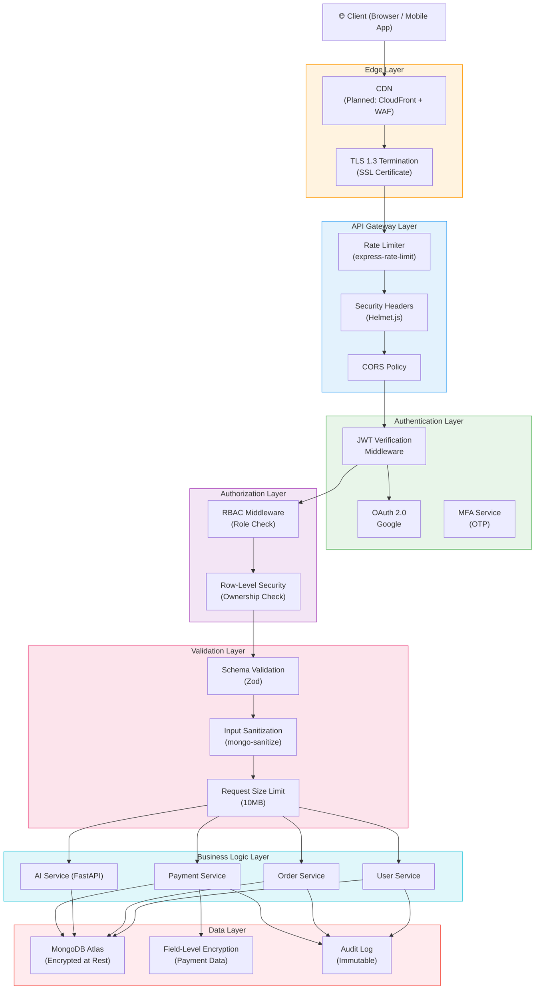
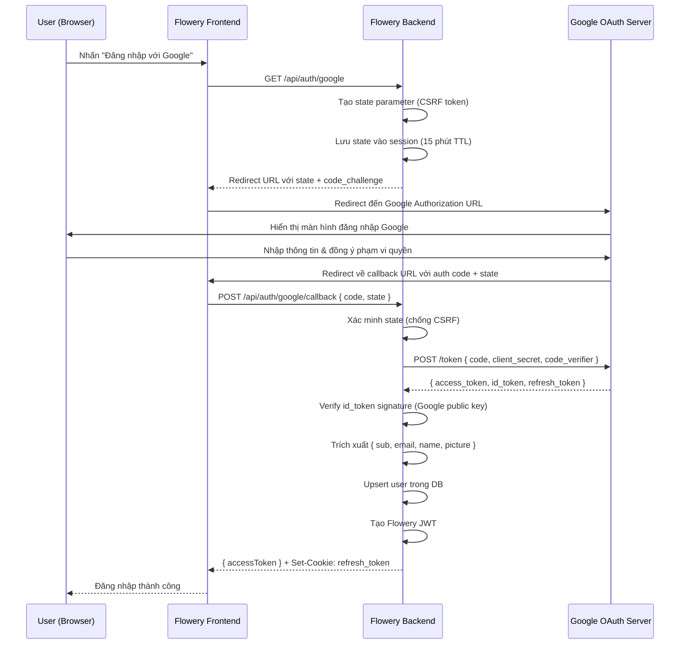
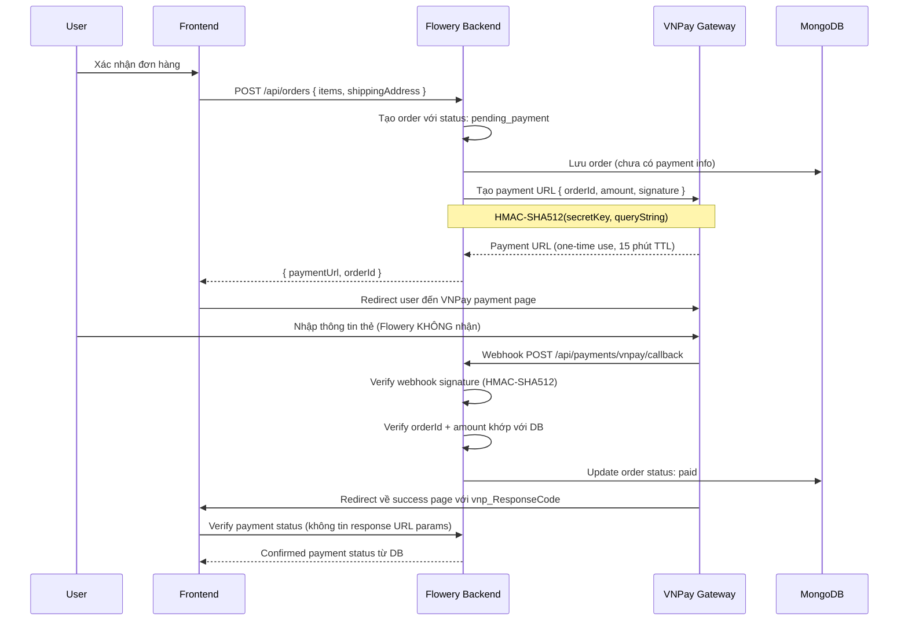

# 10. Bảo Mật & Tuân Thủ (Security & Compliance)

> Tài liệu này mô tả kiến trúc bảo mật toàn diện của Flowery — nền tảng giao hoa dựa trên cảm xúc.  
> Flowery xử lý dữ liệu cá nhân (PII), thông tin thanh toán, địa chỉ và dữ liệu quan hệ người dùng — đòi hỏi tiêu chuẩn bảo mật cao nhất.

---

## 1. Tổng Quan Bảo Mật (Security Overview)

### 1.1 Triết Lý Bảo Mật (Security Philosophy)

Flowery áp dụng nguyên tắc **Defense in Depth** — nhiều lớp bảo vệ độc lập, sao cho nếu một lớp thất bại, các lớp tiếp theo vẫn bảo vệ hệ thống.

| Nguyên tắc | Mô tả | Áp dụng |
|---|---|---|
| **Least Privilege** | Mỗi thành phần chỉ có quyền tối thiểu cần thiết | RBAC, service accounts |
| **Defense in Depth** | Nhiều lớp bảo vệ độc lập | Auth → Rate Limit → Validation → DB |
| **Fail Secure** | Khi thất bại, hệ thống từ chối truy cập (không phải cho phép) | Default deny policy |
| **Zero Trust** | Không tin tưởng bất kỳ request nào mà không xác minh | JWT validation mọi request |
| **Data Minimization** | Chỉ thu thập dữ liệu thực sự cần thiết | PII inventory review |
| **Security by Design** | Bảo mật được thiết kế từ đầu, không thêm vào sau | Threat modeling trước khi build |

### 1.2 Threat Model Overview

**Tài sản cần bảo vệ (Assets):**
- Dữ liệu cá nhân người dùng (họ tên, email, số điện thoại, địa chỉ)
- Thông tin thanh toán và lịch sử giao dịch
- Dữ liệu cảm xúc và hành vi người dùng (nhạy cảm)
- Thông tin shop owner (doanh thu, inventory)
- JWT tokens và session data

**Tác nhân đe dọa (Threat Actors):**
- Người dùng độc hại cố tình truy cập dữ liệu người khác
- Attacker bên ngoài (automated bots, credential stuffing)
- Insider threats (nhân viên lạm dụng quyền truy cập)
- Compromised third-party services (supply chain attacks)

### 1.3 Security Layers Diagram



---

## 2. Xác Thực (Authentication)

### 2.1 JWT Implementation

Flowery sử dụng **dual-token strategy**: Access Token ngắn hạn + Refresh Token dài hạn, tuân theo best practice bảo mật hiện đại.

#### Access Token

```typescript
// Cấu hình Access Token
const ACCESS_TOKEN_CONFIG = {
  algorithm: 'RS256',       // RSA asymmetric (không phải HS256)
  expiresIn: '15m',         // 15 phút — giới hạn thiệt hại nếu bị đánh cắp
  issuer: 'flowery-auth', // Xác định nguồn phát
  audience: 'flowery-api' // Xác định người nhận hợp lệ
};
```

**Cấu trúc JWT Payload:**

```json
{
  "header": {
    "alg": "RS256",
    "typ": "JWT",
    "kid": "key-id-2024-01"
  },
  "payload": {
    "sub": "user_64f3a2b1c9e8d7f0a1b2c3d4",
    "email": "user@example.com",
    "role": "user",
    "shopId": null,
    "sessionId": "sess_abc123xyz",
    "iat": 1704067200,
    "exp": 1704068100,
    "iss": "flowery-auth",
    "aud": "flowery-api"
  }
}
```

> ⚠️ **Lưu ý bảo mật:** JWT payload **không** chứa thông tin nhạy cảm (số điện thoại, địa chỉ, thông tin thanh toán). Chỉ chứa `sub`, `role`, và `sessionId` để xác định danh tính.

#### Refresh Token

```typescript
// Cấu hình Refresh Token
const REFRESH_TOKEN_CONFIG = {
  expiresIn: '7d',              // 7 ngày
  storage: 'httpOnly cookie',   // Không thể đọc bằng JavaScript (chống XSS)
  sameSite: 'Strict',           // Chống CSRF
  secure: true,                 // Chỉ gửi qua HTTPS
  path: '/api/auth/refresh',    // Chỉ gửi đến endpoint refresh (không rò rỉ)
  rotationPolicy: 'on-use'      // Tạo token mới mỗi lần dùng (Refresh Token Rotation)
};

// Lưu trữ Refresh Token trong DB để có thể revoke
interface RefreshTokenRecord {
  tokenHash: string;        // Bcrypt hash của token (không lưu plaintext)
  userId: ObjectId;
  sessionId: string;
  deviceInfo: string;       // User-agent, IP (cho phép quản lý session)
  expiresAt: Date;
  revokedAt?: Date;         // Nếu đã revoke
  createdAt: Date;
}
```

#### Token Rotation & Revocation

```typescript
// Refresh Token Rotation — chống Refresh Token Reuse Attack
async function refreshAccessToken(refreshToken: string, res: Response) {
  const record = await RefreshTokenModel.findByToken(refreshToken);

  // Phát hiện token reuse (token đã được dùng trước đó)
  if (record.usedAt) {
    // Có thể là tấn công — revoke toàn bộ session
    await revokeAllUserSessions(record.userId);
    throw new SecurityError('Token reuse detected. All sessions revoked.');
  }

  // Mark token cũ là đã dùng
  await record.markAsUsed();

  // Tạo token mới (rotation)
  const newAccessToken = generateAccessToken(record.userId);
  const newRefreshToken = generateRefreshToken(record.userId);

  // Set cookie mới
  res.cookie('refresh_token', newRefreshToken, REFRESH_TOKEN_CONFIG);

  return newAccessToken;
}
```

### 2.2 Password Security

#### Bcrypt Hashing

```typescript
import bcrypt from 'bcrypt';

const BCRYPT_SALT_ROUNDS = 12; // ~250ms trên hardware hiện đại — cân bằng UX vs security

// Hash password khi tạo / thay đổi
async function hashPassword(plaintext: string): Promise<string> {
  return bcrypt.hash(plaintext, BCRYPT_SALT_ROUNDS);
}

// Verify — sử dụng timing-safe comparison (bcrypt tự xử lý)
async function verifyPassword(plaintext: string, hash: string): Promise<boolean> {
  return bcrypt.compare(plaintext, hash);
}
```

#### Password Requirements

| Requirement | Rule | Regex |
|---|---|---|
| Độ dài tối thiểu | 8 ký tự | `.{8,}` |
| Chữ hoa | Ít nhất 1 chữ hoa | `[A-Z]` |
| Chữ thường | Ít nhất 1 chữ thường | `[a-z]` |
| Số | Ít nhất 1 chữ số | `[0-9]` |
| Ký tự đặc biệt | Ít nhất 1 ký tự: `!@#$%^&*` | `[!@#$%^&*]` |
| Không được là email | Không chứa phần local của email | Custom check |
| Không có whitespace | Không có khoảng trắng | `^\S+$` |

```typescript
const PASSWORD_SCHEMA = z.string()
  .min(8, 'Mật khẩu phải có ít nhất 8 ký tự')
  .regex(/[A-Z]/, 'Phải có ít nhất 1 chữ hoa')
  .regex(/[a-z]/, 'Phải có ít nhất 1 chữ thường')
  .regex(/[0-9]/, 'Phải có ít nhất 1 chữ số')
  .regex(/[!@#$%^&*]/, 'Phải có ít nhất 1 ký tự đặc biệt (!@#$%^&*)')
  .regex(/^\S+$/, 'Không được chứa khoảng trắng')
  .max(128, 'Mật khẩu không được vượt quá 128 ký tự');
```

#### Password History (Prevent Reuse)

```typescript
// Lưu 5 password hash gần nhất để ngăn tái sử dụng
interface UserPasswordHistory {
  userId: ObjectId;
  hashes: string[]; // Tối đa 5 entries, FIFO
  updatedAt: Date;
}

async function changePassword(userId: string, newPassword: string) {
  const history = await PasswordHistoryModel.findOne({ userId });
  const previousHashes = history?.hashes ?? [];

  // Kiểm tra password mới có trùng với 5 password cũ không
  for (const oldHash of previousHashes) {
    const isReused = await bcrypt.compare(newPassword, oldHash);
    if (isReused) {
      throw new ValidationError('Không thể sử dụng lại 5 mật khẩu gần đây nhất');
    }
  }

  const newHash = await hashPassword(newPassword);

  // Cập nhật history (FIFO — xóa cũ nhất nếu quá 5)
  const updatedHashes = [newHash, ...previousHashes].slice(0, 5);
  await PasswordHistoryModel.findOneAndUpdate(
    { userId },
    { hashes: updatedHashes, updatedAt: new Date() },
    { upsert: true }
  );

  await UserModel.findByIdAndUpdate(userId, { passwordHash: newHash });
}
```

### 2.3 OAuth 2.0 / Social Login

#### OAuth Flow Diagram



#### Google OAuth Configuration

```typescript
const GOOGLE_OAUTH_CONFIG = {
  clientId: process.env.GOOGLE_CLIENT_ID,
  clientSecret: process.env.GOOGLE_CLIENT_SECRET,
  callbackUrl: `${process.env.API_BASE_URL}/api/auth/google/callback`,
  scope: ['openid', 'email', 'profile'], // Tối thiểu — không yêu cầu quyền không cần thiết
  accessType: 'offline',   // Để nhận refresh_token
  prompt: 'consent',       // Buộc hiển thị màn hình đồng ý
};

// Xác minh Google ID Token (thay vì dùng access_token để gọi API)
async function verifyGoogleIdToken(idToken: string) {
  const { OAuth2Client } = await import('google-auth-library');
  const client = new OAuth2Client(GOOGLE_OAUTH_CONFIG.clientId);

  const ticket = await client.verifyIdToken({
    idToken,
    audience: GOOGLE_OAUTH_CONFIG.clientId,
  });

  const payload = ticket.getPayload();
  if (!payload || !payload.email_verified) {
    throw new AuthError('Google account email chưa được xác minh');
  }

  return {
    googleId: payload.sub,
    email: payload.email!,
    name: payload.name,
    avatar: payload.picture,
  };
}
```

### 2.4 Multi-Factor Authentication (Roadmap)

> **Trạng thái:** Planned — Q2 2025

| Phương thức | Ưu tiên | Thư viện |
|---|---|---|
| **Email OTP** | High — triển khai đầu tiên | Nodemailer + crypto.randomInt |
| **SMS OTP** | Medium — Vietnam market | Twilio / ESMS.vn |
| **Authenticator App (TOTP)** | Low — power users | speakeasy (RFC 6238) |

```typescript
// Email OTP implementation pattern
async function sendEmailOTP(userId: string, email: string) {
  const otp = crypto.randomInt(100000, 999999).toString(); // 6 chữ số
  const otpHash = await bcrypt.hash(otp, 10);              // Hash trước khi lưu

  await OTPModel.create({
    userId,
    otpHash,
    purpose: 'mfa_verification',
    expiresAt: new Date(Date.now() + 10 * 60 * 1000), // 10 phút
    attempts: 0,
    maxAttempts: 3, // Sau 3 lần sai, OTP bị vô hiệu hóa
  });

  await emailService.sendOTP(email, otp);
}
```

---

## 3. Phân Quyền (Authorization — RBAC)

### 3.1 Role Hierarchy

```
Admin
  └── Shop Owner
        └── User
              └── Guest (unauthenticated)
```

| Role | Mô tả | Số lượng dự kiến |
|---|---|---|
| **Admin** | Quản trị viên hệ thống — toàn quyền | < 5 người |
| **Shop Owner** | Chủ cửa hàng hoa — quản lý shop và đơn hàng | ~1,000 shops |
| **User** | Người dùng đã đăng ký — mua hàng, đánh giá | ~100,000 users |
| **Guest** | Khách vãng lai — chỉ xem, không mua | Unlimited |

### 3.2 Permission Matrix

| Resource | Action | Admin | Shop Owner | User | Guest |
|---|---|:---:|:---:|:---:|:---:|
| **Users** | Read own profile | ✅ | ✅ | ✅ | ❌ |
| **Users** | Update own profile | ✅ | ✅ | ✅ | ❌ |
| **Users** | Read any profile | ✅ | ❌ | ❌ | ❌ |
| **Users** | Delete user | ✅ | ❌ | ❌ | ❌ |
| **Users** | List all users | ✅ | ❌ | ❌ | ❌ |
| **Shops** | View public info | ✅ | ✅ | ✅ | ✅ |
| **Shops** | Create shop | ✅ | ❌ | ❌ | ❌ |
| **Shops** | Update own shop | ✅ | ✅ | ❌ | ❌ |
| **Shops** | Update any shop | ✅ | ❌ | ❌ | ❌ |
| **Shops** | Delete shop | ✅ | ❌ | ❌ | ❌ |
| **Products** | View public | ✅ | ✅ | ✅ | ✅ |
| **Products** | Create (own shop) | ✅ | ✅ | ❌ | ❌ |
| **Products** | Update (own shop) | ✅ | ✅ | ❌ | ❌ |
| **Products** | Delete (own shop) | ✅ | ✅ | ❌ | ❌ |
| **Products** | Approve listing | ✅ | ❌ | ❌ | ❌ |
| **Orders** | Create order | ✅ | ✅ | ✅ | ❌ |
| **Orders** | View own orders | ✅ | ✅ | ✅ | ❌ |
| **Orders** | View shop orders | ✅ | ✅ | ❌ | ❌ |
| **Orders** | View all orders | ✅ | ❌ | ❌ | ❌ |
| **Orders** | Update status | ✅ | ✅ | ❌ | ❌ |
| **Orders** | Cancel own order | ✅ | ✅ | ✅ | ❌ |
| **Reviews** | Read reviews | ✅ | ✅ | ✅ | ✅ |
| **Reviews** | Create review | ✅ | ✅ | ✅ | ❌ |
| **Reviews** | Delete own review | ✅ | ✅ | ✅ | ❌ |
| **Reviews** | Delete any review | ✅ | ❌ | ❌ | ❌ |
| **Analytics** | View own shop | ✅ | ✅ | ❌ | ❌ |
| **Analytics** | View platform | ✅ | ❌ | ❌ | ❌ |
| **AI Features** | Emotion analysis | ✅ | ✅ | ✅ | ✅ |
| **AI Features** | Recommendation | ✅ | ✅ | ✅ | ✅ |
| **Payments** | Initiate payment | ✅ | ✅ | ✅ | ❌ |
| **Payments** | View own history | ✅ | ✅ | ✅ | ❌ |
| **Payments** | View all payments | ✅ | ❌ | ❌ | ❌ |
| **Payments** | Issue refund | ✅ | ✅ | ❌ | ❌ |

### 3.3 RBAC Middleware Implementation

```typescript
// src/middleware/rbac.middleware.ts

type Role = 'admin' | 'shop_owner' | 'user' | 'guest';
type Action = 'create' | 'read' | 'update' | 'delete' | 'list';

interface AuthContext {
  userId: string;
  role: Role;
  shopId?: string; // Chỉ có nếu role === 'shop_owner'
}

// Middleware factory — tạo middleware kiểm tra quyền
export function requireRole(...roles: Role[]) {
  return (req: AuthRequest, res: Response, next: NextFunction) => {
    if (!req.auth) {
      return res.status(401).json({ error: 'Authentication required' });
    }

    if (!roles.includes(req.auth.role)) {
      // Log unauthorized attempt
      auditLogger.warn('Unauthorized access attempt', {
        userId: req.auth.userId,
        role: req.auth.role,
        requiredRoles: roles,
        path: req.path,
        method: req.method,
      });
      return res.status(403).json({ error: 'Insufficient permissions' });
    }

    next();
  };
}

// Row-level security — đảm bảo user chỉ truy cập dữ liệu của mình
export function requireOwnership(resourceField: string) {
  return async (req: AuthRequest, res: Response, next: NextFunction) => {
    const resourceId = req.params[resourceField];
    const { userId, role } = req.auth!;

    // Admin bypass
    if (role === 'admin') return next();

    // Kiểm tra ownership
    const resource = await getResourceOwner(resourceId, req.path);
    if (resource.ownerId.toString() !== userId) {
      return res.status(403).json({ error: 'Access denied: not your resource' });
    }

    next();
  };
}

// Sử dụng trong routes
router.put('/orders/:orderId/status',
  authenticate,              // Bước 1: Xác thực JWT
  requireRole('shop_owner', 'admin'), // Bước 2: Kiểm tra role
  requireOwnership('orderId'),        // Bước 3: Kiểm tra ownership
  updateOrderStatusController         // Bước 4: Business logic
);
```

---

## 4. Bảo Mật API (API Security)

### 4.1 Rate Limiting

```typescript
// src/middleware/rate-limit.middleware.ts
import rateLimit from 'express-rate-limit';
import RedisStore from 'rate-limit-redis';

const redisClient = createRedisClient(); // Redis cho distributed rate limiting

// Global rate limit — áp dụng cho toàn bộ API
export const globalRateLimit = rateLimit({
  windowMs: 60 * 1000,    // 1 phút
  max: 100,               // 100 request/phút/IP
  standardHeaders: true,  // Trả về RateLimit-* headers
  legacyHeaders: false,
  store: new RedisStore({ client: redisClient, prefix: 'rl:global:' }),
  message: { error: 'Quá nhiều request. Vui lòng thử lại sau 1 phút.' },
  skip: (req) => req.ip === process.env.HEALTH_CHECK_IP, // Bỏ qua health checks
});

// Auth endpoints — nghiêm ngặt hơn để chống brute force
export const authRateLimit = rateLimit({
  windowMs: 60 * 1000,
  max: 20,                // 20 lần/phút
  store: new RedisStore({ client: redisClient, prefix: 'rl:auth:' }),
  keyGenerator: (req) => `${req.ip}:${req.body.email ?? 'unknown'}`,
  message: { error: 'Quá nhiều lần thử đăng nhập. Vui lòng thử lại sau.' },
});

// File upload — chống upload spam
export const uploadRateLimit = rateLimit({
  windowMs: 60 * 1000,
  max: 10,                // 10 lần/phút
  store: new RedisStore({ client: redisClient, prefix: 'rl:upload:' }),
  message: { error: 'Quá nhiều lần upload. Vui lòng thử lại sau.' },
});

// Account lockout sau brute force
export const accountLockout = {
  maxAttempts: 5,
  lockDuration: 30 * 60 * 1000, // 30 phút

  async check(email: string): Promise<void> {
    const attempts = await redis.get(`lockout:${email}`);
    if (attempts && parseInt(attempts) >= this.maxAttempts) {
      throw new AuthError('Tài khoản bị khóa tạm thời. Vui lòng thử lại sau 30 phút.');
    }
  },

  async recordFailure(email: string): Promise<void> {
    const key = `lockout:${email}`;
    await redis.multi()
      .incr(key)
      .expire(key, this.lockDuration / 1000)
      .exec();
  },

  async clear(email: string): Promise<void> {
    await redis.del(`lockout:${email}`);
  },
};
```

### 4.2 Input Validation

```typescript
// src/middleware/validation.middleware.ts
import { z, ZodSchema } from 'zod';
import mongoSanitize from 'mongo-sanitize';

// Schema validation middleware factory
export function validate<T>(schema: ZodSchema<T>, source: 'body' | 'query' | 'params' = 'body') {
  return (req: Request, res: Response, next: NextFunction) => {
    const result = schema.safeParse(req[source]);

    if (!result.success) {
      return res.status(400).json({
        error: 'Validation failed',
        details: result.error.flatten().fieldErrors,
      });
    }

    req[source] = result.data; // Thay thế bằng dữ liệu đã được sanitize
    next();
  };
}

// Sanitize text input chống XSS
export function sanitizeInput(input: string): string {
  return sanitizeHtml(input, {
    allowedTags: [],         // Không cho phép HTML tags trong text fields
    allowedAttributes: {},
    disallowedTagsMode: 'discard',
  });
}

// NoSQL Injection prevention — loại bỏ MongoDB operators trong input
export function preventNoSQLInjection(obj: Record<string, unknown>): Record<string, unknown> {
  const cleaned: Record<string, unknown> = {};
  for (const [key, value] of Object.entries(obj)) {
    // Loại bỏ keys bắt đầu bằng $ (MongoDB operators)
    if (key.startsWith('$')) continue;

    if (typeof value === 'object' && value !== null && !Array.isArray(value)) {
      cleaned[key] = preventNoSQLInjection(value as Record<string, unknown>);
    } else {
      cleaned[key] = value;
    }
  }
  return cleaned;
}

// Request size limit — trong Express config
app.use(express.json({ limit: '10mb' }));
app.use(express.urlencoded({ extended: true, limit: '10mb' }));
```

### 4.3 CORS Configuration

```typescript
// src/config/cors.config.ts
import cors from 'cors';

const ALLOWED_ORIGINS = [
  'https://flowery.vn',
  'https://www.flowery.vn',
  'https://app.flowery.vn',
  'https://admin.flowery.vn',
  ...(process.env.NODE_ENV === 'development' ? ['http://localhost:3000', 'http://localhost:5173'] : []),
];

export const corsConfig = cors({
  origin: (origin, callback) => {
    // Cho phép requests không có origin (mobile apps, Postman in dev)
    if (!origin && process.env.NODE_ENV === 'development') return callback(null, true);
    if (!origin) return callback(new Error('No origin header'), false);

    if (ALLOWED_ORIGINS.includes(origin)) {
      callback(null, true);
    } else {
      callback(new Error(`CORS: Origin ${origin} not allowed`), false);
    }
  },
  methods: ['GET', 'POST', 'PUT', 'PATCH', 'DELETE', 'OPTIONS'],
  allowedHeaders: ['Content-Type', 'Authorization', 'X-Request-ID'],
  exposedHeaders: ['X-RateLimit-Limit', 'X-RateLimit-Remaining', 'X-Request-ID'],
  credentials: true,       // Cho phép cookies (Refresh Token)
  maxAge: 86400,           // Preflight cache 24 giờ
});
```

### 4.4 Helmet.js Security Headers

```typescript
// src/middleware/security-headers.middleware.ts
import helmet from 'helmet';

export const securityHeaders = helmet({
  // Content Security Policy — chặn XSS và data injection
  contentSecurityPolicy: {
    directives: {
      defaultSrc: ["'self'"],
      scriptSrc: ["'self'", 'https://apis.google.com', "'nonce-{NONCE}'"],
      styleSrc: ["'self'", "'unsafe-inline'", 'https://fonts.googleapis.com'],
      fontSrc: ["'self'", 'https://fonts.gstatic.com'],
      imgSrc: ["'self'", 'data:', 'https://res.cloudinary.com', 'https://storage.googleapis.com'],
      connectSrc: ["'self'", 'https://api.flowery.vn'],
      frameSrc: ["'none'"],                           // Chặn iframe (Clickjacking)
      objectSrc: ["'none'"],
      upgradeInsecureRequests: [],                    // Tự động upgrade HTTP → HTTPS
    },
  },

  // HTTP Strict Transport Security — buộc HTTPS
  hsts: {
    maxAge: 31536000,         // 1 năm (tính bằng giây)
    includeSubDomains: true,
    preload: true,            // Submit vào HSTS preload list
  },

  // Chống clickjacking
  frameguard: { action: 'deny' },

  // Ẩn server information
  hidePoweredBy: true,

  // Chống MIME type sniffing
  noSniff: true,

  // XSS Filter (legacy browsers)
  xssFilter: true,

  // Referrer Policy — kiểm soát thông tin referrer
  referrerPolicy: { policy: 'strict-origin-when-cross-origin' },

  // Permissions Policy — tắt các browser features không cần
  permissionsPolicy: {
    features: {
      camera: [],
      microphone: [],
      geolocation: ["'self'"],
      payment: ["'self'"],
    },
  },
});
```

---

## 5. Bảo Mật Dữ Liệu (Data Security)

### 5.1 Encryption at Rest

**MongoDB Atlas Encryption:**

```
MongoDB Atlas cung cấp AES-256 encryption tự động cho toàn bộ data at rest.
Không cần cấu hình thêm — bật mặc định cho tất cả Atlas clusters.

Ngoài ra, Flowery bật Customer Managed Keys (CMK) để kiểm soát hoàn toàn:
- Key Provider: AWS KMS
- Key Rotation: Hàng năm (tự động)
- Key Material Access Log: CloudTrail
```

**Field-Level Encryption cho dữ liệu thanh toán:**

```typescript
// MongoDB Client-Side Field Level Encryption (CSFLE)
// Áp dụng cho các trường thanh toán nhạy cảm

const encryptedFieldsMap = {
  'payments.cardLastFour': {
    encrypt: {
      bsonType: 'string',
      algorithm: 'AEAD_AES_256_CBC_HMAC_SHA_512-Deterministic', // Deterministic cho search
    },
  },
  'payments.billingAddress': {
    encrypt: {
      bsonType: 'object',
      algorithm: 'AEAD_AES_256_CBC_HMAC_SHA_512-Random', // Random cho non-searchable fields
    },
  },
};

// Flowery KHÔNG lưu trữ số thẻ đầy đủ — chỉ lưu last 4 digits
// Toàn bộ thông tin thẻ được xử lý bởi payment gateway (VNPay, MoMo)
```

### 5.2 Encryption in Transit

```
Tất cả communication giữa các thành phần Flowery đều bắt buộc TLS 1.3:

- Frontend ↔ API Gateway: TLS 1.3 (CloudFront managed certificate)
- API Gateway ↔ Microservices: TLS 1.3 (mutual TLS trong nội bộ)
- Microservices ↔ MongoDB Atlas: TLS 1.3 (Atlas built-in)
- Microservices ↔ AI Service (FastAPI): TLS 1.3
- Microservices ↔ Redis: TLS 1.3

Cấu hình TLS nghiêm ngặt:
- Protocols: TLS 1.3 only (TLS 1.2 bị tắt)
- Cipher Suites: TLS_AES_256_GCM_SHA384, TLS_CHACHA20_POLY1305_SHA256
- Certificate Transparency: Bắt buộc
- OCSP Stapling: Bật
- Certificate Pinning: Mobile app (chống man-in-the-middle)
```

### 5.3 Data Classification

| Level | Mô tả | Ví dụ fields | Xử lý |
|---|---|---|---|
| **Public** | Thông tin công khai | Shop name, product info, public reviews | No restriction |
| **Internal** | Nội bộ platform | Order IDs, timestamps, system logs | Auth required |
| **Confidential** | Nhạy cảm người dùng | Email, phone, address, order history | Auth + Ownership |
| **Restricted** | Cực kỳ nhạy cảm | Payment tokens, hashed passwords, emotion data | Encrypted + Minimal access |

### 5.4 PII Handling

**Personal Data Inventory:**

| Field | Category | Collected | Retained | Encrypted |
|---|---|---|---|---|
| `email` | Contact | Registration | Account lifetime + 90 days | No (indexed) |
| `phone` | Contact | Registration | Account lifetime + 90 days | Yes (CSFLE) |
| `fullName` | Identity | Registration | Account lifetime + 90 days | No |
| `address` | Location | Order placement | 2 years | Yes (CSFLE) |
| `dateOfBirth` | Identity | Optional | Account lifetime | Yes (CSFLE) |
| `paymentToken` | Financial | Checkout | Never stored (gateway) | N/A |
| `emotionData` | Behavioral | AI analysis | 1 year | Yes |
| `deviceInfo` | Technical | Login | 90 days | No |
| `ipAddress` | Technical | Every request | 30 days | No |

**Data Masking trong Logs:**

```typescript
// src/utils/log-sanitizer.ts
// Đảm bảo PII không xuất hiện trong logs

const PII_FIELDS = ['email', 'phone', 'address', 'passwordHash', 'cardNumber'];

export function sanitizeForLog(obj: Record<string, unknown>): Record<string, unknown> {
  const sanitized = { ...obj };
  for (const field of PII_FIELDS) {
    if (sanitized[field]) {
      sanitized[field] = '[REDACTED]';
    }
  }
  // Mask email: user@example.com → u***@example.com
  if (typeof sanitized.email === 'string') {
    sanitized.email = maskEmail(sanitized.email);
  }
  return sanitized;
}

function maskEmail(email: string): string {
  const [local, domain] = email.split('@');
  return `${local[0]}***@${domain}`;
}
```

---

## 6. OWASP Top 10 Mitigation

| # | Vulnerability | Risk Level | Mitigation | Implementation |
|---|---|:---:|---|---|
| **A01** | Broken Access Control | 🔴 Critical | RBAC middleware + Row-level security + Default deny | `requireRole()`, `requireOwnership()` middleware trên mọi protected route |
| **A02** | Cryptographic Failures | 🔴 Critical | TLS 1.3 mandatory, bcrypt(12) cho passwords, AES-256 at rest, RS256 JWT | Helmet HSTS, MongoDB Atlas encryption, CSFLE cho payment fields |
| **A03** | Injection (SQLi/NoSQLi/XSS) | 🔴 Critical | Zod schema validation, `preventNoSQLInjection()`, `mongo-sanitize`, parameterized queries | Input validation middleware trên mọi endpoint, không dùng raw string queries |
| **A04** | Insecure Design | 🟠 High | Threat modeling, Security by Design, STRIDE analysis trước khi build | Security review checkpoint trong development workflow |
| **A05** | Security Misconfiguration | 🟠 High | Helmet.js headers, CSP, tắt debug mode ở production, environment separation | `.env.production` khác `.env.development`, không expose stack traces |
| **A06** | Vulnerable Components | 🟠 High | `npm audit` trong CI/CD, Dependabot alerts, SBOM tracking | GitHub Dependabot + weekly `npm audit` trong pipeline |
| **A07** | Auth Failures | 🔴 Critical | Rate limiting, account lockout, Refresh Token Rotation, secure cookie flags | `authRateLimit`, `accountLockout`, `httpOnly + Secure + SameSite` cookies |
| **A08** | Data Integrity Failures | 🟠 High | Webhook signature verification, subresource integrity, signed deployments | VNPay/MoMo HMAC-SHA256 webhook verification, CSP integrity hashes |
| **A09** | Logging Failures | 🟡 Medium | Structured audit logs, PII masking, centralized log aggregation, alerts | Winston + CloudWatch, `sanitizeForLog()`, security event alerts |
| **A10** | SSRF | 🟠 High | URL allowlist cho external requests, block private IP ranges, no user-supplied URLs in server requests | Validate URLs trước khi fetch, block `169.254.x.x`, `10.x.x.x`, `192.168.x.x` |

---

## 7. Bảo Mật Thanh Toán (Payment Security)

### 7.1 PCI DSS Considerations

Flowery **không** lưu trữ, xử lý hoặc truyền tải dữ liệu thẻ tín dụng trực tiếp — toàn bộ được xử lý bởi payment gateway (VNPay, MoMo). Điều này giảm phạm vi PCI DSS xuống mức tối thiểu.

```
PCI DSS Scope Reduction Strategy:
✅ Không lưu Primary Account Number (PAN)
✅ Không lưu CVV/CVC
✅ Không lưu thông tin track data
✅ Sử dụng payment gateway tokenization
✅ Redirect checkout → gateway hosted page (SAQ A)
```

### 7.2 Payment Flow Security



### 7.3 Webhook Signature Verification

```typescript
// src/services/payment/vnpay.service.ts
import crypto from 'crypto';

const VNPAY_SECRET_KEY = process.env.VNPAY_HASH_SECRET!;

// Verify VNPay webhook — bắt buộc trước khi xử lý bất kỳ payment nào
export function verifyVNPayWebhook(params: Record<string, string>): boolean {
  const receivedSign = params['vnp_SecureHash'];
  if (!receivedSign) return false;

  // Tạo lại signature từ params (trừ vnp_SecureHash)
  const filteredParams = Object.fromEntries(
    Object.entries(params).filter(([key]) => key !== 'vnp_SecureHash')
  );

  const sortedKeys = Object.keys(filteredParams).sort();
  const queryString = sortedKeys
    .map((key) => `${key}=${filteredParams[key]}`)
    .join('&');

  const expectedSign = crypto
    .createHmac('sha512', VNPAY_SECRET_KEY)
    .update(queryString)
    .digest('hex');

  // Timing-safe comparison để chống timing attacks
  return crypto.timingSafeEqual(
    Buffer.from(receivedSign.toLowerCase()),
    Buffer.from(expectedSign.toLowerCase())
  );
}

// Verify MoMo webhook
export function verifyMoMoWebhook(body: MoMoWebhookPayload): boolean {
  const { signature, ...data } = body;
  const rawSignature = [
    `accessKey=${process.env.MOMO_ACCESS_KEY}`,
    `amount=${data.amount}`,
    `extraData=${data.extraData}`,
    `message=${data.message}`,
    `orderId=${data.orderId}`,
    `orderInfo=${data.orderInfo}`,
    `orderType=${data.orderType}`,
    `partnerCode=${data.partnerCode}`,
    `payType=${data.payType}`,
    `requestId=${data.requestId}`,
    `responseTime=${data.responseTime}`,
    `resultCode=${data.resultCode}`,
    `transId=${data.transId}`,
  ].join('&');

  const expectedSignature = crypto
    .createHmac('sha256', process.env.MOMO_SECRET_KEY!)
    .update(rawSignature)
    .digest('hex');

  return crypto.timingSafeEqual(
    Buffer.from(signature),
    Buffer.from(expectedSignature)
  );
}
```

### 7.4 Fraud Detection Basics

```typescript
// Các rule cơ bản để phát hiện giao dịch đáng ngờ
const FRAUD_RULES = [
  {
    name: 'Velocity check — quá nhiều đơn hàng trong thời gian ngắn',
    check: async (userId: string) => {
      const recentOrders = await OrderModel.countDocuments({
        userId,
        createdAt: { $gte: new Date(Date.now() - 10 * 60 * 1000) }, // 10 phút
      });
      return recentOrders > 5; // Hơn 5 đơn trong 10 phút là đáng ngờ
    },
    action: 'flag_for_review',
  },
  {
    name: 'Unusual amount — số tiền bất thường',
    check: async (order: Order) => order.totalAmount > 50_000_000, // > 50 triệu VND
    action: 'require_manual_approval',
  },
  {
    name: 'New account high value — tài khoản mới mua giá trị cao',
    check: async (user: User, order: Order) => {
      const accountAge = Date.now() - user.createdAt.getTime();
      const isNew = accountAge < 24 * 60 * 60 * 1000; // < 24 giờ
      return isNew && order.totalAmount > 5_000_000; // > 5 triệu VND
    },
    action: 'flag_for_review',
  },
];
```

---

## 8. Privacy & Compliance

### 8.1 Vietnam Cybersecurity Law Compliance

Flowery tuân thủ **Luật An ninh mạng 2018** (Luật số 24/2018/QH14) và **Nghị định 13/2023/NĐ-CP** về bảo vệ dữ liệu cá nhân:

| Yêu cầu | Biện pháp của Flowery |
|---|---|
| Dữ liệu người dùng VN phải lưu tại VN hoặc có bản sao tại VN | MongoDB Atlas region: ap-southeast-1 (Singapore) + replica tại VN khi có yêu cầu |
| Yêu cầu cung cấp dữ liệu cho cơ quan nhà nước | Quy trình legal hold và data export theo yêu cầu pháp lý |
| Bảo vệ dữ liệu trẻ em (dưới 16 tuổi) | Yêu cầu xác nhận độ tuổi khi đăng ký |
| Thông báo vi phạm dữ liệu trong 72 giờ | Incident response plan với escalation procedure |

### 8.2 PDPA Considerations

Tham khảo **Personal Data Protection Act** (Thái Lan/Singapore) làm best practice cho khu vực:

- **Lawful basis for processing:** Consent (đăng ký), Contract (thực hiện đơn hàng), Legitimate interest (analytics)
- **Data subject rights:** Được triển khai đầy đủ (xem 8.3)
- **Cross-border transfers:** Adequacy assessments cho third-party services

### 8.3 User Data Rights

| Quyền | Mô tả | API Endpoint | SLA |
|---|---|---|---|
| **Right to Access** | Xem toàn bộ dữ liệu của mình | `GET /api/privacy/my-data` | 30 ngày |
| **Right to Rectification** | Sửa thông tin không chính xác | `PATCH /api/users/profile` | Ngay lập tức |
| **Right to Erasure** | Xóa tài khoản và dữ liệu | `DELETE /api/privacy/my-account` | 30 ngày |
| **Data Portability** | Export dữ liệu dạng JSON/CSV | `GET /api/privacy/export` | 30 ngày |
| **Right to Object** | Từ chối xử lý (marketing, analytics) | `POST /api/privacy/opt-out` | Ngay lập tức |

```typescript
// Data export — cung cấp toàn bộ dữ liệu người dùng
async function exportUserData(userId: string): Promise<UserDataExport> {
  const [user, orders, reviews, addressBook, wishlist, emotionHistory] = await Promise.all([
    UserModel.findById(userId).select('-passwordHash -__v'),
    OrderModel.find({ userId }).lean(),
    ReviewModel.find({ userId }).lean(),
    AddressModel.find({ userId }).lean(),
    WishlistModel.findOne({ userId }).lean(),
    EmotionHistoryModel.find({ userId }).lean(),
  ]);

  return {
    exportDate: new Date().toISOString(),
    userId,
    profile: user,
    orders,
    reviews,
    savedAddresses: addressBook,
    wishlist,
    emotionHistory,
  };
}
```

### 8.4 Data Retention Periods

| Loại dữ liệu | Retention | Lý do | Xóa như thế nào |
|---|---|---|---|
| Thông tin tài khoản | Account lifetime + 90 ngày | Legal compliance | Soft delete → Hard delete |
| Lịch sử đơn hàng | 5 năm | Thuế, kế toán | Archive → Delete |
| Log thanh toán | 5 năm | PCI, kế toán | Archive (encrypted) |
| Session logs | 90 ngày | Security audit | Auto-purge |
| IP/Access logs | 30 ngày | Fraud detection | Auto-purge |
| Dữ liệu cảm xúc AI | 1 năm | Model improvement | Anonymize → Delete |
| Email logs | 6 tháng | Troubleshooting | Auto-purge |
| Error logs | 3 tháng | Debugging | Auto-purge |

### 8.5 Cookie Consent

```typescript
// Cookie categories và consent requirements
const COOKIE_CATEGORIES = {
  essential: {
    required: true,
    description: 'Cần thiết để website hoạt động (session, CSRF protection)',
    cookies: ['session_id', 'refresh_token', 'csrf_token'],
  },
  functional: {
    required: false,
    description: 'Ghi nhớ tùy chọn của bạn (ngôn ngữ, theme)',
    cookies: ['language', 'theme', 'currency'],
  },
  analytics: {
    required: false,
    description: 'Hiểu cách người dùng sử dụng website (Google Analytics)',
    cookies: ['_ga', '_gid', '_gat'],
  },
  marketing: {
    required: false,
    description: 'Quảng cáo cá nhân hóa',
    cookies: ['_fbp', 'ads_id'],
  },
};
```

---

## 9. Giám Sát Bảo Mật (Security Monitoring)

### 9.1 Audit Logging

**Các sự kiện cần ghi log:**

| Category | Event | Log Level | Retention |
|---|---|---|---|
| Auth | Login success/failure | INFO/WARN | 90 ngày |
| Auth | Password changed | INFO | 1 năm |
| Auth | Account locked | WARN | 1 năm |
| Auth | Token refresh | DEBUG | 30 ngày |
| Auth | Logout | INFO | 30 ngày |
| Authorization | Access denied (403) | WARN | 90 ngày |
| Authorization | Role changed | INFO | 2 năm |
| Data | PII accessed | INFO | 2 năm |
| Data | Export requested | INFO | 2 năm |
| Data | Account deleted | INFO | 5 năm |
| Payment | Payment initiated | INFO | 5 năm |
| Payment | Payment failed | WARN | 5 năm |
| Payment | Refund issued | INFO | 5 năm |
| Admin | Admin action | INFO | 5 năm |
| Security | Rate limit exceeded | WARN | 90 ngày |
| Security | Signature verification failed | ERROR | 1 năm |
| Security | Suspicious activity | ERROR | 1 năm |

**Log Format (Structured JSON):**

```typescript
interface AuditLog {
  // Metadata
  timestamp: string;          // ISO 8601
  logId: string;              // UUID v4
  service: string;            // 'user-service', 'order-service', etc.
  environment: string;        // 'production', 'staging'

  // Event
  event: string;              // 'auth.login.success', 'order.payment.failed'
  level: 'DEBUG' | 'INFO' | 'WARN' | 'ERROR' | 'CRITICAL';

  // Actor
  userId?: string;            // Masked: 'usr_64f3...c3d4'
  role?: string;
  ipAddress: string;          // Masked sau 30 ngày
  userAgent: string;

  // Context
  requestId: string;          // X-Request-ID header
  sessionId?: string;
  resourceType?: string;      // 'order', 'user', 'product'
  resourceId?: string;

  // Result
  success: boolean;
  errorCode?: string;
  duration?: number;          // milliseconds

  // Additional (NO PII)
  metadata?: Record<string, unknown>;
}

// Example log entry
const exampleLog: AuditLog = {
  timestamp: '2024-09-15T10:30:45.123Z',
  logId: '550e8400-e29b-41d4-a716-446655440000',
  service: 'user-service',
  environment: 'production',
  event: 'auth.login.failure',
  level: 'WARN',
  userId: undefined,
  role: undefined,
  ipAddress: '203.113.xxx.xxx', // Last octet masked
  userAgent: 'Mozilla/5.0...',
  requestId: 'req_abc123',
  sessionId: undefined,
  resourceType: 'user',
  resourceId: undefined,
  success: false,
  errorCode: 'INVALID_CREDENTIALS',
  duration: 245,
  metadata: {
    attemptCount: 3,
    emailMasked: 'u***@example.com',
  },
};
```

### 9.2 Security Alerting Rules

```typescript
// Các rule kích hoạt alert (PagerDuty / Slack)

const SECURITY_ALERTS = [
  {
    name: 'Brute Force Attack',
    condition: '> 100 login failures from same IP trong 5 phút',
    severity: 'HIGH',
    action: 'Auto-block IP + Alert security team',
  },
  {
    name: 'Credential Stuffing',
    condition: '> 50 failed logins với nhiều email khác nhau từ cùng IP',
    severity: 'CRITICAL',
    action: 'Block IP + Alert + Captcha enforcement',
  },
  {
    name: 'Privilege Escalation Attempt',
    condition: 'User cố truy cập Admin endpoint',
    severity: 'HIGH',
    action: 'Log + Alert + Flag account',
  },
  {
    name: 'Unusual Data Export',
    condition: 'Export request > 1000 records cho non-admin user',
    severity: 'MEDIUM',
    action: 'Flag for review + Notify user',
  },
  {
    name: 'Payment Webhook Signature Failure',
    condition: 'Webhook với signature không hợp lệ',
    severity: 'CRITICAL',
    action: 'Reject + Alert + Log source IP',
  },
  {
    name: 'Multiple Account Registrations Same IP',
    condition: '> 10 tài khoản mới từ cùng IP trong 1 giờ',
    severity: 'HIGH',
    action: 'Rate limit + CAPTCHA + Flag accounts',
  },
  {
    name: 'Admin Login Outside Business Hours',
    condition: 'Admin login sau 22:00 hoặc trước 07:00 (UTC+7)',
    severity: 'MEDIUM',
    action: 'Alert + Require additional verification',
  },
];
```

### 9.3 Incident Response Plan

```
INCIDENT RESPONSE — 4 GIAI ĐOẠN

━━━━━━━━━━━━━━━━━━━━━━━━━━━━━━━━━━━━━━━━━━━━━━━━━━━━━━━
GIAI ĐOẠN 1: PHÁT HIỆN & PHÂN LOẠI (0-30 phút)
━━━━━━━━━━━━━━━━━━━━━━━━━━━━━━━━━━━━━━━━━━━━━━━━━━━━━━━
□ Xác nhận incident (không phải false positive)
□ Phân loại mức độ: P1 (Critical) / P2 (High) / P3 (Medium)
□ Notify: Security Lead + Engineering Lead
□ Mở war room (Slack #incident-response)
□ Bắt đầu ghi chép timeline

P1 Criteria: Data breach, payment system compromised, service down
P2 Criteria: Unauthorized access, account takeover, injection detected
P3 Criteria: Unusual activity, policy violation, failed attack

━━━━━━━━━━━━━━━━━━━━━━━━━━━━━━━━━━━━━━━━━━━━━━━━━━━━━━━
GIAI ĐOẠN 2: KIỂM SOÁT (30-120 phút)
━━━━━━━━━━━━━━━━━━━━━━━━━━━━━━━━━━━━━━━━━━━━━━━━━━━━━━━
□ Isolate affected systems (nếu cần)
□ Block attacker IPs / revoke compromised tokens
□ Preserve evidence (snapshots, logs) trước khi thay đổi
□ Xác định scope: bao nhiêu user bị ảnh hưởng?

━━━━━━━━━━━━━━━━━━━━━━━━━━━━━━━━━━━━━━━━━━━━━━━━━━━━━━━
GIAI ĐOẠN 3: KHẮC PHỤC (2-24 giờ)
━━━━━━━━━━━━━━━━━━━━━━━━━━━━━━━━━━━━━━━━━━━━━━━━━━━━━━━
□ Root cause analysis
□ Patch vulnerability
□ Revoke tất cả compromised credentials
□ Force password reset cho affected users
□ Notify affected users (nếu data breach)
□ Báo cáo cơ quan chức năng (nếu pháp luật yêu cầu, trong 72 giờ)

━━━━━━━━━━━━━━━━━━━━━━━━━━━━━━━━━━━━━━━━━━━━━━━━━━━━━━━
GIAI ĐOẠN 4: HẬU KỲ (1-2 tuần sau)
━━━━━━━━━━━━━━━━━━━━━━━━━━━━━━━━━━━━━━━━━━━━━━━━━━━━━━━
□ Post-mortem document (blameless)
□ Update runbooks và playbooks
□ Implement preventive measures
□ Security awareness training (nếu cần)
□ Cập nhật threat model
```

---

## 10. Security Checklist (Pre-Launch)

### Authentication & Session

| # | Item | Status | Owner |
|---|---|---|---|
| 1 | JWT sử dụng RS256 (không phải HS256) | ☐ | Backend |
| 2 | Access Token expiry ≤ 15 phút | ☐ | Backend |
| 3 | Refresh Token lưu trong httpOnly cookie (Secure + SameSite=Strict) | ☐ | Backend |
| 4 | Refresh Token Rotation được triển khai | ☐ | Backend |
| 5 | Refresh Token Reuse Detection được triển khai | ☐ | Backend |
| 6 | Password hashed bằng bcrypt với salt rounds ≥ 12 | ☐ | Backend |
| 7 | Password requirements được enforce (min 8 chars, complexity) | ☐ | Backend |
| 8 | Password history (no reuse of last 5) được enforce | ☐ | Backend |
| 9 | Account lockout sau 5 lần đăng nhập sai | ☐ | Backend |
| 10 | OAuth `state` parameter được validate (chống CSRF) | ☐ | Backend |

### Authorization

| # | Item | Status | Owner |
|---|---|---|---|
| 11 | Tất cả protected routes đều có authentication middleware | ☐ | Backend |
| 12 | RBAC middleware được áp dụng cho mọi action | ☐ | Backend |
| 13 | Row-level security được enforce (users chỉ thấy dữ liệu của mình) | ☐ | Backend |
| 14 | Default deny — endpoint không có auth mặc định là protected | ☐ | Backend |
| 15 | Admin endpoints có IP whitelist (tùy chọn) | ☐ | DevOps |

### API Security

| # | Item | Status | Owner |
|---|---|---|---|
| 16 | Rate limiting được áp dụng (global + per-endpoint) | ☐ | Backend |
| 17 | Input validation (Zod schemas) trên mọi endpoint | ☐ | Backend |
| 18 | NoSQL injection prevention được triển khai | ☐ | Backend |
| 19 | XSS prevention (mongo-sanitize) được áp dụng | ☐ | Backend |
| 20 | Request size limit được đặt (10MB) | ☐ | Backend |
| 21 | CORS chỉ allow các origins đã định | ☐ | Backend |
| 22 | Helmet.js security headers được cấu hình | ☐ | Backend |
| 23 | CSP header được cấu hình đúng | ☐ | Backend |
| 24 | HSTS được bật với preload | ☐ | DevOps |

### Data Security

| # | Item | Status | Owner |
|---|---|---|---|
| 25 | TLS 1.3 được enforce (TLS 1.2 bị tắt) | ☐ | DevOps |
| 26 | MongoDB Atlas encryption at rest được bật | ☐ | DevOps |
| 27 | PII không xuất hiện trong logs (masking được áp dụng) | ☐ | Backend |
| 28 | Không lưu trữ số thẻ tín dụng đầy đủ | ☐ | Backend |
| 29 | Payment webhook signature verification được triển khai | ☐ | Backend |
| 30 | Timing-safe comparison được dùng cho signature verification | ☐ | Backend |

### Infrastructure & Monitoring

| # | Item | Status | Owner |
|---|---|---|---|
| 31 | `.env` files không có trong git repository | ☐ | All |
| 32 | Secrets được quản lý qua Secret Manager (không hardcode) | ☐ | DevOps |
| 33 | `npm audit` không có vulnerabilities (high/critical) | ☐ | Backend |
| 34 | Audit logging được triển khai cho security events | ☐ | Backend |
| 35 | Security alerts được cấu hình (Slack/PagerDuty) | ☐ | DevOps |
| 36 | Incident response plan được document và test | ☐ | All |
| 37 | Stack traces không được expose cho client ở production | ☐ | Backend |
| 38 | Debug mode tắt ở production | ☐ | DevOps |
| 39 | Health check endpoints không expose sensitive info | ☐ | Backend |
| 40 | Data retention policy được implement (auto-purge cron jobs) | ☐ | Backend |

---

## Tài Liệu Liên Quan

- [01-project-overview.md](./01-project-overview.md) — Tổng quan hệ thống Flowery
- [04-api-design.md](./04-api-design.md) — API contracts và error codes
- [05-database-design.md](./05-database-design.md) — Schema và data models
- [07-deployment.md](./07-deployment.md) — Infrastructure và deployment pipeline

---

*Tài liệu này được review định kỳ: **6 tháng/lần** hoặc sau mỗi incident bảo mật.*  
*Lần cập nhật cuối: 2026-03-06 | Phiên bản: 1.0.0*
