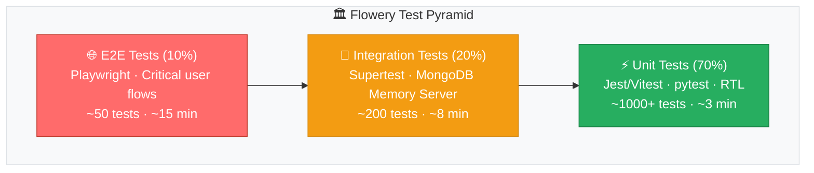
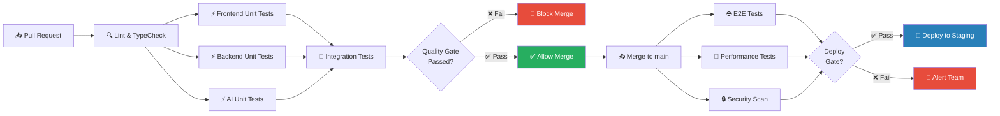
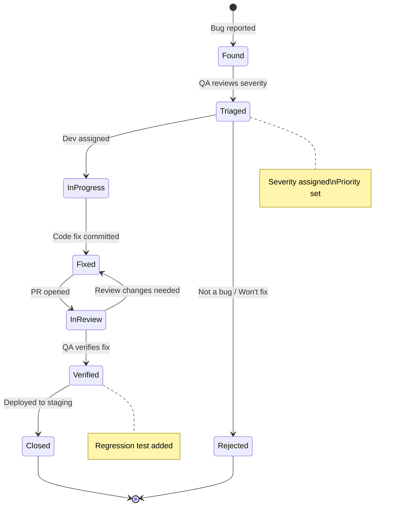

# 11. Chiến Lược Kiểm Thử — Flowery Testing Strategy

> **Flowery** — Nền tảng giao hoa theo cảm xúc | Emotion-based Flower Delivery Platform  
> Stack: MERN + Python/FastAPI + MongoDB Atlas  
> Phiên bản tài liệu: 1.0 | Document Version: 1.0

---

## 1. Tổng Quan Chiến Lược Test (Testing Strategy Overview)

### Triết Lý Kiểm Thử (Testing Philosophy)

Flowery áp dụng phương pháp kiểm thử **"Shift-Left Testing"** — phát hiện lỗi càng sớm càng tốt trong vòng đời phát triển để giảm chi phí sửa chữa. Mọi tính năng mới phải kèm theo test cases trước khi được merge vào nhánh chính.

> **Core principle:** _"Test early, test often, test confidently."_  
> Tests are not optional — they are part of the Definition of Done.

### Quality Gates

Mỗi Pull Request phải vượt qua các cổng chất lượng sau trước khi được phép merge:

| Gate | Yêu Cầu | Áp Dụng |
|------|---------|---------|
| ✅ Lint & Format | Zero lint errors, consistent formatting | All PRs |
| ✅ Type Check | TypeScript strict mode passes | Frontend + Backend |
| ✅ Unit Tests | All pass + coverage ≥ threshold | All PRs |
| ✅ Integration Tests | All pass, no flaky tests | All PRs |
| ✅ E2E Tests | Critical flows pass | Merge to `main` |
| ✅ Security Scan | No HIGH/CRITICAL vulnerabilities | All PRs |
| ✅ Performance Budget | No regressions > 10% | Merge to `main` |

### Test Pyramid Diagram



---

## 2. Kim Tự Tháp Test (Test Pyramid)

### 2.1 Unit Tests

Unit tests kiểm tra từng đơn vị code độc lập — component, function, service method — trong môi trường hoàn toàn cô lập với các dependencies được mock.

---

#### Frontend Unit Tests — React/Next.js

**Công cụ:** React Testing Library (RTL) + Vitest + `@testing-library/user-event`

**Phạm vi kiểm thử:**
- Component rendering và conditional UI logic
- Custom React hooks
- Utility functions (formatters, validators, helpers)
- Redux/Zustand store slices
- API client functions (mocked)

**Mục tiêu coverage:** **80%+** (statements, branches, functions, lines)

**Cấu trúc thư mục:**
```
src/
├── components/
│   └── FlowerCard/
│       ├── FlowerCard.tsx
│       ├── FlowerCard.test.tsx       ← colocated test
│       └── FlowerCard.stories.tsx
├── hooks/
│   ├── useEmotionQuiz.ts
│   └── useEmotionQuiz.test.ts
└── utils/
    ├── formatCurrency.ts
    └── formatCurrency.test.ts
```

**Ví dụ — Component Test (FlowerCard):**

```typescript
// src/components/FlowerCard/FlowerCard.test.tsx
import { render, screen, fireEvent } from '@testing-library/react';
import userEvent from '@testing-library/user-event';
import { vi, describe, it, expect, beforeEach } from 'vitest';
import { FlowerCard } from './FlowerCard';
import { formatCurrency } from '@/utils/formatCurrency';

const mockFlower = {
  id: 'flower-001',
  name: 'Hoa Hồng Đỏ Premium',
  nameEn: 'Premium Red Rose',
  price: 350000,
  originalPrice: 420000,
  imageUrl: '/images/red-rose.jpg',
  emotion: 'love',
  rating: 4.8,
  reviewCount: 127,
  inStock: true,
};

const mockOnAddToCart = vi.fn();
const mockOnWishlist = vi.fn();

describe('FlowerCard', () => {
  beforeEach(() => {
    vi.clearAllMocks();
  });

  it('should render flower name and price correctly', () => {
    // Arrange
    render(
      <FlowerCard flower={mockFlower} onAddToCart={mockOnAddToCart} />
    );

    // Assert
    expect(screen.getByText('Hoa Hồng Đỏ Premium')).toBeInTheDocument();
    expect(screen.getByText(formatCurrency(350000))).toBeInTheDocument();
  });

  it('should display discount badge when originalPrice is higher', () => {
    // Arrange
    render(<FlowerCard flower={mockFlower} onAddToCart={mockOnAddToCart} />);

    // Assert
    const discount = Math.round(
      ((mockFlower.originalPrice - mockFlower.price) / mockFlower.originalPrice) * 100
    );
    expect(screen.getByText(`-${discount}%`)).toBeInTheDocument();
  });

  it('should disable add-to-cart button when out of stock', () => {
    // Arrange
    const outOfStockFlower = { ...mockFlower, inStock: false };
    render(
      <FlowerCard flower={outOfStockFlower} onAddToCart={mockOnAddToCart} />
    );

    // Act
    const button = screen.getByRole('button', { name: /thêm vào giỏ/i });

    // Assert
    expect(button).toBeDisabled();
    expect(screen.getByText(/hết hàng/i)).toBeInTheDocument();
  });

  it('should call onAddToCart with flower id when button clicked', async () => {
    // Arrange
    const user = userEvent.setup();
    render(
      <FlowerCard flower={mockFlower} onAddToCart={mockOnAddToCart} />
    );

    // Act
    await user.click(screen.getByRole('button', { name: /thêm vào giỏ/i }));

    // Assert
    expect(mockOnAddToCart).toHaveBeenCalledOnce();
    expect(mockOnAddToCart).toHaveBeenCalledWith(mockFlower.id);
  });

  it('should render emotion tag matching flower emotion', () => {
    // Arrange
    render(<FlowerCard flower={mockFlower} onAddToCart={mockOnAddToCart} />);

    // Assert
    expect(screen.getByTestId('emotion-tag')).toHaveTextContent(/tình yêu|love/i);
  });
});
```

**Ví dụ — Custom Hook Test (useEmotionQuiz):**

```typescript
// src/hooks/useEmotionQuiz.test.ts
import { renderHook, act } from '@testing-library/react';
import { describe, it, expect } from 'vitest';
import { useEmotionQuiz } from './useEmotionQuiz';

describe('useEmotionQuiz', () => {
  it('should initialize with the first question', () => {
    const { result } = renderHook(() => useEmotionQuiz());

    expect(result.current.currentStep).toBe(0);
    expect(result.current.answers).toEqual({});
    expect(result.current.isComplete).toBe(false);
  });

  it('should advance to next step when answer is submitted', () => {
    const { result } = renderHook(() => useEmotionQuiz());

    act(() => {
      result.current.submitAnswer('mood', 'happy');
    });

    expect(result.current.currentStep).toBe(1);
    expect(result.current.answers.mood).toBe('happy');
  });

  it('should mark quiz as complete after final answer', () => {
    const { result } = renderHook(() => useEmotionQuiz());
    const totalSteps = result.current.totalSteps;

    // Answer all questions
    act(() => {
      for (let i = 0; i < totalSteps; i++) {
        result.current.submitAnswer(`question_${i}`, `answer_${i}`);
      }
    });

    expect(result.current.isComplete).toBe(true);
  });
});
```

---

#### Backend Unit Tests — Node.js/Express

**Công cụ:** Vitest + Supertest + `mongodb-memory-server`

**Phạm vi kiểm thử:**
- Service layer business logic (isolated, no DB)
- Controller handlers (mocked service layer)
- Validation schemas (Zod/Joi)
- Utility functions (price calculators, slug generators)
- Middleware functions

**Mục tiêu coverage:** **85%+**

**Ví dụ — Service Layer Test (OrderService):**

```typescript
// src/services/__tests__/order.service.test.ts
import { describe, it, expect, vi, beforeEach } from 'vitest';
import { OrderService } from '../order.service';
import { OrderRepository } from '@/repositories/order.repository';
import { InventoryService } from '../inventory.service';
import { PaymentService } from '../payment.service';
import { OrderStatus, PaymentMethod } from '@/types/order.types';

// Mock all external dependencies
vi.mock('@/repositories/order.repository');
vi.mock('../inventory.service');
vi.mock('../payment.service');

describe('OrderService', () => {
  let orderService: OrderService;
  let mockOrderRepo: vi.Mocked<OrderRepository>;
  let mockInventoryService: vi.Mocked<InventoryService>;

  beforeEach(() => {
    vi.clearAllMocks();
    mockOrderRepo = new OrderRepository() as vi.Mocked<OrderRepository>;
    mockInventoryService = new InventoryService() as vi.Mocked<InventoryService>;
    orderService = new OrderService(mockOrderRepo, mockInventoryService);
  });

  describe('createOrder', () => {
    it('should create order successfully when inventory is available', async () => {
      // Arrange
      const orderDto = {
        customerId: 'cust-001',
        shopId: 'shop-001',
        items: [{ flowerId: 'flower-001', quantity: 2, price: 350000 }],
        deliveryAddress: '123 Nguyễn Huệ, Q.1, TP.HCM',
        paymentMethod: PaymentMethod.VNPAY,
      };

      mockInventoryService.checkAvailability.mockResolvedValue(true);
      mockOrderRepo.create.mockResolvedValue({
        id: 'order-001',
        ...orderDto,
        status: OrderStatus.PENDING,
        totalAmount: 700000,
        createdAt: new Date(),
      });

      // Act
      const result = await orderService.createOrder(orderDto);

      // Assert
      expect(result.status).toBe(OrderStatus.PENDING);
      expect(result.totalAmount).toBe(700000);
      expect(mockInventoryService.checkAvailability).toHaveBeenCalledWith(
        'flower-001',
        2
      );
    });

    it('should throw InsufficientInventoryError when stock is unavailable', async () => {
      // Arrange
      const orderDto = {
        customerId: 'cust-001',
        shopId: 'shop-001',
        items: [{ flowerId: 'flower-002', quantity: 99, price: 200000 }],
        deliveryAddress: '456 Lê Lợi, Q.1, TP.HCM',
        paymentMethod: PaymentMethod.COD,
      };

      mockInventoryService.checkAvailability.mockResolvedValue(false);

      // Act & Assert
      await expect(orderService.createOrder(orderDto)).rejects.toThrow(
        'InsufficientInventoryError'
      );
      expect(mockOrderRepo.create).not.toHaveBeenCalled();
    });

    it('should calculate correct total with delivery fee and discount', async () => {
      // Arrange — order over 500k VND gets free delivery
      const orderDto = {
        customerId: 'cust-001',
        shopId: 'shop-001',
        items: [{ flowerId: 'flower-001', quantity: 3, price: 350000 }],
        deliveryAddress: '789 Trần Hưng Đạo, Q.5, TP.HCM',
        paymentMethod: PaymentMethod.MOMO,
        couponCode: 'BLOOM10',
      };

      mockInventoryService.checkAvailability.mockResolvedValue(true);
      mockOrderRepo.create.mockResolvedValue({ id: 'order-002', ...orderDto } as any);

      // Act
      const result = await orderService.createOrder(orderDto);

      // Assert — 3 × 350k = 1,050k → 10% off = 945k, free delivery
      expect(result.deliveryFee).toBe(0);
      expect(result.discountAmount).toBe(105000);
    });
  });
});
```

---

#### AI Service Unit Tests — Python/FastAPI

**Công cụ:** pytest + pytest-asyncio + pytest-cov + `unittest.mock`

**Phạm vi kiểm thử:**
- Recommendation algorithm logic
- Emotion scoring functions
- Data preprocessing pipelines
- Feature extraction utilities

**Mục tiêu coverage:** **90%+**

**Ví dụ — Recommendation Algorithm Test:**

```python
# ai-service/tests/unit/test_recommendation.py
import pytest
from unittest.mock import AsyncMock, patch, MagicMock
from app.services.recommendation import FlowerRecommendationService
from app.models.schemas import EmotionProfile, FlowerCandidate

@pytest.fixture
def recommendation_service():
    return FlowerRecommendationService()

@pytest.fixture
def sample_emotion_profile():
    return EmotionProfile(
        primary_emotion="joy",
        secondary_emotion="gratitude",
        intensity=0.85,
        occasion="birthday",
        recipient="mother",
        color_preference=["yellow", "pink"],
        budget_range=(200000, 600000),
    )

@pytest.fixture
def sample_flower_candidates():
    return [
        FlowerCandidate(id="f001", name="Hướng Dương", emotions=["joy", "energy"],
                        colors=["yellow"], price=280000, score=0.0),
        FlowerCandidate(id="f002", name="Hoa Cẩm Chướng Hồng", emotions=["gratitude", "love"],
                        colors=["pink"], price=320000, score=0.0),
        FlowerCandidate(id="f003", name="Hoa Cúc Trắng", emotions=["peace", "purity"],
                        colors=["white"], price=150000, score=0.0),
    ]

class TestFlowerRecommendationService:
    def test_score_flowers_ranks_by_emotion_match(
        self, recommendation_service, sample_emotion_profile, sample_flower_candidates
    ):
        # Act
        scored = recommendation_service.score_flowers(
            sample_emotion_profile, sample_flower_candidates
        )

        # Assert — sunflower (joy match) and carnation (gratitude match) rank above daisy
        ranked_ids = [f.id for f in sorted(scored, key=lambda x: x.score, reverse=True)]
        assert ranked_ids[0] in ["f001", "f002"]
        assert ranked_ids[-1] == "f003"

    def test_score_excludes_flowers_outside_budget(
        self, recommendation_service, sample_emotion_profile, sample_flower_candidates
    ):
        # Arrange — low budget profile
        low_budget_profile = sample_emotion_profile.model_copy(
            update={"budget_range": (100000, 200000)}
        )

        # Act
        scored = recommendation_service.score_flowers(
            low_budget_profile, sample_flower_candidates
        )

        # Assert — only daisy (150k) is within budget
        in_budget = [f for f in scored if f.score > 0]
        assert all(f.price <= 200000 for f in in_budget)

    def test_emotion_intensity_amplifies_primary_emotion_weight(
        self, recommendation_service
    ):
        # Arrange
        high_intensity = EmotionProfile(
            primary_emotion="love", secondary_emotion="romance",
            intensity=0.95, occasion="anniversary", recipient="partner",
            color_preference=["red"], budget_range=(300000, 1000000)
        )
        low_intensity = high_intensity.model_copy(update={"intensity": 0.3})

        candidate = FlowerCandidate(
            id="f010", name="Hoa Hồng Đỏ", emotions=["love"],
            colors=["red"], price=450000, score=0.0
        )

        # Act
        high_score = recommendation_service.score_flowers(high_intensity, [candidate])[0].score
        low_score = recommendation_service.score_flowers(low_intensity, [candidate])[0].score

        # Assert — higher intensity = higher score for primary emotion match
        assert high_score > low_score

    @pytest.mark.asyncio
    async def test_get_recommendations_returns_top_n(
        self, recommendation_service, sample_emotion_profile
    ):
        # Arrange
        with patch.object(recommendation_service, '_fetch_candidates', new_callable=AsyncMock) as mock_fetch:
            mock_fetch.return_value = [
                FlowerCandidate(id=f"f{i:03d}", name=f"Flower {i}",
                                emotions=["joy"], colors=["yellow"],
                                price=300000, score=0.0)
                for i in range(20)
            ]

            # Act
            results = await recommendation_service.get_recommendations(
                sample_emotion_profile, top_n=5
            )

            # Assert
            assert len(results) == 5
            mock_fetch.assert_called_once()
```

---

### 2.2 Integration Tests

Integration tests kiểm tra sự phối hợp giữa các thành phần thực — API routes, database operations, service interactions — với dependencies thật hoặc in-memory equivalents.

**Công cụ:** Supertest + `mongodb-memory-server` + `nock` (HTTP mocking)

**Ví dụ — API Integration Test:**

```typescript
// src/__tests__/integration/auth.routes.test.ts
import { describe, it, expect, beforeAll, afterAll, beforeEach } from 'vitest';
import request from 'supertest';
import { MongoMemoryServer } from 'mongodb-memory-server';
import mongoose from 'mongoose';
import { app } from '@/app';
import { User } from '@/models/User';
import { generateTestUser } from '@/test/factories/user.factory';

let mongoServer: MongoMemoryServer;

beforeAll(async () => {
  mongoServer = await MongoMemoryServer.create();
  await mongoose.connect(mongoServer.getUri());
});

afterAll(async () => {
  await mongoose.disconnect();
  await mongoServer.stop();
});

beforeEach(async () => {
  await User.deleteMany({});
});

describe('POST /api/v1/auth/register', () => {
  it('should register a new customer successfully', async () => {
    // Arrange
    const payload = {
      fullName: 'Nguyễn Thị Hoa',
      email: 'hoa.nguyen@example.com',
      password: 'SecurePass123!',
      phone: '0901234567',
      role: 'customer',
    };

    // Act
    const response = await request(app)
      .post('/api/v1/auth/register')
      .send(payload)
      .expect(201);

    // Assert
    expect(response.body.success).toBe(true);
    expect(response.body.data.user.email).toBe(payload.email);
    expect(response.body.data.user.password).toBeUndefined(); // never expose password
    expect(response.body.data.tokens.accessToken).toBeDefined();

    // Verify persisted in DB
    const dbUser = await User.findOne({ email: payload.email });
    expect(dbUser).not.toBeNull();
    expect(dbUser!.passwordHash).not.toBe(payload.password); // must be hashed
  });

  it('should return 409 when email already exists', async () => {
    // Arrange
    const existingUser = await generateTestUser({ email: 'existing@example.com' });
    await User.create(existingUser);

    // Act
    const response = await request(app)
      .post('/api/v1/auth/register')
      .send({ ...existingUser, password: 'AnotherPass123!' })
      .expect(409);

    // Assert
    expect(response.body.error.code).toBe('EMAIL_ALREADY_EXISTS');
  });

  it('should return 422 when phone number format is invalid', async () => {
    // Act
    const response = await request(app)
      .post('/api/v1/auth/register')
      .send({
        fullName: 'Test User',
        email: 'test@example.com',
        password: 'ValidPass123!',
        phone: '123', // invalid Vietnamese phone
      })
      .expect(422);

    // Assert
    expect(response.body.error.fields).toContainEqual(
      expect.objectContaining({ field: 'phone' })
    );
  });
});

describe('POST /api/v1/auth/login', () => {
  it('should return tokens on valid credentials', async () => {
    // Arrange
    const user = await generateTestUser({ email: 'login@example.com' });
    await User.create(user);

    // Act
    const response = await request(app)
      .post('/api/v1/auth/login')
      .send({ email: 'login@example.com', password: 'TestPass123!' })
      .expect(200);

    // Assert
    expect(response.body.data.tokens.accessToken).toBeDefined();
    expect(response.body.data.tokens.refreshToken).toBeDefined();
    expect(response.headers['set-cookie']).toBeDefined(); // httpOnly cookie
  });

  it('should return 429 after 5 failed login attempts', async () => {
    const user = await generateTestUser({ email: 'target@example.com' });
    await User.create(user);

    for (let i = 0; i < 5; i++) {
      await request(app)
        .post('/api/v1/auth/login')
        .send({ email: 'target@example.com', password: 'WrongPass!' });
    }

    const response = await request(app)
      .post('/api/v1/auth/login')
      .send({ email: 'target@example.com', password: 'WrongPass!' })
      .expect(429);

    expect(response.body.error.code).toBe('RATE_LIMIT_EXCEEDED');
  });
});
```

---

### 2.3 End-to-End Tests

E2E tests kiểm tra toàn bộ luồng người dùng từ browser đến database, đảm bảo hệ thống hoạt động đúng từ góc nhìn của người dùng cuối.

**Công cụ:** Playwright + `@playwright/test`

**Luồng nghiệp vụ quan trọng cần kiểm thử:**

| # | Luồng | Độ Ưu Tiên |
|---|-------|-----------|
| 1 | Đăng ký → Đăng nhập → Duyệt sản phẩm → Đặt hàng → Thanh toán | 🔴 Critical |
| 2 | Đăng ký shop → Upload sản phẩm → Quản lý đơn hàng | 🔴 Critical |
| 3 | Làm quiz cảm xúc → Nhận gợi ý hoa → Đặt hàng | 🔴 Critical |
| 4 | Đăng ký gói subscription → Thanh toán định kỳ | 🟡 High |
| 5 | Tìm kiếm hoa → Lọc theo cảm xúc → Xem chi tiết | 🟡 High |

**Ví dụ — E2E Test (Emotion Quiz → Order Flow):**

```typescript
// e2e/tests/emotion-quiz-to-order.spec.ts
import { test, expect, Page } from '@playwright/test';
import { LoginPage } from '../pages/LoginPage';
import { QuizPage } from '../pages/QuizPage';
import { ProductPage } from '../pages/ProductPage';
import { CheckoutPage } from '../pages/CheckoutPage';
import { testUsers } from '../fixtures/users';

test.describe('Emotion Quiz → Recommendation → Order Flow', () => {
  let page: Page;

  test.beforeEach(async ({ browser }) => {
    page = await browser.newPage();
    const loginPage = new LoginPage(page);
    await loginPage.goto();
    await loginPage.login(testUsers.customer.email, testUsers.customer.password);
    await expect(page).toHaveURL('/dashboard');
  });

  test.afterEach(async () => {
    await page.close();
  });

  test('should recommend flowers based on emotion quiz answers', async () => {
    // Arrange
    const quizPage = new QuizPage(page);
    await quizPage.goto();

    // Act — complete the emotion quiz
    await quizPage.selectMood('joy');
    await quizPage.selectOccasion('birthday');
    await quizPage.selectRecipient('mother');
    await quizPage.selectColorPreference(['yellow', 'pink']);
    await quizPage.setBudget(200000, 500000);
    await quizPage.submit();

    // Assert — should navigate to recommendations page
    await expect(page).toHaveURL(/\/recommendations/);
    const flowerCards = page.locator('[data-testid="flower-card"]');
    await expect(flowerCards).toHaveCount({ min: 1 });

    // Flowers should match the selected emotion
    const emotionTags = page.locator('[data-testid="emotion-tag"]');
    await expect(emotionTags.first()).toContainText(/vui|joy|hạnh phúc/i);
  });

  test('should complete full order from recommendation', async () => {
    // Arrange
    const quizPage = new QuizPage(page);
    await quizPage.goto();
    await quizPage.completeQuickQuiz({ mood: 'love', occasion: 'anniversary' });

    // Act — select first recommended flower
    await page.locator('[data-testid="flower-card"]').first().click();
    const productPage = new ProductPage(page);
    await productPage.selectQuantity(2);
    await productPage.addToCart();
    await productPage.goToCart();
    await productPage.proceedToCheckout();

    // Fill checkout
    const checkoutPage = new CheckoutPage(page);
    await checkoutPage.fillDeliveryAddress({
      street: '123 Nguyễn Huệ',
      district: 'Quận 1',
      city: 'TP. Hồ Chí Minh',
    });
    await checkoutPage.selectDeliveryTime('tomorrow_morning');
    await checkoutPage.selectPaymentMethod('cod');
    await checkoutPage.addGiftMessage('Chúc mừng kỷ niệm ngày cưới! 💐');
    await checkoutPage.placeOrder();

    // Assert
    await expect(page).toHaveURL(/\/order-success/);
    await expect(page.locator('[data-testid="order-id"]')).toBeVisible();
    await expect(page.locator('[data-testid="success-message"]')).toContainText(
      /đặt hàng thành công/i
    );
  });
});
```

**Playwright Configuration:**

```typescript
// playwright.config.ts
import { defineConfig, devices } from '@playwright/test';

export default defineConfig({
  testDir: './e2e/tests',
  fullyParallel: true,
  forbidOnly: !!process.env.CI,
  retries: process.env.CI ? 2 : 0,
  workers: process.env.CI ? 4 : undefined,
  reporter: [
    ['html', { outputFolder: 'e2e/reports' }],
    ['junit', { outputFile: 'e2e/reports/junit.xml' }],
  ],
  use: {
    baseURL: process.env.E2E_BASE_URL || 'http://localhost:3000',
    trace: 'on-first-retry',
    screenshot: 'only-on-failure',
    video: 'retain-on-failure',
  },
  projects: [
    { name: 'chromium', use: { ...devices['Desktop Chrome'] } },
    { name: 'firefox', use: { ...devices['Desktop Firefox'] } },
    { name: 'mobile-chrome', use: { ...devices['Pixel 7'] } },
  ],
  globalSetup: './e2e/setup/global-setup.ts',
  globalTeardown: './e2e/setup/global-teardown.ts',
});
```

---

## 3. Các Loại Test Bổ Sung (Additional Test Types)

### 3.1 Performance Testing

Kiểm tra hiệu năng hệ thống dưới tải cao để đảm bảo SLAs trong các dịp cao điểm (Valentine's Day, 8/3, 20/10).

**Công cụ:** k6 + Grafana k6 Cloud

**Performance Budget Table:**

| Endpoint | P50 | P95 | P99 | Max RPS | Error Rate |
|----------|-----|-----|-----|---------|-----------|
| `GET /api/v1/flowers` | < 200ms | < 500ms | < 800ms | 500 | < 0.1% |
| `POST /api/v1/orders` | < 500ms | < 1000ms | < 2000ms | 100 | < 0.5% |
| `GET /api/v1/recommendations` | < 800ms | < 1500ms | < 3000ms | 200 | < 0.5% |
| `POST /api/v1/payments/vnpay` | < 1000ms | < 2000ms | < 4000ms | 50 | < 0.1% |
| `GET /api/v1/search` | < 300ms | < 700ms | < 1200ms | 300 | < 0.1% |

**Ví dụ — k6 Load Test Script:**

```javascript
// k6/tests/flower-search.js
import http from 'k6/http';
import { check, sleep, group } from 'k6';
import { Counter, Trend } from 'k6/metrics';

// Custom metrics
const orderCreated = new Counter('orders_created');
const searchLatency = new Trend('search_latency');

export const options = {
  stages: [
    { duration: '2m', target: 50 },   // Ramp up to 50 users
    { duration: '5m', target: 200 },  // Stay at 200 users (peak Valentine's traffic)
    { duration: '2m', target: 500 },  // Spike test
    { duration: '5m', target: 200 },  // Back to normal
    { duration: '2m', target: 0 },    // Ramp down
  ],
  thresholds: {
    http_req_duration: ['p(95)<500', 'p(99)<800'],
    http_req_failed: ['rate<0.001'],
    search_latency: ['p(95)<700'],
  },
};

const BASE_URL = __ENV.BASE_URL || 'https://staging.flowery.vn';

export function setup() {
  // Login and get token for authenticated requests
  const loginRes = http.post(`${BASE_URL}/api/v1/auth/login`, JSON.stringify({
    email: 'loadtest@flowery.vn',
    password: __ENV.LOAD_TEST_PASSWORD,
  }), { headers: { 'Content-Type': 'application/json' } });

  return { token: loginRes.json('data.tokens.accessToken') };
}

export default function (data) {
  const headers = {
    'Content-Type': 'application/json',
    Authorization: `Bearer ${data.token}`,
  };

  group('Browse and Search Flowers', () => {
    // Search flowers by emotion
    const start = Date.now();
    const searchRes = http.get(
      `${BASE_URL}/api/v1/flowers?emotion=joy&maxPrice=500000&page=1&limit=20`,
      { headers }
    );
    searchLatency.add(Date.now() - start);

    check(searchRes, {
      'search returns 200': (r) => r.status === 200,
      'search returns flowers': (r) => r.json('data.flowers').length > 0,
      'search is fast': (r) => r.timings.duration < 500,
    });

    sleep(1);

    // View flower detail
    const flowers = searchRes.json('data.flowers');
    if (flowers.length > 0) {
      const flowerId = flowers[Math.floor(Math.random() * flowers.length)].id;
      const detailRes = http.get(`${BASE_URL}/api/v1/flowers/${flowerId}`, { headers });
      check(detailRes, { 'flower detail returns 200': (r) => r.status === 200 });
    }
  });

  sleep(Math.random() * 3 + 1); // Think time 1-4 seconds
}
```

---

### 3.2 Security Testing

**OWASP Top 10 Coverage:**

| Risk | Test Method | Tool | Frequency |
|------|------------|------|-----------|
| Injection (SQL/NoSQL) | Automated scan + manual | OWASP ZAP | Each release |
| Broken Authentication | Auth flow testing | Custom scripts | Each release |
| Sensitive Data Exposure | SSL scan + header audit | SSL Labs, ZAP | Weekly |
| JWT Vulnerabilities | Token manipulation tests | jwt_tool | Each release |
| IDOR | Object reference testing | Burp Suite | Each release |
| XSS | Reflected + stored XSS scan | ZAP, Playwright | Each release |
| CSRF | Token validation tests | Custom scripts | Each release |

**Dependency Scanning (CI/CD):**

```yaml
# .github/workflows/security-scan.yml (relevant excerpt)
- name: Run npm audit
  run: npm audit --audit-level=high
  
- name: Run Snyk vulnerability scan
  uses: snyk/actions/node@master
  env:
    SNYK_TOKEN: ${{ secrets.SNYK_TOKEN }}
  with:
    args: --severity-threshold=high

- name: Run OWASP Dependency Check
  uses: dependency-check/Dependency-Check_Action@main
  with:
    project: 'flowery'
    path: '.'
    format: 'HTML'
```

**Manual Penetration Test Checklist:**

- [ ] Bypass authentication với tampered JWT
- [ ] Access other users' orders via IDOR
- [ ] SQL/NoSQL injection trên search inputs
- [ ] XSS payload trong gift message và review fields
- [ ] Rate limiting trên login và payment endpoints
- [ ] Insecure Direct Object Reference trên order IDs
- [ ] Mass assignment trên user profile update
- [ ] File upload validation (shop product images)
- [ ] Payment amount tampering (client-side price manipulation)

---

### 3.3 Accessibility Testing

**Công cụ:** axe-core + `@axe-core/playwright` + manual audit

**WCAG 2.1 AA Compliance Checklist:**

```typescript
// e2e/tests/accessibility.spec.ts
import { test, expect } from '@playwright/test';
import AxeBuilder from '@axe-core/playwright';

test.describe('Accessibility Audit', () => {
  test('flower listing page should have no critical a11y violations', async ({ page }) => {
    await page.goto('/flowers');
    await page.waitForLoadState('networkidle');

    const results = await new AxeBuilder({ page })
      .withTags(['wcag2a', 'wcag2aa', 'wcag21aa'])
      .analyze();

    expect(results.violations.filter(v => v.impact === 'critical')).toHaveLength(0);
    expect(results.violations.filter(v => v.impact === 'serious')).toHaveLength(0);
  });

  test('checkout form should be keyboard navigable', async ({ page }) => {
    await page.goto('/checkout');
    
    // Tab through all interactive elements
    await page.keyboard.press('Tab');
    await expect(page.locator(':focus')).toBeVisible();
    
    // All form fields should be reachable via keyboard
    const focusableElements = await page.locator(
      'input:not([disabled]), select:not([disabled]), button:not([disabled]), a[href]'
    ).count();
    
    for (let i = 0; i < focusableElements; i++) {
      await page.keyboard.press('Tab');
    }
  });
});
```

**Manual A11y Checklist:**

- [ ] Color contrast ratio ≥ 4.5:1 (text) và 3:1 (large text)
- [ ] Tất cả images có alt text mô tả (đặc biệt flower images)
- [ ] Form labels liên kết đúng với inputs
- [ ] Focus states rõ ràng, visible trên mọi interactive element
- [ ] Screen reader đọc được emotion quiz flow
- [ ] Error messages có live region (ARIA) để screen reader thông báo

---

### 3.4 Visual Regression Testing

**Công cụ:** Chromatic + Storybook

```typescript
// src/components/FlowerCard/FlowerCard.stories.tsx
import type { Meta, StoryObj } from '@storybook/react';
import { FlowerCard } from './FlowerCard';

const meta: Meta<typeof FlowerCard> = {
  title: 'Components/FlowerCard',
  component: FlowerCard,
  parameters: { chromatic: { viewports: [375, 768, 1280] } },
};
export default meta;

type Story = StoryObj<typeof FlowerCard>;

export const Default: Story = { args: { flower: mockFlower } };
export const OutOfStock: Story = { args: { flower: { ...mockFlower, inStock: false } } };
export const WithDiscount: Story = { args: { flower: { ...mockFlower, originalPrice: 500000 } } };
export const LongName: Story = {
  args: { flower: { ...mockFlower, name: 'Bó hoa hồng đỏ nhung cao cấp kết hợp baby trắng' } },
};
```

---

## 4. Môi Trường Test (Test Environments)

### Environments Overview

| Môi Trường | URL | Mục Đích | Database | Reset |
|-----------|-----|---------|---------|-------|
| **Local** | `localhost:3000` | Phát triển, TDD | MongoDB Memory Server | Per test |
| **CI** | GitHub Actions | Automated testing | MongoDB Memory Server | Per run |
| **Staging** | `staging.flowery.vn` | Integration, E2E, UAT | MongoDB Atlas (staging cluster) | Weekly |
| **Production** | `flowery.vn` | Live — không test | MongoDB Atlas (prod) | Never |

### Test Data Management

**Factory Pattern (Backend):**

```typescript
// src/test/factories/user.factory.ts
import { faker } from '@faker-js/faker/locale/vi';
import bcrypt from 'bcrypt';

interface UserFactoryOptions {
  role?: 'customer' | 'shop_owner' | 'admin';
  email?: string;
  verified?: boolean;
}

export async function generateTestUser(options: UserFactoryOptions = {}) {
  const role = options.role ?? 'customer';
  const password = 'TestPass123!';

  return {
    fullName: faker.person.fullName(),
    email: options.email ?? faker.internet.email(),
    passwordHash: await bcrypt.hash(password, 10),
    phone: `09${faker.string.numeric(8)}`,
    role,
    isVerified: options.verified ?? true,
    createdAt: new Date(),
    profile: {
      avatar: faker.image.avatar(),
      bio: faker.lorem.sentence(),
      location: faker.helpers.arrayElement(['TP.HCM', 'Hà Nội', 'Đà Nẵng']),
    },
  };
}

// Database seeding for staging
export async function seedStagingDatabase() {
  const customers = await Promise.all(
    Array.from({ length: 50 }, () => generateTestUser({ role: 'customer' }))
  );
  const shops = await Promise.all(
    Array.from({ length: 10 }, () => generateTestUser({ role: 'shop_owner' }))
  );
  await User.insertMany([...customers, ...shops]);
}
```

**Test Fixtures (E2E):**

```typescript
// e2e/fixtures/users.ts
export const testUsers = {
  customer: {
    email: 'e2e.customer@flowery.vn',
    password: process.env.E2E_CUSTOMER_PASSWORD!,
    fullName: 'Khách Hàng Test',
  },
  shopOwner: {
    email: 'e2e.shop@flowery.vn',
    password: process.env.E2E_SHOP_PASSWORD!,
    shopName: 'Shop Hoa Test E2E',
  },
};
```

---

## 5. CI/CD Integration

### GitHub Actions Workflow

```yaml
# .github/workflows/ci.yml
name: Flowery CI/CD Pipeline

on:
  pull_request:
    branches: [main, develop]
  push:
    branches: [main]

env:
  NODE_VERSION: '20'
  PYTHON_VERSION: '3.11'

jobs:
  # ─── Stage 1: Code Quality ────────────────────────────────────
  lint-and-typecheck:
    name: 🔍 Lint & TypeCheck
    runs-on: ubuntu-latest
    steps:
      - uses: actions/checkout@v4
      - uses: actions/setup-node@v4
        with: { node-version: '${{ env.NODE_VERSION }}', cache: 'npm' }
      - run: npm ci
      - run: npm run lint
      - run: npm run typecheck

  # ─── Stage 2: Unit Tests ──────────────────────────────────────
  unit-tests-frontend:
    name: ⚡ Unit Tests (Frontend)
    runs-on: ubuntu-latest
    needs: lint-and-typecheck
    steps:
      - uses: actions/checkout@v4
      - uses: actions/setup-node@v4
        with: { node-version: '${{ env.NODE_VERSION }}', cache: 'npm' }
      - run: npm ci
      - run: npm run test:unit --workspace=frontend -- --coverage
      - uses: actions/upload-artifact@v4
        with:
          name: frontend-coverage
          path: frontend/coverage/

  unit-tests-backend:
    name: ⚡ Unit Tests (Backend)
    runs-on: ubuntu-latest
    needs: lint-and-typecheck
    steps:
      - uses: actions/checkout@v4
      - uses: actions/setup-node@v4
        with: { node-version: '${{ env.NODE_VERSION }}', cache: 'npm' }
      - run: npm ci
      - run: npm run test:unit --workspace=backend -- --coverage
      - uses: actions/upload-artifact@v4
        with:
          name: backend-coverage
          path: backend/coverage/

  unit-tests-ai:
    name: ⚡ Unit Tests (AI Service)
    runs-on: ubuntu-latest
    needs: lint-and-typecheck
    steps:
      - uses: actions/checkout@v4
      - uses: actions/setup-python@v5
        with: { python-version: '${{ env.PYTHON_VERSION }}', cache: 'pip' }
      - working-directory: ai-service
        run: |
          pip install -r requirements-dev.txt
          pytest tests/unit/ --cov=app --cov-report=xml --cov-fail-under=90

  # ─── Stage 3: Integration Tests ───────────────────────────────
  integration-tests:
    name: 🔗 Integration Tests
    runs-on: ubuntu-latest
    needs: [unit-tests-frontend, unit-tests-backend, unit-tests-ai]
    services:
      redis:
        image: redis:7-alpine
        ports: ['6379:6379']
    steps:
      - uses: actions/checkout@v4
      - uses: actions/setup-node@v4
        with: { node-version: '${{ env.NODE_VERSION }}', cache: 'npm' }
      - run: npm ci
      - run: npm run test:integration
        env:
          REDIS_URL: redis://localhost:6379
          JWT_SECRET: ${{ secrets.TEST_JWT_SECRET }}

  # ─── Stage 4: E2E + Performance (main branch only) ────────────
  e2e-tests:
    name: 🌐 E2E Tests
    runs-on: ubuntu-latest
    needs: integration-tests
    if: github.ref == 'refs/heads/main'
    steps:
      - uses: actions/checkout@v4
      - uses: actions/setup-node@v4
        with: { node-version: '${{ env.NODE_VERSION }}', cache: 'npm' }
      - run: npm ci
      - run: npx playwright install --with-deps chromium
      - run: npm run test:e2e
        env:
          E2E_BASE_URL: ${{ secrets.STAGING_URL }}
          E2E_CUSTOMER_PASSWORD: ${{ secrets.E2E_CUSTOMER_PASSWORD }}
      - uses: actions/upload-artifact@v4
        if: failure()
        with:
          name: e2e-failure-artifacts
          path: e2e/reports/

  performance-tests:
    name: 🚀 Performance Tests
    runs-on: ubuntu-latest
    needs: integration-tests
    if: github.ref == 'refs/heads/main'
    steps:
      - uses: actions/checkout@v4
      - uses: grafana/setup-k6-action@v1
      - run: k6 run k6/tests/smoke.js
        env:
          BASE_URL: ${{ secrets.STAGING_URL }}
          LOAD_TEST_PASSWORD: ${{ secrets.LOAD_TEST_PASSWORD }}
```

### Pipeline Flow Diagram



---

## 6. Ma Trận Test Coverage (Test Coverage Matrix)

| Module / Feature | Unit | Integration | E2E | Performance | Security | Visual |
|-----------------|------|-------------|-----|-------------|----------|--------|
| **Authentication** | ✅ | ✅ | ✅ | ✅ | ✅ | — |
| **User Profile** | ✅ | ✅ | ✅ | — | ✅ | ✅ |
| **Flower Catalog** | ✅ | ✅ | ✅ | ✅ | — | ✅ |
| **Emotion Quiz** | ✅ | ✅ | ✅ | ✅ | — | ✅ |
| **AI Recommendations** | ✅ | ✅ | ✅ | ✅ | — | ✅ |
| **Shopping Cart** | ✅ | ✅ | ✅ | ✅ | — | ✅ |
| **Order Management** | ✅ | ✅ | ✅ | ✅ | ✅ | — |
| **Payment (VNPay)** | ✅ | ✅ | ✅ | ✅ | ✅ | — |
| **Payment (MoMo)** | ✅ | ✅ | ✅ | — | ✅ | — |
| **Subscription** | ✅ | ✅ | ✅ | — | ✅ | — |
| **Shop Management** | ✅ | ✅ | ✅ | ✅ | ✅ | ✅ |
| **Product Upload** | ✅ | ✅ | ✅ | — | ✅ | — |
| **Search & Filter** | ✅ | ✅ | ✅ | ✅ | — | ✅ |
| **Notifications** | ✅ | ✅ | — | ✅ | — | — |
| **Admin Dashboard** | ✅ | ✅ | ✅ | — | ✅ | ✅ |
| **Reviews & Ratings** | ✅ | ✅ | ✅ | — | ✅ | ✅ |
| **Delivery Tracking** | ✅ | ✅ | ✅ | ✅ | — | — |

**Coverage Legend:** ✅ Covered | 🔄 Planned | — Not applicable

---

## 7. Quy Trình QA (QA Process)

### Code Review Checklist (Testing)

Mỗi PR phải đáp ứng toàn bộ checklist này trước khi được approve:

- [ ] Mỗi bug fix có ít nhất 1 regression test tương ứng
- [ ] Mỗi feature mới có unit tests và integration tests
- [ ] Test names mô tả rõ behavior, không phải implementation
- [ ] Không có `console.log` hay debug code trong tests
- [ ] Test data không hardcode production IDs hay secrets
- [ ] Mocks được clear sau mỗi test (`afterEach`)
- [ ] Coverage không giảm so với trước PR

### Definition of Done (Testing Requirements)

Một task được coi là **Done** khi:

1. ✅ Code review approved bởi ít nhất 1 peer
2. ✅ Unit tests viết và pass (coverage threshold maintained)
3. ✅ Integration tests cho API endpoints mới
4. ✅ E2E test cập nhật (nếu thay đổi user flow)
5. ✅ `npm run lint` và `npm run typecheck` pass
6. ✅ Không có HIGH/CRITICAL security vulnerabilities mới
7. ✅ Performance không regression > 10%
8. ✅ Documentation cập nhật nếu cần

### Bug Severity Levels

| Mức Độ | Định Nghĩa | SLA Fix | Ví Dụ |
|--------|-----------|---------|-------|
| 🔴 **Critical** | Hệ thống sập, mất dữ liệu, bảo mật bị xâm phạm | 4 giờ | Payment processing fails, data breach |
| 🟠 **High** | Core feature broken, nhiều users bị ảnh hưởng | 24 giờ | Cannot place order, login fails |
| 🟡 **Medium** | Feature hoạt động nhưng không đúng, workaround có | 3 ngày | Wrong price display, filter incorrect |
| 🟢 **Low** | UX issue nhỏ, cosmetic, edge cases | 1 tuần | Typo, minor UI misalignment |

### Bug Lifecycle



---

## 8. Test Naming Conventions & Best Practices

### Naming Convention

```typescript
// Pattern: describe('[Module/Component]') + it('should [behavior] when [condition]')

describe('OrderService', () => {
  describe('createOrder', () => {
    it('should create order with PENDING status when payment is COD');
    it('should throw InsufficientInventoryError when stock is 0');
    it('should apply free delivery when subtotal exceeds 500,000 VND');
    it('should send confirmation email when order is created successfully');
  });
});

describe('FlowerCard component', () => {
  it('should display discount percentage when originalPrice is provided');
  it('should disable add-to-cart button when flower is out of stock');
  it('should call onAddToCart with correct flower ID when button is clicked');
});
```

### AAA Pattern (Arrange, Act, Assert)

```typescript
it('should calculate total with applicable coupon discount', async () => {
  // ─── ARRANGE ────────────────────────────────────────────────
  const cart = {
    items: [{ flowerId: 'f001', quantity: 2, unitPrice: 350000 }],
    coupon: { code: 'BLOOM20', type: 'percentage', value: 20 },
  };

  // ─── ACT ────────────────────────────────────────────────────
  const result = await cartService.calculateTotal(cart);

  // ─── ASSERT ─────────────────────────────────────────────────
  expect(result.subtotal).toBe(700000);
  expect(result.discountAmount).toBe(140000);   // 20% of 700k
  expect(result.total).toBe(560000);
});
```

### Test Isolation Rules

```typescript
// ✅ GOOD — isolated, no shared mutable state
describe('UserService', () => {
  let service: UserService;
  let mockRepo: MockUserRepository;

  beforeEach(() => {
    // Fresh instance per test
    mockRepo = new MockUserRepository();
    service = new UserService(mockRepo);
  });

  afterEach(() => {
    vi.clearAllMocks();
    vi.restoreAllMocks();
  });
});

// ❌ BAD — shared state causes flaky tests
let service = new UserService(); // shared across tests!
```

### Mocking Strategy

| Hãy Mock | Không Nên Mock |
|---------|--------------|
| External HTTP APIs (payment gateways, SMS) | Business logic trong service đang test |
| Email/notification services | Pure utility functions |
| File system operations | In-memory database (dùng real DB) |
| Time/Date (`vi.useFakeTimers()`) | Internal module logic |
| Random number generators | Validation functions |

### Test Data Factory Pattern

```typescript
// src/test/factories/flower.factory.ts — builder pattern
export class FlowerFactory {
  private data: Partial<Flower> = {
    id: faker.string.uuid(),
    name: faker.commerce.productName(),
    price: faker.number.int({ min: 150000, max: 2000000 }),
    emotion: faker.helpers.arrayElement(['joy', 'love', 'peace', 'gratitude']),
    inStock: true,
    shopId: faker.string.uuid(),
  };

  withEmotion(emotion: EmotionTag) {
    this.data.emotion = emotion;
    return this;
  }

  outOfStock() {
    this.data.inStock = false;
    return this;
  }

  withPrice(price: number) {
    this.data.price = price;
    return this;
  }

  build(): Flower {
    return this.data as Flower;
  }
}

// Usage in tests:
const flower = new FlowerFactory().withEmotion('love').withPrice(450000).build();
const soldOutFlower = new FlowerFactory().outOfStock().build();
```

---

## 9. KPIs & Metrics

### Coverage Targets per Module

| Module | Unit | Integration | Ghi Chú |
|--------|------|-------------|---------|
| Frontend Components | 80% | — | RTL statements coverage |
| Frontend Hooks | 90% | — | Branch coverage critical |
| Backend Services | 85% | 75% | Business logic priority |
| Backend Controllers | 80% | 80% | API contract testing |
| AI Recommendation | 90% | 70% | Algorithm correctness |
| Payment Handlers | 95% | 90% | Financial logic — zero tolerance |
| Auth & Security | 95% | 90% | Security-critical paths |

### Test Execution Time Budgets

| Test Suite | Max Duration | Action Khi Vượt |
|-----------|-------------|----------------|
| Frontend unit tests | 2 minutes | Profile và optimize slow tests |
| Backend unit tests | 2 minutes | Split into parallel workers |
| Integration tests | 8 minutes | Parallelize by domain |
| E2E tests (full suite) | 20 minutes | Prioritize critical paths |
| Performance smoke test | 5 minutes | Adjust load profile |
| Full CI pipeline (PR) | 15 minutes | Parallelize stages |
| Full CI pipeline (main) | 40 minutes | Optimize E2E parallelism |

### Flaky Test Policy

- **Định nghĩa:** Test fail < 100% nguyên nhân từ code thay đổi — timeout, race condition, external service
- **Phát hiện:** Test fail 2+ lần trong 5 runs liên tiếp → auto-labelled `flaky`
- **SLA:** Flaky tests phải được fix hoặc quarantine trong **48 giờ**
- **Quarantine:** Move to `tests/quarantine/` folder — không block CI nhưng được track
- **Zero tolerance trong payment và auth flows**

### Quality Dashboard Metrics

Các metrics được thu thập và hiển thị trên Grafana dashboard:

```
📊 Flowery Quality Dashboard
├── 🧪 Test Results
│   ├── Pass rate (rolling 7 days): target > 99%
│   ├── Flaky test count: target = 0
│   └── Test execution trend (P50, P95)
├── 📈 Coverage Trends
│   ├── Frontend coverage delta per PR
│   ├── Backend coverage delta per PR
│   └── Coverage regression alerts
├── 🚀 Performance Metrics
│   ├── API P95 latency trends
│   ├── Load test pass/fail history
│   └── Bundle size changes
└── 🔒 Security
    ├── Open vulnerabilities by severity
    ├── Days since last security scan
    └── Dependency freshness score
```

---

## Phụ Lục (Appendix)

### Vitest Configuration

```typescript
// vitest.config.ts
import { defineConfig } from 'vitest/config';
import path from 'path';

export default defineConfig({
  test: {
    environment: 'node',
    globals: true,
    setupFiles: ['./src/test/setup.ts'],
    coverage: {
      provider: 'v8',
      reporter: ['text', 'json', 'lcov', 'html'],
      exclude: [
        'node_modules/', 'dist/', '**/*.d.ts',
        '**/*.config.*', 'src/test/', '**/*.stories.*',
      ],
      thresholds: {
        statements: 85,
        branches: 80,
        functions: 85,
        lines: 85,
      },
    },
    poolOptions: {
      threads: { singleThread: false, maxThreads: 4 },
    },
  },
  resolve: {
    alias: { '@': path.resolve(__dirname, './src') },
  },
});
```

### pytest Configuration

```toml
# ai-service/pyproject.toml
[tool.pytest.ini_options]
testpaths = ["tests"]
asyncio_mode = "auto"
addopts = [
  "--cov=app",
  "--cov-report=term-missing",
  "--cov-report=html:htmlcov",
  "--cov-fail-under=90",
  "-v",
  "--tb=short",
]

[tool.coverage.run]
source = ["app"]
omit = ["tests/*", "app/migrations/*", "app/main.py"]

[tool.coverage.report]
fail_under = 90
show_missing = true
```

### Useful Test Commands

```bash
# Run all unit tests with coverage
npm run test:unit

# Run specific test file (watch mode)
npx vitest src/services/__tests__/order.service.test.ts --watch

# Run integration tests
npm run test:integration

# Run E2E tests (staging)
E2E_BASE_URL=https://staging.flowery.vn npm run test:e2e

# Run E2E tests with UI (debugging)
npx playwright test --ui

# Run k6 load test (local)
k6 run k6/tests/flower-search.js -e BASE_URL=http://localhost:3001

# Run AI service tests with coverage
cd ai-service && pytest tests/ -v --cov=app

# Check test coverage report
open coverage/lcov-report/index.html

# Run security scan
npm audit --audit-level=high
npx snyk test --severity-threshold=high
```

---

*Tài liệu này được duy trì bởi team Flowery Engineering & QA.*  
*Cập nhật lần cuối: 2026-03-06 | Document maintained by Flowery Engineering & QA Team*
