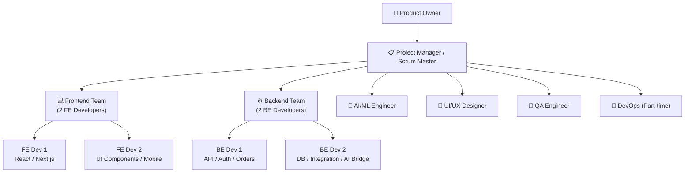
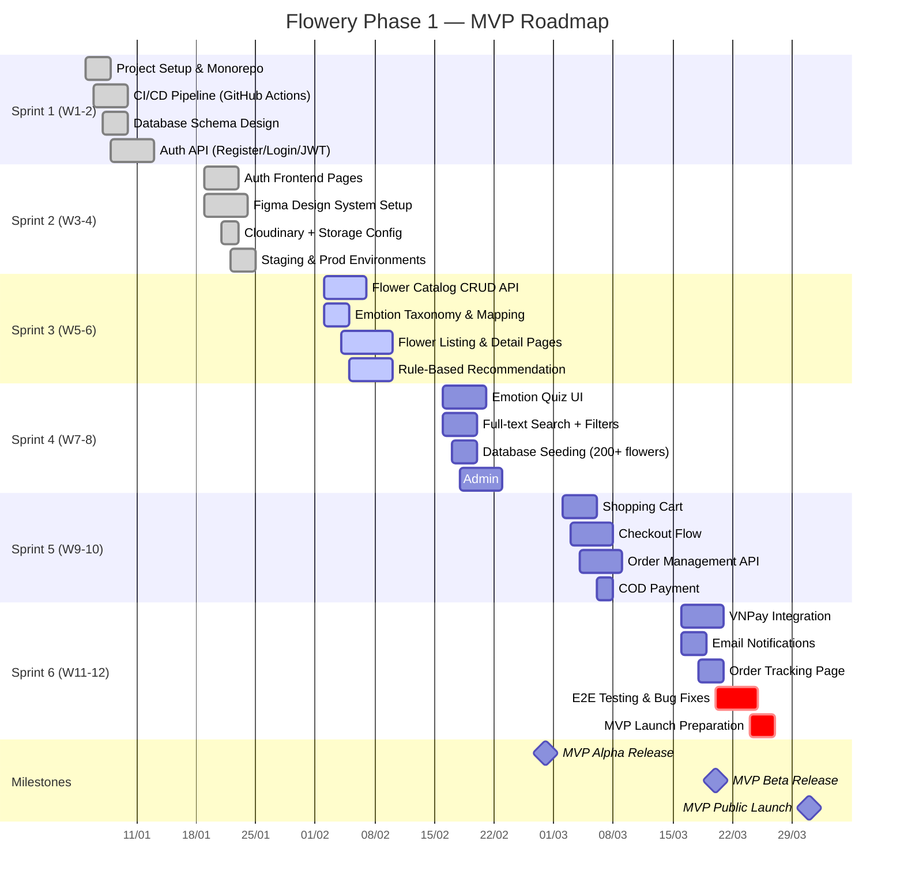

# 12. Quản Lý Dự Án (Project Management) — Flowery

> Tài liệu này mô tả kế hoạch quản lý dự án toàn diện cho **Flowery** — nền tảng giao hoa theo cảm xúc tại Việt Nam. Bao gồm phương pháp Agile, lộ trình chi tiết, quản lý rủi ro và ngân sách.

> **⚠️ Lưu ý:** Cơ cấu đội ngũ (10 người) và ngân sách (~$150,000 USD / 18 tháng) trong tài liệu này là kế hoạch lý thuyết cho dự án quy mô đầy đủ. Thực tế triển khai hiện tại có thể khác biệt về quy mô nhân sự và chi phí. Các con số nên được xem là tham khảo cho việc mở rộng trong tương lai.

---

## 1. Tổng Quan Dự Án (Project Overview)

### 1.1 Tóm Tắt Dự Án (Project Summary)

**Flowery** là nền tảng thương mại điện tử chuyên biệt kết hợp AI để gợi ý hoa dựa trên cảm xúc của người dùng, xây dựng trên nền tảng MERN stack (MongoDB, Express.js, React, Node.js). Dự án nhắm đến thị trường Việt Nam với mục tiêu trở thành platform giao hoa hàng đầu ứng dụng công nghệ AI.

| Thông tin        | Chi tiết                                      |
| ---------------- | --------------------------------------------- |
| **Project Name** | Flowery                                     |
| **Version**      | 1.0                                           |
| **Start Date**   | Q1 2026                                       |
| **Duration**     | 18 tháng (3 phases)                           |
| **Tech Stack**   | MERN + AI/ML (Python FastAPI)                 |
| **Target Market**| Việt Nam (Hà Nội, TP.HCM, Đà Nẵng)          |
| **Budget**       | ~$150,000 USD (18 tháng)                      |
| **Team Size**    | 10 người (core team)                          |

### 1.2 Mục Tiêu & Tiêu Chí Thành Công (Objectives & Success Criteria)

#### Mục tiêu kinh doanh (Business Objectives)
- **OBJ-01:** Ra mắt MVP trong vòng 3 tháng đầu với tính năng gợi ý hoa dựa trên cảm xúc
- **OBJ-02:** Đạt 5,000+ người dùng đăng ký sau 6 tháng vận hành
- **OBJ-03:** Onboard 50+ shop hoa trong Phase 2 (tháng 4–6)
- **OBJ-04:** Tỷ lệ chuyển đổi (conversion rate) đạt ≥ 8% sau 12 tháng
- **OBJ-05:** Đạt breakeven (hòa vốn) trong tháng thứ 18

#### Mục tiêu kỹ thuật (Technical Objectives)
- **OBJ-T01:** System uptime ≥ 99.5%
- **OBJ-T02:** Page load time < 3 giây (P95)
- **OBJ-T03:** AI recommendation accuracy ≥ 80% (user satisfaction)
- **OBJ-T04:** API response time < 500ms (P95)
- **OBJ-T05:** Zero critical security vulnerabilities tại thời điểm launch

### 1.3 Phạm Vi Dự Án (Scope Statement)

#### In Scope ✅
- Nền tảng web và mobile-responsive cho end users
- Hệ thống gợi ý hoa dựa trên cảm xúc (rule-based → ML)
- Cổng thanh toán: COD, VNPay, Momo (Phase 2)
- Marketplace cho shop hoa (Phase 2)
- Hệ thống đăng ký hoa định kỳ / subscription (Phase 2)
- AI recommendation engine nâng cao (Phase 3)
- Admin dashboard cho internal management
- Shop dashboard cho flower vendors
- Notification system (email, push, SMS)

#### Out of Scope ❌
- Mobile native app (iOS / Android) — xem xét Phase 4
- Hệ thống logistics / vận chuyển tự xây (dùng đối tác)
- Tích hợp blockchain / NFT
- Mở rộng thị trường quốc tế trong 18 tháng đầu
- Livestream commerce features
- B2B enterprise contracts

### 1.4 Giả Định & Ràng Buộc (Assumptions & Constraints)

#### Giả Định (Assumptions)
- Đối tác vận chuyển (GHN, GHTK) có API sẵn sàng tích hợp
- VNPay sandbox environment khả dụng trong Sprint 5
- Team có kinh nghiệm với MERN stack
- Dữ liệu hoa ban đầu sẽ được seed thủ công (200+ loại hoa)
- Server infrastructure triển khai trên AWS ap-southeast-1 (Singapore)

#### Ràng Buộc (Constraints)
- **Timeline:** Phase 1 phải hoàn thành trong 12 tuần (≤ 3 tháng)
- **Budget:** Không vượt $10,000/tháng trong 6 tháng đầu
- **Team:** Không tuyển thêm quá 3 người trong Phase 1
- **Compliance:** Tuân thủ Nghị định 13/2023/NĐ-CP về bảo vệ dữ liệu cá nhân (PDPD)
- **Payment:** Tích hợp cổng thanh toán được cấp phép bởi NHNN

---

## 2. Cơ Cấu Đội Ngũ (Team Structure)

### 2.1 Thành Phần Đội Ngũ (Team Composition)

| Role                      | Số lượng | Giai đoạn     | Chịu trách nhiệm chính                                     |
| ------------------------- | -------- | ------------- | ---------------------------------------------------------- |
| **Project Manager / SM**  | 1        | Phase 1–3     | Sprint planning, risk management, stakeholder communication |
| **Product Owner**         | 1        | Phase 1–3     | Product backlog, acceptance criteria, business priorities  |
| **Frontend Developer**    | 2        | Phase 1–3     | React UI, Next.js, mobile responsiveness                   |
| **Backend Developer**     | 2        | Phase 1–3     | Node.js APIs, database design, integration                 |
| **AI/ML Engineer**        | 1        | Phase 1–3     | Recommendation engine, NLP, model training                 |
| **UI/UX Designer**        | 1        | Phase 1–2     | Figma design, user research, usability testing             |
| **QA Engineer**           | 1        | Phase 1–3     | Test planning, automation, regression testing              |
| **DevOps Engineer**       | 1 (P/T)  | Phase 1–3     | CI/CD, infrastructure, monitoring, deployment              |

> **P/T** = Part-time (20h/tuần)

### 2.2 Ma Trận RACI

| Deliverable                  | PM  | PO  | FE Dev | BE Dev | AI/ML | Designer | QA  | DevOps |
| ---------------------------- | --- | --- | ------ | ------ | ----- | -------- | --- | ------ |
| Product Backlog              | C   | **R** | I      | I      | I     | I        | I   | I      |
| Sprint Planning              | **R** | A   | C      | C      | C     | C        | C   | I      |
| System Architecture          | A   | I   | C      | **R**  | C     | I        | I   | C      |
| UI/UX Design                 | I   | A   | C      | I      | I     | **R**    | C   | I      |
| Frontend Development         | I   | A   | **R**  | C      | I     | C        | C   | I      |
| Backend Development          | I   | A   | C      | **R**  | C     | I        | C   | I      |
| AI Recommendation Engine     | I   | A   | C      | C      | **R** | I        | C   | I      |
| Database Design              | I   | C   | I      | **R**  | C     | I        | I   | C      |
| CI/CD Pipeline               | A   | I   | I      | C      | I     | I        | C   | **R**  |
| Test Planning & Execution    | A   | C   | C      | C      | C     | I        | **R** | I    |
| Payment Integration          | A   | C   | C      | **R**  | I     | I        | C   | I      |
| Production Deployment        | A   | I   | I      | C      | I     | I        | C   | **R**  |
| Sprint Review Presentation   | C   | **R** | C    | C      | C     | C        | C   | I      |
| Risk Management              | **R** | C | I      | I      | I     | I        | C   | C      |

> **R** = Responsible | **A** = Accountable | **C** = Consulted | **I** = Informed

### 2.3 Kế Hoạch Mở Rộng Đội Ngũ (Team Scaling Plan)

| Phase     | Thời gian | Team Size | Vai trò bổ sung                                              |
| --------- | --------- | --------- | ------------------------------------------------------------ |
| Phase 1   | Tháng 1–3 | 10        | Core team như trên                                           |
| Phase 2   | Tháng 4–6 | 12        | + 1 Marketing Specialist, + 1 Customer Support              |
| Phase 3   | Tháng 7–12| 15        | + 1 Data Scientist, + 1 Senior BE Dev, + 1 Mobile Dev (prep)|

### 2.4 Sơ Đồ Tổ Chức (Org Chart)



---

## 3. Phương Pháp Agile (Agile Methodology)

### 3.1 Scrum Framework

Flowery áp dụng **Scrum framework** được điều chỉnh cho small team với sprint 2 tuần. PM đồng thời đảm nhiệm vai trò Scrum Master để giảm chi phí overhead.

```
Sprint Cycle (2 tuần = 10 working days)
─────────────────────────────────────────────────────────────
Day 1   : Sprint Planning (2h)
Day 1-9 : Development, Daily Standup (15min/ngày)
Day 8   : Backlog Grooming (1h)
Day 10  : Sprint Review (1h) + Sprint Retrospective (1h)
─────────────────────────────────────────────────────────────
Velocity Target: 40–60 story points/sprint (sau Sprint 3)
```

### 3.2 Các Buổi Họp Scrum (Ceremonies)

| Ceremony                 | Tần suất       | Thời lượng | Người tham gia          | Mục đích                                          |
| ------------------------ | -------------- | ---------- | ----------------------- | ------------------------------------------------- |
| **Sprint Planning**      | Đầu mỗi sprint | 2 giờ      | Toàn bộ team            | Xác định sprint goal, chọn backlog items          |
| **Daily Standup**        | Mỗi ngày       | 15 phút    | Dev team + SM           | Đồng bộ tiến độ, blocker identification           |
| **Sprint Review**        | Cuối mỗi sprint | 1 giờ     | Team + Stakeholders     | Demo features hoàn thành, thu thập feedback       |
| **Sprint Retrospective** | Cuối mỗi sprint | 1 giờ     | Dev team + SM           | Cải tiến quy trình (What went well / improve)     |
| **Backlog Grooming**     | 1 lần/tuần     | 1 giờ      | PM + PO + Tech Leads    | Refine, estimate, prioritize backlog items        |
| **Architecture Review**  | Khi cần        | 2 giờ      | BE Dev + AI/ML + DevOps | Quyết định kỹ thuật quan trọng                    |

### 3.3 Definition of Ready (DoR)

Một User Story chỉ được kéo vào Sprint khi đáp ứng **tất cả** tiêu chí sau:

- [ ] Được viết theo format: *"Là [user], tôi muốn [action] để [benefit]"*
- [ ] Acceptance Criteria rõ ràng, testable (≥ 3 criteria)
- [ ] Story Points đã được estimate (Planning Poker)
- [ ] UI mockup / wireframe đã được duyệt (nếu có UI)
- [ ] API contract đã được định nghĩa (nếu cần integration)
- [ ] Dependencies đã được xác định và không blocking
- [ ] Story Points ≤ 13 (nếu lớn hơn → cần split)

### 3.4 Definition of Done (DoD)

Một User Story chỉ được coi là **Done** khi:

- [ ] Code đã được review và approve bởi ít nhất 1 reviewer
- [ ] Unit tests viết xong với coverage ≥ 80%
- [ ] Integration tests pass
- [ ] Không còn linting errors / TypeScript errors
- [ ] Documentation được cập nhật (API docs, README)
- [ ] Feature được deploy lên Staging environment
- [ ] QA Engineer đã verify Acceptance Criteria
- [ ] PO đã sign off (demo/review)
- [ ] Không có critical bugs còn mở

### 3.5 Story Point Estimation (Fibonacci)

| Points | Mô tả                                             | Ví dụ                                  |
| ------ | ------------------------------------------------- | -------------------------------------- |
| **1**  | Thay đổi nhỏ, rõ ràng, < 2 giờ                   | Fix copy text, update color            |
| **2**  | Task đơn giản, ít risk, < 4 giờ                  | Thêm validation field                  |
| **3**  | Task vừa, một số complexity, ~1 ngày             | Tạo CRUD API endpoint                  |
| **5**  | Task phức tạp, cần design, 2–3 ngày             | Tích hợp payment gateway               |
| **8**  | Task lớn, nhiều components, 3–5 ngày            | Xây dựng recommendation module        |
| **13** | Task rất lớn, nhiều unknowns — nên split        | Implement ML model integration         |
| **?**  | Story chưa đủ thông tin để estimate              | Cần clarification trước                |

---

## 4. Lộ Trình Chi Tiết (Detailed Roadmap)

### Phase 1: MVP (12 Tuần / 6 Sprints)

#### Sprint 1–2: Foundation (Tuần 1–4)

**Sprint Goal:** Thiết lập hạ tầng dự án, CI/CD pipeline, và core authentication system.

| User Story                                           | Points | Owner  |
| ---------------------------------------------------- | ------ | ------ |
| Setup monorepo structure (frontend + backend)        | 3      | DevOps |
| Cấu hình CI/CD với GitHub Actions                    | 5      | DevOps |
| Thiết kế database schema (MongoDB collections)       | 5      | BE Dev |
| Implement Auth: Register / Login (JWT + Refresh)     | 8      | BE Dev |
| Frontend: Auth pages (Login, Register, Forgot PW)   | 8      | FE Dev |
| Setup Figma design system & component library        | 5      | Designer |
| Configure Cloudinary for image uploads               | 3      | BE Dev |
| Setup Staging & Production environments              | 5      | DevOps |

**Sprint 1–2 Deliverables:**
- ✅ Working CI/CD pipeline (auto-deploy to staging on PR merge)
- ✅ User registration và login hoạt động end-to-end
- ✅ Design system với 20+ core components
- ✅ Database schema documented và deployed

---

#### Sprint 3–4: Core Features (Tuần 5–8)

**Sprint Goal:** Xây dựng catalog hoa, tính năng tìm kiếm theo cảm xúc và bộ câu hỏi gợi ý.

| User Story                                              | Points | Owner  |
| ------------------------------------------------------- | ------ | ------ |
| Flower catalog: CRUD API + Admin panel                  | 8      | BE Dev |
| Flower listing page với filter & pagination             | 8      | FE Dev |
| Flower detail page (ảnh, mô tả, giá, đánh giá)        | 5      | FE Dev |
| Emotion taxonomy: Define 12 core emotions + mapping     | 3      | AI/ML  |
| Rule-based recommendation engine (emotion → flower)    | 8      | AI/ML  |
| Emotion quiz UI (3–5 câu hỏi interactive)              | 8      | FE Dev |
| Search với Full-text + emotion filter                   | 5      | BE Dev |
| Seed database: 200+ hoa với metadata đầy đủ            | 3      | BE Dev |

**Sprint 3–4 Deliverables:**
- ✅ 200+ hoa trong catalog với ảnh và metadata
- ✅ Emotion quiz hoạt động và trả về top 5 gợi ý
- ✅ Search và filter theo cảm xúc, loại hoa, giá

---

#### Sprint 5–6: Ordering & Polish (Tuần 9–12)

**Sprint Goal:** Hoàn thiện luồng đặt hàng, tích hợp thanh toán, và chuẩn bị MVP launch.

| User Story                                           | Points | Owner  |
| ---------------------------------------------------- | ------ | ------ |
| Shopping cart (add, remove, update quantity)         | 8      | FE Dev |
| Checkout flow (địa chỉ giao, thời gian, ghi chú)   | 8      | FE Dev |
| Order management API (create, status, history)       | 8      | BE Dev |
| COD payment method                                   | 3      | BE Dev |
| VNPay integration (sandbox → production)             | 8      | BE Dev |
| Order tracking page                                  | 5      | FE Dev |
| Email notifications (order confirm, shipping update) | 5      | BE Dev |
| Admin: Order management dashboard                    | 5      | FE Dev |
| Performance optimization & load testing              | 5      | DevOps |
| End-to-end testing & bug fixes                       | 8      | QA     |

**Sprint 5–6 Deliverables:**
- ✅ Người dùng có thể đặt hoa và thanh toán COD + VNPay
- ✅ Email notification tự động
- ✅ Admin dashboard quản lý đơn hàng
- ✅ MVP ready for public launch

---

#### Gantt Chart — Phase 1



---

### Phase 2: Marketplace (12 Tuần / 6 Sprints — Tháng 4–6)

#### Sprint 7–8: Shop Onboarding (Tuần 13–16)

**Sprint Goal:** Cho phép shop hoa đăng ký, quản lý sản phẩm và nhận đơn hàng.

| Tính năng                                              | Owner     |
| ------------------------------------------------------ | --------- |
| Shop registration & verification workflow              | BE Dev    |
| Shop profile page (ảnh bìa, giới thiệu, địa chỉ)     | FE Dev    |
| Product management: Add / Edit / Delete sản phẩm      | FE + BE   |
| Inventory management (số lượng tồn kho)               | BE Dev    |
| Shop discovery page & category browsing               | FE Dev    |
| Multi-vendor order routing                             | BE Dev    |

#### Sprint 9–10: Reviews & Shop Dashboard (Tuần 17–20)

**Sprint Goal:** Hệ thống đánh giá, ratings và dashboard analytics cho shop.

| Tính năng                                              | Owner     |
| ------------------------------------------------------ | --------- |
| Review & rating system (1–5 sao + comment)             | FE + BE   |
| Verified purchase badge                                | BE Dev    |
| Shop dashboard: doanh thu, đơn hàng, analytics         | FE Dev    |
| Shop performance reports (daily/weekly/monthly)        | BE Dev    |
| Seller notification system                             | BE Dev    |
| Report / flag inappropriate reviews                    | BE Dev    |

#### Sprint 11–12: Subscription & Notifications (Tuần 21–24)

**Sprint Goal:** Hệ thống đăng ký hoa định kỳ và thông báo đa kênh.

| Tính năng                                              | Owner     |
| ------------------------------------------------------ | --------- |
| Subscription plans (weekly, bi-weekly, monthly)        | BE Dev    |
| Subscription management UI (pause, cancel, modify)     | FE Dev    |
| Recurring payment với VNPay / Momo                     | BE Dev    |
| Push notifications (Firebase FCM)                      | BE Dev    |
| SMS notifications (ESMS / Twilio)                      | BE Dev    |
| Referral program cơ bản                                | FE + BE   |

---

### Phase 3: AI Enhancement & Scale (24 Tuần / 12 Sprints — Tháng 7–18)

#### Sprint 13–16: ML Recommendation Engine (Tháng 7–8)

- Thu thập và label training data từ Phase 1–2 (order history, ratings, quiz answers)
- Xây dựng collaborative filtering model
- Xây dựng content-based filtering dựa trên flower attributes
- Hybrid recommendation model (CF + CBF)
- A/B testing framework để so sánh rule-based vs ML
- Model serving API (FastAPI + Redis caching)

#### Sprint 17–20: Advanced AI Features (Tháng 9–11)

- **Message AI:** Gợi ý lời nhắn theo cảm xúc và dịp lễ (GPT integration)
- **Image Recognition:** Nhận diện loại hoa từ ảnh upload (Vision API)
- **Seasonal Intelligence:** Tự động điều chỉnh gợi ý theo mùa / sự kiện
- **Personalization Engine:** Profile cảm xúc dài hạn của user
- **Chatbot tư vấn** cơ bản cho lựa chọn hoa

#### Sprint 21–24: Performance & Scale (Tháng 12–18)

- Caching layer nâng cao (Redis Cluster)
- Database indexing optimization & query tuning
- CDN optimization cho media assets
- Load testing & stress testing (mục tiêu: 10,000 concurrent users)
- Microservices migration cho recommendation service
- Kubernetes deployment setup
- Comprehensive monitoring & alerting (Grafana dashboards)

---

## 5. Mốc Quan Trọng (Milestones)

| # | Milestone           | Target Date | Deliverables chính                                        | Tiêu chí thành công                                   |
| - | ------------------- | ----------- | --------------------------------------------------------- | ----------------------------------------------------- |
| 1 | **MVP Alpha**       | 2026-02-28  | Auth, flower catalog, emotion quiz, recommendation        | Internal team demo pass, 0 critical bugs              |
| 2 | **MVP Beta**        | 2026-03-20  | Full ordering flow, VNPay, email notifications            | Beta users (50 người) test và feedback tích cực       |
| 3 | **MVP Launch**      | 2026-03-31  | Public launch trên App Store / Web                        | 500+ đăng ký tuần đầu, uptime ≥ 99%                  |
| 4 | **Phase 1 Review**  | 2026-04-15  | Phase 1 KPIs assessment                                   | 1,000+ users, 300+ orders, 4.0+ rating               |
| 5 | **Marketplace Beta**| 2026-05-31  | Shop registration, product management, reviews            | 20+ shops onboarded, 100+ shop products               |
| 6 | **Phase 2 Launch**  | 2026-06-30  | Marketplace live, subscriptions active                    | 50+ shops, 5,000+ users, subscription MRR > 0        |
| 7 | **AI Engine v1**    | 2026-09-30  | ML recommendation engine deployed                         | Recommendation CTR ≥ 25% (vs 15% rule-based)         |
| 8 | **Advanced AI**     | 2026-12-31  | Message AI, image recognition, chatbot                    | AI features NPS ≥ 40, user session +30%              |
| 9 | **Scale Ready**     | 2027-03-31  | Platform supports 10,000 concurrent users                 | Load test pass, P95 latency < 500ms under load       |
| 10| **Phase 3 Complete**| 2027-06-30 | Full platform with all AI features                        | 50,000+ users, 200+ shops, MRR breakeven             |

---

## 6. Quản Lý Rủi Ro (Risk Management)

### 6.1 Risk Register

#### 🔴 Technical Risks

| ID   | Rủi ro                                                  | Xác suất | Tác động | Mức độ | Chiến lược giảm thiểu                                                    | Người chịu trách nhiệm |
| ---- | ------------------------------------------------------- | -------- | -------- | ------ | ------------------------------------------------------------------------ | ---------------------- |
| T-01 | VNPay integration phức tạp hơn dự kiến, delay Sprint 6 | Cao      | Cao      | 🔴 Rất cao | Bắt đầu sandbox integration từ Sprint 4; có fallback COD-only launch   | BE Dev + PM            |
| T-02 | AI recommendation accuracy thấp (< 70%)                | Trung bình | Cao    | 🟠 Cao  | Rule-based làm fallback; thu thập feedback data sớm từ Phase 1          | AI/ML Engineer         |
| T-03 | Database performance bottleneck khi scale               | Trung bình | Cao    | 🟠 Cao  | Index optimization từ sớm; MongoDB Atlas auto-scaling; cache layer       | BE Dev + DevOps        |
| T-04 | Security vulnerabilities trong auth / payment           | Thấp     | Rất cao  | 🟠 Cao  | Security audit trước MVP launch; penetration testing; OWASP checklist    | QA + BE Dev            |
| T-05 | Third-party API downtime (GHN, VNPay, Cloudinary)       | Trung bình | Trung bình | 🟡 Trung bình | Circuit breaker pattern; fallback providers; SLA monitoring            | DevOps                 |
| T-06 | Technical debt tích lũy làm chậm Phase 2–3             | Cao      | Trung bình | 🟠 Cao | Dành 20% sprint capacity cho refactoring; code review strict             | PM + Tech Leads        |

#### 🟠 Business Risks

| ID   | Rủi ro                                                  | Xác suất | Tác động | Mức độ | Chiến lược giảm thiểu                                                    | Người chịu trách nhiệm |
| ---- | ------------------------------------------------------- | -------- | -------- | ------ | ------------------------------------------------------------------------ | ---------------------- |
| B-01 | User acquisition chậm, không đạt 1,000 users sau 1 tháng | Cao   | Cao      | 🔴 Rất cao | Marketing plan trước launch (social media, KOL); beta waitlist          | PO + Marketing         |
| B-02 | Shop hoa không muốn onboard vào marketplace             | Trung bình | Cao   | 🟠 Cao  | Miễn phí 3 tháng đầu; dedicated onboarding support; demo rõ ROI         | PO + PM                |
| B-03 | Đối thủ cạnh tranh ra tính năng tương tự               | Thấp     | Trung bình | 🟡 Trung bình | Tập trung differentiator (emotion AI); build user loyalty sớm          | PO                     |

#### 🟡 Operational Risks

| ID   | Rủi ro                                                   | Xác suất | Tác động | Mức độ | Chiến lược giảm thiểu                                                   | Người chịu trách nhiệm |
| ---- | --------------------------------------------------------- | -------- | -------- | ------ | ----------------------------------------------------------------------- | ---------------------- |
| O-01 | Developer nghỉ việc giữa dự án (key person dependency)   | Trung bình | Cao   | 🟠 Cao  | Documentation đầy đủ; pair programming; knowledge transfer sessions     | PM                     |
| O-02 | Sprint velocity không ổn định, trượt deadline            | Cao      | Trung bình | 🟠 Cao | Buffer 20% trong timeline; phát hiện sớm qua burndown charts           | PM (Scrum Master)      |
| O-03 | Communication breakdown trong distributed team           | Thấp     | Trung bình | 🟡 Trung bình | Async-first communication protocol; video call 2x/tuần                 | PM                     |

#### 🔵 External Risks

| ID   | Rủi ro                                                  | Xác suất | Tác động | Mức độ | Chiến lược giảm thiểu                                                   | Người chịu trách nhiệm |
| ---- | ------------------------------------------------------- | -------- | -------- | ------ | ----------------------------------------------------------------------- | ---------------------- |
| E-01 | Thay đổi quy định NHNN về thanh toán điện tử            | Thấp     | Cao      | 🟠 Cao  | Theo dõi legal updates; tư vấn luật; sử dụng payment providers có phép | PO + PM                |
| E-02 | Biến động tỷ giá ảnh hưởng chi phí AWS / SaaS           | Trung bình | Thấp  | 🟡 Thấp | Reserve currency buffer; negotiate annual contracts                     | PM                     |

### 6.2 Ma Trận Rủi Ro (Risk Matrix)

```
Tác động │ Rất cao │         │  T-04   │         │  B-01   │
         ├─────────┼─────────┼─────────┼─────────┼─────────┤
         │  Cao    │  E-02   │  T-05   │  T-03   │  T-01   │
         │         │         │  B-03   │  T-06   │  T-02   │
         │         │         │         │  O-02   │  B-02   │
         │         │         │         │  E-01   │  O-01   │
         ├─────────┼─────────┼─────────┼─────────┼─────────┤
         │ Trung   │         │  O-03   │         │         │
         │ bình    │         │         │         │         │
         ├─────────┼─────────┼─────────┼─────────┼─────────┤
         │  Thấp   │         │         │         │         │
         └─────────┴─────────┴─────────┴─────────┴─────────┘
                   │  Thấp   │  Trung  │   Cao   │Rất cao  │
                             Xác suất

🟢 Thấp  🟡 Trung bình  🟠 Cao  🔴 Rất cao
```

---

## 7. Ngân Sách Ước Tính (Budget Estimation)

### 7.1 Chi Phí Nhân Sự (Team Cost — Vietnam Market Rates)

> Mức lương ước tính tháng 1/2026, tính theo net salary (triệu VNĐ/tháng)

| Vai trò                  | Số lượng | Lương/người (M VNĐ) | Tổng/tháng (M VNĐ) | Tổng/tháng (USD) |
| ------------------------ | -------- | ------------------- | ------------------- | ---------------- |
| Project Manager / SM     | 1        | 35                  | 35                  | ~$1,400          |
| Product Owner            | 1        | 40                  | 40                  | ~$1,600          |
| Frontend Developer (Mid) | 2        | 28                  | 56                  | ~$2,240          |
| Backend Developer (Mid)  | 2        | 30                  | 60                  | ~$2,400          |
| AI/ML Engineer           | 1        | 38                  | 38                  | ~$1,520          |
| UI/UX Designer           | 1        | 25                  | 25                  | ~$1,000          |
| QA Engineer              | 1        | 22                  | 22                  | ~$880            |
| DevOps (Part-time 50%)   | 1        | 18                  | 18                  | ~$720            |
| **TỔNG NHÂN SỰ**         | **10**   | —                   | **294 M VNĐ**       | **~$11,760**     |

### 7.2 Chi Phí Hạ Tầng (Infrastructure Cost — Monthly)

| Dịch vụ                                    | Plan / Config                            | Chi phí/tháng (USD) |
| ------------------------------------------ | ---------------------------------------- | ------------------- |
| **Vercel** (Frontend hosting)              | Pro Team plan                            | $20                 |
| **AWS EC2** (Backend — 2x t3.medium)       | 2 instances, Singapore region            | $65                 |
| **AWS ECS / EKS** (Phase 3 containers)     | Fargate (Phase 3 only)                   | $120                |
| **MongoDB Atlas** (Database)               | M10 Cluster (Phase 1), M30 (Phase 2+)   | $57 → $189          |
| **Redis** (Caching — ElastiCache)          | cache.t3.micro                           | $18                 |
| **Cloudinary** (Media storage)             | Plus plan (225GB storage)               | $89                 |
| **AWS S3** (Static assets backup)          | Standard storage                         | $10                 |
| **AWS CloudFront** (CDN)                   | ~100GB transfer/month                    | $15                 |
| **Domain + SSL**                           | .com domain + AWS ACM (free SSL)         | $15/năm (~$2)       |
| **Email** (AWS SES)                        | ~50,000 emails/tháng                     | $5                  |
| **Firebase FCM** (Push notifications)      | Free tier                                | $0                  |
| **ESMS** (SMS — Vietnam)                   | ~1,000 SMS/tháng                         | $20                 |
| **Sentry** (Error monitoring)              | Team plan                                | $26                 |
| **GitHub** (Version control + Actions)     | Team plan                                | $4/user × 10 = $40  |
| **TỔNG HẠ TẦNG (Phase 1)**                 | —                                        | **~$367/tháng**     |

### 7.3 Chi Phí Công Cụ SaaS (Tools)

| Công cụ                   | Plan              | Chi phí/tháng (USD) |
| ------------------------- | ----------------- | ------------------- |
| Jira / Linear             | Standard (10 users) | $75               |
| Notion                    | Team plan         | $16                 |
| Figma                     | Professional      | $45                 |
| Slack                     | Pro plan          | $87                 |
| Grafana Cloud             | Free tier         | $0                  |
| **TỔNG CÔNG CỤ**          | —                 | **~$223/tháng**     |

### 7.4 Monthly Burn Rate

| Giai đoạn         | Nhân sự (USD) | Hạ tầng (USD) | Công cụ (USD) | Marketing (USD) | **Tổng/tháng**   |
| ----------------- | ------------- | ------------- | ------------- | --------------- | ---------------- |
| Phase 1 (T1–3)    | $11,760       | $367          | $223          | $500            | **~$12,850**     |
| Phase 2 (T4–6)    | $13,760       | $650          | $223          | $2,000          | **~$16,633**     |
| Phase 3 (T7–12)   | $16,260       | $1,200        | $223          | $3,000          | **~$20,683**     |
| Phase 3 (T13–18)  | $16,260       | $1,500        | $223          | $4,000          | **~$21,983**     |

> Bổ sung thêm 2 nhân sự (Marketing Specialist + Customer Support) từ tháng 4 và 3 nhân sự thêm từ tháng 7.

### 7.5 Dự Báo Ngân Sách 18 Tháng (18-Month Budget Projection)

| Tháng | Phase   | Burn Rate   | Cumulative Spend | Ghi chú                         |
| ----- | ------- | ----------- | ---------------- | ------------------------------- |
| T01   | Phase 1 | $12,850     | $12,850          | Project kickoff                 |
| T02   | Phase 1 | $12,850     | $25,700          | Sprint 3–4                      |
| T03   | Phase 1 | $12,850     | $38,550          | MVP Launch                      |
| T04   | Phase 2 | $16,633     | $55,183          | +Marketing hire, Phase 2 begin  |
| T05   | Phase 2 | $16,633     | $71,816          | Marketplace beta                |
| T06   | Phase 2 | $16,633     | $88,449          | Phase 2 launch                  |
| T07   | Phase 3 | $20,683     | $109,132         | +AI/ML, +Sr Dev hires           |
| T08   | Phase 3 | $20,683     | $129,815         | ML engine sprint                |
| T09   | Phase 3 | $20,683     | $150,498         | **Budget checkpoint**           |
| T10   | Phase 3 | $20,683     | $171,181         | Advanced AI features            |
| T11   | Phase 3 | $20,683     | $191,864         | Performance optimization        |
| T12   | Phase 3 | $20,683     | $212,547         | 12-month milestone review       |
| T13   | Phase 3 | $21,983     | $234,530         | Scale focus                     |
| T14   | Phase 3 | $21,983     | $256,513         |                                 |
| T15   | Phase 3 | $21,983     | $278,496         |                                 |
| T16   | Phase 3 | $21,983     | $300,479         |                                 |
| T17   | Phase 3 | $21,983     | $322,462         |                                 |
| T18   | Phase 3 | $21,983     | $344,445         | **Mục tiêu breakeven**          |

> 💡 **Ghi chú:** Dự án cần seed funding hoặc revenue tự generate để cover burn rate từ tháng 9 trở đi. Revenue projection từ commission marketplace và subscription cần bù đắp chi phí.

---

## 8. Công Cụ & Quy Trình (Tools & Processes)

### 8.1 Tech Stack Công Cụ (Toolchain)

| Nhóm                  | Công cụ               | Mục đích                                         |
| --------------------- | --------------------- | ------------------------------------------------ |
| **Project Management** | Jira / Linear        | Sprint planning, backlog, issue tracking         |
| **Communication**      | Slack + Discord      | Daily comms, dev channels, alerts               |
| **Documentation**      | Notion               | PRDs, runbooks, meeting notes, knowledge base   |
| **Design**             | Figma                | UI/UX design, prototyping, design system        |
| **Version Control**    | GitHub               | Source code, PRs, code review                   |
| **CI/CD**              | GitHub Actions       | Automated build, test, deploy pipeline          |
| **Error Monitoring**   | Sentry               | Real-time error tracking, alerting              |
| **Performance**        | Grafana + Prometheus | Infrastructure & app metrics dashboards         |
| **API Testing**        | Postman / Insomnia   | API development & testing                       |
| **Load Testing**       | k6                   | Performance & load testing                      |
| **Secrets Management** | AWS Secrets Manager  | Environment variables, API keys                 |

### 8.2 Quy Trình Code Review (Code Review Process)

```
Developer → Feature Branch → Pull Request
                                    │
                    ┌───────────────▼───────────────┐
                    │     Automated Checks (CI)      │
                    │  ✓ Build passing               │
                    │  ✓ All tests green             │
                    │  ✓ Coverage ≥ 80%              │
                    │  ✓ Linting / type-check pass   │
                    └───────────────┬───────────────┘
                                    │ CI Pass
                    ┌───────────────▼───────────────┐
                    │    Peer Code Review (1+)       │
                    │  ✓ Logic correctness           │
                    │  ✓ Security implications       │
                    │  ✓ Performance considerations  │
                    │  ✓ Code readability & docs     │
                    └───────────────┬───────────────┘
                                    │ Approved
                    ┌───────────────▼───────────────┐
                    │    QA Verification (Staging)   │
                    │  ✓ Acceptance criteria met     │
                    │  ✓ No regression in key flows  │
                    └───────────────┬───────────────┘
                                    │ QA Sign-off
                                    ▼
                             Merge to main
                             Auto-deploy to Staging
```

**Code Review Standards:**
- PR size: Tối đa 400 lines changed (nếu lớn hơn → split PR)
- Review SLA: 24 giờ trong ngày làm việc
- Không được self-merge (luôn cần ít nhất 1 reviewer)
- Conventional Commits format bắt buộc: `feat:`, `fix:`, `chore:`, `docs:`, `test:`

### 8.3 Quy Trình Release (Release Process)

| Stage         | Branch   | Trigger                         | Environment  | Gate                      |
| ------------- | -------- | ------------------------------- | ------------ | ------------------------- |
| Development   | feature/ | PR merge to `develop`           | Dev          | CI pass                   |
| Staging       | develop  | Auto after every merge          | Staging      | E2E smoke tests pass      |
| Release Candidate | release/ | Manual tag before release  | Staging (RC) | QA full regression        |
| Production    | main     | Manual approval + merge         | Production   | PM + PO sign-off required |

**Hotfix Process:** `hotfix/` branch → review → merge to `main` → cherry-pick to `develop`

---

## 9. Tiêu Chí Thành Công (Success Metrics)

### 9.1 Phase 1 — MVP (Sau 3 tháng vận hành)

| Metric                          | Target        | Measurement Tool      |
| ------------------------------- | ------------- | --------------------- |
| Registered users                | ≥ 1,000       | MongoDB Analytics     |
| Total orders completed          | ≥ 500         | Order dashboard       |
| App / website rating            | ≥ 4.0 / 5.0  | Google Play / App Store / Trustpilot |
| API error rate                  | < 2%          | Sentry                |
| Page load time (P95)            | < 3 giây      | Vercel Analytics / Lighthouse |
| Uptime                          | ≥ 99.5%       | AWS CloudWatch        |
| Emotion quiz completion rate    | ≥ 60%         | Mixpanel / Google Analytics |
| Recommendation click-through rate (CTR) | ≥ 15% | Custom analytics    |
| Cart abandonment rate           | < 70%         | Analytics             |

### 9.2 Phase 2 — Marketplace (Sau 6 tháng vận hành)

| Metric                          | Target          | Measurement Tool      |
| ------------------------------- | --------------- | --------------------- |
| Total registered users          | ≥ 5,000         | MongoDB               |
| Active shops on marketplace     | ≥ 50            | Admin dashboard       |
| Shop products listed            | ≥ 500           | Catalog dashboard     |
| Monthly active users (MAU)      | ≥ 2,000         | Analytics             |
| Monthly Recurring Revenue (MRR) | ≥ $2,000 USD    | Stripe / VNPay reports|
| Subscription plan subscribers   | ≥ 200           | Subscription dashboard|
| Average review rating           | ≥ 4.2 / 5.0    | Review system         |
| Shop retention rate (90 ngày)   | ≥ 70%           | Admin analytics       |

### 9.3 Phase 3 — AI & Scale (Sau 18 tháng vận hành)

| Metric                           | Target           | Measurement Tool       |
| -------------------------------- | ---------------- | ---------------------- |
| Total users                      | ≥ 50,000         | MongoDB                |
| ML recommendation accuracy       | ≥ 80%            | A/B test + user survey |
| Recommendation CTR (ML vs rule)  | +60% improvement | Analytics              |
| Platform scalability             | 10,000 concurrent users | k6 load test    |
| API latency (P95) under load     | < 500ms          | Grafana                |
| Monthly GMV (Gross Merchandise Value) | ≥ $50,000 | Revenue dashboard     |
| MRR                              | ≥ $15,000        | Finance dashboard      |
| NPS Score                        | ≥ 40             | Delighted / Typeform   |

---

## 10. Kế Hoạch Giao Tiếp (Communication Plan)

### 10.1 Ma Trận Stakeholder Communication

| Stakeholder            | Vai trò                  | Tần suất báo cáo   | Format                         | Kênh chính        |
| ---------------------- | ------------------------ | ------------------- | ------------------------------ | ----------------- |
| **Founders / Investors** | Decision makers        | 2 tuần / lần        | Executive Summary (1 page)    | Email + Notion    |
| **Product Owner**      | Product direction         | Hàng ngày           | Verbal + Slack                | Slack / Direct    |
| **Dev Team**           | Execution                 | Hàng ngày (standup) | Verbal + Jira                 | Standup / Slack   |
| **QA Engineer**        | Quality gate              | Per sprint          | Test report                   | Jira + Slack      |
| **Shop Partners**      | Business stakeholders     | Hàng tháng          | Partner newsletter             | Email / Zalo      |
| **End Users**          | Product feedback          | Continuous          | In-app survey + App reviews   | App / Email       |

### 10.2 Báo Cáo Định Kỳ (Reporting Cadence)

| Báo cáo                    | Tần suất       | Người tạo | Người nhận            | Nội dung chính                                       |
| -------------------------- | -------------- | --------- | --------------------- | ---------------------------------------------------- |
| **Daily Standup Summary**  | Hàng ngày      | SM        | Dev team              | Blockers, progress, plan hôm nay                    |
| **Sprint Report**          | Mỗi 2 tuần    | PM        | Team + PO             | Velocity, burn-down, completed stories, next sprint |
| **Monthly KPI Report**     | Hàng tháng    | PM + PO   | Founders / Investors  | Business metrics, technical health, risks           |
| **Budget Review**          | Hàng tháng    | PM        | Founders              | Actual vs planned spend, burn rate                  |
| **Risk Review**            | Mỗi 2 tuần    | PM        | Tech Leads + PO       | Updated risk register, new risks, mitigations       |
| **Quarterly Business Review (QBR)** | Hàng quý | PM + PO | All stakeholders    | Phase review, roadmap adjustment, strategic decisions|

### 10.3 Quy Trình Escalation (Escalation Process)

```
Level 1 — Team Level (Giải quyết trong 24h)
  Blocker kỹ thuật, task conflict, scope nhỏ
  → Developer tự giải quyết hoặc discuss với pair
  → Báo trong Daily Standup

Level 2 — Management Level (Giải quyết trong 48h)
  Sprint scope change, inter-team dependency, resource conflict
  → Scrum Master / PM giải quyết
  → Documented trong Jira + Slack

Level 3 — Leadership Level (Giải quyết trong 72h)
  Timeline risk, budget overrun, major technical pivot
  → PM + PO + Tech Lead thảo luận
  → Decision documented trong Notion

Level 4 — Executive Level (Giải quyết trong 1 tuần)
  Strategic pivot, major budget deviation (>20%), legal issues
  → PM trình bày với Founders / Board
  → Formal decision memo
```

### 10.4 Quy Định Giao Tiếp Async-First

- **Slack channels:** `#general`, `#dev`, `#design`, `#ops`, `#alerts`, `#random`
- **Response SLA:** Slack trong 4h làm việc; Email trong 24h
- **Video calls:** Dùng cho Sprint ceremonies và urgent discussions; không mandatory daily
- **Documentation-first:** Mọi decision quan trọng → viết vào Notion trước khi gọi meeting
- **Meeting-free zones:** Thứ Tư mỗi tuần (Deep Work Day) — không họp, không interrupt

---

## 11. Phụ Lục (Appendix)

### A. Glossary

| Thuật ngữ           | Định nghĩa                                                                 |
| ------------------- | -------------------------------------------------------------------------- |
| **Sprint**          | Chu kỳ phát triển 2 tuần với mục tiêu cụ thể                             |
| **Backlog**         | Danh sách tất cả User Stories đã được xác định cho sản phẩm               |
| **Story Points**    | Đơn vị ước lượng effort tương đối (không phải giờ)                        |
| **Velocity**        | Số story points trung bình team hoàn thành trong một sprint               |
| **DoR**             | Definition of Ready — điều kiện để story được kéo vào sprint             |
| **DoD**             | Definition of Done — điều kiện để story được coi là hoàn thành            |
| **MRR**             | Monthly Recurring Revenue — doanh thu định kỳ hàng tháng                  |
| **GMV**             | Gross Merchandise Value — tổng giá trị giao dịch trên platform            |
| **CTR**             | Click-through Rate — tỷ lệ click trên số lần hiển thị                    |
| **NPS**             | Net Promoter Score — chỉ số đo loyalty của khách hàng                    |
| **MAU**             | Monthly Active Users — người dùng hoạt động trong tháng                   |
| **P95**             | 95th percentile — 95% requests hoàn thành trong thời gian này             |

### B. Liên Kết Quan Trọng (Key Links)

| Tài liệu                   | Mô tả                                           |
| -------------------------- | ----------------------------------------------- |
| Product Backlog (Jira)     | Toàn bộ user stories và sprint planning         |
| Design System (Figma)      | UI components, color palette, typography        |
| Architecture Docs (Notion) | System design, ADRs (Architecture Decision Records) |
| API Documentation          | Swagger/OpenAPI spec cho tất cả endpoints       |
| Runbooks (Notion)          | Hướng dẫn xử lý incidents và deployments       |
| OKRs Dashboard             | Quarterly objectives và key results tracking    |

---

*Tài liệu này được cập nhật vào cuối mỗi sprint. Phiên bản hiện tại: **v1.0** — Ngày tạo: 2026-01-01*

*Người chịu trách nhiệm tài liệu: **Project Manager***
